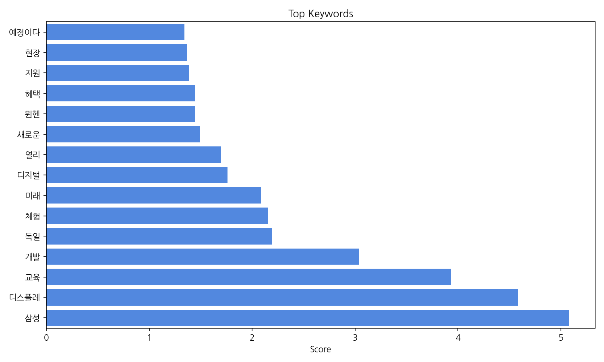
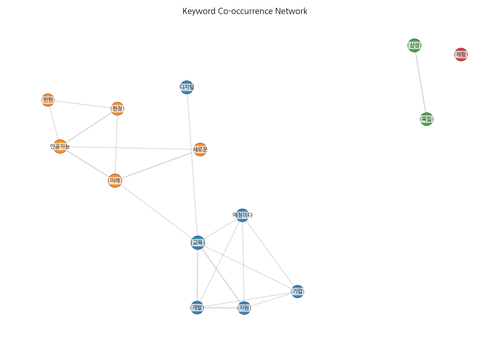
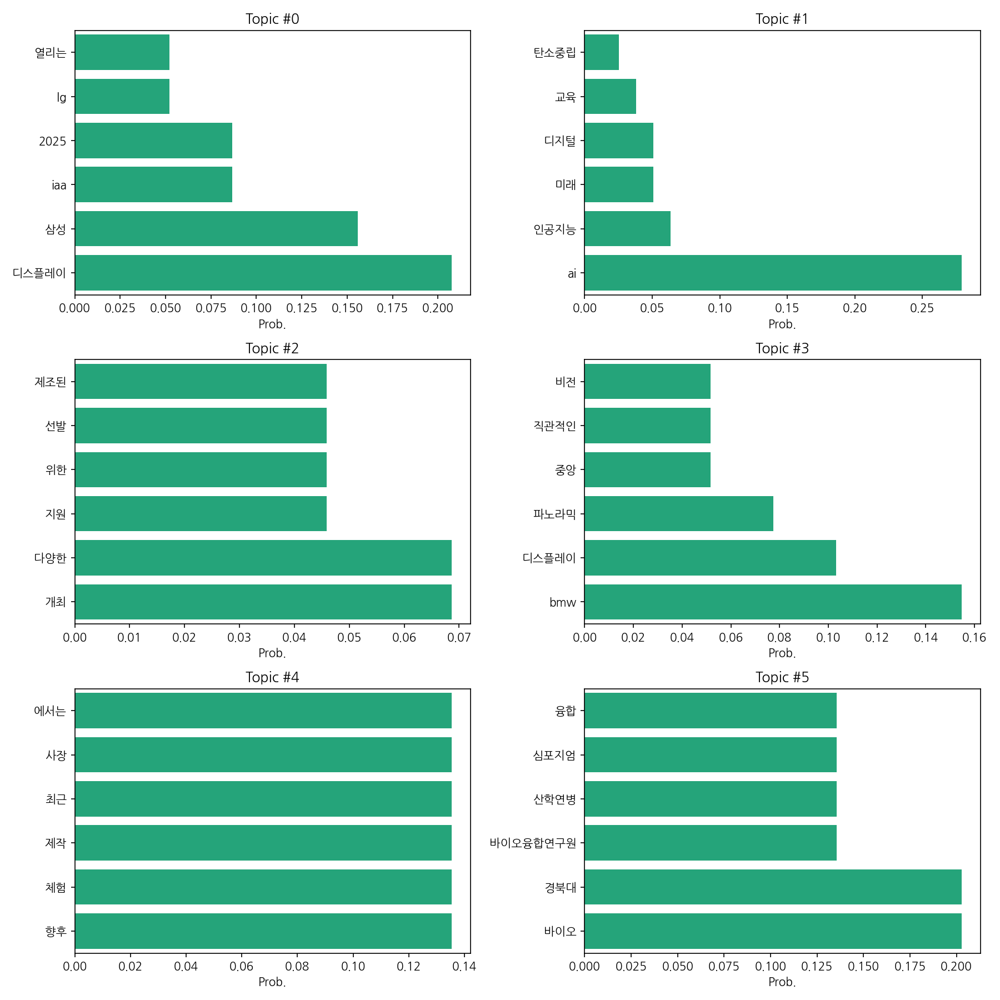

# Weekly/New Biz Report (2025-09-08)

## Executive Summary

- 이번 기간 핵심 토픽과 키워드, 주요 시사점을 요약합니다.

1. **핵심 맥락 설명:**  이 데이터는 자동차, 디스플레이, 그리고 바이오 분야의 뉴스 기사를 주로 다루고 있습니다.  특히, 독일 뮌헨에서 열리는 IAA 모터쇼와 관련된 삼성, LG 등의 디스플레이 기술과 BMW의 새로운 기술이 주요 관심사이며, 인공지능(AI) 기술의 미래와 바이오 산업의 발전에 대한 뉴스도 상당 부분을 차지합니다.  여기에 다양한 산업 지원 및 경진대회 개최 소식도 포함되어 있습니다.

2. **최근 변화/스파이크:**  데이터는 2025년 9월 8일 단 하루의 기사 수(20건)만을 보여주고 있습니다.  따라서 장기적인 추세 변화를 파악하기에는 데이터가 부족하며, 2025년 9월 8일의 기사 수가 특정 이벤트(예: IAA 모터쇼 개막)에 따른 일시적인 증가인지, 아니면 지속적인 추세 변화의 시작인지는 추가 데이터 분석이 필요합니다.

3. **실무 인사이트:**

* **IAA 모터쇼 집중 모니터링:**  2025년 IAA 모터쇼에서 공개된 자동차 및 디스플레이 기술 동향을 면밀히 분석하여, 시장 경쟁력 강화 및 신기술 도입 전략을 수립해야 합니다.  특히 삼성과 LG의 디스플레이 기술 발표 내용을 중점적으로 살펴봐야 합니다.
* **AI 및 바이오 분야 기술 트렌드 분석:**  AI와 바이오 분야의 기술 발전 속도가 빠르므로, 관련 뉴스 및 연구 동향을 지속적으로 모니터링하고,  자사 사업과의 연관성을 분석하여 새로운 사업 기회를 발굴해야 합니다.  특히, AI 교육 및 탄소중립 관련 기술에 주목해야 합니다.
* **산업 지원 정책 적극 활용:**  정부 및 기관에서 제공하는 다양한 산업 지원 정책 및 경진대회 참여를 통해 자사의 기술 경쟁력을 강화하고, 사업 확장을 위한 자금 및 인력 확보 전략을 마련해야 합니다.  관련 정보를 수집하고 적극적으로 활용하는 전략이 필요합니다.

## Key Metrics

- 문서 수: 20
- 키워드 수(상위): 15
- 토픽 수: 6
- 시계열 데이터 일자 수: 1

## Top Keywords

| Rank | Keyword | Score |
|---:|---|---:|
| 1 | 삼성 | 5.077 |
| 2 | 디스플레 | 4.583 |
| 3 | 교육 | 3.931 |
| 4 | 개발 | 3.039 |
| 5 | 독일 | 2.195 |
| 6 | 체험 | 2.155 |
| 7 | 미래 | 2.084 |
| 8 | 디지털 | 1.759 |
| 9 | 열리 | 1.697 |
| 10 | 새로운 | 1.491 |
| 11 | 뮌헨 | 1.443 |
| 12 | 혜택 | 1.442 |
| 13 | 지원 | 1.383 |
| 14 | 현장 | 1.368 |
| 15 | 예정이다 | 1.343 |

## Topics

- Topic #0: 디스플레이, 삼성, iaa, 2025, lg, 열리는
- Topic #1: ai, 인공지능, 미래, 디지털, 교육, 탄소중립
- Topic #2: 개최, 다양한, 지원, 위한, 선발, 제조된
- Topic #3: bmw, 디스플레이, 파노라믹, 중앙, 직관적인, 비전
- Topic #4: 향후, 체험, 제작, 최근, 사장, 에서는
- Topic #5: 바이오, 경북대, 바이오융합연구원, 산학연병, 심포지엄, 융합

## Trend

- 최근 14~30일 기사 수 추세와 7일 이동평균선을 제공합니다.

## Insights

1. **핵심 맥락 설명:**  이 데이터는 자동차, 디스플레이, 그리고 바이오 분야의 뉴스 기사를 주로 다루고 있습니다.  특히, 독일 뮌헨에서 열리는 IAA 모터쇼와 관련된 삼성, LG 등의 디스플레이 기술과 BMW의 새로운 기술이 주요 관심사이며, 인공지능(AI) 기술의 미래와 바이오 산업의 발전에 대한 뉴스도 상당 부분을 차지합니다.  여기에 다양한 산업 지원 및 경진대회 개최 소식도 포함되어 있습니다.

2. **최근 변화/스파이크:**  데이터는 2025년 9월 8일 단 하루의 기사 수(20건)만을 보여주고 있습니다.  따라서 장기적인 추세 변화를 파악하기에는 데이터가 부족하며, 2025년 9월 8일의 기사 수가 특정 이벤트(예: IAA 모터쇼 개막)에 따른 일시적인 증가인지, 아니면 지속적인 추세 변화의 시작인지는 추가 데이터 분석이 필요합니다.

3. **실무 인사이트:**

* **IAA 모터쇼 집중 모니터링:**  2025년 IAA 모터쇼에서 공개된 자동차 및 디스플레이 기술 동향을 면밀히 분석하여, 시장 경쟁력 강화 및 신기술 도입 전략을 수립해야 합니다.  특히 삼성과 LG의 디스플레이 기술 발표 내용을 중점적으로 살펴봐야 합니다.
* **AI 및 바이오 분야 기술 트렌드 분석:**  AI와 바이오 분야의 기술 발전 속도가 빠르므로, 관련 뉴스 및 연구 동향을 지속적으로 모니터링하고,  자사 사업과의 연관성을 분석하여 새로운 사업 기회를 발굴해야 합니다.  특히, AI 교육 및 탄소중립 관련 기술에 주목해야 합니다.
* **산업 지원 정책 적극 활용:**  정부 및 기관에서 제공하는 다양한 산업 지원 정책 및 경진대회 참여를 통해 자사의 기술 경쟁력을 강화하고, 사업 확장을 위한 자금 및 인력 확보 전략을 마련해야 합니다.  관련 정보를 수집하고 적극적으로 활용하는 전략이 필요합니다.

## Opportunities (Top 5)

| Idea | Target | Value Prop | Score |
|---|---|---|---:|
| IAA 모터쇼 기술 트렌드 분석 및 사업화 플랫폼 | 자동차 부품 제조사, 디스플레이 제조사, 자동차 관련 IT 기업 (중견/대기업) | IAA 모터쇼 등 주요 전시회의 기술 트렌드를 분석하고, 시장 경쟁력 강화 및 신기술 도입 전략 수립에 필요한 정보를 제공합니다. 경쟁사 분석, 특허 동향 분석, 시장 전망 보고서 등을 포함한 종합적인 솔루션을 제공하여, 의사결정 속도를 높이고 리스크를 줄입니다. | 4.5 |
| AI 기반 디스플레이 기술 교육 플랫폼 | 디스플레이 제조사, IT 기업, 대학교 (중소/중견/대기업) | AI 기반 디스플레이 기술 교육을 위한 온라인/오프라인 플랫폼을 제공합니다. 실무 중심의 교육 커리큘럼과 실습 환경을 제공하여, 빠르게 변화하는 기술 트렌드에 대응할 수 있도록 지원합니다. 삼성, LG 등의 최신 기술 동향을 반영한 교육 콘텐츠를 제공합니다. | 4.0 |
| AI 기반 탄소중립 솔루션 개발 | 제조업체, 에너지 기업 (중견/대기업) | AI 기반 탄소중립 솔루션을 개발하여, 기업의 에너지 효율을 높이고 탄소 배출량을 감축하는 데 도움을 줍니다.  AI 알고리즘을 활용하여 에너지 소비 패턴을 분석하고, 최적의 에너지 관리 전략을 제시합니다. 폐기물 관리 시스템을 통해 폐기물 발생량을 줄이고 재활용률을 높입니다. | 3.8 |
| 바이오 산업 기술 트렌드 분석 및 사업화 지원 플랫폼 | 바이오 관련 중소기업, 바이오 스타트업 | 바이오 산업의 최신 기술 트렌드를 분석하고, 사업화 전략 수립에 필요한 정보를 제공하는 플랫폼입니다.  시장 분석, 경쟁사 분석, 기술 동향 분석, 정부 지원 정책 정보 등을 제공하여, 중소기업의 사업화 성공률을 높입니다. | 3.5 |
| 산업 지원 정책 정보 플랫폼 | 중소/중견기업, 스타트업 | 정부 및 기관의 산업 지원 정책 정보를 한 곳에서 쉽게 찾아볼 수 있는 플랫폼을 제공합니다.  키워드 검색, 필터링 기능 등을 통해 필요한 정보를 빠르게 찾을 수 있도록 지원하며,  정책 전문가의 컨설팅 서비스도 제공합니다. | 3.2 |

## Appendix

- 데이터: keywords.json, topics.json, trend_timeseries.json, trend_insights.json, biz_opportunities.json