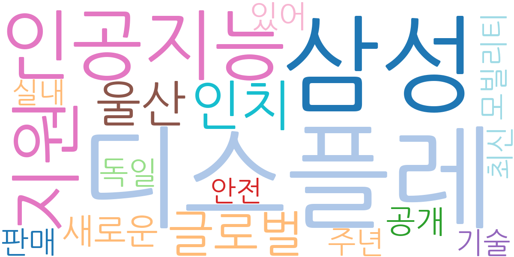
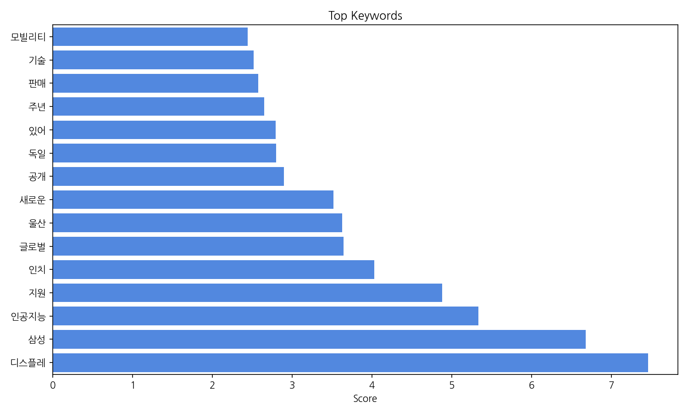
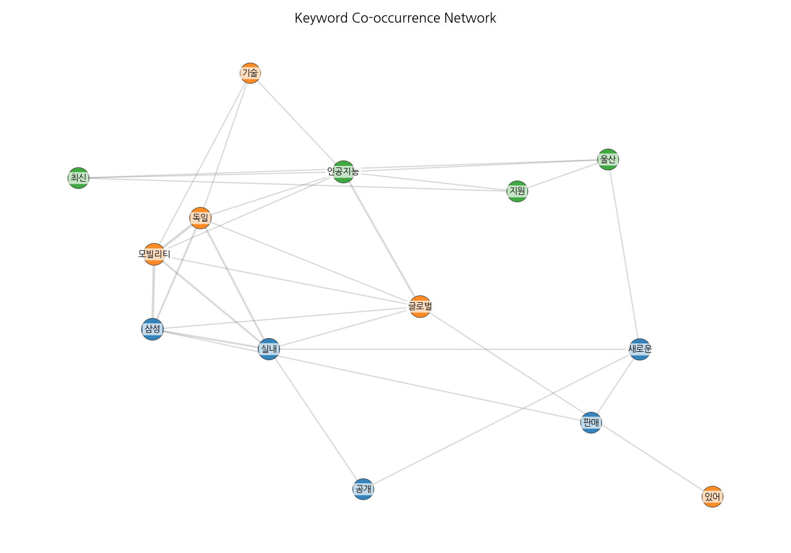
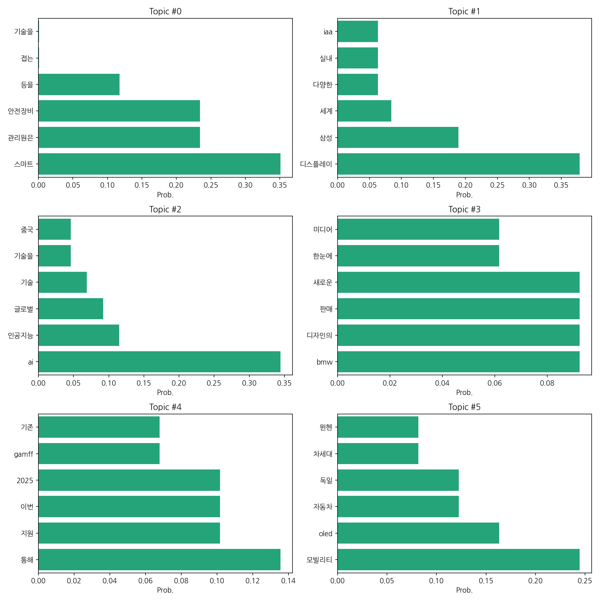
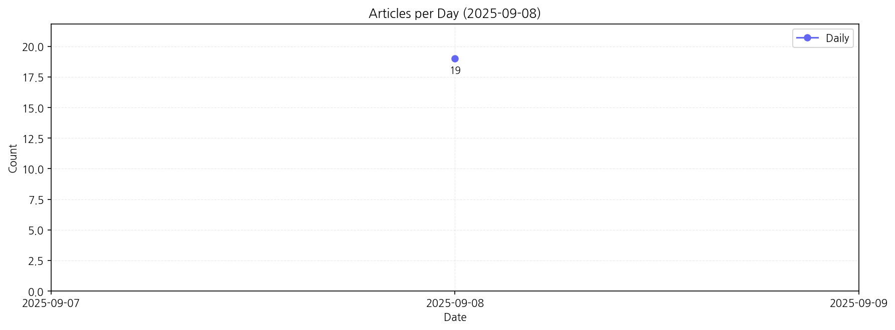

# Weekly/New Biz Report (2025-09-08)

## Executive Summary

- 이번 기간 핵심 토픽과 키워드, 주요 시사점을 요약합니다.

1) 상위 토픽을 3개 주제로 묶어 핵심 맥락을 설명하면 다음과 같습니다. 첫째, **스마트 기술 및 안전** 주제는 스마트 관리 시스템과 안전 장비 관련 기술 동향을 다룹니다.  둘째, **자동차 산업의 미래 기술**은  디스플레이 기술, AI, 그리고 모빌리티 분야의 혁신적인 기술 발전과  BMW, 삼성 등 글로벌 기업들의 새로운 기술 및 디자인 공개를 중심으로 이루어집니다. 마지막으로 **미래 기술 지원 및 정책**은  2025년을 중심으로 한 미래 기술 지원 정책 및 관련 기술 개발 동향을 보여줍니다.

2) 최근 변화/스파이크는 2025년 9월 8일 19건의 기사가 집중적으로 발생한 것을 볼 수 있습니다. 이는 특정 기술 발표나 전시회 개최 등의 이벤트와 관련이 있을 가능성이 높습니다.

3) 실무 인사이트 3가지:

* **관련 이벤트 모니터링 강화:** 2025년 9월 8일 기사 급증 사례를 바탕으로, 주요 자동차 전시회, 기술 발표회 등 관련 이벤트를 지속적으로 모니터링하여 뉴스 트렌드를 예측하고 대응 전략을 수립합니다.  핵심 키워드를 활용한 뉴스 알림 시스템 구축을 고려할 수 있습니다.
* **경쟁사 기술 분석 심화:** 삼성, BMW 등 주요 기업의 기술 발표 내용을 면밀히 분석하여 자사 기술 경쟁력 강화 방안을 모색합니다. 특히, AI, 디스플레이, 모빌리티 분야의 기술 트렌드를 분석하고, 차별화 전략을 수립해야 합니다.
* **미래 기술 지원 정책 적극 활용:** 정부의 미래 기술 지원 정책을 적극적으로 활용하여 기술 개발 및 사업화를 추진합니다.  관련 정책 정보를 수집하고, 지원 사업 참여를 통해 기술 개발 자금 확보 및 사업화 전략을 구체화합니다.

## Key Metrics

- 기간: 2025-09-08 ~ 2025-09-08
- 총 기사 수: 19
- 문서 수: 19
- 키워드 수(상위): 15
- 토픽 수: 6
- 시계열 데이터 일자 수: 1

## Top Keywords

| Rank | Keyword | Score |
|---:|---|---:|
| 1 | 디스플레 | 7.458 |
| 2 | 삼성 | 6.680 |
| 3 | 인공지능 | 5.335 |
| 4 | 지원 | 4.881 |
| 5 | 인치 | 4.029 |
| 6 | 글로벌 | 3.647 |
| 7 | 울산 | 3.627 |
| 8 | 새로운 | 3.519 |
| 9 | 공개 | 2.894 |
| 10 | 독일 | 2.796 |
| 11 | 있어 | 2.791 |
| 12 | 주년 | 2.652 |
| 13 | 판매 | 2.576 |
| 14 | 기술 | 2.518 |
| 15 | 모빌리티 | 2.444 |

## Topics

- Topic #0: 스마트, 관리원은, 안전장비, 등을, 접는, 기술을
- Topic #1: 디스플레이, 삼성, 세계, 다양한, 실내, iaa
- Topic #2: ai, 인공지능, 글로벌, 기술, 기술을, 중국
- Topic #3: bmw, 디자인의, 판매, 새로운, 한눈에, 미디어
- Topic #4: 통해, 지원, 이번, 2025, gamff, 기존
- Topic #5: 모빌리티, oled, 자동차, 독일, 차세대, 뮌헨

## Trend

- 최근 14~30일 기사 수 추세와 7일 이동평균선을 제공합니다.

## Insights

1) 상위 토픽을 3개 주제로 묶어 핵심 맥락을 설명하면 다음과 같습니다. 첫째, **스마트 기술 및 안전** 주제는 스마트 관리 시스템과 안전 장비 관련 기술 동향을 다룹니다.  둘째, **자동차 산업의 미래 기술**은  디스플레이 기술, AI, 그리고 모빌리티 분야의 혁신적인 기술 발전과  BMW, 삼성 등 글로벌 기업들의 새로운 기술 및 디자인 공개를 중심으로 이루어집니다. 마지막으로 **미래 기술 지원 및 정책**은  2025년을 중심으로 한 미래 기술 지원 정책 및 관련 기술 개발 동향을 보여줍니다.

2) 최근 변화/스파이크는 2025년 9월 8일 19건의 기사가 집중적으로 발생한 것을 볼 수 있습니다. 이는 특정 기술 발표나 전시회 개최 등의 이벤트와 관련이 있을 가능성이 높습니다.

3) 실무 인사이트 3가지:

* **관련 이벤트 모니터링 강화:** 2025년 9월 8일 기사 급증 사례를 바탕으로, 주요 자동차 전시회, 기술 발표회 등 관련 이벤트를 지속적으로 모니터링하여 뉴스 트렌드를 예측하고 대응 전략을 수립합니다.  핵심 키워드를 활용한 뉴스 알림 시스템 구축을 고려할 수 있습니다.
* **경쟁사 기술 분석 심화:** 삼성, BMW 등 주요 기업의 기술 발표 내용을 면밀히 분석하여 자사 기술 경쟁력 강화 방안을 모색합니다. 특히, AI, 디스플레이, 모빌리티 분야의 기술 트렌드를 분석하고, 차별화 전략을 수립해야 합니다.
* **미래 기술 지원 정책 적극 활용:** 정부의 미래 기술 지원 정책을 적극적으로 활용하여 기술 개발 및 사업화를 추진합니다.  관련 정책 정보를 수집하고, 지원 사업 참여를 통해 기술 개발 자금 확보 및 사업화 전략을 구체화합니다.

## Opportunities (Top 5)

| Idea | Target | Value Prop | Score |
|---|---|---|---:|
| 자동차 산업 이벤트 예측 및 분석 플랫폼 | 자동차 부품 제조사, 자동차 디자인 회사, 자동차 관련 연구소 (중소기업 및 대기업) | AI 기반의 자동차 산업 이벤트 예측 및 분석 플랫폼을 통해 실시간 뉴스 모니터링, 경쟁사 기술 분석, 미래 기술 지원 정책 정보 제공을 자동화하여 효율적인 의사결정을 지원합니다.  핵심 키워드 기반의 맞춤형 알림 시스템으로 중요 정보를 놓치지 않도록 합니다. | 4.50 |
| 스마트 자동차 안전 관리 시스템 | 자동차 제조사, 자동차 정비 업체, 운송 회사 (대기업 위주) | IoT 기반의 스마트 자동차 안전 관리 시스템을 통해 차량의 실시간 상태 모니터링, 예측 정비, 사고 예방 기능을 제공합니다.  다양한 안전 장비와의 연동을 통해 통합 관리를 가능하게 하고, 효율적인 안전 관리를 지원합니다. | 4.00 |
| 차세대 디스플레이 기술 개발 및 상용화 지원 서비스 | 디스플레이 관련 중소/중견기업, 스타트업 | 차세대 디스플레이 기술 개발 및 상용화를 위한 종합 지원 서비스를 제공합니다.  기술 개발 자금 지원, 기술 컨설팅, 시장 진출 지원 등을 통해 경쟁력 있는 제품 개발 및 상용화를 지원합니다.  정부 지원 정책 정보 제공 및 사업화 전략 수립 지원을 제공합니다. | 3.80 |
| AI 기반 자동차 디자인 플랫폼 | 자동차 디자인 회사, 자동차 제조사 디자인 부서 | AI 기반의 자동차 디자인 플랫폼을 통해 디자인 개발 시간 단축, 비용 절감, 디자인 변경의 유연성 증대를 지원합니다.  소비자 선호도 분석 및 디자인 최적화 기능을 제공하여 시장 경쟁력을 강화합니다. | 3.50 |
| 모빌리티 서비스 플랫폼 개발 | 개인 사용자, 기업 사용자 (모든 규모) | 다양한 모빌리티 서비스를 통합적으로 제공하는 플랫폼을 개발하여 사용자 편의성을 향상시킵니다.  실시간 정보 제공, 예약 및 결제 기능, 개인 맞춤형 서비스 추천 기능을 제공합니다.  다양한 모빌리티 서비스 간 연계 및 통합을 통해 사용자 경험을 혁신적으로 개선합니다. | 3.20 |

## Appendix

- 데이터: keywords.json, topics.json, trend_timeseries.json, trend_insights.json, biz_opportunities.json