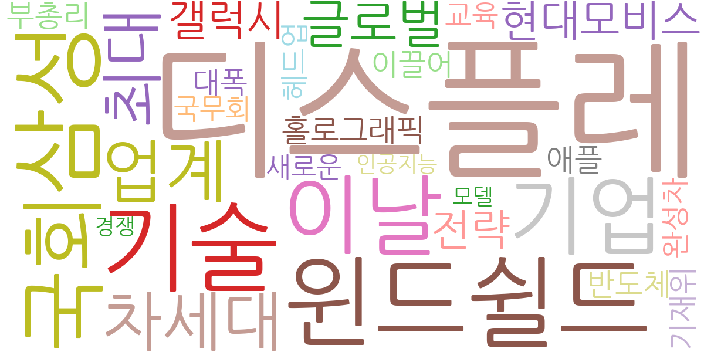
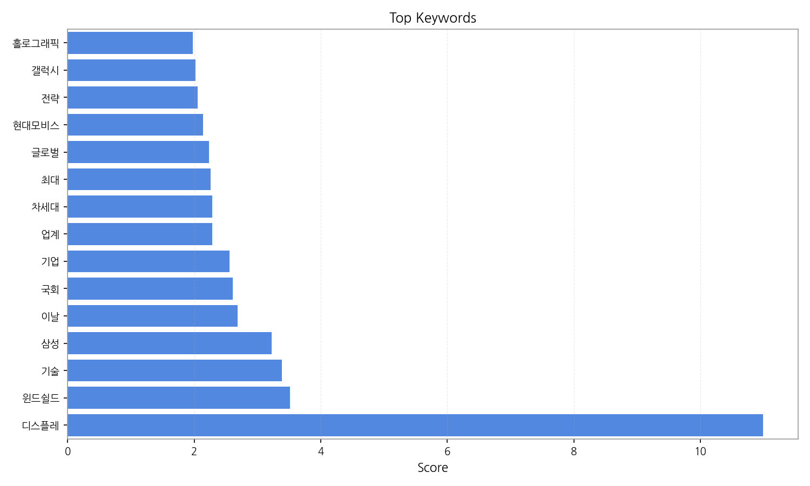
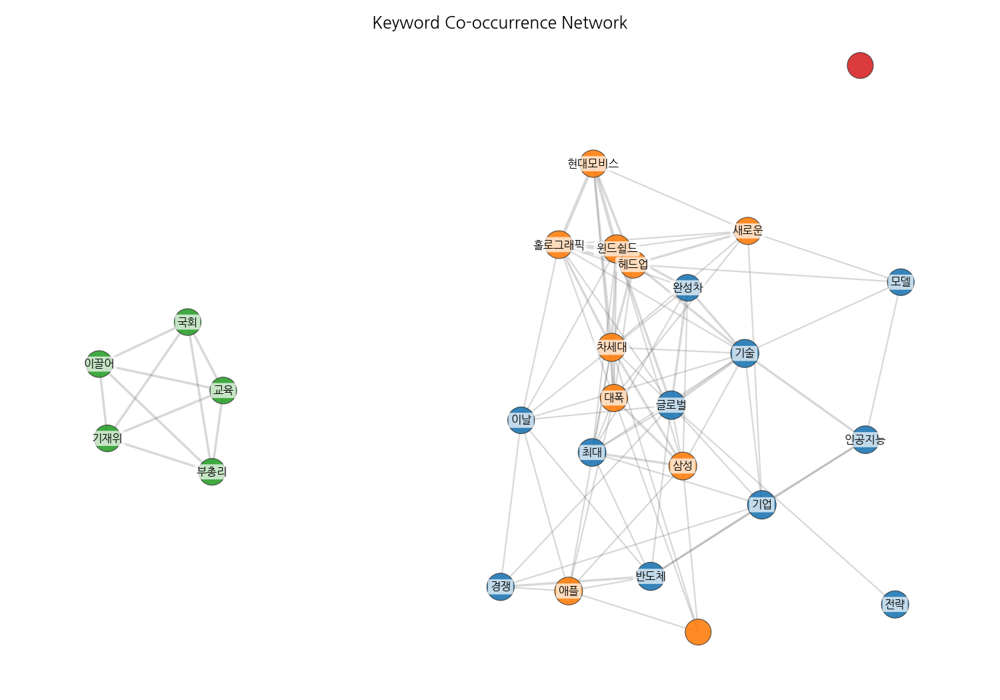
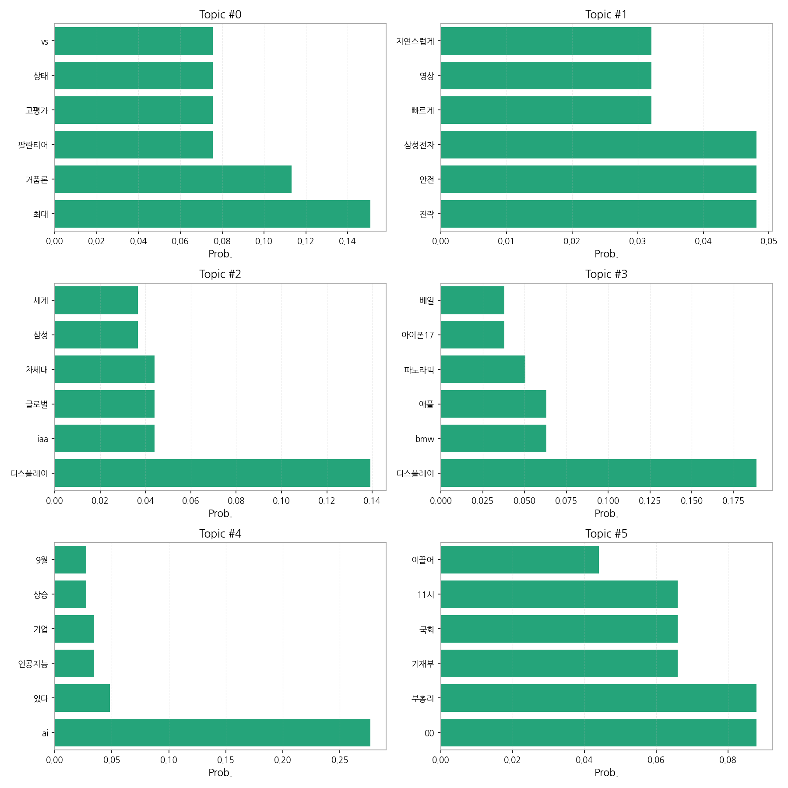
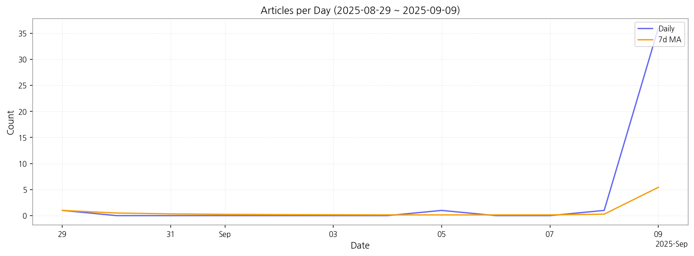

# Weekly/New Biz Report (2025-09-08)

## Executive Summary

- 이번 기간 핵심 토픽과 키워드, 주요 시사점을 요약합니다.

1) 상위 토픽을 3개 주제로 묶어 핵심 맥락을 설명하면 다음과 같습니다. 첫째,  '기술주 거품 논쟁 및 AI 기술 경쟁' 주제는 최근 기술주 시장의 과열과 고평가 논란, 특히 팔란티어와 같은 AI 기업을 중심으로 한 거품 논쟁과 AI 기술 경쟁 심화를 다룹니다.  둘째, '자동차 산업의 디스플레이 기술 경쟁' 주제는 삼성전자를 비롯한 글로벌 기업들의 차세대 디스플레이 기술 개발 경쟁, 특히 자동차용 윈드쉴드 및 파노라믹 디스플레이 기술 개발 동향을 보여줍니다.  셋째, '정부 경제 정책 및 국회 논의' 주제는 한국 정부의 경제 정책, 특히 기획재정부와 국회의 경제 관련 논의 및 정책 결정 과정을 다룹니다.

2) 최근 변화/스파이크를 짚어보면, 2025년 9월 9일 기사 수가 급증(36건)하였는데, 이는 특정 기술 관련 이슈 또는 정부 정책 발표 등의 외부 요인에 의한 것으로 추정됩니다.  이러한 급증은 특정 이벤트에 대한 언론의 집중적인 보도를 반영하는 것으로 해석할 수 있습니다.

3) 실무 인사이트 3가지:

* **기술주 투자 전략 재검토:**  기술주 거품 논쟁을 면밀히 모니터링하고,  과열된 시장 상황을 고려하여 투자 포트폴리오를 다변화하고 리스크 관리를 강화해야 합니다.  특히 AI 기업 투자는 신중한 접근이 필요합니다.
* **자동차 디스플레이 시장 동향 분석:**  자동차 산업의 디스플레이 기술 경쟁 심화에 따라,  시장 트렌드를 지속적으로 분석하고,  차세대 디스플레이 기술 개발 및 적용 전략을 수립해야 합니다.  특히 삼성전자와 같은 주요 기업의 기술 개발 동향을 주의 깊게 관찰해야 합니다.
* **정부 정책 변화 모니터링 및 대응:**  정부의 경제 정책 및 국회 논의를 지속적으로 모니터링하고,  정책 변화에 따른 사업 전략을 신속하게 조정해야 합니다.  특히 기획재정부의 정책 발표 및 국회의 관련 법안 심의 상황을 주시해야 합니다.

## Key Metrics

- 기간: 2025-08-29 ~ 2025-09-09
- 총 기사 수: 39
- 문서 수: 39
- 키워드 수(상위): 15
- 토픽 수: 6
- 시계열 데이터 일자 수: 4

## Top Keywords

| Rank | Keyword | Score |
|---:|---|---:|
| 1 | 디스플레 | 10.992 |
| 2 | 윈드쉴드 | 3.513 |
| 3 | 기술 | 3.384 |
| 4 | 삼성 | 3.221 |
| 5 | 이날 | 2.687 |
| 6 | 국회 | 2.610 |
| 7 | 기업 | 2.558 |
| 8 | 업계 | 2.286 |
| 9 | 차세대 | 2.282 |
| 10 | 최대 | 2.256 |
| 11 | 글로벌 | 2.234 |
| 12 | 현대모비스 | 2.138 |
| 13 | 전략 | 2.054 |
| 14 | 갤럭시 | 2.018 |
| 15 | 홀로그래픽 | 1.981 |

## Topics

- Topic #0: 최대, 거품론, 팔란티어, 고평가, 상태, vs
- Topic #1: 전략, 안전, 삼성전자, 빠르게, 영상, 자연스럽게
- Topic #2: 디스플레이, iaa, 글로벌, 차세대, 삼성, 세계
- Topic #3: 디스플레이, bmw, 애플, 파노라믹, 아이폰17, 베일
- Topic #4: ai, 있다, 인공지능, 기업, 상승, 9월
- Topic #5: 00, 부총리, 기재부, 국회, 11시, 이끌어

## Trend

- 최근 14~30일 기사 수 추세와 7일 이동평균선을 제공합니다.

## Insights

1) 상위 토픽을 3개 주제로 묶어 핵심 맥락을 설명하면 다음과 같습니다. 첫째,  '기술주 거품 논쟁 및 AI 기술 경쟁' 주제는 최근 기술주 시장의 과열과 고평가 논란, 특히 팔란티어와 같은 AI 기업을 중심으로 한 거품 논쟁과 AI 기술 경쟁 심화를 다룹니다.  둘째, '자동차 산업의 디스플레이 기술 경쟁' 주제는 삼성전자를 비롯한 글로벌 기업들의 차세대 디스플레이 기술 개발 경쟁, 특히 자동차용 윈드쉴드 및 파노라믹 디스플레이 기술 개발 동향을 보여줍니다.  셋째, '정부 경제 정책 및 국회 논의' 주제는 한국 정부의 경제 정책, 특히 기획재정부와 국회의 경제 관련 논의 및 정책 결정 과정을 다룹니다.

2) 최근 변화/스파이크를 짚어보면, 2025년 9월 9일 기사 수가 급증(36건)하였는데, 이는 특정 기술 관련 이슈 또는 정부 정책 발표 등의 외부 요인에 의한 것으로 추정됩니다.  이러한 급증은 특정 이벤트에 대한 언론의 집중적인 보도를 반영하는 것으로 해석할 수 있습니다.

3) 실무 인사이트 3가지:

* **기술주 투자 전략 재검토:**  기술주 거품 논쟁을 면밀히 모니터링하고,  과열된 시장 상황을 고려하여 투자 포트폴리오를 다변화하고 리스크 관리를 강화해야 합니다.  특히 AI 기업 투자는 신중한 접근이 필요합니다.
* **자동차 디스플레이 시장 동향 분석:**  자동차 산업의 디스플레이 기술 경쟁 심화에 따라,  시장 트렌드를 지속적으로 분석하고,  차세대 디스플레이 기술 개발 및 적용 전략을 수립해야 합니다.  특히 삼성전자와 같은 주요 기업의 기술 개발 동향을 주의 깊게 관찰해야 합니다.
* **정부 정책 변화 모니터링 및 대응:**  정부의 경제 정책 및 국회 논의를 지속적으로 모니터링하고,  정책 변화에 따른 사업 전략을 신속하게 조정해야 합니다.  특히 기획재정부의 정책 발표 및 국회의 관련 법안 심의 상황을 주시해야 합니다.

## Opportunities (Top 5)

| Idea | Target | Value Prop | Score |
|---|---|---|---:|
| AI 기반 자동차 디스플레이 시장 분석 및 투자 플랫폼 | 자동차 부품 투자사, VC, 헤지펀드, 자동차 제조사의 투자 부서 (중견/대기업) | AI 기반의 정량적 시장 분석 및 예측 모델을 통해 투자 위험을 최소화하고, 수익률을 극대화하는 투자 전략을 제공합니다.  경쟁사 대비 차별화된 시장 분석 및 예측 결과를 제공하여 투자 의사결정에 도움을 줍니다. 정부 정책 변화를 실시간으로 반영하여 투자 전략을 조정합니다. | 4.50 |
| AI 기반 자동차 디스플레이 기술 경쟁력 분석 서비스 | 자동차 부품 제조사 (중견/대기업), 자동차 연구소 | AI 기반의 데이터 분석 기술을 활용하여 자동차 디스플레이 기술 경쟁력을 정량적으로 비교 분석합니다.  특허 분석, 기술 동향 분석, 시장 점유율 분석 등을 통해 경쟁사의 강점과 약점을 파악하고,  자사의 기술 경쟁력을 향상시킬 수 있는 전략을 제시합니다. | 4.20 |
| 자동차 디스플레이 시장을 위한 특허 포트폴리오 전략 컨설팅 | 자동차 부품 제조사 (중견/대기업), 특허 법률 사무소 | 자동차 디스플레이 시장의 특허 동향 분석 및 경쟁사 특허 분석을 통해,  최적의 특허 포트폴리오 전략을 수립하고 관리할 수 있도록 지원합니다.  특허 출원 전략, 특허 분쟁 대응 전략 등을 제공하여 기업의 지식재산권을 보호하고,  경쟁 우위를 확보할 수 있도록 돕습니다. | 4.00 |
| 자동차용 홀로그래픽 윈드쉴드 개발 및 상용화 | 자동차 부품 제조사 (대기업), 자동차 제조사 (대기업) | 홀로그래픽 기술을 활용하여 운전자에게 증강현실 기반의 정보를 제공하고, 운전의 안전성과 편의성을 극대화합니다.  기존 디스플레이 대비 시각적 몰입도를 높이고, 운전자의 피로도를 줄입니다.  차별화된 기술력을 바탕으로 프리미엄 자동차 시장을 공략합니다. | 3.80 |
| 정부 경제 정책 변화 예측 및 리스크 관리 시스템 | 대기업 기획/전략 부서, 경제 연구소, 금융 투자 기관 | AI 기반의 정책 분석 시스템을 통해 정부 경제 정책 변화를 예측하고,  리스크를 관리할 수 있는 솔루션을 제공합니다.  정책 변화에 대한 신속한 대응 전략을 수립하고,  사업 전략을 효율적으로 조정할 수 있도록 지원합니다. | 3.50 |

## Appendix

- 데이터: keywords.json, topics.json, trend_timeseries.json, trend_insights.json, biz_opportunities.json