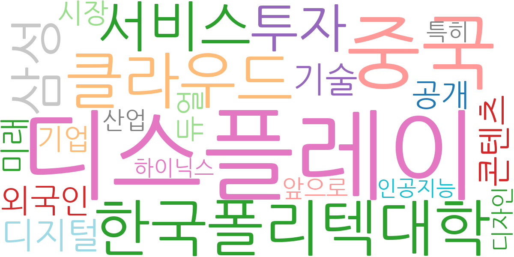
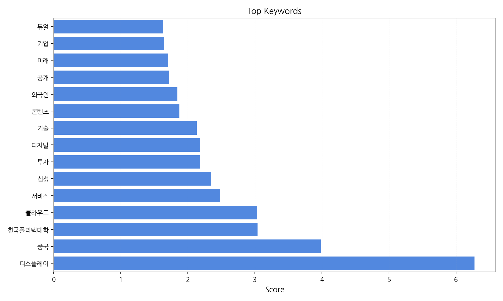
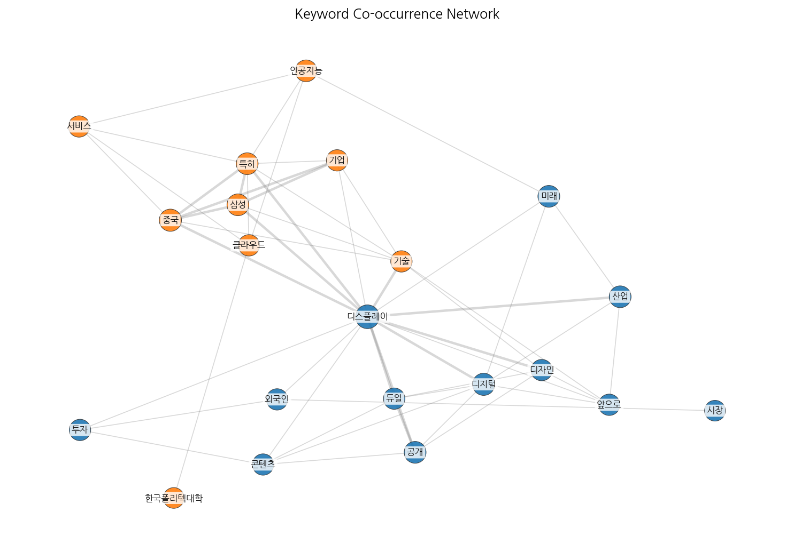
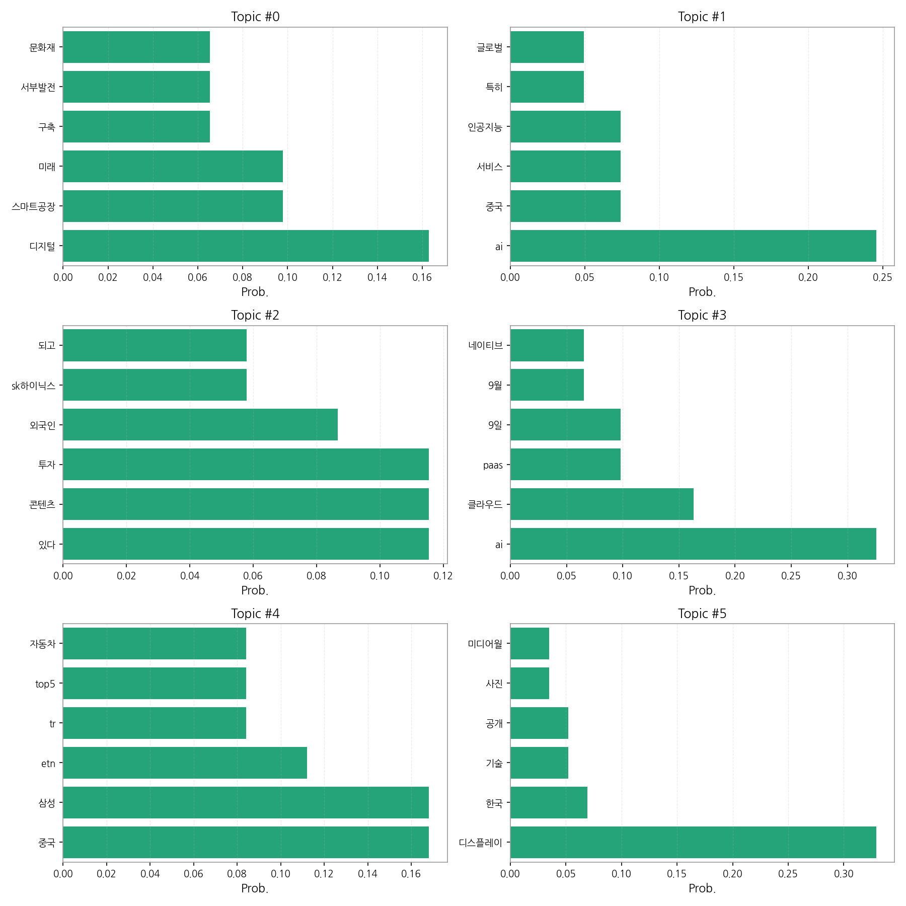
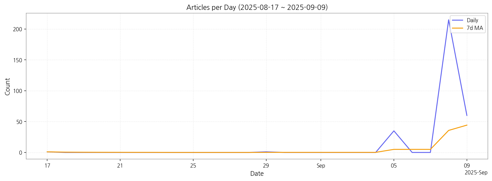

# Weekly/New Biz Report (2025-09-09)

## Executive Summary

- 이번 기간 핵심 토픽과 키워드, 주요 시사점을 요약합니다.

1) 상위 토픽을 3개 주제로 묶어 핵심 맥락을 설명하면 다음과 같습니다. 첫째, **디지털 전환과 스마트 기술**은 스마트공장 구축, 첨단 기술 운영 등 디지털 전환 관련 뉴스가 다수를 차지하며 미래 기술에 대한 관심을 반영합니다. 둘째, **AI 및 클라우드 기술**은 AI, 인공지능 서비스, 클라우드 기반 PaaS 등 AI와 클라우드 기술의 발전과 시장 확대에 대한 내용을 주로 다룹니다. 마지막으로 **글로벌 경제 및 기술 경쟁**은 중국과의 경쟁, 삼성과 같은 대기업의 기술 개발 및 투자, 외국인 투자 등 글로벌 시장 상황과 기술 경쟁에 대한 뉴스가 포함됩니다.  이 세 가지 주제는 한국 경제의 미래 성장 동력과 관련된 핵심 기술 및 시장 동향을 보여줍니다.

2) 최근 변화/스파이크를 짚어보면, 9월 5일부터 9월 9일 사이에 기사 수가 급증했습니다. 특히 9월 8일에는 215건의 기사가 등장하며 압도적인 수치를 보였는데, 이는 특정 기술 발표나 정책 공개 등 외부 요인에 의한 것으로 추정됩니다.

3) 실무 인사이트 3가지:

* **주요 기술 트렌드 모니터링 강화:**  AI, 클라우드, 디지털 전환 등 주요 기술 키워드를 중심으로 뉴스 및 기술 동향을 지속적으로 모니터링하여 시장 변화에 대한 빠른 대응 체계를 구축해야 합니다.  특히 9월 초 기사 급증 원인 분석을 통해 예측 불가능한 이벤트에 대한 대비책을 마련해야 합니다.
* **핵심 기술 관련 투자 전략 재검토:**  AI, 스마트공장 등 주요 기술 분야에 대한 투자 전략을 재검토하고,  글로벌 경쟁 환경을 고려한 차별화된 전략을 수립해야 합니다.  특히 중국 기업과의 경쟁 심화를 고려한 기술 경쟁력 강화 방안을 마련해야 합니다.
* **디지털 전환 가속화 및 인력 양성:**  기업의 디지털 전환을 가속화하고,  AI, 클라우드 등 핵심 기술 분야의 인력 양성에 적극적으로 투자해야 합니다.  한국폴리텍대학과 같은 교육기관과의 협력을 통해 실무 능력을 갖춘 인재를 확보하는 전략을 세워야 합니다.

## Key Metrics

- 기간: 2025-08-17 ~ 2025-09-09
- 총 기사 수: 312
- 문서 수: 20
- 키워드 수(상위): 15
- 토픽 수: 6
- 시계열 데이터 일자 수: 5

## Top Keywords

| Rank | Keyword | Score |
|---:|---|---:|
| 1 | 디스플레이 | 6.276 |
| 2 | 중국 | 3.987 |
| 3 | 한국폴리텍대학 | 3.038 |
| 4 | 클라우드 | 3.034 |
| 5 | 서비스 | 2.483 |
| 6 | 삼성 | 2.351 |
| 7 | 투자 | 2.187 |
| 8 | 디지털 | 2.182 |
| 9 | 기술 | 2.137 |
| 10 | 콘텐츠 | 1.876 |
| 11 | 외국인 | 1.843 |
| 12 | 공개 | 1.712 |
| 13 | 미래 | 1.699 |
| 14 | 기업 | 1.646 |
| 15 | 듀얼 | 1.629 |

## Topics

- Topic #0: 디지털, 스마트공장, 미래, 구축, 서부발전, 문화재
- Topic #1: ai, 중국, 서비스, 인공지능, 특히, 글로벌
- Topic #2: 있다, 콘텐츠, 투자, 외국인, sk하이닉스, 되고
- Topic #3: ai, 클라우드, paas, 9일, 9월, 네이티브
- Topic #4: 중국, 삼성, etn, tr, top5, 자동차
- Topic #5: 디스플레이, 한국, 기술, 공개, 사진, 미디어월

## Trend

- 최근 14~30일 기사 수 추세와 7일 이동평균선을 제공합니다.

## Insights

1) 상위 토픽을 3개 주제로 묶어 핵심 맥락을 설명하면 다음과 같습니다. 첫째, **디지털 전환과 스마트 기술**은 스마트공장 구축, 첨단 기술 운영 등 디지털 전환 관련 뉴스가 다수를 차지하며 미래 기술에 대한 관심을 반영합니다. 둘째, **AI 및 클라우드 기술**은 AI, 인공지능 서비스, 클라우드 기반 PaaS 등 AI와 클라우드 기술의 발전과 시장 확대에 대한 내용을 주로 다룹니다. 마지막으로 **글로벌 경제 및 기술 경쟁**은 중국과의 경쟁, 삼성과 같은 대기업의 기술 개발 및 투자, 외국인 투자 등 글로벌 시장 상황과 기술 경쟁에 대한 뉴스가 포함됩니다.  이 세 가지 주제는 한국 경제의 미래 성장 동력과 관련된 핵심 기술 및 시장 동향을 보여줍니다.

2) 최근 변화/스파이크를 짚어보면, 9월 5일부터 9월 9일 사이에 기사 수가 급증했습니다. 특히 9월 8일에는 215건의 기사가 등장하며 압도적인 수치를 보였는데, 이는 특정 기술 발표나 정책 공개 등 외부 요인에 의한 것으로 추정됩니다.

3) 실무 인사이트 3가지:

* **주요 기술 트렌드 모니터링 강화:**  AI, 클라우드, 디지털 전환 등 주요 기술 키워드를 중심으로 뉴스 및 기술 동향을 지속적으로 모니터링하여 시장 변화에 대한 빠른 대응 체계를 구축해야 합니다.  특히 9월 초 기사 급증 원인 분석을 통해 예측 불가능한 이벤트에 대한 대비책을 마련해야 합니다.
* **핵심 기술 관련 투자 전략 재검토:**  AI, 스마트공장 등 주요 기술 분야에 대한 투자 전략을 재검토하고,  글로벌 경쟁 환경을 고려한 차별화된 전략을 수립해야 합니다.  특히 중국 기업과의 경쟁 심화를 고려한 기술 경쟁력 강화 방안을 마련해야 합니다.
* **디지털 전환 가속화 및 인력 양성:**  기업의 디지털 전환을 가속화하고,  AI, 클라우드 등 핵심 기술 분야의 인력 양성에 적극적으로 투자해야 합니다.  한국폴리텍대학과 같은 교육기관과의 협력을 통해 실무 능력을 갖춘 인재를 확보하는 전략을 세워야 합니다.

## Opportunities (Top 5)

| Idea | Target | Value Prop | Score |
|---|---|---|---:|
| AI 기반 스마트공장 솔루션 제공 | 제조업 중소기업 (직원 수 100명 미만) | AI 기반의 맞춤형 스마트공장 솔루션을 클라우드 기반으로 제공하여 초기 투자 비용을 절감하고, 전문 인력 부족 문제를 해결합니다.  경쟁력 있는 가격과 높은 생산성 향상 효과를 제공하여 중국 기업과의 경쟁에서 우위를 확보할 수 있도록 지원합니다. | 4.50 |
| 클라우드 기반 AI 교육 플랫폼 개발 | AI 및 클라우드 관련 교육기관, 중소기업 재직자 | 클라우드 기반의 실무 중심 AI 교육 플랫폼을 제공하여, 시간과 장소에 제약 없이 편리하게 학습할 수 있도록 합니다.  실제 산업 현장에서 활용되는 기술과 사례를 중심으로 교육하여 실무 능력 향상에 초점을 맞춥니다. | 4.00 |
| AI 기반 글로벌 시장 분석 및 예측 서비스 | 대기업 전략 기획 부서, 투자 회사 | AI 기반의 빅데이터 분석 기술을 활용하여 글로벌 시장 동향을 분석하고 미래를 예측하는 서비스를 제공합니다.  경쟁사 분석, 시장 규모 예측, 투자 전략 수립 등에 필요한 정보를 제공하여 의사결정을 지원합니다. | 3.50 |
| 디지털 전환 컨설팅 및 구축 지원 서비스 | 중견·대기업 IT 부서, 경영 기획 부서 | 기업의 특성과 요구사항에 맞춘 맞춤형 디지털 전환 컨설팅과 구축 지원 서비스를 제공합니다.  클라우드, AI 등 최신 기술 도입을 지원하고,  디지털 전환 과정에서 발생하는 문제 해결을 지원합니다. | 3.00 |
| 스마트팩토리 구축을 위한  AI 기반 예지보전 솔루션 | 중견·대기업 제조업체 생산 관리 부서 | AI 기반의 예지보전 솔루션을 통해 설비 고장을 예측하고 사전에 예방함으로써 생산 차질을 최소화하고 유지보수 비용을 절감합니다.  실시간 데이터 분석을 통해 설비의 이상 징후를 조기에 감지하고,  최적의 유지보수 시점을 제안합니다. | 2.50 |

## Appendix

- 데이터: keywords.json, topics.json, trend_timeseries.json, trend_insights.json, biz_opportunities.json