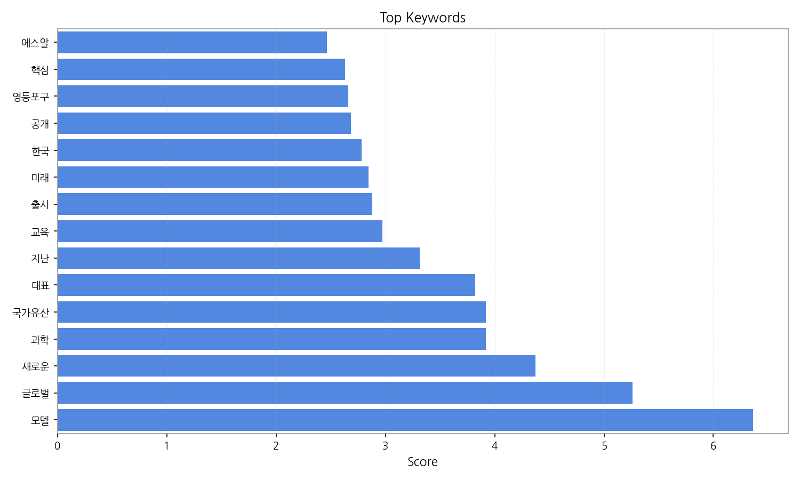
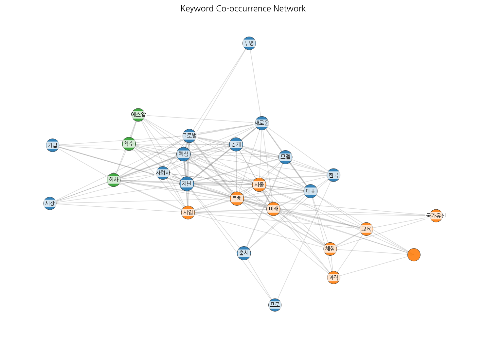
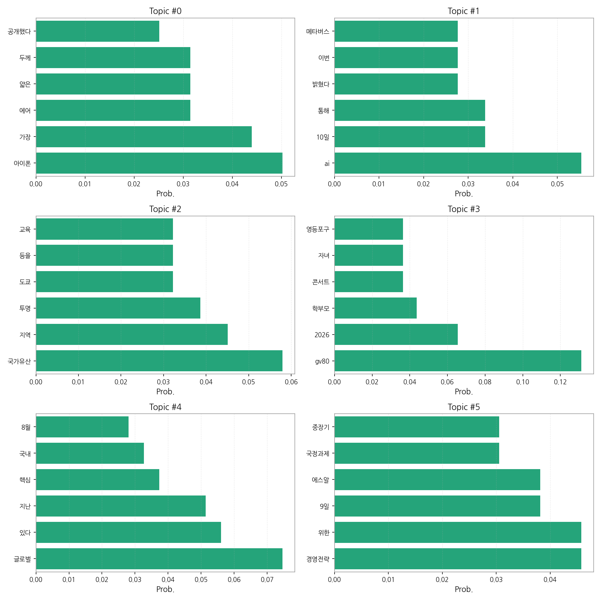

# Weekly/New Biz Report (2025-09-10)

## Executive Summary

- 이번 기간 핵심 토픽과 키워드, 주요 시사점을 요약합니다.

1. **핵심 맥락 설명:**  제공된 데이터는 9월 초를 중심으로 한국 뉴스에서 주요하게 다뤄진 네 가지 주제를 보여줍니다.  첫째,  애플의 신제품 아이폰 공개와 관련된 소식이 있으며, 둘째, AI와 메타버스 기술 관련 뉴스가 다수를 차지합니다. 셋째, 국가유산 및 지역 교육과 관련된 기사들이 있고, 넷째, 자동차(GV80) 출시 및 미래 진로, 학부모 관련 뉴스가 포함되어 있습니다. 이러한 주제들은 기술, 문화, 교육, 경제 등 다양한 분야를 아우르고 있으며,  9월 초의 높은 기사 수는 특정 이벤트 또는 시의성 있는 뉴스의 영향을 반영합니다.

2. **최근 변화/스파이크:** 9월 5일부터 9월 10일 사이에 기사 수가 급증하는 현상이 나타났습니다. 특히 9월 8일에는 215건의 기사가 작성되어, 다른 날짜에 비해 압도적으로 많은 기사가 생성되었는데, 이는 특정 대형 이벤트 또는 뉴스 발표와 관련이 있을 것으로 추정됩니다.

3. **실무 인사이트:**

* **9월 8일 뉴스 이벤트 분석:** 9월 8일 기사 급증 원인을 분석하여, 당시 주요 뉴스 이벤트를 파악하고, 향후 유사한 이벤트 발생 시 대응 전략을 수립합니다.  이는 특정 키워드 분석이나 주요 언론사 기사 분석을 통해 가능합니다.
* **주요 토픽별 키워드 추출 및 모니터링 시스템 구축:**  아이폰, AI, 국가유산, GV80 등 주요 토픽별 핵심 키워드를 추출하고,  실시간 뉴스 모니터링 시스템을 구축하여,  향후 관련 뉴스 트렌드를 빠르게 파악하고 대응할 수 있도록 합니다.
* **데이터 기반 뉴스 콘텐츠 전략 수립:**  데이터 분석 결과를 바탕으로,  각 토픽에 맞는 뉴스 콘텐츠 전략을 수립하고,  독자들의 관심을 끌 수 있는 효과적인 콘텐츠를 제작합니다.  예를 들어, AI 관련 뉴스가 많다면 AI 관련 심층 분석 기사를 제작하는 것을 고려할 수 있습니다.

## Key Metrics

- 기간: 2025-08-17 ~ 2025-09-10
- 총 기사 수: 331
- 문서 수: 20
- 키워드 수(상위): 15
- 토픽 수: 6
- 시계열 데이터 일자 수: 6

## Top Keywords

| Rank | Keyword | Score |
|---:|---|---:|
| 1 | 모델 | 6.365 |
| 2 | 글로벌 | 5.263 |
| 3 | 새로운 | 4.375 |
| 4 | 과학 | 3.921 |
| 5 | 국가유산 | 3.918 |
| 6 | 대표 | 3.821 |
| 7 | 지난 | 3.315 |
| 8 | 교육 | 2.975 |
| 9 | 출시 | 2.880 |
| 10 | 미래 | 2.844 |
| 11 | 한국 | 2.780 |
| 12 | 공개 | 2.687 |
| 13 | 영등포구 | 2.662 |
| 14 | 핵심 | 2.631 |
| 15 | 에스알 | 2.467 |

## Topics

- Topic #0: 아이폰, 가장, 에어, 얇은, 두께, 공개했다
- Topic #1: ai, 10일, 통해, 밝혔다, 이번, 메타버스
- Topic #2: 국가유산, 지역, 투명, 도쿄, 등을, 교육
- Topic #3: gv80, 2026, 학부모, 콘서트, 자녀, 영등포구
- Topic #4: 글로벌, 있다, 지난, 핵심, 국내, 8월
- Topic #5: 경영전략, 위한, 9일, 에스알, 국정과제, 중장기

## Trend

- 최근 14~30일 기사 수 추세와 7일 이동평균선을 제공합니다.

## Insights

1. **핵심 맥락 설명:**  제공된 데이터는 9월 초를 중심으로 한국 뉴스에서 주요하게 다뤄진 네 가지 주제를 보여줍니다.  첫째,  애플의 신제품 아이폰 공개와 관련된 소식이 있으며, 둘째, AI와 메타버스 기술 관련 뉴스가 다수를 차지합니다. 셋째, 국가유산 및 지역 교육과 관련된 기사들이 있고, 넷째, 자동차(GV80) 출시 및 미래 진로, 학부모 관련 뉴스가 포함되어 있습니다. 이러한 주제들은 기술, 문화, 교육, 경제 등 다양한 분야를 아우르고 있으며,  9월 초의 높은 기사 수는 특정 이벤트 또는 시의성 있는 뉴스의 영향을 반영합니다.

2. **최근 변화/스파이크:** 9월 5일부터 9월 10일 사이에 기사 수가 급증하는 현상이 나타났습니다. 특히 9월 8일에는 215건의 기사가 작성되어, 다른 날짜에 비해 압도적으로 많은 기사가 생성되었는데, 이는 특정 대형 이벤트 또는 뉴스 발표와 관련이 있을 것으로 추정됩니다.

3. **실무 인사이트:**

* **9월 8일 뉴스 이벤트 분석:** 9월 8일 기사 급증 원인을 분석하여, 당시 주요 뉴스 이벤트를 파악하고, 향후 유사한 이벤트 발생 시 대응 전략을 수립합니다.  이는 특정 키워드 분석이나 주요 언론사 기사 분석을 통해 가능합니다.
* **주요 토픽별 키워드 추출 및 모니터링 시스템 구축:**  아이폰, AI, 국가유산, GV80 등 주요 토픽별 핵심 키워드를 추출하고,  실시간 뉴스 모니터링 시스템을 구축하여,  향후 관련 뉴스 트렌드를 빠르게 파악하고 대응할 수 있도록 합니다.
* **데이터 기반 뉴스 콘텐츠 전략 수립:**  데이터 분석 결과를 바탕으로,  각 토픽에 맞는 뉴스 콘텐츠 전략을 수립하고,  독자들의 관심을 끌 수 있는 효과적인 콘텐츠를 제작합니다.  예를 들어, AI 관련 뉴스가 많다면 AI 관련 심층 분석 기사를 제작하는 것을 고려할 수 있습니다.

## Opportunities (Top 5)

| Idea | Target | Value Prop | Score |
|---|---|---|---:|
| 실시간 뉴스 이벤트 분석 및 예측 시스템 | 언론사, 뉴스 에이전시, 콘텐츠 제작사, 홍보/마케팅 부서 (대기업 이상) | AI 기반 실시간 뉴스 분석 및 예측 시스템을 통해 뉴스 이벤트 발생 시점 예측 및 주요 키워드 분석을 제공하여 효율적인 콘텐츠 전략 수립 지원.  경쟁사 대비 빠른 뉴스 트렌드 파악 및 대응으로 시장 경쟁력 강화.  데이터 기반의 과학적인 의사결정 지원. | 4.50 |
| AI 기반 뉴스 콘텐츠 자동 생성 플랫폼 | 중소 언론사, 뉴스 에이전시, 개인 블로거, 콘텐츠 마케터 | AI 기반 자동 기사 작성 기능을 통해 뉴스 콘텐츠 제작 시간 단축 및 효율성 증대.  다양한 형태의 뉴스 콘텐츠 자동 생성을 통해 독자 흥미도 향상.  데이터 기반의 최적화된 콘텐츠 배포 전략 제시. | 4.00 |
| 국가유산 연계 교육 콘텐츠 플랫폼 | 학교, 교육기관, 학부모, 청소년 (초중고등학생) | AR/VR 기술을 활용한 인터랙티브 국가유산 교육 콘텐츠 제공.  온라인/오프라인 연계 교육 프로그램 운영.  지역별 맞춤형 교육 콘텐츠 제공. | 3.50 |
| AI 기반 자동차 시장 분석 및 예측 서비스 | 자동차 제조사, 자동차 부품 업체, 자동차 판매업체, 투자사 | AI 기반 데이터 분석을 통해 자동차 시장 트렌드 및 소비자 선호도 예측.  경쟁 차종 분석 및 시장 점유율 예측.  효과적인 마케팅 전략 수립 지원. | 3.00 |
| 맞춤형 미래 진로 교육 플랫폼 | 중고등학생, 학부모, 학교 진로상담 교사 | AI 기반 개인별 맞춤형 진로 상담 및 교육 콘텐츠 제공.  다양한 직업 정보 및 진로 관련 정보 제공.  온라인/오프라인 연계 진로 교육 프로그램 운영. | 2.50 |

## Appendix

- 데이터: keywords.json, topics.json, trend_timeseries.json, trend_insights.json, biz_opportunities.json