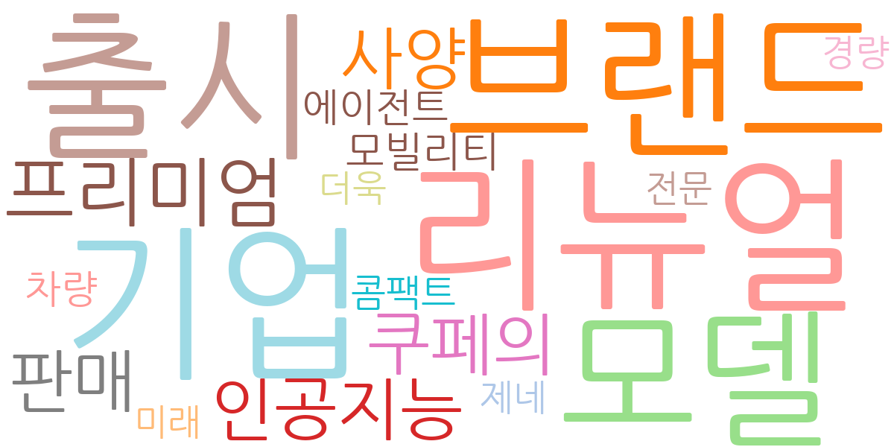
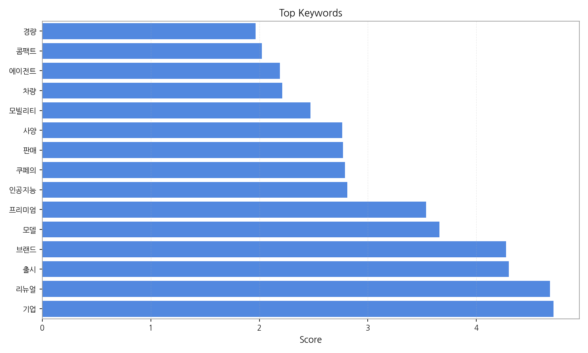
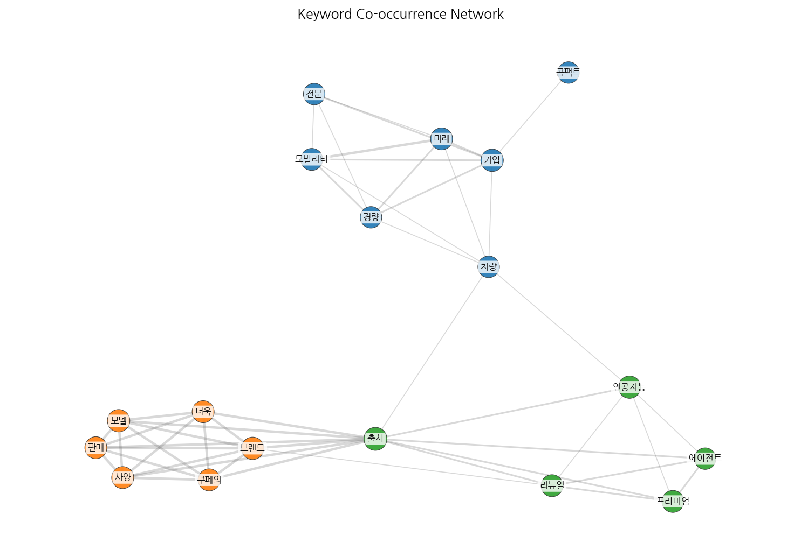
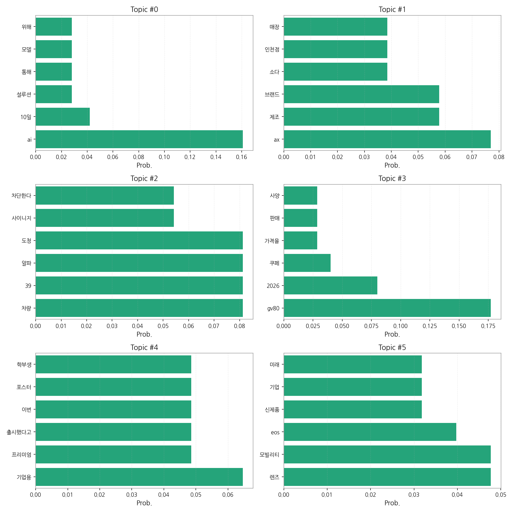
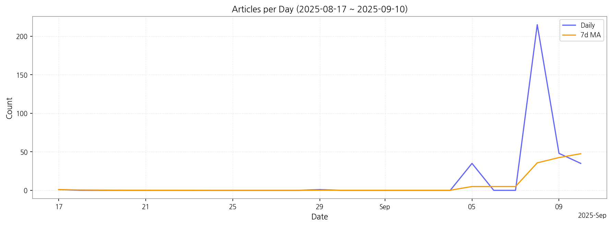

# Weekly/New Biz Report (2025-09-10)

## Executive Summary

- 이번 기간 핵심 토픽과 키워드, 주요 시사점을 요약합니다.

제공된 데이터를 바탕으로 한국어 뉴스의 핵심 맥락을 분석해 보겠습니다.

1. **상위 토픽 핵심 맥락:**  데이터 상 상위 토픽들은 크게 세 가지 핵심 맥락으로 묶을 수 있습니다. 첫째, **AI 기술의 활용 및 발전** (topic 0)은 인공지능 기반 솔루션 및 모델 개발에 대한 뉴스가 다수를 차지합니다. 둘째, **제품 출시 및 브랜드 마케팅** (topic 1, 3, 4, 5)은  새로운 자동차 모델(GV80 쿠페 등),  소비재 브랜드 제품, 기업용 프리미엄 서비스 등 다양한 제품의 출시 및 마케팅 활동을 보여줍니다. 마지막으로 **첨단 기술과 관련된 이슈** (topic 2)는 차량 관련 기술, 특히 도청 방지 기술과 같은 첨단 기술에 대한 뉴스가 포함되어 있습니다.  이러한 세 가지 맥락은 기술 발전과 시장 경쟁의 흐름을 반영하고 있습니다.

2. **최근 변화/스파이크:** 9월 5일부터 9월 10일 사이에 기사 수가 급증했습니다. 특히 9월 8일에는 215건의 기사가 등장하여 압도적인 스파이크를 보였는데, 이는 특정 이벤트나 뉴스 발표에 의한 것으로 추정됩니다. 이 기간 동안 다양한 분야에서 새로운 제품 출시나 기술 발표가 있었을 가능성이 높습니다.

3. **실무 인사이트:**

* **9월 8일 기사 분석:** 9월 8일 급증한 기사들을 분석하여 어떤 이벤트나 뉴스가 기사 증가의 원인이었는지 파악하고, 이를 통해 향후 유사한 이벤트 예측 및 대응 전략을 수립합니다.  특히, 어떤 분야의 뉴스가 가장 많았는지 분석하여, 해당 분야에 대한 집중적인 모니터링 및 대응 전략을 마련해야 합니다.
* **토픽별 키워드 분석 심화:**  각 토픽의 상위 키워드를 더욱 심층적으로 분석하여,  뉴스의 뉘앙스와 트렌드를 정확하게 파악합니다. 예를 들어, "AI" 토픽에서는 어떤 종류의 AI 기술이 주목받고 있는지, "제품 출시" 토픽에서는 어떤 제품 카테고리가 인기를 얻고 있는지 등을 분석해야 합니다.
* **경쟁사 모니터링 강화:**  경쟁사들의 제품 출시 및 마케팅 활동을 지속적으로 모니터링하고,  자사의 전략과 비교 분석하여  경쟁 우위를 확보할 수 있는 방안을 모색합니다. 특히 9월 8일 기사 급증 현상을 통해 경쟁사의 움직임을 파악하고,  자사의 대응 전략을 재검토해야 합니다.

## Key Metrics

- 기간: 2025-08-17 ~ 2025-09-10
- 총 기사 수: 335
- 문서 수: 20
- 키워드 수(상위): 15
- 토픽 수: 6
- 시계열 데이터 일자 수: 6

## Top Keywords

| Rank | Keyword | Score |
|---:|---|---:|
| 1 | 기업 | 4.711 |
| 2 | 리뉴얼 | 4.677 |
| 3 | 출시 | 4.299 |
| 4 | 브랜드 | 4.271 |
| 5 | 모델 | 3.660 |
| 6 | 프리미엄 | 3.535 |
| 7 | 인공지능 | 2.810 |
| 8 | 쿠페의 | 2.788 |
| 9 | 판매 | 2.772 |
| 10 | 사양 | 2.762 |
| 11 | 모빌리티 | 2.471 |
| 12 | 차량 | 2.212 |
| 13 | 에이전트 | 2.190 |
| 14 | 콤팩트 | 2.023 |
| 15 | 경량 | 1.967 |

## Topics

- Topic #0: ai, 10일, 설루션, 통해, 모델, 위해
- Topic #1: ax, 제조, 브랜드, 소다, 인천점, 매장
- Topic #2: 차량, 39, 알파, 도청, 사이니지, 차단한다
- Topic #3: gv80, 2026, 쿠페, 가격을, 판매, 사양
- Topic #4: 기업용, 프리미엄, 출시했다고, 이번, 포스터, 학부생
- Topic #5: 렌즈, 모빌리티, eos, 신제품, 기업, 미래

## Trend

- 최근 14~30일 기사 수 추세와 7일 이동평균선을 제공합니다.

## Insights

제공된 데이터를 바탕으로 한국어 뉴스의 핵심 맥락을 분석해 보겠습니다.

1. **상위 토픽 핵심 맥락:**  데이터 상 상위 토픽들은 크게 세 가지 핵심 맥락으로 묶을 수 있습니다. 첫째, **AI 기술의 활용 및 발전** (topic 0)은 인공지능 기반 솔루션 및 모델 개발에 대한 뉴스가 다수를 차지합니다. 둘째, **제품 출시 및 브랜드 마케팅** (topic 1, 3, 4, 5)은  새로운 자동차 모델(GV80 쿠페 등),  소비재 브랜드 제품, 기업용 프리미엄 서비스 등 다양한 제품의 출시 및 마케팅 활동을 보여줍니다. 마지막으로 **첨단 기술과 관련된 이슈** (topic 2)는 차량 관련 기술, 특히 도청 방지 기술과 같은 첨단 기술에 대한 뉴스가 포함되어 있습니다.  이러한 세 가지 맥락은 기술 발전과 시장 경쟁의 흐름을 반영하고 있습니다.

2. **최근 변화/스파이크:** 9월 5일부터 9월 10일 사이에 기사 수가 급증했습니다. 특히 9월 8일에는 215건의 기사가 등장하여 압도적인 스파이크를 보였는데, 이는 특정 이벤트나 뉴스 발표에 의한 것으로 추정됩니다. 이 기간 동안 다양한 분야에서 새로운 제품 출시나 기술 발표가 있었을 가능성이 높습니다.

3. **실무 인사이트:**

* **9월 8일 기사 분석:** 9월 8일 급증한 기사들을 분석하여 어떤 이벤트나 뉴스가 기사 증가의 원인이었는지 파악하고, 이를 통해 향후 유사한 이벤트 예측 및 대응 전략을 수립합니다.  특히, 어떤 분야의 뉴스가 가장 많았는지 분석하여, 해당 분야에 대한 집중적인 모니터링 및 대응 전략을 마련해야 합니다.
* **토픽별 키워드 분석 심화:**  각 토픽의 상위 키워드를 더욱 심층적으로 분석하여,  뉴스의 뉘앙스와 트렌드를 정확하게 파악합니다. 예를 들어, "AI" 토픽에서는 어떤 종류의 AI 기술이 주목받고 있는지, "제품 출시" 토픽에서는 어떤 제품 카테고리가 인기를 얻고 있는지 등을 분석해야 합니다.
* **경쟁사 모니터링 강화:**  경쟁사들의 제품 출시 및 마케팅 활동을 지속적으로 모니터링하고,  자사의 전략과 비교 분석하여  경쟁 우위를 확보할 수 있는 방안을 모색합니다. 특히 9월 8일 기사 급증 현상을 통해 경쟁사의 움직임을 파악하고,  자사의 대응 전략을 재검토해야 합니다.

## Opportunities (Top 5)

| Idea | Target | Value Prop | Score |
|---|---|---|---:|
| 뉴스 기반 경쟁사 모니터링 및 시장 예측 서비스 | 대기업 홍보/마케팅 부서, 시장조사 기관, 경영 컨설팅 회사 | 한국어 뉴스 데이터를 기반으로 경쟁사의 제품 출시, 마케팅 전략, 기술 동향 등을 실시간으로 모니터링하고 분석하여 제공합니다.  AI 기반 핵심 맥락 분석을 통해 시장 트렌드 변화를 예측하고,  경쟁 우위 확보를 위한 전략 수립에 필요한 인사이트를 제공합니다.  기존의 수동적인 모니터링 방식보다 효율적이고 정확한 정보를 제공합니다. | 4.50 |
| AI 기반 제품 출시 및 마케팅 전략 최적화 플랫폼 | 중소/중견기업 마케팅 부서, 스타트업 | AI 기반 뉴스 분석 기술을 활용하여 제품 출시 전략 및 마케팅 채널 최적화를 지원합니다.  시장 트렌드 분석을 통해 효과적인 마케팅 메시지 및 타겟 고객을 도출하고,  예상되는 시장 반응을 예측하여  리스크를 최소화합니다.  데이터 기반 의사결정을 통해 마케팅 효율성을 극대화합니다. | 4.00 |
| 뉴스 기반 첨단 기술 동향 분석 및 예측 서비스 | IT 기업 R&D 부서, 기술 투자 기관 | 한국어 뉴스 데이터를 기반으로 첨단 기술(AI, 모빌리티 등) 동향을 분석하고,  미래 기술 트렌드를 예측하여 제공합니다.  핵심 기술 및 이슈를 신속하게 파악하고,  기술 개발 전략 수립에 필요한 인사이트를 제공합니다.  경쟁 기술 분석을 통해 기술 경쟁력 강화 전략을 제시합니다. | 3.80 |
| AI 기반 뉴스 맥락 분석을 통한 이벤트 예측 시스템 | 금융 기관, 증권사, 리스크 관리 부서 | AI 기반 뉴스 맥락 분석 기술을 활용하여 시장에 영향을 미칠 수 있는 이벤트 발생 가능성을 예측하고,  그 영향을 분석합니다.  이벤트 발생 시 신속한 대응 전략을 수립하고,  리스크를 최소화하는 데 도움을 줍니다.  데이터 기반 예측을 통해 의사결정의 정확성을 높입니다. | 3.50 |
| 맞춤형 뉴스 요약 및 분석 서비스 (특정 산업/기업 중심) | 대기업 CEO, 임원, 부서장 (자동차, IT, 소비재 등 특정 산업) | AI 기반 뉴스 분석 기술을 활용하여 특정 산업 또는 기업에 관련된 뉴스만을 추출하고,  핵심 내용을 요약하여 제공합니다.  개인의 관심사와 필요에 맞춘 맞춤형 뉴스 서비스를 제공하여,  시간을 절약하고  핵심 정보를 빠르게 파악할 수 있도록 지원합니다.  데이터 기반 의사결정을 지원합니다. | 3.20 |

## Appendix

- 데이터: keywords.json, topics.json, trend_timeseries.json, trend_insights.json, biz_opportunities.json