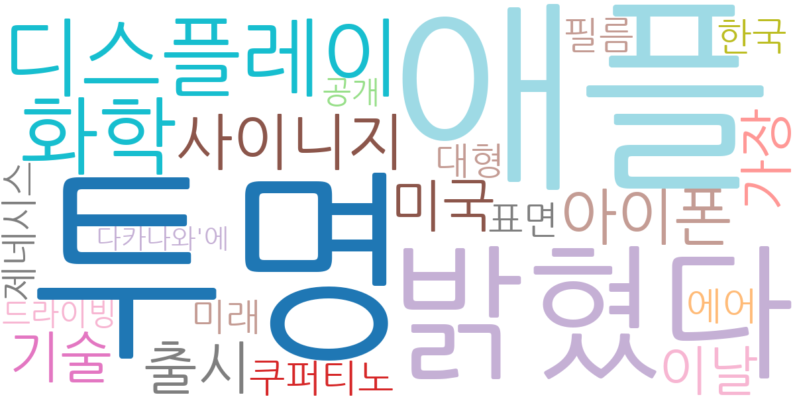
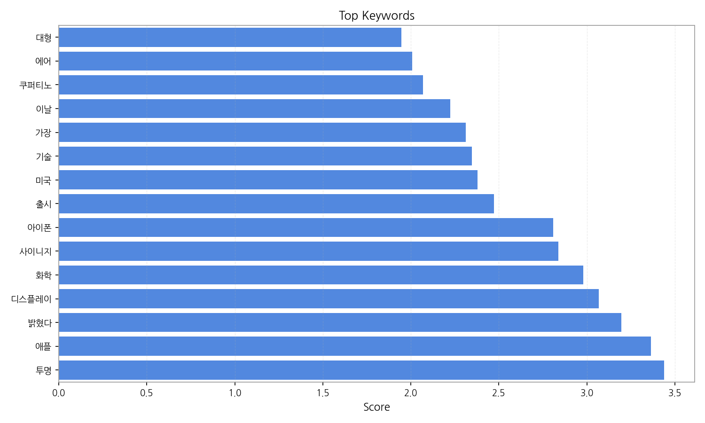
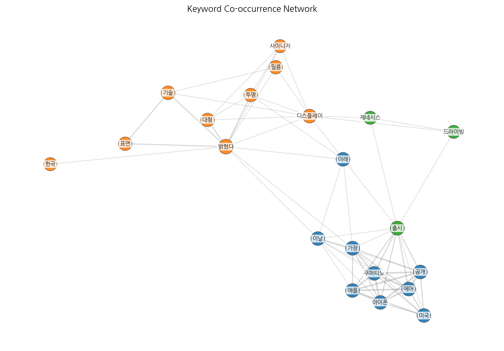
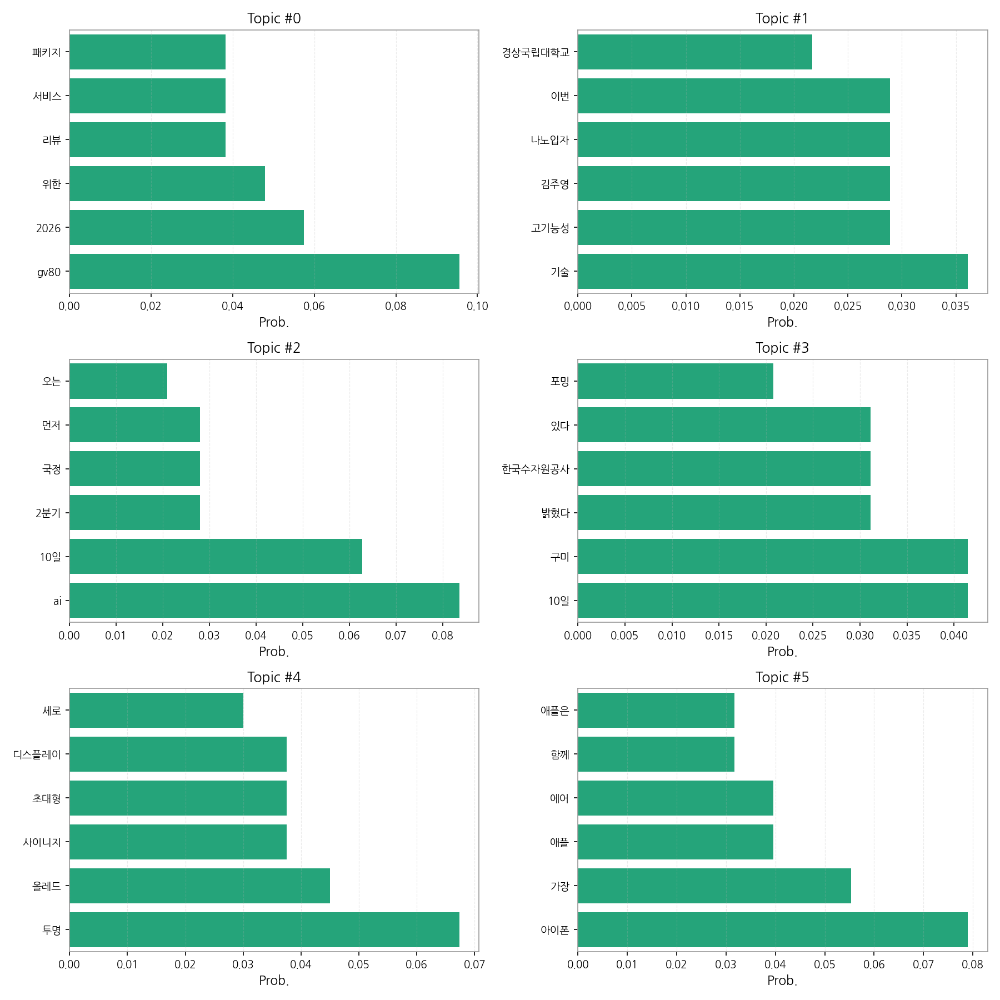
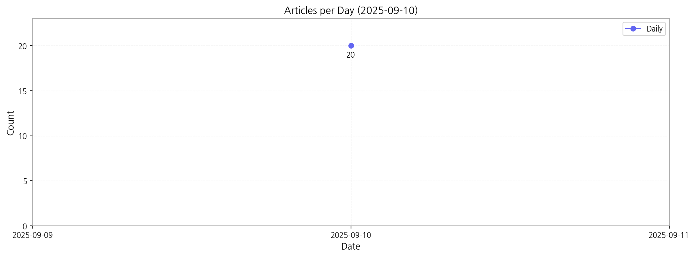

# Weekly/New Biz Report (2025-09-10)

## Executive Summary

- 이번 기간 핵심 토픽과 키워드, 주요 시사점을 요약합니다.

제공된 데이터를 바탕으로 한국어 뉴스 기사의 핵심 맥락을 분석해 보겠습니다.

1) **상위 토픽 핵심 맥락:**  데이터는 자동차, 기술, AI, 지역 개발, 디스플레이 산업 등 다섯 가지 주요 분야를 다루고 있습니다.  GV80 관련 서비스 패키지 리뷰, 고기능성 나노입자 기술 개발, AI 기반 미래 모델 및 국정과의 연관성, 구미 지역 개발 및 한국수자원공사 관련 소식, 그리고 LG전자의 초대형 투명 OLED 사이니지 출시 등이 주요 내용입니다.  이러한 기사들은 각 산업 분야의 최신 동향과 기술 발전, 그리고 지역 경제 활성화와 관련된 이슈들을 보여줍니다.

2) **최근 변화/스파이크:** 2025년 9월 10일 20건의 기사가 집중적으로 발생했습니다. 이는 특정 이벤트 또는 뉴스 발표에 따른 급격한 기사 증가를 시사하며, 해당 시점의 주요 뉴스를 파악하는 것이 중요합니다.  추가 데이터가 필요하지만,  특정 제품 출시, 정부 정책 발표, 또는 주요 행사 개최 등이 원인일 가능성이 높습니다.

3) **실무 인사이트:**

* **주요 키워드 모니터링 강화:**  GV80, AI, OLED, 구미 등 주요 키워드에 대한 실시간 모니터링 시스템을 구축하여 뉴스 트렌드를 빠르게 파악하고,  시장 변화에 대한 선제적 대응을 준비해야 합니다.  특히 2025년 9월 10일과 같은 급증 시점의 뉴스를 분석하여 원인을 규명하고,  향후 유사한 상황 발생에 대비해야 합니다.
* **경쟁사 및 기술 동향 분석:**  고기능성 나노입자 기술, AI 모델, 초대형 OLED 사이니지 등 경쟁사의 기술 개발 및 시장 진출 현황을 면밀히 분석하여 자사의 전략을 수립하고,  차별화된 경쟁력을 확보해야 합니다.  특히,  관련 기술의 특허 동향과 시장 경쟁력 분석을 통해 미래 전략을 수립해야 합니다.
* **지역 경제 및 정부 정책 연계:** 구미 지역 개발과 관련된 뉴스를 분석하여 정부 정책 및 지역 경제 동향을 파악하고,  자사 사업과의 연계 방안을 모색해야 합니다.  지역 사회와의 협력을 통해 시너지 효과를 창출하고,  지속 가능한 성장을 도모해야 합니다.

## Key Metrics

- 기간: 2025-09-10 ~ 2025-09-10
- 총 기사 수: 20
- 문서 수: 20
- 키워드 수(상위): 15
- 토픽 수: 6
- 시계열 데이터 일자 수: 1

## Top Keywords

| Rank | Keyword | Score |
|---:|---|---:|
| 1 | 투명 | 3.439 |
| 2 | 애플 | 3.363 |
| 3 | 밝혔다 | 3.196 |
| 4 | 디스플레이 | 3.069 |
| 5 | 화학 | 2.980 |
| 6 | 사이니지 | 2.837 |
| 7 | 아이폰 | 2.809 |
| 8 | 출시 | 2.472 |
| 9 | 미국 | 2.379 |
| 10 | 기술 | 2.348 |
| 11 | 가장 | 2.313 |
| 12 | 이날 | 2.223 |
| 13 | 쿠퍼티노 | 2.069 |
| 14 | 에어 | 2.008 |
| 15 | 대형 | 1.947 |

## Topics

- Topic #0: gv80, 2026, 위한, 리뷰, 서비스, 패키지
- Topic #1: 기술, 고기능성, 김주영, 나노입자, 이번, 경상국립대학교
- Topic #2: ai, 10일, 2분기, 국정, 먼저, 오는
- Topic #3: 10일, 구미, 밝혔다, 한국수자원공사, 있다, 포밍
- Topic #4: 투명, 올레드, 사이니지, 초대형, 디스플레이, 세로
- Topic #5: 아이폰, 가장, 애플, 에어, 함께, 애플은

## Trend

- 최근 14~30일 기사 수 추세와 7일 이동평균선을 제공합니다.

## Insights

제공된 데이터를 바탕으로 한국어 뉴스 기사의 핵심 맥락을 분석해 보겠습니다.

1) **상위 토픽 핵심 맥락:**  데이터는 자동차, 기술, AI, 지역 개발, 디스플레이 산업 등 다섯 가지 주요 분야를 다루고 있습니다.  GV80 관련 서비스 패키지 리뷰, 고기능성 나노입자 기술 개발, AI 기반 미래 모델 및 국정과의 연관성, 구미 지역 개발 및 한국수자원공사 관련 소식, 그리고 LG전자의 초대형 투명 OLED 사이니지 출시 등이 주요 내용입니다.  이러한 기사들은 각 산업 분야의 최신 동향과 기술 발전, 그리고 지역 경제 활성화와 관련된 이슈들을 보여줍니다.

2) **최근 변화/스파이크:** 2025년 9월 10일 20건의 기사가 집중적으로 발생했습니다. 이는 특정 이벤트 또는 뉴스 발표에 따른 급격한 기사 증가를 시사하며, 해당 시점의 주요 뉴스를 파악하는 것이 중요합니다.  추가 데이터가 필요하지만,  특정 제품 출시, 정부 정책 발표, 또는 주요 행사 개최 등이 원인일 가능성이 높습니다.

3) **실무 인사이트:**

* **주요 키워드 모니터링 강화:**  GV80, AI, OLED, 구미 등 주요 키워드에 대한 실시간 모니터링 시스템을 구축하여 뉴스 트렌드를 빠르게 파악하고,  시장 변화에 대한 선제적 대응을 준비해야 합니다.  특히 2025년 9월 10일과 같은 급증 시점의 뉴스를 분석하여 원인을 규명하고,  향후 유사한 상황 발생에 대비해야 합니다.
* **경쟁사 및 기술 동향 분석:**  고기능성 나노입자 기술, AI 모델, 초대형 OLED 사이니지 등 경쟁사의 기술 개발 및 시장 진출 현황을 면밀히 분석하여 자사의 전략을 수립하고,  차별화된 경쟁력을 확보해야 합니다.  특히,  관련 기술의 특허 동향과 시장 경쟁력 분석을 통해 미래 전략을 수립해야 합니다.
* **지역 경제 및 정부 정책 연계:** 구미 지역 개발과 관련된 뉴스를 분석하여 정부 정책 및 지역 경제 동향을 파악하고,  자사 사업과의 연계 방안을 모색해야 합니다.  지역 사회와의 협력을 통해 시너지 효과를 창출하고,  지속 가능한 성장을 도모해야 합니다.

## Opportunities (Top 5)

| Idea | Target | Value Prop | Score |
|---|---|---|---:|
| AI 기반 뉴스 분석 및 예측 플랫폼 | 대기업 홍보/IR팀, 시장조사 기관, 금융투자사 리서치센터 (직원 100명 이상 대기업) | AI 기반 실시간 뉴스 분석 및 예측 플랫폼을 통해 주요 키워드 모니터링, 경쟁사 및 기술 동향 분석, 정부 정책 연계 분석 등을 자동화하여 시장 변화에 대한 선제적 대응을 가능하게 합니다.  특히, 뉴스 급증 시점 분석을 통해 위기 관리 및 기회 포착에 도움을 줍니다. | 4.50 |
| 맞춤형 뉴스 요약 및 알림 서비스 | 바쁜 비즈니스 전문가, 특정 산업 종사자 (개인 및 기업) | AI 기반 뉴스 요약 및 개인 맞춤형 알림 서비스를 제공하여 사용자의 시간을 절약하고, 관심 분야의 중요 뉴스만 신속하게 전달합니다.  자동화된 뉴스 필터링과 요약 기능으로 효율적인 정보 습득을 지원합니다. | 4.00 |
| 지역 경제 활성화를 위한 데이터 기반 플랫폼 | 지자체, 지역 개발 기관, 지역 기업 (중소기업 포함) | 뉴스 데이터 분석을 기반으로 지역 경제 현황을 실시간으로 파악하고, 지역 개발 정책 수립에 필요한 데이터를 제공합니다.  지역 특성을 고려한 맞춤형 정책 제안 및 지역 경제 활성화 방안을 지원합니다. | 3.50 |
| 산업별 기술 트렌드 분석 및 예측 서비스 | 기업 R&D 부서, 기술 투자 기관 (대기업 및 중견기업) | AI 기반 뉴스 분석을 통해 특정 산업 분야의 기술 트렌드를 분석하고, 미래 기술 발전 방향을 예측합니다.  경쟁사 기술 동향 및 특허 정보를 제공하여 기업의 R&D 전략 수립에 도움을 줍니다. | 3.00 |
| 자동차 산업 서비스 패키지 리뷰 분석 및 개선 플랫폼 | 자동차 제조사, 자동차 서비스 제공업체 (대기업) | AI 기반 자동차 서비스 패키지 리뷰 분석 플랫폼을 통해 고객 의견을 자동으로 수집, 분석하고, 서비스 개선 방향을 제시합니다.  고객 만족도 향상 및 서비스 경쟁력 강화에 기여합니다. | 2.50 |

## Appendix

- 데이터: keywords.json, topics.json, trend_timeseries.json, trend_insights.json, biz_opportunities.json