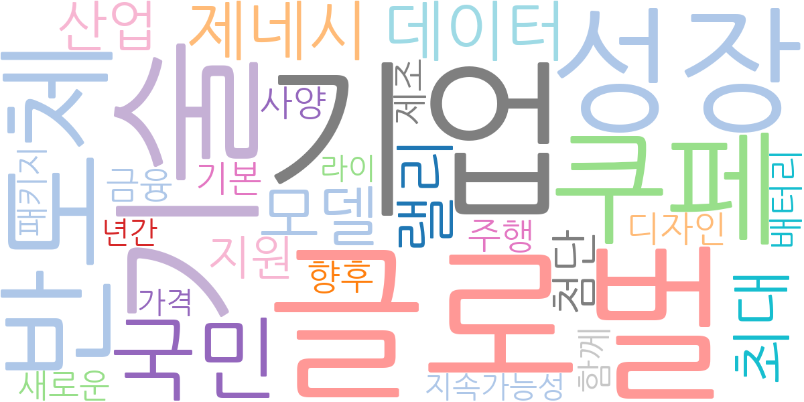
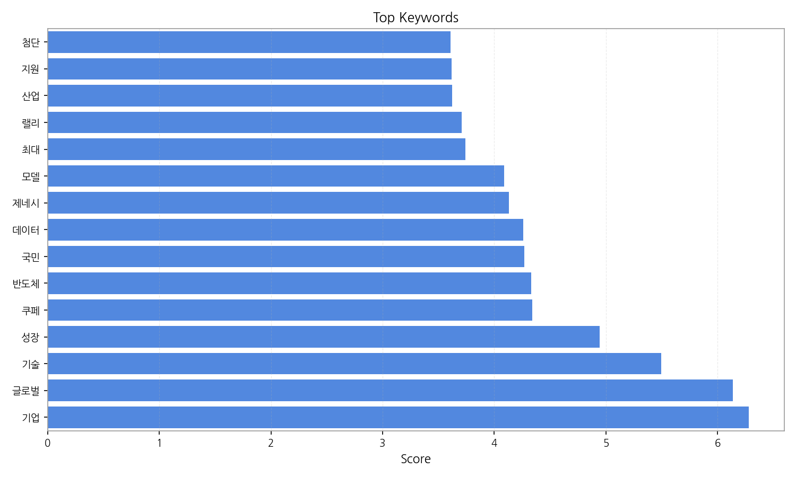
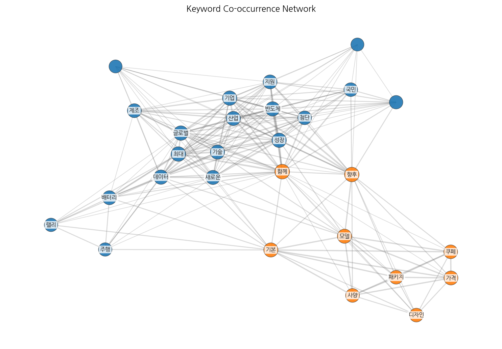
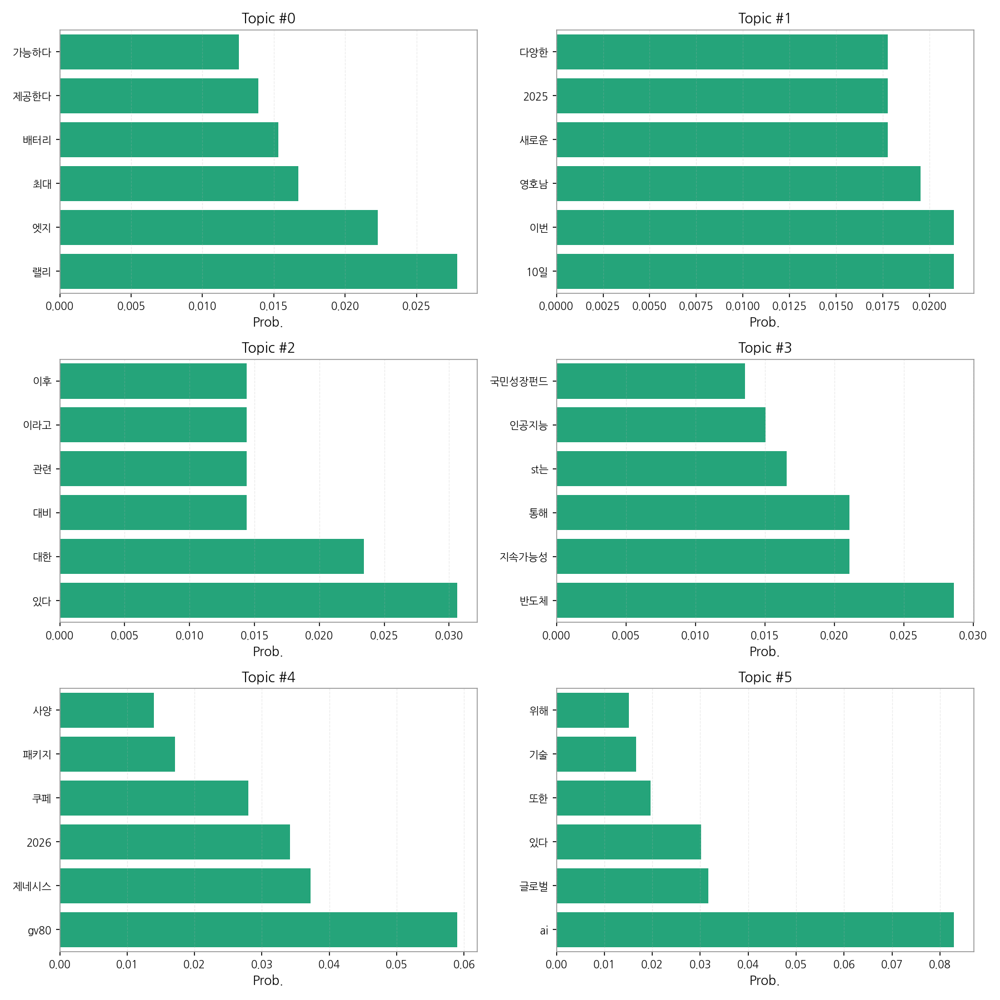
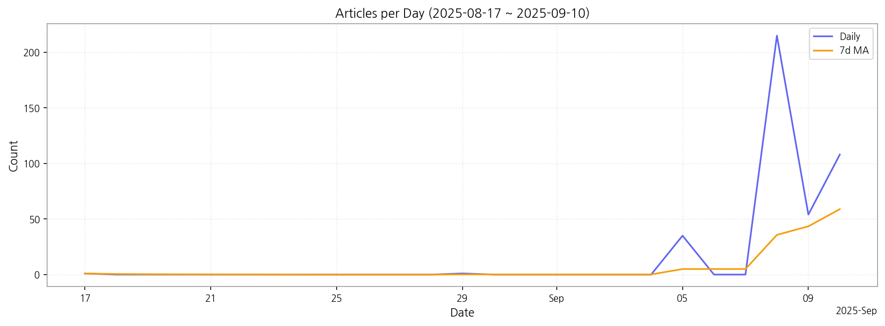

# Weekly/New Biz Report (2025-09-10)

## Executive Summary

- 이번 기간 핵심 토픽과 키워드, 주요 시사점을 요약합니다.

1) 상위 토픽을 3개 주제로 묶어 핵심 맥락을 설명하면 다음과 같습니다. 첫째, 자동차 산업 동향 (topic 0, 4)은 전기차 배터리 기술 발전과 제네시스 GV80 신차 출시 등으로 요약됩니다.  둘째, 정치 및 사회 이슈 (topic 1, 2)는 영호남 지역을 중심으로 한 정치적 이슈와  일반적인 사회 현안에 대한 뉴스 보도를 다룹니다. 셋째, 기술 및 경제 (topic 3, 5)는 반도체 산업의 지속가능성과 인공지능(AI) 기술의 글로벌 성장에 대한 내용을 포함합니다.

2) 최근 변화/스파이크를 살펴보면, 2025년 9월 8일 기사 수가 급증(215건)한 것을 확인할 수 있습니다. 이는 특정 이슈, 예를 들어 중요한 정치적 발표나 대형 기술 기업의 뉴스 발표 등에 의한 것으로 추정됩니다.

3) 실무 인사이트 3가지:

* **9월 8일 기사 급증 원인 분석:** 9월 8일 기사 급증 원인을 분석하여 향후 유사한 현상 발생 시 신속한 대응 전략을 수립합니다.  관련 키워드 분석 및 경쟁사 보도 분석을 통해 원인을 파악하고,  다음과 같은 상황 발생 시 대응 매뉴얼을 작성합니다.
* **토픽별 뉴스 모니터링 시스템 강화:**  자동차, 정치/사회, 기술/경제 등 주요 토픽에 대한 뉴스 모니터링 시스템을 강화하고, 실시간 알림 시스템을 구축하여 중요 이슈 발생 시 즉각적으로 대응할 수 있도록 합니다.  키워드 알림 설정 및  뉴스 소스 다변화를 통해 정보의 정확성과 신속성을 확보합니다.
* **데이터 기반 의사결정 지원 시스템 구축:**  기사 수 변화 추이 분석을 통해 미래 예측 모델을 개발하고,  데이터 기반 의사결정 지원 시스템을 구축하여 효율적인 리소스 배분 및 전략 수립에 활용합니다.  예측 모델 정확도 향상을 위한 지속적인 데이터 분석 및 모델 개선을 통해 의사결정의 정확성을 높입니다.

## Key Metrics

- 기간: 2025-08-17 ~ 2025-09-10
- 총 기사 수: 414
- 문서 수: 20
- 키워드 수(상위): 15
- 토픽 수: 6
- 시계열 데이터 일자 수: 6

## Top Keywords

| Rank | Keyword | Score |
|---:|---|---:|
| 1 | 기업 | 6.282 |
| 2 | 글로벌 | 6.137 |
| 3 | 기술 | 5.493 |
| 4 | 성장 | 4.945 |
| 5 | 쿠페 | 4.342 |
| 6 | 반도체 | 4.329 |
| 7 | 국민 | 4.271 |
| 8 | 데이터 | 4.261 |
| 9 | 제네시 | 4.134 |
| 10 | 모델 | 4.090 |
| 11 | 최대 | 3.743 |
| 12 | 랠리 | 3.710 |
| 13 | 산업 | 3.622 |
| 14 | 지원 | 3.620 |
| 15 | 첨단 | 3.609 |

## Topics

- Topic #0: 랠리, 엣지, 최대, 배터리, 제공한다, 가능하다
- Topic #1: 10일, 이번, 영호남, 새로운, 2025, 다양한
- Topic #2: 있다, 대한, 대비, 관련, 이라고, 이후
- Topic #3: 반도체, 지속가능성, 통해, st는, 인공지능, 국민성장펀드
- Topic #4: gv80, 제네시스, 2026, 쿠페, 패키지, 사양
- Topic #5: ai, 글로벌, 있다, 또한, 기술, 위해

## Trend

- 최근 14~30일 기사 수 추세와 7일 이동평균선을 제공합니다.

## Insights

1) 상위 토픽을 3개 주제로 묶어 핵심 맥락을 설명하면 다음과 같습니다. 첫째, 자동차 산업 동향 (topic 0, 4)은 전기차 배터리 기술 발전과 제네시스 GV80 신차 출시 등으로 요약됩니다.  둘째, 정치 및 사회 이슈 (topic 1, 2)는 영호남 지역을 중심으로 한 정치적 이슈와  일반적인 사회 현안에 대한 뉴스 보도를 다룹니다. 셋째, 기술 및 경제 (topic 3, 5)는 반도체 산업의 지속가능성과 인공지능(AI) 기술의 글로벌 성장에 대한 내용을 포함합니다.

2) 최근 변화/스파이크를 살펴보면, 2025년 9월 8일 기사 수가 급증(215건)한 것을 확인할 수 있습니다. 이는 특정 이슈, 예를 들어 중요한 정치적 발표나 대형 기술 기업의 뉴스 발표 등에 의한 것으로 추정됩니다.

3) 실무 인사이트 3가지:

* **9월 8일 기사 급증 원인 분석:** 9월 8일 기사 급증 원인을 분석하여 향후 유사한 현상 발생 시 신속한 대응 전략을 수립합니다.  관련 키워드 분석 및 경쟁사 보도 분석을 통해 원인을 파악하고,  다음과 같은 상황 발생 시 대응 매뉴얼을 작성합니다.
* **토픽별 뉴스 모니터링 시스템 강화:**  자동차, 정치/사회, 기술/경제 등 주요 토픽에 대한 뉴스 모니터링 시스템을 강화하고, 실시간 알림 시스템을 구축하여 중요 이슈 발생 시 즉각적으로 대응할 수 있도록 합니다.  키워드 알림 설정 및  뉴스 소스 다변화를 통해 정보의 정확성과 신속성을 확보합니다.
* **데이터 기반 의사결정 지원 시스템 구축:**  기사 수 변화 추이 분석을 통해 미래 예측 모델을 개발하고,  데이터 기반 의사결정 지원 시스템을 구축하여 효율적인 리소스 배분 및 전략 수립에 활용합니다.  예측 모델 정확도 향상을 위한 지속적인 데이터 분석 및 모델 개선을 통해 의사결정의 정확성을 높입니다.

## Opportunities (Top 5)

| Idea | Target | Value Prop | Score |
|---|---|---|---:|
| 뉴스 이벤트 예측 및 대응 시스템 | 대기업 홍보/PR팀, 정부 부처 홍보팀, 금융기관 리스크 관리팀 (직원 수 100명 이상) | AI 기반 뉴스 이벤트 예측 및 실시간 알림 시스템을 통해 급증 현상을 사전에 예측하고, 신속한 대응 전략 수립을 지원합니다. 경쟁사 대응 분석 및 키워드 트렌드 분석을 통해 효율적인 정보 분석을 제공합니다. | 4.50 |
| 자동차 산업 동향 분석 및 예측 플랫폼 | 자동차 부품 제조사, 자동차 판매 및 서비스 기업, 자동차 관련 투자 기관 (직원 수 50명 이상) | 데이터 기반 자동차 산업 동향 분석 및 예측 플랫폼을 제공하여 시장 트렌드 변화에 대한 신속한 대응을 지원합니다.  경쟁사 분석, 기술 발전 예측, 시장 수요 예측 등을 통해 효율적인 사업 전략 수립을 돕습니다. | 4.00 |
| AI 기반 정치/사회 이슈 분석 및 예측 서비스 | 정치 컨설팅 업체, 여론조사 기관, 언론사 (직원 수 30명 이상) | AI 기반 정치/사회 이슈 분석 및 예측 서비스를 제공하여 효과적인 의사결정 지원 및 리스크 관리를 돕습니다.  여론 동향 분석, 이슈 확산 예측, 시나리오 분석 등을 통해 효율적인 대응 전략 수립을 지원합니다. | 3.50 |
| 반도체 산업 지속가능성 평가 및 컨설팅 | 반도체 제조 기업, 반도체 관련 기업, 투자 기관 (직원 수 100명 이상) | 반도체 산업의 지속가능성을 평가하고, ESG 경영 전략 수립을 위한 컨설팅 서비스를 제공합니다.  환경, 사회, 지배구조(ESG) 측면에서의 위험 요소를 분석하고, 지속가능한 성장 전략을 제시합니다. | 3.00 |
| AI 기반 글로벌 기술 트렌드 분석 서비스 | IT 기업, 연구소, 투자 기관 (직원 수 50명 이상) | AI 기반 글로벌 기술 트렌드 분석 서비스를 제공하여 미래 기술 변화에 대한 예측 및 대응 전략 수립을 지원합니다.  특허 분석, 논문 분석, 시장 조사 등을 통해 기술 트렌드를 분석하고, 미래 기술 발전 방향을 예측합니다. | 2.50 |

## Appendix

- 데이터: keywords.json, topics.json, trend_timeseries.json, trend_insights.json, biz_opportunities.json