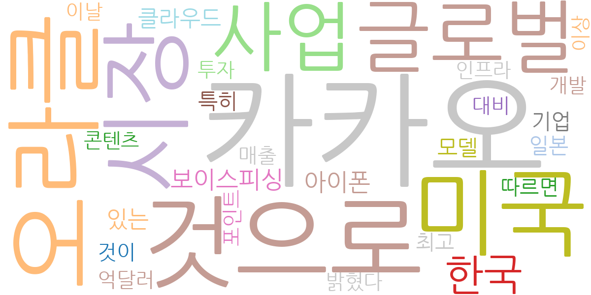
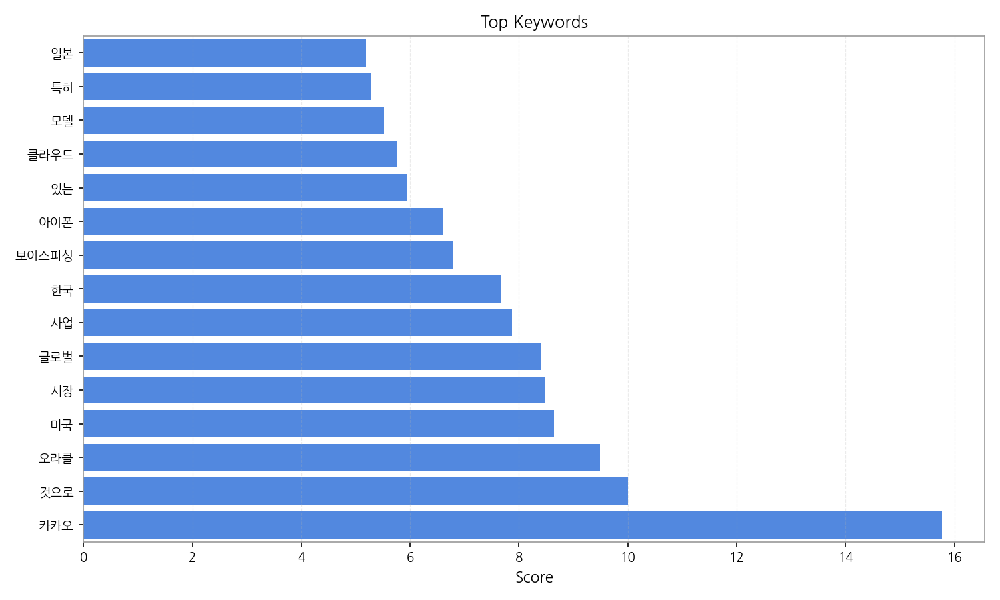
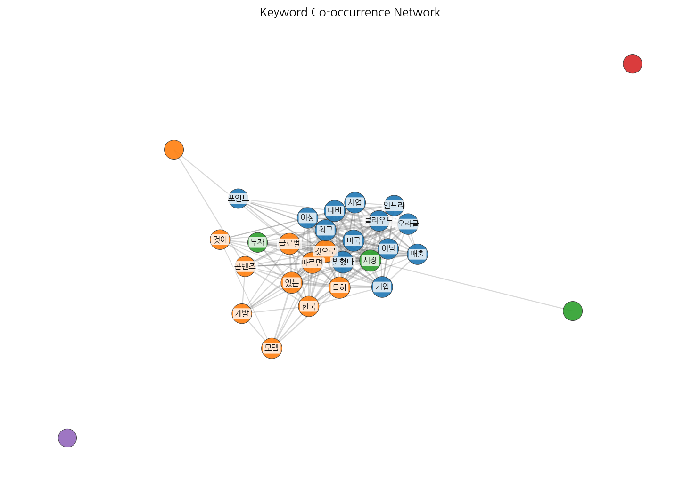
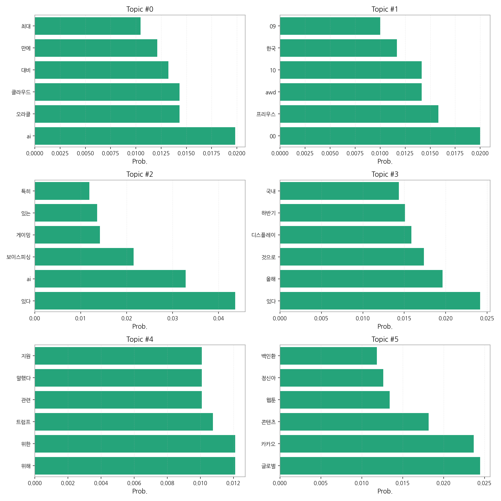
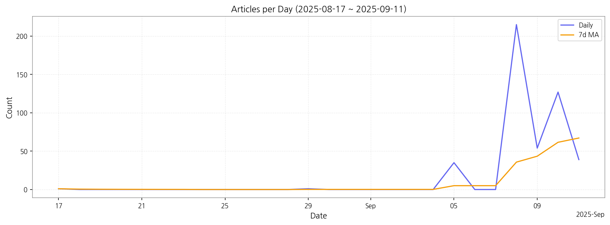

# Weekly/New Biz Report (2025-09-10)

## Executive Summary

- 이번 기간 핵심 토픽과 키워드, 주요 시사점을 요약합니다.

1) 상위 토픽을 3개 주제로 묶어 핵심 맥락을 설명하면 다음과 같습니다. 첫째, AI와 클라우드 기술 관련 뉴스가 증가하고 있으며, 특히 오라클과 같은 글로벌 기업의 기술 동향과 국내 대응 전략에 대한 보도가 많았습니다. 둘째, 자동차(프리우스 AWD 모델 등)와 관련된 뉴스와 AI 기반 보이스피싱 및 게이밍 관련 뉴스가 혼재되어 있으며, 기술 발전과 사회적 문제 해결에 대한 관심이 동시에 나타나고 있습니다.  셋째, 국내외 IT 기업들의 신제품 출시(아이폰17, 디스플레이 기술 등) 및 글로벌 콘텐츠 시장(카카오 웹툰 등) 동향에 대한 뉴스가 주를 이루며, 기술 트렌드와 시장 경쟁에 대한 관심을 반영하고 있습니다.

2) 최근 변화/스파이크를 짚어보면, 9월 5일부터 9월 11일 사이에 기사 수가 급증하였습니다. 특히 9월 8일에는 215건의 기사가 생성되어 다른 날짜에 비해 압도적으로 많은 기사가 생성되었는데, 이는 특정 이슈나 사건 발생에 따른 집중적인 보도를 시사합니다.

3) 실무 인사이트 3가지:

* **9월 8일 기사 분석:** 9월 8일 급증한 기사들을 분석하여 당시 주요 이슈를 파악하고, 관련 키워드를 추출하여 향후 유사 이슈 발생 시 신속한 대응 전략을 수립합니다.  이는 위기 관리 및 기회 포착에 중요한 정보를 제공할 것입니다.
* **토픽별 키워드 심층 분석:** 각 토픽의 상위 키워드를 활용하여 뉴스의 흐름을 더욱 정확하게 파악하고,  각 주제에 대한 세부적인 분석 보고서를 작성하여 경영진에게 전달합니다. 이를 통해 보다 정확한 의사결정을 지원할 수 있습니다.
* **실시간 모니터링 시스템 구축:** 뉴스 기사 발생 건수의 급격한 변화를 감지할 수 있는 실시간 모니터링 시스템을 구축하여,  잠재적인 위험 요소나 기회를 조기에 파악하고 선제적으로 대응할 수 있도록 합니다.  이를 통해 위기 상황 발생 시 신속한 대응이 가능해집니다.

## Key Metrics

- 기간: 2025-08-17 ~ 2025-09-11
- 총 기사 수: 472
- 문서 수: 37
- 키워드 수(상위): 15
- 토픽 수: 6
- 시계열 데이터 일자 수: 7

## Top Keywords

| Rank | Keyword | Score |
|---:|---|---:|
| 1 | 카카오 | 15.774 |
| 2 | 것으로 | 10.001 |
| 3 | 오라클 | 9.490 |
| 4 | 미국 | 8.649 |
| 5 | 시장 | 8.472 |
| 6 | 글로벌 | 8.414 |
| 7 | 사업 | 7.872 |
| 8 | 한국 | 7.682 |
| 9 | 보이스피싱 | 6.786 |
| 10 | 아이폰 | 6.611 |
| 11 | 있는 | 5.941 |
| 12 | 클라우드 | 5.763 |
| 13 | 모델 | 5.519 |
| 14 | 특히 | 5.289 |
| 15 | 일본 | 5.192 |

## Topics

- Topic #0: ai, 오라클, 클라우드, 대비, 만에, 최대
- Topic #1: 00, 프리우스, awd, 10, 한국, 09
- Topic #2: 있다, ai, 보이스피싱, 게이밍, 있는, 특히
- Topic #3: 있다, 올해, 것으로, 디스플레이, 하반기, 국내
- Topic #4: 위해, 위한, 트럼프, 관련, 말했다, 지원
- Topic #5: 글로벌, 카카오, 콘텐츠, 웹툰, 정신아, 백인환

## Trend

- 최근 14~30일 기사 수 추세와 7일 이동평균선을 제공합니다.

## Insights

1) 상위 토픽을 3개 주제로 묶어 핵심 맥락을 설명하면 다음과 같습니다. 첫째, AI와 클라우드 기술 관련 뉴스가 증가하고 있으며, 특히 오라클과 같은 글로벌 기업의 기술 동향과 국내 대응 전략에 대한 보도가 많았습니다. 둘째, 자동차(프리우스 AWD 모델 등)와 관련된 뉴스와 AI 기반 보이스피싱 및 게이밍 관련 뉴스가 혼재되어 있으며, 기술 발전과 사회적 문제 해결에 대한 관심이 동시에 나타나고 있습니다.  셋째, 국내외 IT 기업들의 신제품 출시(아이폰17, 디스플레이 기술 등) 및 글로벌 콘텐츠 시장(카카오 웹툰 등) 동향에 대한 뉴스가 주를 이루며, 기술 트렌드와 시장 경쟁에 대한 관심을 반영하고 있습니다.

2) 최근 변화/스파이크를 짚어보면, 9월 5일부터 9월 11일 사이에 기사 수가 급증하였습니다. 특히 9월 8일에는 215건의 기사가 생성되어 다른 날짜에 비해 압도적으로 많은 기사가 생성되었는데, 이는 특정 이슈나 사건 발생에 따른 집중적인 보도를 시사합니다.

3) 실무 인사이트 3가지:

* **9월 8일 기사 분석:** 9월 8일 급증한 기사들을 분석하여 당시 주요 이슈를 파악하고, 관련 키워드를 추출하여 향후 유사 이슈 발생 시 신속한 대응 전략을 수립합니다.  이는 위기 관리 및 기회 포착에 중요한 정보를 제공할 것입니다.
* **토픽별 키워드 심층 분석:** 각 토픽의 상위 키워드를 활용하여 뉴스의 흐름을 더욱 정확하게 파악하고,  각 주제에 대한 세부적인 분석 보고서를 작성하여 경영진에게 전달합니다. 이를 통해 보다 정확한 의사결정을 지원할 수 있습니다.
* **실시간 모니터링 시스템 구축:** 뉴스 기사 발생 건수의 급격한 변화를 감지할 수 있는 실시간 모니터링 시스템을 구축하여,  잠재적인 위험 요소나 기회를 조기에 파악하고 선제적으로 대응할 수 있도록 합니다.  이를 통해 위기 상황 발생 시 신속한 대응이 가능해집니다.

## Opportunities (Top 5)

| Idea | Target | Value Prop | Score |
|---|---|---|---:|
| AI 기반 뉴스 분석 및 위기관리 플랫폼 | 대기업 홍보/PR팀, 위기관리팀, 경영진 (직원 수 1000명 이상) | AI 기반 실시간 뉴스 모니터링 및 분석 시스템을 통해 중요 뉴스를 빠르게 감지하고, 위험 요소를 사전에 예측하여 선제적으로 대응할 수 있도록 지원합니다.  키워드 추출 및 감성 분석 기능을 통해 뉴스의 핵심 내용을 신속하게 파악하고, 맞춤형 보고서를 제공하여 효율적인 의사결정을 지원합니다. | 4.50 |
| 글로벌 기술 트렌드 분석 및 사업 기회 발굴 서비스 | 중견/대기업 전략기획팀, 신사업개발팀 (직원 수 300명 이상) | AI 기반 데이터 분석을 통해 글로벌 기술 트렌드를 분석하고, 국내 기업에 적합한 사업 기회를 발굴하여 제공합니다.  경쟁사 분석, 시장 예측, 기술 로드맵 등을 포함한 종합적인 보고서를 제공하여 신사업 전략 수립을 지원합니다.  오라클, 카카오 등 주요 기업의 동향을 중점적으로 분석합니다. | 4.00 |
| AI 기반 보이스피싱 예방 및 대응 솔루션 | 금융기관, 통신사, 개인 (고령층, 디지털 취약계층) | AI 기반 음성 분석 및 패턴 인식 기술을 통해 보이스피싱을 실시간으로 감지하고, 피해를 예방하는 솔루션을 제공합니다.  개인 맞춤형 보이스피싱 예방 교육 및 대응 매뉴얼을 제공하고, 피해 발생 시 신속한 지원 체계를 구축합니다.  기존 솔루션보다 정확도를 높이고, 다양한 유형의 보이스피싱에 대응할 수 있습니다. | 3.80 |
| 실시간 뉴스 트렌드 분석 기반 맞춤형 광고 플랫폼 | 중소/중견기업 마케팅팀, 광고대행사 | 실시간 뉴스 트렌드 분석을 기반으로 광고 타겟팅 및 콘텐츠를 자동으로 생성하고 최적화하는 플랫폼을 제공합니다.  특정 이슈 발생 시 신속하게 광고 전략을 변경하고, 효과적인 광고 캠페인을 운영할 수 있도록 지원합니다.  데이터 기반의 정확한 타겟팅으로 광고 효율성을 극대화합니다. | 3.50 |
| AI 기반 웹툰 콘텐츠 추천 및 제작 지원 플랫폼 | 웹툰 플랫폼, 웹툰 제작자, 웹툰 독자 | AI 기반 콘텐츠 추천 시스템을 통해 독자에게 맞춤형 웹툰을 추천하고, 제작자에게는 인기 콘텐츠 제작을 위한 데이터 분석 및 지원을 제공합니다.  독자의 취향 분석 및 트렌드 예측을 통해 새로운 콘텐츠 기획을 지원하고, 제작 과정을 효율화합니다.  카카오 웹툰과 같은 플랫폼과의 협력을 통해 시너지 효과를 창출합니다. | 3.20 |

## Appendix

- 데이터: keywords.json, topics.json, trend_timeseries.json, trend_insights.json, biz_opportunities.json