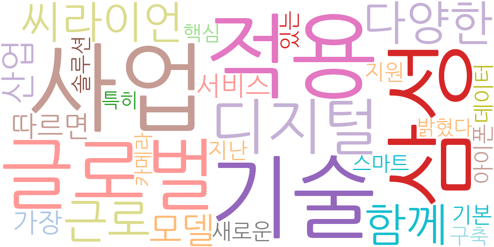
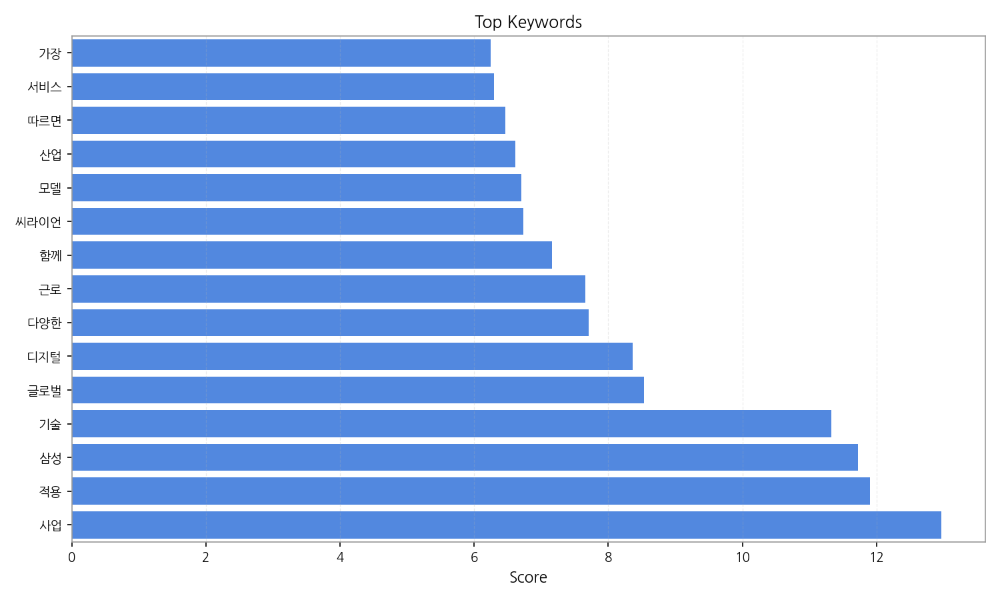
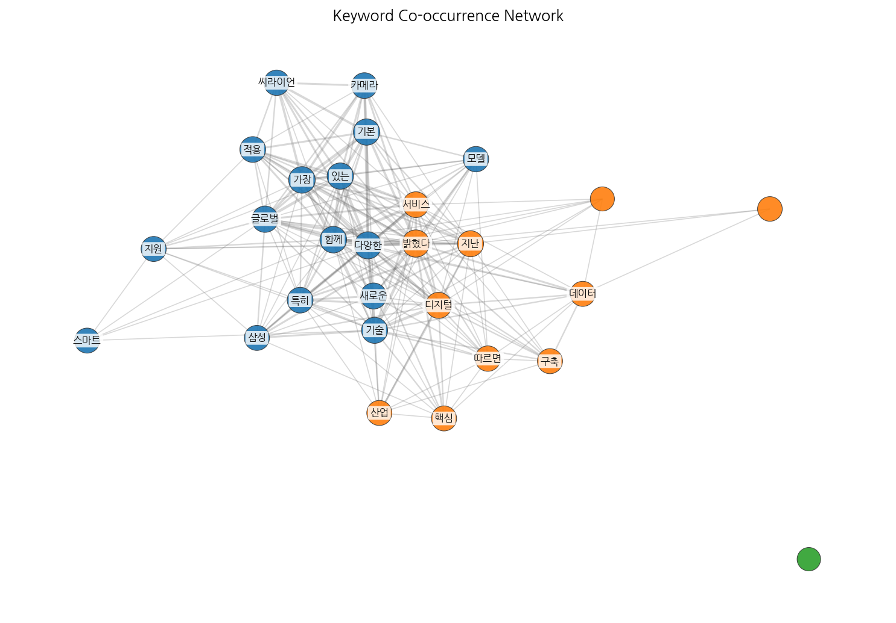
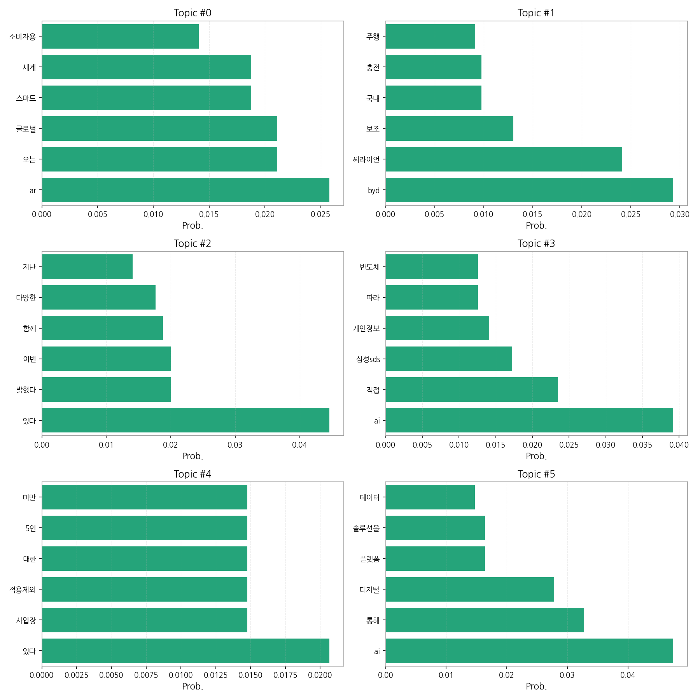
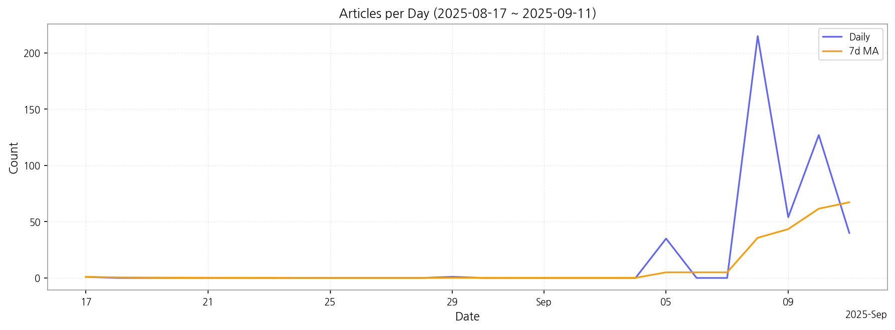

# Weekly/New Biz Report (2025-09-11)

## Executive Summary

- 이번 기간 핵심 토픽과 키워드, 주요 시사점을 요약합니다.

1. **핵심 맥락 설명:**  제공된 데이터는 글로벌 기술 동향, 국내 자동차 시장 변화, 그리고 AI 및 디지털 전환 관련 뉴스를 주로 다루고 있습니다.  특히,  9월 초중순에 걸쳐 AI, 전기차, 그리고 디지털 전환 관련 뉴스가 급증했는데, 이는 특정 기술 발표나 정책 변화 등의 외부 요인에 의한 것으로 추측됩니다.  이는 한국 시장의 기술 트렌드와 정부 정책 방향을 반영하는 것으로 해석할 수 있습니다.

2. **최근 변화/스파이크:** 9월 5일부터 9월 11일 사이에 기사 수가 급격하게 증가했습니다.  이는 특정 기술 관련 대규모 행사, 정부 정책 발표, 또는 주요 기업의 신제품 출시 등의 이벤트가 있었음을 시사합니다.

3. **실무 인사이트:**

* **9월 초중순 뉴스 분석 심화:**  9월 5일부터 11일 사이 기사 급증 원인을 분석하여,  관련 이벤트(기술 발표, 정책 변화 등)를 파악하고,  향후 시장 트렌드 예측에 활용합니다.  구체적으로는 언론 보도 외에 정부 발표자료, 기업 공시자료 등을 참고하여 분석의 정확도를 높여야 합니다.
* **주요 키워드 기반 모니터링 시스템 구축:** "AI", "전기차", "디지털 전환" 등 주요 키워드를 중심으로 뉴스 모니터링 시스템을 구축하여,  실시간으로 시장 동향을 파악하고,  신속한 대응 전략을 수립합니다.  여기에는 다양한 뉴스 소스(온라인 뉴스, 전문 매체 등)를 포함해야 합니다.
* **경쟁사 및 시장 동향 분석 보고서 작성:**  경쟁사의 기술 개발 및 시장 진출 전략을 분석하고,  자사의 경쟁력 강화 방안을 모색하기 위한 정기적인 보고서를 작성합니다.  이를 위해서는 경쟁사의 뉴스 기사, 투자 정보, 특허 정보 등을 종합적으로 분석해야 합니다.

## Key Metrics

- 기간: 2025-08-17 ~ 2025-09-11
- 총 기사 수: 473
- 문서 수: 19
- 키워드 수(상위): 15
- 토픽 수: 6
- 시계열 데이터 일자 수: 7

## Top Keywords

| Rank | Keyword | Score |
|---:|---|---:|
| 1 | 사업 | 12.968 |
| 2 | 적용 | 11.902 |
| 3 | 삼성 | 11.720 |
| 4 | 기술 | 11.324 |
| 5 | 글로벌 | 8.531 |
| 6 | 디지털 | 8.367 |
| 7 | 다양한 | 7.703 |
| 8 | 근로 | 7.662 |
| 9 | 함께 | 7.159 |
| 10 | 씨라이언 | 6.735 |
| 11 | 모델 | 6.699 |
| 12 | 산업 | 6.612 |
| 13 | 따르면 | 6.461 |
| 14 | 서비스 | 6.299 |
| 15 | 가장 | 6.251 |

## Topics

- Topic #0: ar, 오는, 글로벌, 스마트, 세계, 소비자용
- Topic #1: byd, 씨라이언, 보조, 국내, 충전, 주행
- Topic #2: 있다, 밝혔다, 이번, 함께, 다양한, 지난
- Topic #3: ai, 직접, 삼성sds, 개인정보, 따라, 반도체
- Topic #4: 있다, 사업장, 적용제외, 대한, 5인, 미만
- Topic #5: ai, 통해, 디지털, 플랫폼, 솔루션을, 데이터

## Trend

- 최근 14~30일 기사 수 추세와 7일 이동평균선을 제공합니다.

## Insights

1. **핵심 맥락 설명:**  제공된 데이터는 글로벌 기술 동향, 국내 자동차 시장 변화, 그리고 AI 및 디지털 전환 관련 뉴스를 주로 다루고 있습니다.  특히,  9월 초중순에 걸쳐 AI, 전기차, 그리고 디지털 전환 관련 뉴스가 급증했는데, 이는 특정 기술 발표나 정책 변화 등의 외부 요인에 의한 것으로 추측됩니다.  이는 한국 시장의 기술 트렌드와 정부 정책 방향을 반영하는 것으로 해석할 수 있습니다.

2. **최근 변화/스파이크:** 9월 5일부터 9월 11일 사이에 기사 수가 급격하게 증가했습니다.  이는 특정 기술 관련 대규모 행사, 정부 정책 발표, 또는 주요 기업의 신제품 출시 등의 이벤트가 있었음을 시사합니다.

3. **실무 인사이트:**

* **9월 초중순 뉴스 분석 심화:**  9월 5일부터 11일 사이 기사 급증 원인을 분석하여,  관련 이벤트(기술 발표, 정책 변화 등)를 파악하고,  향후 시장 트렌드 예측에 활용합니다.  구체적으로는 언론 보도 외에 정부 발표자료, 기업 공시자료 등을 참고하여 분석의 정확도를 높여야 합니다.
* **주요 키워드 기반 모니터링 시스템 구축:** "AI", "전기차", "디지털 전환" 등 주요 키워드를 중심으로 뉴스 모니터링 시스템을 구축하여,  실시간으로 시장 동향을 파악하고,  신속한 대응 전략을 수립합니다.  여기에는 다양한 뉴스 소스(온라인 뉴스, 전문 매체 등)를 포함해야 합니다.
* **경쟁사 및 시장 동향 분석 보고서 작성:**  경쟁사의 기술 개발 및 시장 진출 전략을 분석하고,  자사의 경쟁력 강화 방안을 모색하기 위한 정기적인 보고서를 작성합니다.  이를 위해서는 경쟁사의 뉴스 기사, 투자 정보, 특허 정보 등을 종합적으로 분석해야 합니다.

## Opportunities (Top 5)

| Idea | Target | Value Prop | Score |
|---|---|---|---:|
| 씨라이언 | 기업(B2B) | 씨라이언 도입으로 비용 절감, 품질·성능 개선, 고객경험 향상 등 가시적 효과를 기대할 수 있음. | 85.19 |
| 함께 | 기업(B2B) | 함께 도입으로 비용 절감, 품질·성능 개선, 고객경험 향상 등 가시적 효과를 기대할 수 있음. | 70.52 |
| 사업 | 기업(B2B) | 사업 도입으로 비용 절감, 품질·성능 개선, 고객경험 향상 등 가시적 효과를 기대할 수 있음. | 36.90 |
| 적용 | 기업(B2B) | 적용 도입으로 비용 절감, 품질·성능 개선, 고객경험 향상 등 가시적 효과를 기대할 수 있음. | 36.08 |
| 삼성 | 기업(B2B) | 삼성 도입으로 비용 절감, 품질·성능 개선, 고객경험 향상 등 가시적 효과를 기대할 수 있음. | 35.94 |

## Appendix

- 데이터: keywords.json, topics.json, trend_timeseries.json, trend_insights.json, biz_opportunities.json