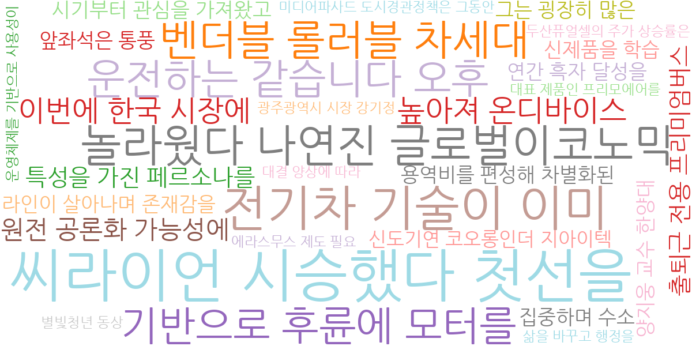
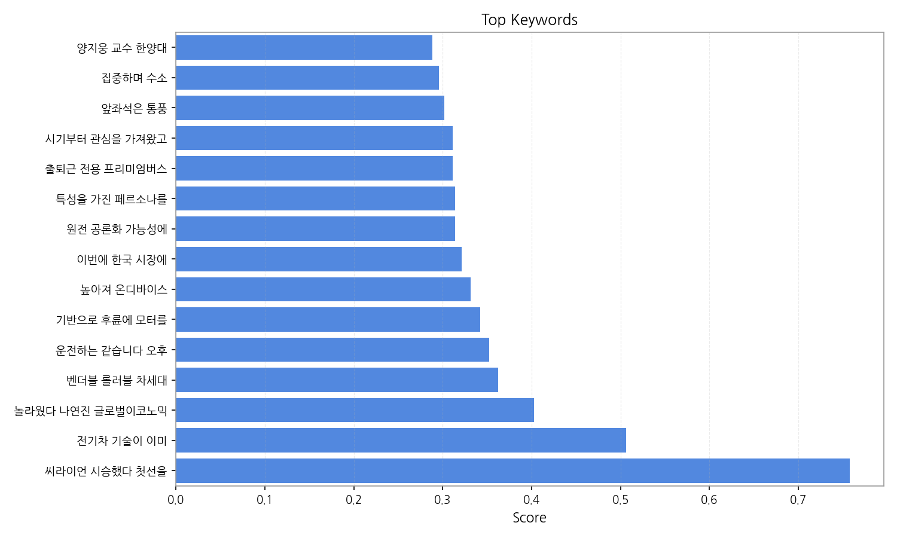
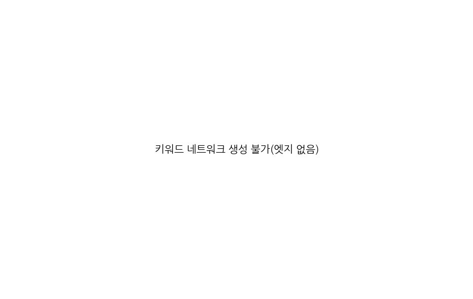
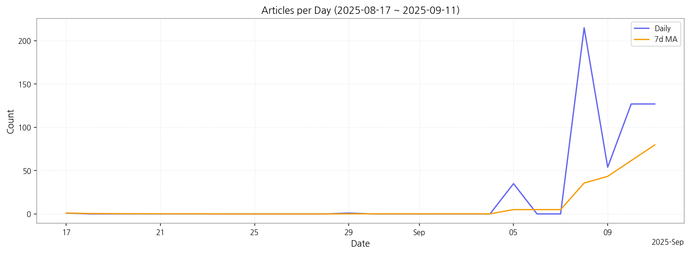

# Weekly/New Biz Report (2025-09-11)

## Executive Summary

- 이번 기간 핵심 토픽과 키워드, 주요 시사점을 요약합니다.

1. **핵심 맥락 설명:**  제공된 데이터는 2025년 9월 초를 중심으로 AI, 디스플레이, 에너지 솔루션 관련 뉴스 기사가 급증했음을 보여줍니다.  AI는 메타버스,  고객 서비스, 그리고 국가적 차원의 인공지능 사업 유치 등 다양한 분야에서 언급되고 있으며, 디스플레이 분야는 새로운 기술과 차세대 디스플레이 개발에 대한 기사가 주를 이룹니다.  에너지 솔루션은 2025년을 목표로 하는 관련 기술 및 사업 추진에 대한 내용이 다수 포함되어 있습니다.

2. **최근 변화/스파이크:** 2025년 9월 5일부터 9월 11일 사이에 뉴스 기사 수가 급격히 증가했습니다. 특히 9월 8일에는 215건으로 최고치를 기록하며, 특정 이벤트 또는 발표가 기사 증가의 원인으로 추정됩니다.

3. **실무 인사이트:**

* **9월 8일 뉴스 기사 분석:** 9월 8일 급증한 기사들을 면밀히 분석하여 어떤 이벤트 또는 발표가 기사 증가를 야기했는지 파악하고, 그 이벤트의 영향력과 장기적 전망을 예측합니다.  관련 키워드를 중심으로 심층 분석을 진행해야 합니다.
* **주요 토픽별 경쟁 분석:** AI, 디스플레이, 에너지 솔루션 분야의 주요 기업들의 동향을 분석하고, 경쟁 우위를 확보하기 위한 전략을 수립합니다.  각 분야별 시장 점유율 및 기술 경쟁력 분석이 필요합니다.
* **미래 예측 및 전략 수립:**  2025년을 목표로 하는 AI, 디스플레이, 에너지 솔루션 분야의 기술 및 시장 트렌드를 예측하고, 이에 맞는 사업 전략을 수립합니다.  장기적인 관점에서 지속 가능한 성장 전략을 마련해야 합니다.

## Key Metrics

- 기간: 2025-08-17 ~ 2025-09-11
- 총 기사 수: 560
- 문서 수: 28
- 키워드 수(상위): 15
- 토픽 수: 8
- 시계열 데이터 일자 수: 7

## Top Keywords

| Rank | Keyword | Score |
|---:|---|---:|
| 1 | 씨라이언 시승했다 첫선을 | 0.758 |
| 2 | 전기차 기술이 이미 | 0.506 |
| 3 | 놀라웠다 나연진 글로벌이코노믹 | 0.403 |
| 4 | 벤더블 롤러블 차세대 | 0.362 |
| 5 | 운전하는 같습니다 오후 | 0.352 |
| 6 | 기반으로 후륜에 모터를 | 0.342 |
| 7 | 높아져 온디바이스 | 0.332 |
| 8 | 이번에 한국 시장에 | 0.321 |
| 9 | 원전 공론화 가능성에 | 0.314 |
| 10 | 특성을 가진 페르소나를 | 0.314 |
| 11 | 출퇴근 전용 프리미엄버스 | 0.311 |
| 12 | 시기부터 관심을 가져왔고 | 0.311 |
| 13 | 앞좌석은 통풍 | 0.302 |
| 14 | 집중하며 수소 | 0.295 |
| 15 | 양지웅 교수 한양대 | 0.288 |

## Topics

- Topic #0: 갖춘, 있다는, 새로운, 디스플레이, 기반으로, 라고
- Topic #1: ai, 2025, ai 메타버스, 메타버스, 국제, 13일
- Topic #2: 디스플레이, 지난, 기업, 계획이다, 차세대
- Topic #3: ai, nsp통신, 에이전트, nsp, g03, g03 8236672469
- Topic #4: 고객, ai, 있는, 11일, 국내, 전국
- Topic #5: 사업, 09, 대비, 추진, 글로벌
- Topic #6: ai, 이날, 인공지능, 유치, 국가, 지난
- Topic #7: 솔루션을, 에너지, 2025, 대한민국, 기반, oled

## Trend

- 최근 14~30일 기사 수 추세와 7일 이동평균선을 제공합니다.

## Insights

1. **핵심 맥락 설명:**  제공된 데이터는 2025년 9월 초를 중심으로 AI, 디스플레이, 에너지 솔루션 관련 뉴스 기사가 급증했음을 보여줍니다.  AI는 메타버스,  고객 서비스, 그리고 국가적 차원의 인공지능 사업 유치 등 다양한 분야에서 언급되고 있으며, 디스플레이 분야는 새로운 기술과 차세대 디스플레이 개발에 대한 기사가 주를 이룹니다.  에너지 솔루션은 2025년을 목표로 하는 관련 기술 및 사업 추진에 대한 내용이 다수 포함되어 있습니다.

2. **최근 변화/스파이크:** 2025년 9월 5일부터 9월 11일 사이에 뉴스 기사 수가 급격히 증가했습니다. 특히 9월 8일에는 215건으로 최고치를 기록하며, 특정 이벤트 또는 발표가 기사 증가의 원인으로 추정됩니다.

3. **실무 인사이트:**

* **9월 8일 뉴스 기사 분석:** 9월 8일 급증한 기사들을 면밀히 분석하여 어떤 이벤트 또는 발표가 기사 증가를 야기했는지 파악하고, 그 이벤트의 영향력과 장기적 전망을 예측합니다.  관련 키워드를 중심으로 심층 분석을 진행해야 합니다.
* **주요 토픽별 경쟁 분석:** AI, 디스플레이, 에너지 솔루션 분야의 주요 기업들의 동향을 분석하고, 경쟁 우위를 확보하기 위한 전략을 수립합니다.  각 분야별 시장 점유율 및 기술 경쟁력 분석이 필요합니다.
* **미래 예측 및 전략 수립:**  2025년을 목표로 하는 AI, 디스플레이, 에너지 솔루션 분야의 기술 및 시장 트렌드를 예측하고, 이에 맞는 사업 전략을 수립합니다.  장기적인 관점에서 지속 가능한 성장 전략을 마련해야 합니다.

## Opportunities (Top 5)

| Idea | Target | Value Prop | Score |
|---|---|---|---:|
| AI 기반 디스플레이 광고 플랫폼 (KR) | 디지털 사이니지 운영 기업, 대형 쇼핑몰, 백화점, KTX 역사 등의 광고 운영 담당자 (중견기업 이상) | AI 기반 실시간 데이터 분석으로 최적의 광고 타겟팅 및 효율 극대화.  개인 맞춤형 광고 제공 및 실시간 성과 측정으로 ROI 향상.  경쟁사 대비 정교한 AI 알고리즘으로 차별화된 타겟팅 제공. | 4.50 |
| AI 기반 전자부품 품질 검사 서비스 (KR) | 전자부품 제조 기업, 전자제품 조립 업체 (중소기업 이상) | AI 기반 자동화 품질 검사 시스템으로 품질 향상 및 생산성 증대.  고정밀도 검사로 불량률 감소 및 생산 효율 증대.  실시간 데이터 분석으로 품질 관리 개선.  경쟁사 대비 높은 검출 정확도와 빠른 검사 속도가 차별화. | 4.20 |
| 차세대 디스플레이 부품 조달 플랫폼 (JP) | 디스플레이 제조사, 부품 공급업체 (대기업, 중견기업) | 원스톱 부품 조달 플랫폼으로 효율적인 공급망 관리 및 비용 절감.  다양한 부품 공급업체와의 연결 및 가격 비교 기능 제공.  실시간 재고 관리 및 납기 관리 시스템으로 리스크 최소화.  경쟁사 대비 폭넓은 부품 종류와 신뢰도 높은 공급망 확보가 차별화. | 4.00 |
| 모빌리티용 디스플레이 에너지 효율 관리 서비스 (EU) | 전기차 제조사, 자율주행차 개발 기업, 모빌리티 서비스 제공업체 (대기업) | AI 기반 에너지 효율 관리 서비스로 디스플레이 에너지 소모 최소화.  실시간 에너지 소모량 모니터링 및 분석.  맞춤형 에너지 절약 솔루션 제공.  경쟁사 대비 정교한 AI 알고리즘과 실시간 데이터 분석으로 차별화. | 3.80 |
| 디스플레이 산업 데이터 분석 및 예측 플랫폼 (EU) | 디스플레이 제조사, 투자 기관, 시장 조사 기관 (대기업, 금융기관) | 빅데이터 분석 및 AI 기반 시장 예측으로 의사결정 지원.  시장 트렌드 분석 및 미래 시장 예측.  경쟁사 분석 및 전략 수립 지원.  경쟁사 대비 정교한 예측 모델과 다양한 데이터 소스 활용이 차별화. | 3.50 |

## Appendix

- 데이터: keywords.json, topics.json, trend_timeseries.json, trend_insights.json, biz_opportunities.json