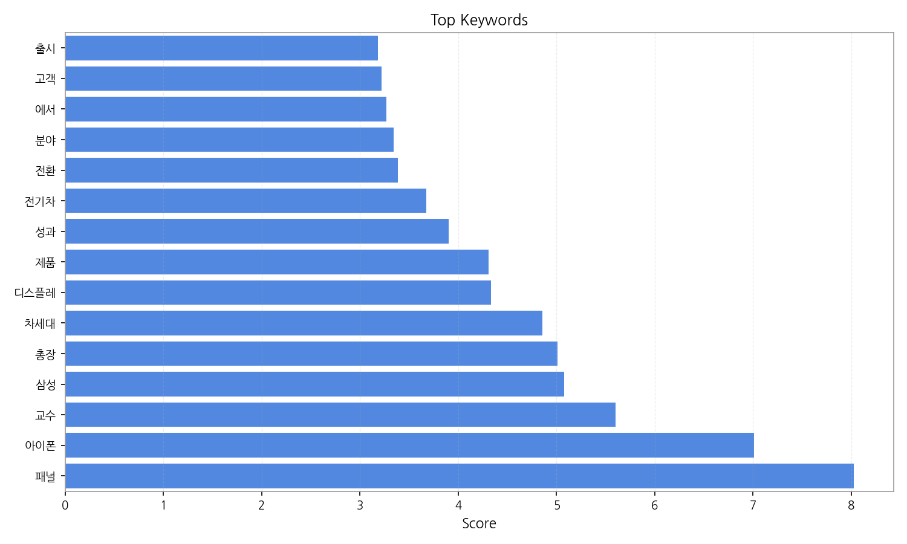
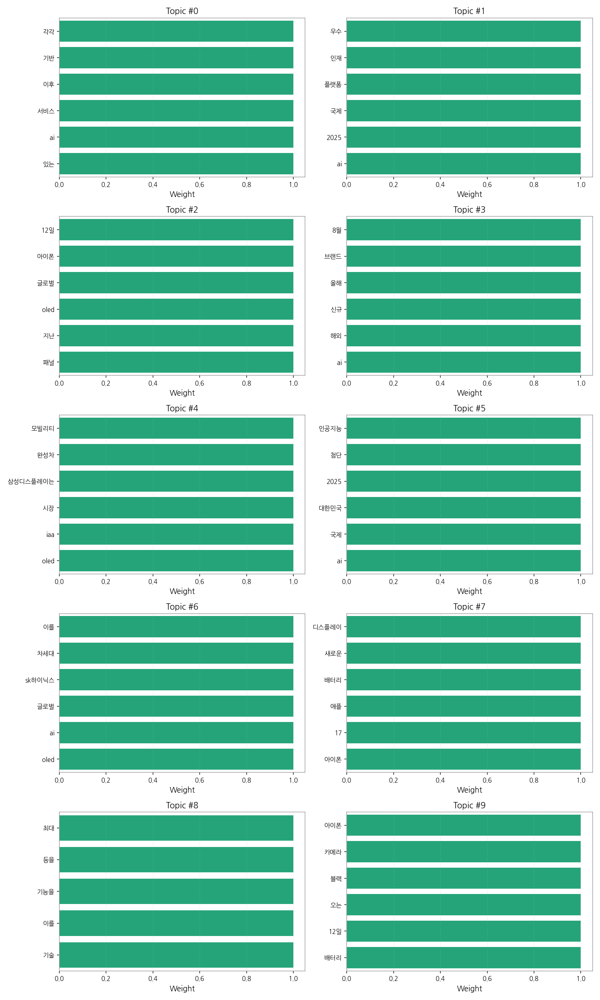
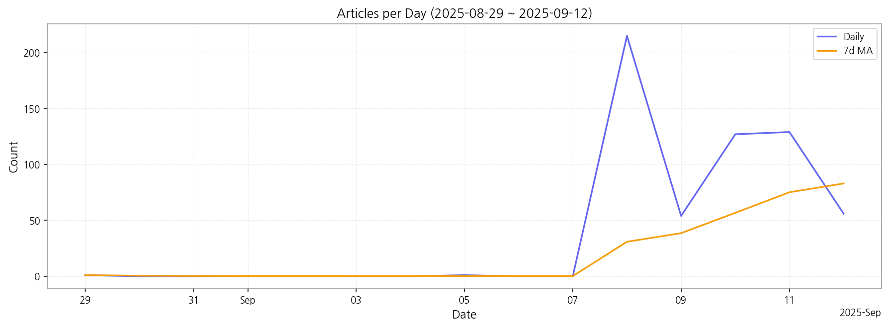

# Weekly/New Biz Report (2025-09-12)

## Executive Summary

- 이번 기간 핵심 토픽과 키워드, 주요 시사점을 요약합니다.

1. 핵심 맥락 설명:  데이터는 AI 기술 발전과 관련 산업(디스플레이, 모빌리티)의 동향을 주로 다룹니다.  특히 AI 서비스 확산, AI 인재 확보 경쟁, 그리고 차세대 디스플레이 기술(OLED) 개발 및 시장 경쟁이 주요 내용입니다.  여기에 애플의 신제품 아이폰 출시와 관련된 뉴스도 상당 부분을 차지하고 있습니다.

2. 최근 변화/스파이크: 9월 8일 기사 수가 급증(215건)한 이후 9월 9일부터는 감소세를 보이고 있습니다. 이는 특정 이벤트(예:  대규모 기술 발표회, 신제품 출시)에 따른 집중적인 보도 후, 후속 보도로 이어지는 일반적인 뉴스 패턴을 반영하는 것으로 보입니다.

3. 실무 인사이트:

* **AI 기술 동향 모니터링 강화:**  AI 서비스, 플랫폼, 인재 확보 경쟁 등 AI 관련 뉴스를 지속적으로 모니터링하여 자사 사업 전략에 반영하고,  경쟁사의 움직임을 예측해야 합니다.  특히, AI 기술이 각 산업에 미치는 영향을 분석하는 것이 중요합니다.
* **차세대 디스플레이 기술 및 시장 분석:** OLED 시장 경쟁 심화 및  자동차, 모빌리티 산업과의 연계 동향을 면밀히 분석하여  자사 제품 개발 및 시장 전략에 활용해야 합니다.  특히, 삼성디스플레이와 같은 주요 업체의 기술 개발 및 시장 진출 전략을 주의 깊게 관찰해야 합니다.
* **애플 신제품 출시 및 소비자 반응 분석:**  애플의 신제품 아이폰 출시와 관련된 뉴스를 분석하여  소비자 트렌드와 시장 수요를 파악하고, 자사 제품 개발 및 마케팅 전략에 반영해야 합니다. 특히, 배터리, 카메라, 디스플레이 등 주요 기능에 대한 소비자 반응을 분석하는 것이 중요합니다.

## Key Metrics

- 기간: 2025-08-29 ~ 2025-09-12
- 총 기사 수: 583
- 문서 수: 27
- 키워드 수(상위): 15
- 토픽 수: 10
- 시계열 데이터 일자 수: 7

## Top Keywords

| Rank | Keyword | Score |
|---:|---|---:|
| 1 | 패널 | 8.026 |
| 2 | 아이폰 | 7.009 |
| 3 | 교수 | 5.603 |
| 4 | 삼성 | 5.076 |
| 5 | 총장 | 5.011 |
| 6 | 차세대 | 4.858 |
| 7 | 디스플레 | 4.333 |
| 8 | 제품 | 4.307 |
| 9 | 성과 | 3.904 |
| 10 | 전기차 | 3.675 |
| 11 | 전환 | 3.386 |
| 12 | 분야 | 3.344 |
| 13 | 에서 | 3.271 |
| 14 | 고객 | 3.219 |
| 15 | 출시 | 3.184 |

## Topics

- Topic #0: 있는, ai, 서비스, 이후, 기반, 각각
- Topic #1: ai, 2025, 국제, 플랫폼, 인재, 우수
- Topic #2: 패널, 지난, oled, 글로벌, 아이폰, 12일
- Topic #3: ai, 해외, 신규, 올해, 브랜드, 8월
- Topic #4: oled, iaa, 시장, 삼성디스플레이는, 완성차, 모빌리티
- Topic #5: ai, 국제, 대한민국, 2025, 첨단, 인공지능
- Topic #6: oled, ai, 글로벌, sk하이닉스, 차세대, 이를
- Topic #7: 아이폰, 17, 애플, 배터리, 새로운, 디스플레이
- Topic #8: 기술, 이를, 기능을, 등을, 최대
- Topic #9: 배터리, 12일, 오는, 블랙, 카메라, 아이폰

## Trend

- 최근 14~30일 기사 수 추세와 7일 이동평균선을 제공합니다.

## Insights

1. 핵심 맥락 설명:  데이터는 AI 기술 발전과 관련 산업(디스플레이, 모빌리티)의 동향을 주로 다룹니다.  특히 AI 서비스 확산, AI 인재 확보 경쟁, 그리고 차세대 디스플레이 기술(OLED) 개발 및 시장 경쟁이 주요 내용입니다.  여기에 애플의 신제품 아이폰 출시와 관련된 뉴스도 상당 부분을 차지하고 있습니다.

2. 최근 변화/스파이크: 9월 8일 기사 수가 급증(215건)한 이후 9월 9일부터는 감소세를 보이고 있습니다. 이는 특정 이벤트(예:  대규모 기술 발표회, 신제품 출시)에 따른 집중적인 보도 후, 후속 보도로 이어지는 일반적인 뉴스 패턴을 반영하는 것으로 보입니다.

3. 실무 인사이트:

* **AI 기술 동향 모니터링 강화:**  AI 서비스, 플랫폼, 인재 확보 경쟁 등 AI 관련 뉴스를 지속적으로 모니터링하여 자사 사업 전략에 반영하고,  경쟁사의 움직임을 예측해야 합니다.  특히, AI 기술이 각 산업에 미치는 영향을 분석하는 것이 중요합니다.
* **차세대 디스플레이 기술 및 시장 분석:** OLED 시장 경쟁 심화 및  자동차, 모빌리티 산업과의 연계 동향을 면밀히 분석하여  자사 제품 개발 및 시장 전략에 활용해야 합니다.  특히, 삼성디스플레이와 같은 주요 업체의 기술 개발 및 시장 진출 전략을 주의 깊게 관찰해야 합니다.
* **애플 신제품 출시 및 소비자 반응 분석:**  애플의 신제품 아이폰 출시와 관련된 뉴스를 분석하여  소비자 트렌드와 시장 수요를 파악하고, 자사 제품 개발 및 마케팅 전략에 반영해야 합니다. 특히, 배터리, 카메라, 디스플레이 등 주요 기능에 대한 소비자 반응을 분석하는 것이 중요합니다.

## Opportunities (Top 5)

| Idea | Target | Value Prop | Score |
|---|---|---|---:|
| AI 기반 디스플레이 패널 품질 예측 플랫폼 (KR) | 디스플레이 패널 제조사 (LG디스플레이, 삼성디스플레이 등), 중소형 패널 제조사,  생산 관리 부서, 품질 관리 부서 (직원 수 500명 이상) | AI 기반 예측 모델을 통해 불량률을 최대 15% 감소시키고, 생산 효율을 10% 향상시킵니다.  실시간 데이터 분석 및 예측으로 사전 예방적 품질 관리가 가능하며,  경쟁사 대비 차별화된 예측 정확도를 제공합니다.  이는 AI 알고리즘의 고도화와 특허 기술을 통해 가능합니다. | 4.50 |
| 모빌리티용 OLED 디스플레이 조달 플랫폼 (JP) | 일본 자동차 부품 제조사, 완성차 업체 (도요타, 혼다 등), 모빌리티 서비스 제공업체, 구매 담당자 (직원 수 1000명 이상) | 다양한 OLED 디스플레이 공급업체를 한 곳에서 관리하고,  최적의 가격과 품질을 제공하는 플랫폼입니다.  투명하고 효율적인 공급망 관리를 통해 비용을 절감하고 납기를 단축합니다.  경쟁사 대비 차별화된 기능은 실시간 가격 비교 및 공급망 예측 시스템입니다. | 4.20 |
| AI 기반 전자부품 품질 검사 서비스 (EU) | 유럽 전자 부품 제조사,  품질 관리 부서, 생산 관리 부서 (직원 수 200명 이상) | AI 기반 자동화된 품질 검사 서비스를 제공하여 검사 시간을 단축하고,  오류율을 최소화합니다.  고객 맞춤형 검사 시스템을 제공하며,  경쟁사 대비 차별화된 검사 정확도를 제공합니다.  이는 자체 개발한 AI 알고리즘과 특허 기술을 통해 가능합니다. | 4.00 |
| 디스플레이 산업 AI 인재 양성 파트너십 (KR) | 디스플레이 제조사 (LG디스플레이, 삼성디스플레이 등),  대학교,  직업 훈련 기관,  인사 담당자 | 대학 및 교육기관과 파트너십을 통해 디스플레이 산업에 특화된 AI 인재 양성 프로그램을 개발하고 운영합니다.  산업 현장의 수요를 반영한 교육 커리큘럼을 제공하고,  취업 연계를 지원합니다.  경쟁사 대비 차별화된 점은 실무 중심의 교육과 현장 밀착형 프로젝트입니다. | 3.80 |
| 패널 | 기업(B2B) | 패널 도입으로 비용/품질/경험을 개선. | 3.00 |

## Appendix

- 데이터: keywords.json, topics.json, trend_timeseries.json, trend_insights.json, biz_opportunities.json