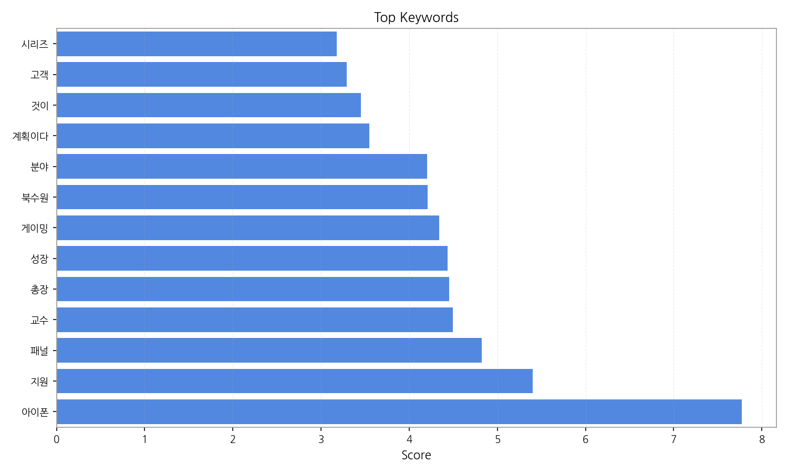
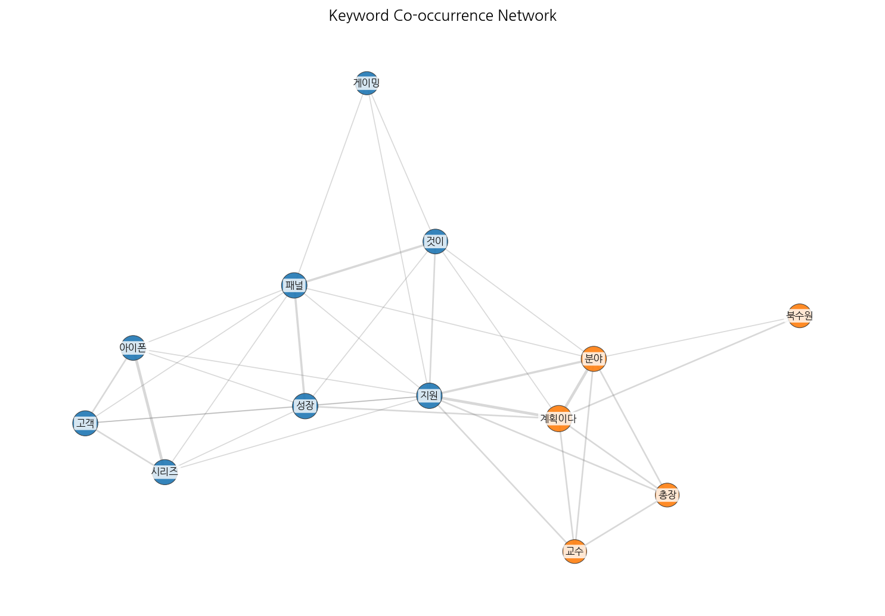
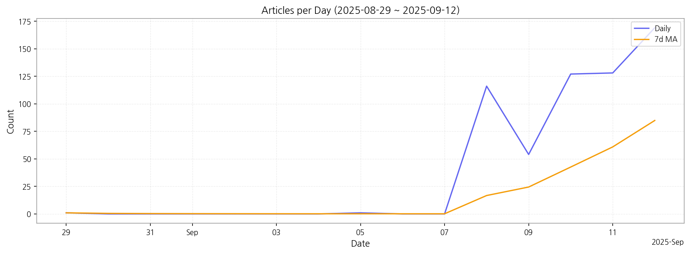

# Weekly/New Biz Report (2025-09-12)

## Executive Summary

- 이번 기간 핵심 토픽과 키워드, 주요 시사점을 요약합니다.

1. **핵심 맥락:**  데이터는 크게 세 가지 핵심 주제를 보여줍니다. 첫째,  OLED 디스플레이 기술과 관련된 삼성디스플레이의 글로벌 시장 경쟁력 및  차세대 아이폰에 대한 기대감이 높은 것을 알 수 있습니다. 둘째, 인공지능(AI) 기술의 발전과 이를 활용한 다양한 제품 및 서비스 출시가 주요 뉴스 토픽입니다. 특히 AI 기반 모빌리티, 로봇, 그리고 AI를 탑재한 아이폰17에 대한 관심이 집중되고 있습니다. 셋째,  전기차와 헬스케어 분야도 주목받고 있으며, 이들 산업에서의 글로벌 경쟁과 기술 발전에 대한 뉴스가 많이 보도되고 있습니다.

2. **최근 변화/스파이크:** 9월 8일부터 기사 수가 급증하였으며, 특히 9월 12일에는 169건으로 최고치를 기록했습니다. 이는 아이폰17 출시와 관련된 뉴스 보도가 집중적으로 이루어졌기 때문으로 추정됩니다.

3. **실무 인사이트:**

* **아이폰17 출시 관련 마케팅 전략 강화:** 9월 8일 이후 아이폰17 관련 기사 급증을 고려하여,  소비자 관심을 집중시키는 타겟 마케팅 전략을 수립하고,  온라인/오프라인 채널을 활용한 적극적인 홍보를 진행해야 합니다.  특히 AI 기능과 OLED 디스플레이 성능을 강조하는 것이 중요합니다.
* **AI 기술 트렌드 모니터링 및 신규 사업 발굴:**  AI 관련 기사의 지속적인 증가 추세를 감안하여,  AI 기술 트렌드를 지속적으로 모니터링하고,  AI 기술을 활용한 신규 사업 아이템 발굴 및 투자를 검토해야 합니다. 특히 모빌리티, 로봇 분야에 대한 집중적인 분석이 필요합니다.
* **OLED 시장 경쟁 심화 대응 전략 수립:**  OLED 시장 경쟁 심화 및 중국 업체의 약진을 고려하여,  차별화된 기술 경쟁력 확보 및 원가 경쟁력 강화를 위한 전략을 수립해야 합니다.  삼성디스플레이의 기술 우위를 유지하고,  글로벌 시장 점유율 확대를 위한 적극적인 노력이 필요합니다.

## Key Metrics

- 기간: 2025-08-29 ~ 2025-09-12
- 총 기사 수: 596
- 문서 수: 26
- 키워드 수(상위): 13
- 토픽 수: 10
- 시계열 데이터 일자 수: 7

## Top Keywords

| Rank | Keyword | Score |
|---:|---|---:|
| 1 | 아이폰 | 7.773 |
| 2 | 지원 | 5.401 |
| 3 | 패널 | 4.822 |
| 4 | 교수 | 4.495 |
| 5 | 총장 | 4.451 |
| 6 | 성장 | 4.436 |
| 7 | 게이밍 | 4.339 |
| 8 | 북수원 | 4.207 |
| 9 | 분야 | 4.200 |
| 10 | 계획이다 | 3.547 |
| 11 | 것이 | 3.453 |
| 12 | 고객 | 3.293 |
| 13 | 시리즈 | 3.175 |

## Topics

- Topic #0: oled, 헬스케어, 동시에, 있는, 전기차, 글로벌
- Topic #1: 에서, 출시, 으로, 새로운, 있는, 가능하며
- Topic #2: 글로벌, 시장, 라고, 서울, 아이폰17, ai
- Topic #3: oled, 대비, 중국, 패널, 올해, 내년
- Topic #4: 로봇, 현장, 프로그램, ai, 인공지능, 지역
- Topic #5: 아이폰17, 계획이다, 12일, 으로, 도시, 반도체
- Topic #6: 에서, 출시, 으로, 새로운, 있는, 가능하며
- Topic #7: 지난, 2025, 글로벌, 12일, 있는
- Topic #8: ai, 모니터, 디스플레이, 부문, 글로벌, 있는
- Topic #9: 아이폰, 17, oled, 최대, ai, display

## Trend

- 최근 14~30일 기사 수 추세와 7일 이동평균선을 제공합니다.

## Insights

1. **핵심 맥락:**  데이터는 크게 세 가지 핵심 주제를 보여줍니다. 첫째,  OLED 디스플레이 기술과 관련된 삼성디스플레이의 글로벌 시장 경쟁력 및  차세대 아이폰에 대한 기대감이 높은 것을 알 수 있습니다. 둘째, 인공지능(AI) 기술의 발전과 이를 활용한 다양한 제품 및 서비스 출시가 주요 뉴스 토픽입니다. 특히 AI 기반 모빌리티, 로봇, 그리고 AI를 탑재한 아이폰17에 대한 관심이 집중되고 있습니다. 셋째,  전기차와 헬스케어 분야도 주목받고 있으며, 이들 산업에서의 글로벌 경쟁과 기술 발전에 대한 뉴스가 많이 보도되고 있습니다.

2. **최근 변화/스파이크:** 9월 8일부터 기사 수가 급증하였으며, 특히 9월 12일에는 169건으로 최고치를 기록했습니다. 이는 아이폰17 출시와 관련된 뉴스 보도가 집중적으로 이루어졌기 때문으로 추정됩니다.

3. **실무 인사이트:**

* **아이폰17 출시 관련 마케팅 전략 강화:** 9월 8일 이후 아이폰17 관련 기사 급증을 고려하여,  소비자 관심을 집중시키는 타겟 마케팅 전략을 수립하고,  온라인/오프라인 채널을 활용한 적극적인 홍보를 진행해야 합니다.  특히 AI 기능과 OLED 디스플레이 성능을 강조하는 것이 중요합니다.
* **AI 기술 트렌드 모니터링 및 신규 사업 발굴:**  AI 관련 기사의 지속적인 증가 추세를 감안하여,  AI 기술 트렌드를 지속적으로 모니터링하고,  AI 기술을 활용한 신규 사업 아이템 발굴 및 투자를 검토해야 합니다. 특히 모빌리티, 로봇 분야에 대한 집중적인 분석이 필요합니다.
* **OLED 시장 경쟁 심화 대응 전략 수립:**  OLED 시장 경쟁 심화 및 중국 업체의 약진을 고려하여,  차별화된 기술 경쟁력 확보 및 원가 경쟁력 강화를 위한 전략을 수립해야 합니다.  삼성디스플레이의 기술 우위를 유지하고,  글로벌 시장 점유율 확대를 위한 적극적인 노력이 필요합니다.

## Opportunities (Top 5)

| Idea | Target | Value Prop | Score |
|---|---|---|---:|
| AI 기반 디스플레이 품질 검사 플랫폼 | 삼성디스플레이, LG디스플레이 등 대규모 디스플레이 제조업체 (KR) | AI 기반 자동화 시스템으로 검사 속도와 정확도를 향상시켜 불량률을 최소화하고, 생산성을 높입니다.  기존 시스템 대비 30% 이상의 비용 절감 효과를 제공하는 것이 차별화 포인트입니다. | 4.50 |
| AI 기반 모빌리티 디스플레이 맞춤형 광고 서비스 | 자동차 제조사 마케팅 부서, 자동차 부품업체 (EU) | AI 기반으로 운전자의 특성과 상황을 분석하여 맞춤형 광고를 제공하고, 실시간으로 광고 효과를 측정합니다.  개인정보보호를 준수하면서 효율적인 타겟팅으로 높은 광고 전환율을 달성하는 것이 차별화 포인트입니다. | 4.00 |
| OLED 디스플레이 부품 조달 플랫폼 | 중소형 OLED 디스플레이 제조업체 (JP) | 다양한 OLED 디스플레이 부품 공급업체를 연결하는 플랫폼을 통해 가격 경쟁력을 확보하고, 효율적인 조달 시스템을 구축합니다.  실시간 재고 관리 및 납기 관리 기능을 제공하여 공급망 관리를 최적화하는 것이 차별화 포인트입니다. | 3.50 |
| 디스플레이 시장 분석 및 예측 서비스 | 디스플레이 업계 투자사, 시장 분석 기관 (KR) | AI 기반 데이터 분석을 통해 디스플레이 시장 트렌드를 예측하고, 경쟁사 전략을 분석하여  투자 및 사업 전략 수립에 필요한 정보를 제공합니다.  다양한 데이터 소스를 활용하여 정확도 높은 예측을 제공하는 것이 차별화 포인트입니다. | 3.00 |
| AI 기반 사이니지 콘텐츠 제작 및 관리 플랫폼 | 대형 쇼핑몰, 백화점, 공항 등 사이니지 운영 업체 (JP) | AI 기반 자동화 시스템으로 사이니지 콘텐츠 제작 및 관리 효율을 높이고,  다양한 기기에 맞는 최적화된 콘텐츠를 제공합니다.  데이터 기반으로 콘텐츠 효과를 분석하고,  최신 트렌드를 반영한 콘텐츠를 자동으로 생성하는 것이 차별화 포인트입니다. | 2.50 |

## Appendix

- 데이터: keywords.json, topics.json, trend_timeseries.json, trend_insights.json, biz_opportunities.json