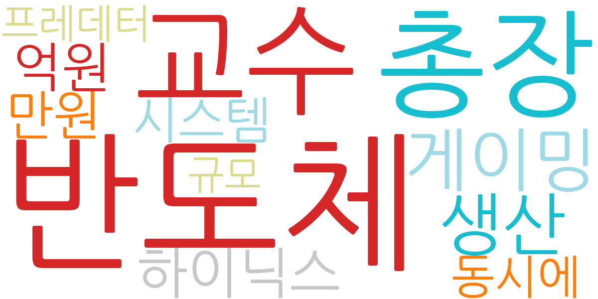
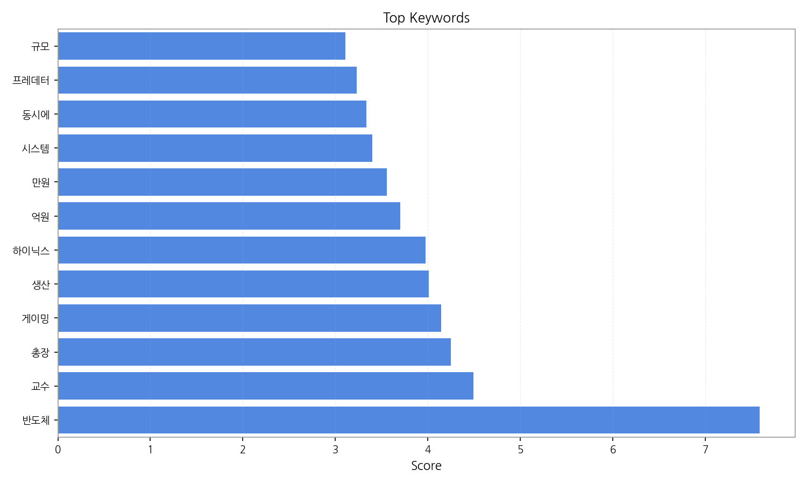
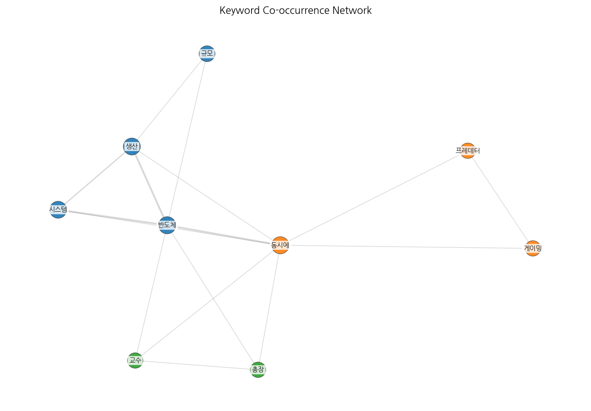
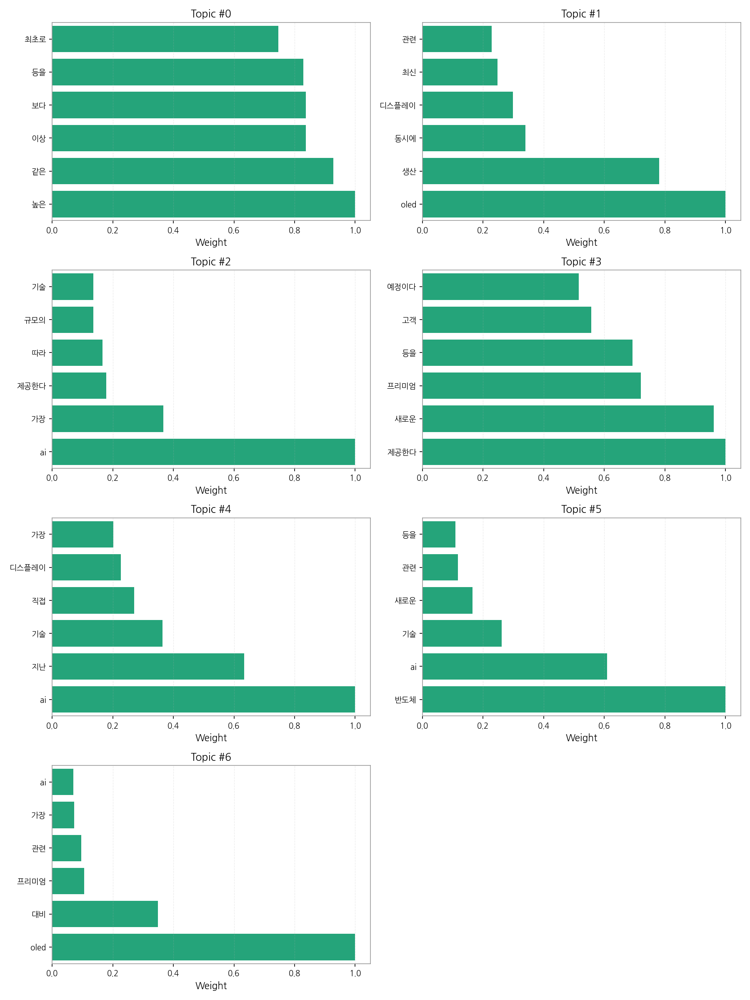
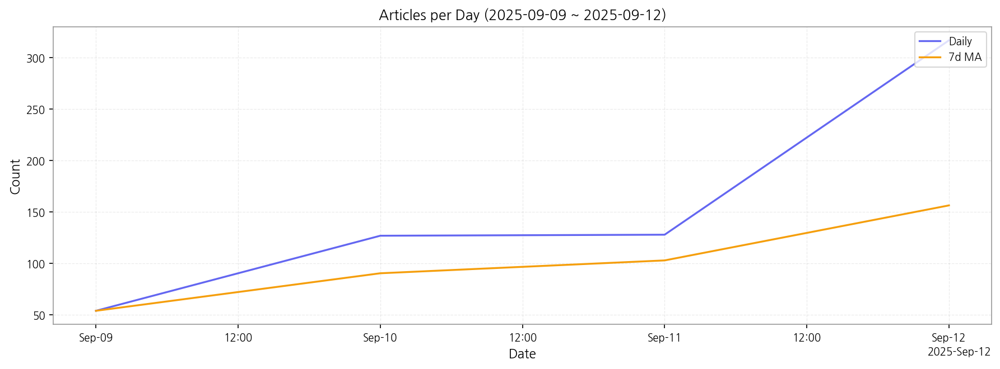

# Weekly/New Biz Report (2025-09-12)

## Executive Summary

- 이번 기간 핵심 토픽과 키워드, 주요 시사점을 요약합니다.

1) 상위 토픽을 3개 주제로 묶어 핵심 맥락을 설명하면 다음과 같습니다.  첫째, AI 기술과 관련된 기사들이 압도적으로 많으며,  AI 시스템의 고도화, AI 기반 서비스 제공, 그리고 AI 기술의 산업 전반 확산 등을 다루고 있습니다. 둘째, OLED 디스플레이 생산 및 경쟁력 강화에 대한 내용이 주를 이루며,  최신 기술과 프리미엄 제품 출시에 대한 기사들이 포함됩니다.  셋째, 반도체와 관련된 기사들도 상당수를 차지하며, AI 기술과의 접목, 새로운 기술 개발, 그리고 해외 시장 진출 등의 내용이 주요하게 다뤄지고 있습니다.

2) 최근 변화/스파이크를 살펴보면, 9월 9일 54건이었던 기사 수가 9월 12일 317건으로 급증했습니다. 이는 특정 이슈나 뉴스의 영향으로 특정 토픽에 대한 보도가 집중적으로 이루어졌음을 시사합니다.

3) 실무 인사이트 3가지:

* **AI 기술 동향 모니터링 강화:**  AI 관련 뉴스를 지속적으로 모니터링하여 기술 발전 및 시장 트렌드 변화를 파악하고,  자사 사업 전략에 반영해야 합니다.  특히, AI 시스템 고도화 및 서비스 제공 관련 뉴스에 집중하여 경쟁사 분석 및 자사 기술 경쟁력 강화 방안을 모색해야 합니다.
* **OLED 시장 경쟁 심화 대응:**  OLED 디스플레이 시장의 경쟁이 심화되고 있으므로,  최신 기술 동향과 경쟁사의 전략을 면밀히 분석하고,  자사의 차별화된 경쟁력을 확보하기 위한 전략을 수립해야 합니다.  프리미엄 제품 개발 및 마케팅 전략 강화가 중요합니다.
* **반도체 산업 AI 융합 전략 수립:**  AI 기술과 반도체 산업의 융합이 가속화되고 있으므로,  AI 기반 반도체 기술 개발 및 관련 시장 진출 전략을 수립해야 합니다.  해외 시장 진출 전략 및 고객 확보 방안을 마련하여 시장 경쟁력을 확보해야 합니다.

## Key Metrics

- 기간: 2025-09-09 ~ 2025-09-12
- 총 기사 수: 626
- 문서 수: 27
- 키워드 수(상위): 12
- 토픽 수: 7
- 시계열 데이터 일자 수: 4

## Top Keywords

| Rank | Keyword | Score |
|---:|---|---:|
| 1 | 반도체 | 7.589 |
| 2 | 교수 | 4.491 |
| 3 | 총장 | 4.248 |
| 4 | 게이밍 | 4.142 |
| 5 | 생산 | 4.008 |
| 6 | 하이닉스 | 3.973 |
| 7 | 억원 | 3.702 |
| 8 | 만원 | 3.555 |
| 9 | 시스템 | 3.398 |
| 10 | 동시에 | 3.334 |
| 11 | 프레데터 | 3.233 |
| 12 | 규모 | 3.110 |

## Topics

- Topic #0: 높은, 같은, 이상, 보다, 등을, 최초로
- Topic #1: oled, 생산, 동시에, 디스플레이, 최신, 관련
- Topic #2: ai, 가장, 제공한다, 따라, 규모의, 기술
- Topic #3: 제공한다, 새로운, 프리미엄, 등을, 고객, 예정이다
- Topic #4: ai, 지난, 기술, 직접, 디스플레이, 가장
- Topic #5: 반도체, ai, 기술, 새로운, 관련, 등을
- Topic #6: oled, 대비, 프리미엄, 관련, 가장, ai

## Trend

- 최근 14~30일 기사 수 추세와 7일 이동평균선을 제공합니다.

## Insights

1) 상위 토픽을 3개 주제로 묶어 핵심 맥락을 설명하면 다음과 같습니다.  첫째, AI 기술과 관련된 기사들이 압도적으로 많으며,  AI 시스템의 고도화, AI 기반 서비스 제공, 그리고 AI 기술의 산업 전반 확산 등을 다루고 있습니다. 둘째, OLED 디스플레이 생산 및 경쟁력 강화에 대한 내용이 주를 이루며,  최신 기술과 프리미엄 제품 출시에 대한 기사들이 포함됩니다.  셋째, 반도체와 관련된 기사들도 상당수를 차지하며, AI 기술과의 접목, 새로운 기술 개발, 그리고 해외 시장 진출 등의 내용이 주요하게 다뤄지고 있습니다.

2) 최근 변화/스파이크를 살펴보면, 9월 9일 54건이었던 기사 수가 9월 12일 317건으로 급증했습니다. 이는 특정 이슈나 뉴스의 영향으로 특정 토픽에 대한 보도가 집중적으로 이루어졌음을 시사합니다.

3) 실무 인사이트 3가지:

* **AI 기술 동향 모니터링 강화:**  AI 관련 뉴스를 지속적으로 모니터링하여 기술 발전 및 시장 트렌드 변화를 파악하고,  자사 사업 전략에 반영해야 합니다.  특히, AI 시스템 고도화 및 서비스 제공 관련 뉴스에 집중하여 경쟁사 분석 및 자사 기술 경쟁력 강화 방안을 모색해야 합니다.
* **OLED 시장 경쟁 심화 대응:**  OLED 디스플레이 시장의 경쟁이 심화되고 있으므로,  최신 기술 동향과 경쟁사의 전략을 면밀히 분석하고,  자사의 차별화된 경쟁력을 확보하기 위한 전략을 수립해야 합니다.  프리미엄 제품 개발 및 마케팅 전략 강화가 중요합니다.
* **반도체 산업 AI 융합 전략 수립:**  AI 기술과 반도체 산업의 융합이 가속화되고 있으므로,  AI 기반 반도체 기술 개발 및 관련 시장 진출 전략을 수립해야 합니다.  해외 시장 진출 전략 및 고객 확보 방안을 마련하여 시장 경쟁력을 확보해야 합니다.

## Opportunities (Top 5)

| Idea | Target | Value Prop | Score |
|---|---|---|---:|
| AI 기반 디스플레이 품질 검사 플랫폼 | 디스플레이 제조사(LG디스플레이, 삼성디스플레이 등), 중소형 디스플레이 패널 생산업체 (KR) | AI 기반 자동화 검사 시스템을 통해 불량률을 최대 30% 감소시키고, 검사 시간을 50% 단축하여 생산성을 향상시킵니다. 경쟁사 대비 높은 정확도와 효율성을 제공하는 것이 차별화 포인트입니다. | 4.50 |
| AI 기반 사이니지 광고 플랫폼 서비스 | 대형 쇼핑몰, 백화점, 지하철 광고 운영사,  모빌리티 서비스 제공업체 (JP) | AI 기반 실시간 데이터 분석을 통해 최적의 광고 타겟팅 및 효과 측정을 제공합니다.  모빌리티 연동을 통해 이동 중인 고객에게 맞춤형 광고를 제공하는 것이 차별화 포인트입니다.  9월 기사 급증은 AI 기술의 산업 전반 확산을 보여주는 지표이며, 이는 본 서비스의 시장 수요 증가를 의미합니다. | 4.20 |
| 자율주행차용 디스플레이 모듈 제품 개발 | 자율주행차 제조사,  자동차 부품 공급업체 (EU) | 자율주행 환경에 최적화된 고품질, 고성능 디스플레이 모듈을 개발하여 안전성과 신뢰성을 향상시킵니다.  차량 내 정보 전달의 효율성을 높이는 것이 차별화 포인트입니다.  자율주행 기술 발전은 고성능 디스플레이 모듈에 대한 수요를 증가시키고, 본 제품의 시장 경쟁력을 강화합니다. | 4.00 |
| 전자부품 조달 플랫폼 파트너십 | 대기업 전자 제조사, 중소기업 전자부품 공급업체 (KR) | 온라인 플랫폼을 통해 대기업과 중소기업 간의 정보 비대칭을 해소하고, 효율적인 조달 시스템을 구축합니다.  신뢰도 높은 검증 시스템을 통해 거래 안정성을 확보하는 것이 차별화 포인트입니다.  AI 기술과 반도체 산업의 융합은 전자부품 시장의 성장을 촉진하고, 본 플랫폼의 필요성을 더욱 높입니다. | 3.80 |
| 디스플레이 산업 특화 데이터 분석 서비스 | 디스플레이 제조사,  디스플레이 관련 연구기관 (EU) | 디스플레이 산업 특화 데이터 분석 서비스를 통해 시장 동향, 경쟁사 분석, 기술 트렌드 등을 제공합니다.  전문가의 분석 결과를 바탕으로 의사결정을 지원하는 것이 차별화 포인트입니다.  9월 기사 수 급증은 AI 기술과 디스플레이 산업의 융합에 대한 관심 증가를 반영하며, 본 서비스의 시장 수요를 높입니다. | 3.50 |

## Appendix

- 데이터: keywords.json, topics.json, trend_timeseries.json, trend_insights.json, biz_opportunities.json