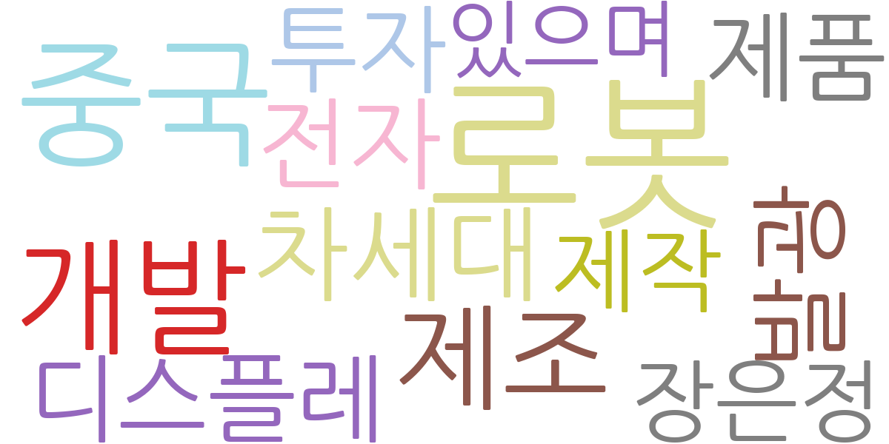
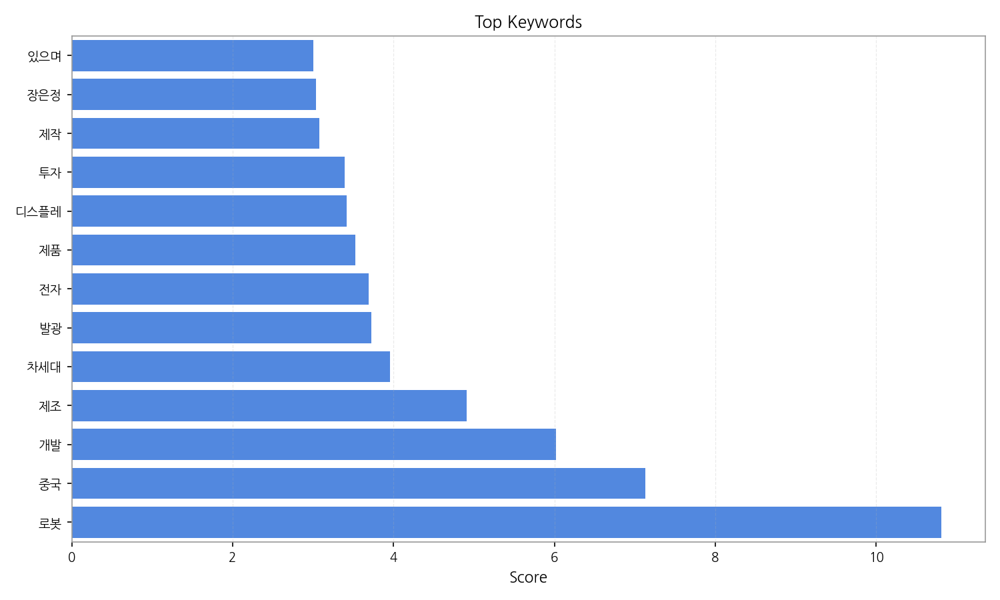
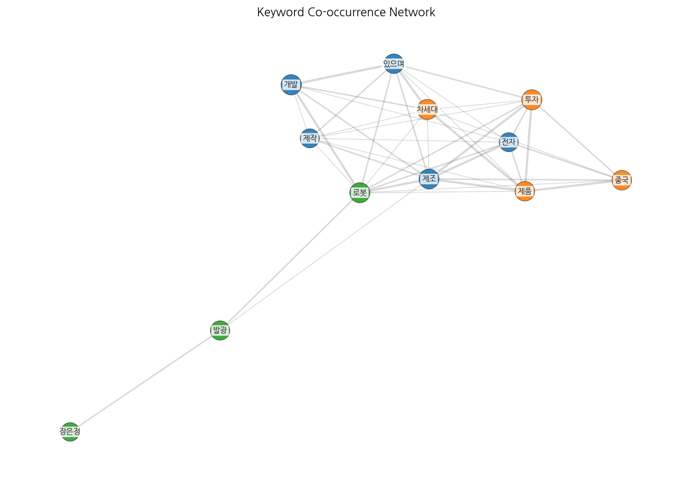
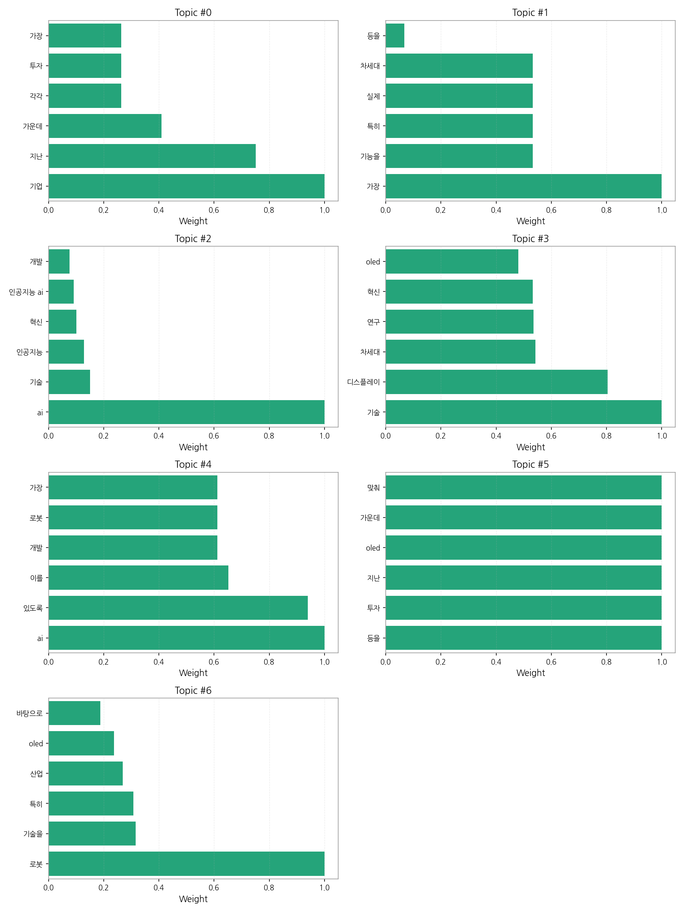
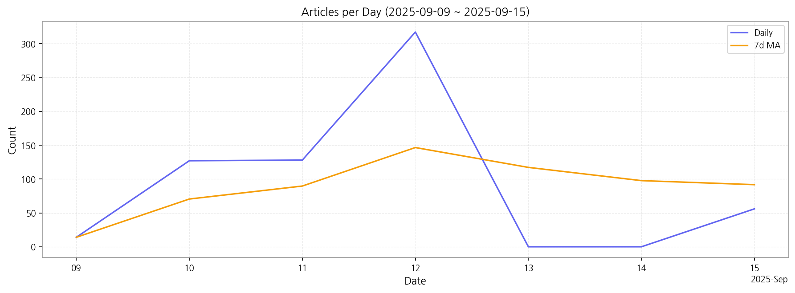

# Weekly/New Biz Report (2025-09-15)

## Executive Summary

- 이번 기간 핵심 토픽과 키워드, 주요 시사점을 요약합니다.

1) 상위 토픽을 3개 주제로 묶어 핵심 맥락을 설명하면 다음과 같습니다. 첫째, **기업의 AI 및 기술 투자**는 기업들이 AI, 차세대 디스플레이 기술 등에 적극적으로 투자하고 있으며, 이를 통해 혁신을 추구하고 경쟁력을 강화하려는 움직임을 보여줍니다. 둘째, **차세대 디스플레이 기술 개발**은 OLED를 중심으로 한 차세대 디스플레이 기술 개발 및 연구가 활발하게 진행되고 있으며, 관련 기술 혁신에 대한 기대감이 높다는 것을 시사합니다. 셋째, **AI 기반 로봇 기술 개발**은 AI 기술을 바탕으로 한 로봇 기술 개발이 활발하게 이루어지고 있으며, 이는 다양한 산업 분야에 적용될 것으로 예상됩니다.  이 세 가지 주제는 모두 기술 혁신과 투자라는 공통된 맥락을 가지고 있으며, 한국 경제의 미래 성장 동력과 밀접한 관련이 있습니다.

2) 최근 변화/스파이크를 짚어보면, 2025년 9월 9일 14건이었던 기사 수가 9월 12일 317건으로 급증하는 스파이크 현상이 나타났습니다. 이는 특정 기술 관련 뉴스나 정부 정책 발표 등 외부 요인에 의한 것으로 추정되며,  관련 이슈에 대한 대중의 관심이 급격히 증가했음을 보여줍니다.

3) 실무 인사이트 3가지:

* **관련 키워드 모니터링 강화:**  "AI", "로봇", "OLED", "차세대 디스플레이", "기술 투자" 등 핵심 키워드에 대한 실시간 모니터링 시스템을 구축하여 뉴스 트렌드를 빠르게 파악하고 대응 전략을 수립합니다.  특히, 급증하는 기사 수의 원인을 분석하여  향후 예측 모델을 개선합니다.
* **기술 동향 보고서 정기 발간:**  AI, 로봇, 디스플레이 기술 분야의 최신 동향을 정리한 보고서를 정기적으로 발간하여 관련 부서에 배포하고,  내부적으로 기술 개발 전략 및 투자 방향 설정에 활용합니다.  보고서에는 경쟁사 분석 및 시장 전망도 포함되어야 합니다.
* **전문가 네트워크 구축:**  해당 기술 분야의 전문가들과 네트워크를 구축하여 정보 교류를 활성화하고,  새로운 기술 트렌드에 대한 조기 경보 시스템을 마련합니다.  정기적인 세미나나 컨퍼런스 참석을 통해 최신 정보를 습득하고,  외부 전문가의 자문을 적극적으로 활용합니다.

## Key Metrics

- 기간: 2025-09-09 ~ 2025-09-15
- 총 기사 수: 642
- 문서 수: 28
- 키워드 수(상위): 13
- 토픽 수: 7
- 시계열 데이터 일자 수: 5

## Top Keywords

| Rank | Keyword | Score |
|---:|---|---:|
| 1 | 로봇 | 10.812 |
| 2 | 중국 | 7.133 |
| 3 | 개발 | 6.021 |
| 4 | 제조 | 4.912 |
| 5 | 차세대 | 3.954 |
| 6 | 발광 | 3.726 |
| 7 | 전자 | 3.693 |
| 8 | 제품 | 3.525 |
| 9 | 디스플레 | 3.417 |
| 10 | 투자 | 3.393 |
| 11 | 제작 | 3.078 |
| 12 | 장은정 | 3.035 |
| 13 | 있으며 | 3.003 |

## Topics

- Topic #0: 기업, 지난, 가운데, 각각, 투자, 가장
- Topic #1: 가장, 기능을, 특히, 실제, 차세대, 등을
- Topic #2: ai, 기술, 인공지능, 혁신, 인공지능 ai, 개발
- Topic #3: 기술, 디스플레이, 차세대, 연구, 혁신, oled
- Topic #4: ai, 있도록, 이를, 개발, 로봇, 가장
- Topic #5: 등을, 투자, 지난, oled, 가운데, 맞춰
- Topic #6: 로봇, 기술을, 특히, 산업, oled, 바탕으로

## Trend

- 최근 14~30일 기사 수 추세와 7일 이동평균선을 제공합니다.

## Insights

1) 상위 토픽을 3개 주제로 묶어 핵심 맥락을 설명하면 다음과 같습니다. 첫째, **기업의 AI 및 기술 투자**는 기업들이 AI, 차세대 디스플레이 기술 등에 적극적으로 투자하고 있으며, 이를 통해 혁신을 추구하고 경쟁력을 강화하려는 움직임을 보여줍니다. 둘째, **차세대 디스플레이 기술 개발**은 OLED를 중심으로 한 차세대 디스플레이 기술 개발 및 연구가 활발하게 진행되고 있으며, 관련 기술 혁신에 대한 기대감이 높다는 것을 시사합니다. 셋째, **AI 기반 로봇 기술 개발**은 AI 기술을 바탕으로 한 로봇 기술 개발이 활발하게 이루어지고 있으며, 이는 다양한 산업 분야에 적용될 것으로 예상됩니다.  이 세 가지 주제는 모두 기술 혁신과 투자라는 공통된 맥락을 가지고 있으며, 한국 경제의 미래 성장 동력과 밀접한 관련이 있습니다.

2) 최근 변화/스파이크를 짚어보면, 2025년 9월 9일 14건이었던 기사 수가 9월 12일 317건으로 급증하는 스파이크 현상이 나타났습니다. 이는 특정 기술 관련 뉴스나 정부 정책 발표 등 외부 요인에 의한 것으로 추정되며,  관련 이슈에 대한 대중의 관심이 급격히 증가했음을 보여줍니다.

3) 실무 인사이트 3가지:

* **관련 키워드 모니터링 강화:**  "AI", "로봇", "OLED", "차세대 디스플레이", "기술 투자" 등 핵심 키워드에 대한 실시간 모니터링 시스템을 구축하여 뉴스 트렌드를 빠르게 파악하고 대응 전략을 수립합니다.  특히, 급증하는 기사 수의 원인을 분석하여  향후 예측 모델을 개선합니다.
* **기술 동향 보고서 정기 발간:**  AI, 로봇, 디스플레이 기술 분야의 최신 동향을 정리한 보고서를 정기적으로 발간하여 관련 부서에 배포하고,  내부적으로 기술 개발 전략 및 투자 방향 설정에 활용합니다.  보고서에는 경쟁사 분석 및 시장 전망도 포함되어야 합니다.
* **전문가 네트워크 구축:**  해당 기술 분야의 전문가들과 네트워크를 구축하여 정보 교류를 활성화하고,  새로운 기술 트렌드에 대한 조기 경보 시스템을 마련합니다.  정기적인 세미나나 컨퍼런스 참석을 통해 최신 정보를 습득하고,  외부 전문가의 자문을 적극적으로 활용합니다.

## Opportunities (Top 5)

| Idea | Target | Value Prop | Score |
|---|---|---|---:|
| AI 기반 디스플레이 제조 공정 최적화 플랫폼 | 한국(KR)의 대기업 디스플레이 제조사(삼성디스플레이, LG디스플레이 등) 및 중견 제조업체, 생산 관리 부서, 공정 엔지니어 | AI 기반 예측 모델을 통해 불량률을 최대 15% 감소시키고, 생산성을 10% 향상시켜 제조 원가를 절감합니다.  실시간 데이터 분석 및 예측 기능을 통해 문제 발생을 사전에 예방하고, 최적의 생산 조건을 자동으로 설정하는 것이 차별화 포인트입니다. | 4.50 |
| 스마트 사이니지용 AI 기반 콘텐츠 제작 서비스 | 일본(JP)의 소매업체, 광고 대행사, 공공기관, 사이니지 운영 담당자, 마케팅 부서 | AI 기반 자동 콘텐츠 생성 및 최적화 서비스를 제공하여 시간과 비용을 절감하고, 효과적인 사이니지 콘텐츠를 제작할 수 있도록 지원합니다.  다양한 디스플레이 환경에 맞춤형 콘텐츠를 자동 생성하는 것이 차별화 포인트입니다. | 4.00 |
| AI 기반 로봇 자동화 시스템 구축 파트너십(조달) | 한국(KR)의 중소/중견 전자 제조업체, 생산 자동화 담당 부서, 조달 담당자 | 다양한 로봇 제조사와의 파트너십을 통해 최적의 로봇 자동화 시스템을 구축하고, 통합 관리 서비스를 제공합니다.  중소기업의 접근성을 높이고, 맞춤형 솔루션을 제공하는 것이 차별화 포인트입니다. | 3.80 |
| 모빌리티 디스플레이 시장 분석 및 예측 플랫폼 | EU의 자동차 부품 제조사, 디스플레이 제조사, 투자사, 시장 조사 기관, 연구 기관 | AI 기반 데이터 분석 기술을 활용하여 모빌리티 디스플레이 시장의 동향을 실시간으로 분석하고, 미래 시장을 정확하게 예측합니다.  다양한 데이터 소스를 통합하여 시장 트렌드를 예측하는 것이 차별화 포인트입니다. | 3.50 |
| 차세대 디스플레이 기술 특허 관리 및 라이선싱 서비스 | 일본(JP)의 중소/중견 디스플레이 관련 기술 기업, 연구소, 법률 자문 부서 | AI 기반 특허 검색 및 분석 시스템을 통해 효율적인 특허 관리 및 라이선싱 서비스를 제공합니다.  특허 포트폴리오 전략 수립 및 국제 특허 분쟁 대응을 지원하는 것이 차별화 포인트입니다. | 3.20 |

## Appendix

- 데이터: keywords.json, topics.json, trend_timeseries.json, trend_insights.json, biz_opportunities.json