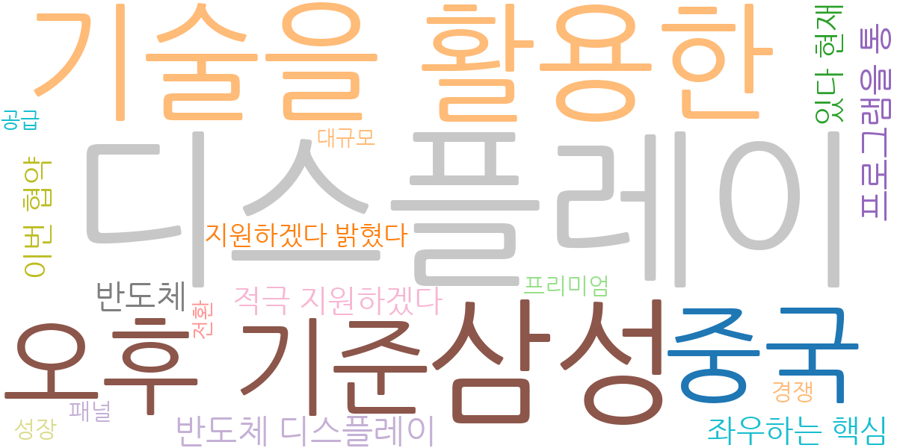
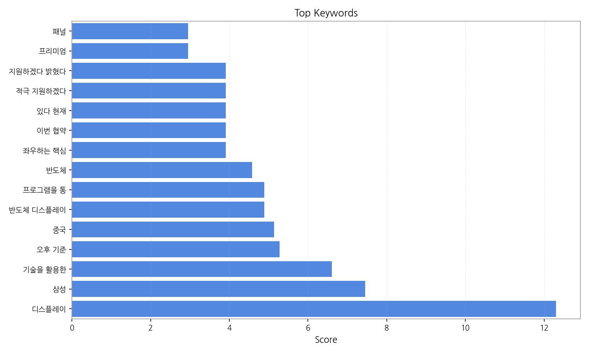
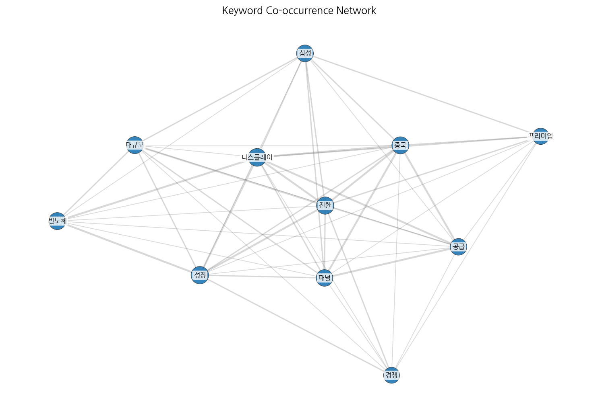
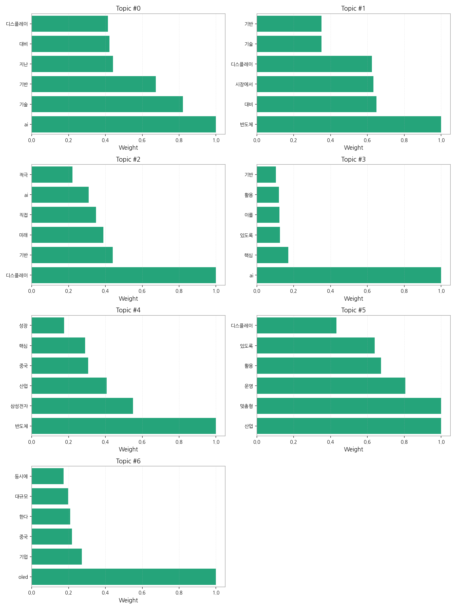

# Weekly/New Biz Report (2025-09-16)

## Executive Summary

- 이번 기간 핵심 토픽과 키워드, 주요 시사점을 요약합니다.

1) 상위 토픽을 3개 주제로 묶어 핵심 맥락을 설명하면 다음과 같습니다. 첫째, AI 기반 기술 활용 및 성장과 관련된 토픽(topic 0, 3)은 AI 기술이 디스플레이 산업을 비롯한 다양한 산업 분야에서 적극적으로 활용되고 있으며, 이를 기반으로 한 기업들의 성장 전략이 주요 뉴스를 차지하고 있음을 보여줍니다. 둘째, 반도체 및 디스플레이 산업의 경쟁 심화 및 시장 확대와 관련된 토픽(topic 1, 2, 4, 6)은 삼성전자를 비롯한 주요 기업들의 반도체 및 디스플레이 시장 경쟁, 특히 중국 시장 진출 및 OLED 시장 확대를 위한 노력이 뉴스의 큰 부분을 차지하고 있습니다. 마지막으로, 산업 전반의 맞춤형 운영 및 미래 전략과 관련된 토픽(topic 5)은 AI 기술을 활용한 맞춤형 산업 운영 전략과 미래 산업 경쟁력 확보를 위한 기업들의 적극적인 노력을 보여주는 뉴스들이 주를 이룹니다.

2) 최근 변화/스파이크를 짚어보면, 9월 12일 기사 수가 급증(317건)한 것을 확인할 수 있습니다. 이는 특정 이슈, 예를 들어 주요 기업의 신기술 발표나 정부 정책 발표 등으로 인한 집중적인 보도의 결과로 추측됩니다.

3) 실무 인사이트 3가지:

* **AI 기술 도입 전략 수립 및 실행:**  AI 기술을 활용한 디스플레이 및 반도체 산업의 효율성 증대 방안을 구체적으로 모색하고,  실제 사업에 적용 가능한 AI 기반 시스템 구축 및 운영 계획을 수립하여 실행해야 합니다.  특히, 데이터 분석 및 예측 모델 개발에 집중하여 의사결정의 정확성을 높여야 합니다.
* **시장 경쟁 심화에 대한 대응 전략 마련:**  중국 시장을 포함한 글로벌 시장 경쟁 심화에 대비하여 차별화된 기술 경쟁력 확보 및 시장 점유율 확대 전략을 수립해야 합니다.  특히, OLED 시장의 성장 가능성에 대한 분석과 투자 전략을 재검토하고,  기술 개발 및 특허 확보에 대한 투자를 강화해야 합니다.
* **맞춤형 산업 운영 시스템 구축:** AI 기반의 맞춤형 산업 운영 시스템을 구축하여 생산성 향상 및 비용 절감을 도모해야 합니다.  데이터 기반 의사결정 시스템을 구축하고,  실시간 모니터링 및 예측 분석을 통해 효율적인 자원 배분 및 생산 관리를 실현해야 합니다.

## Key Metrics

- 기간: 2025-09-09 ~ 2025-09-16
- 총 기사 수: 739
- 문서 수: 30
- 키워드 수(상위): 15
- 토픽 수: 7
- 시계열 데이터 일자 수: 6

## Top Keywords

| Rank | Keyword | Score |
|---:|---|---:|
| 1 | 디스플레이 | 12.302 |
| 2 | 삼성 | 7.455 |
| 3 | 기술을 활용한 | 6.601 |
| 4 | 오후 기준 | 5.281 |
| 5 | 중국 | 5.133 |
| 6 | 반도체 디스플레이 | 4.890 |
| 7 | 프로그램을 통 | 4.890 |
| 8 | 반도체 | 4.578 |
| 9 | 좌우하는 핵심 | 3.912 |
| 10 | 이번 협약 | 3.912 |
| 11 | 있다 현재 | 3.912 |
| 12 | 적극 지원하겠다 | 3.912 |
| 13 | 지원하겠다 밝혔다 | 3.912 |
| 14 | 프리미엄 | 2.953 |
| 15 | 패널 | 2.953 |

## Topics

- Topic #0: ai, 기술, 기반, 지난, 대비, 디스플레이
- Topic #1: 반도체, 대비, 시장에서, 디스플레이, 기술, 기반
- Topic #2: 디스플레이, 기반, 미래, 직접, ai, 적극
- Topic #3: ai, 핵심, 있도록, 이를, 활용, 기반
- Topic #4: 반도체, 삼성전자, 산업, 중국, 핵심, 성장
- Topic #5: 산업, 맞춤형, 운영, 활용, 있도록, 디스플레이
- Topic #6: oled, 기업, 중국, 한다, 대규모, 동시에

## Trend

- 최근 14~30일 기사 수 추세와 7일 이동평균선을 제공합니다.

## Insights

1) 상위 토픽을 3개 주제로 묶어 핵심 맥락을 설명하면 다음과 같습니다. 첫째, AI 기반 기술 활용 및 성장과 관련된 토픽(topic 0, 3)은 AI 기술이 디스플레이 산업을 비롯한 다양한 산업 분야에서 적극적으로 활용되고 있으며, 이를 기반으로 한 기업들의 성장 전략이 주요 뉴스를 차지하고 있음을 보여줍니다. 둘째, 반도체 및 디스플레이 산업의 경쟁 심화 및 시장 확대와 관련된 토픽(topic 1, 2, 4, 6)은 삼성전자를 비롯한 주요 기업들의 반도체 및 디스플레이 시장 경쟁, 특히 중국 시장 진출 및 OLED 시장 확대를 위한 노력이 뉴스의 큰 부분을 차지하고 있습니다. 마지막으로, 산업 전반의 맞춤형 운영 및 미래 전략과 관련된 토픽(topic 5)은 AI 기술을 활용한 맞춤형 산업 운영 전략과 미래 산업 경쟁력 확보를 위한 기업들의 적극적인 노력을 보여주는 뉴스들이 주를 이룹니다.

2) 최근 변화/스파이크를 짚어보면, 9월 12일 기사 수가 급증(317건)한 것을 확인할 수 있습니다. 이는 특정 이슈, 예를 들어 주요 기업의 신기술 발표나 정부 정책 발표 등으로 인한 집중적인 보도의 결과로 추측됩니다.

3) 실무 인사이트 3가지:

* **AI 기술 도입 전략 수립 및 실행:**  AI 기술을 활용한 디스플레이 및 반도체 산업의 효율성 증대 방안을 구체적으로 모색하고,  실제 사업에 적용 가능한 AI 기반 시스템 구축 및 운영 계획을 수립하여 실행해야 합니다.  특히, 데이터 분석 및 예측 모델 개발에 집중하여 의사결정의 정확성을 높여야 합니다.
* **시장 경쟁 심화에 대한 대응 전략 마련:**  중국 시장을 포함한 글로벌 시장 경쟁 심화에 대비하여 차별화된 기술 경쟁력 확보 및 시장 점유율 확대 전략을 수립해야 합니다.  특히, OLED 시장의 성장 가능성에 대한 분석과 투자 전략을 재검토하고,  기술 개발 및 특허 확보에 대한 투자를 강화해야 합니다.
* **맞춤형 산업 운영 시스템 구축:** AI 기반의 맞춤형 산업 운영 시스템을 구축하여 생산성 향상 및 비용 절감을 도모해야 합니다.  데이터 기반 의사결정 시스템을 구축하고,  실시간 모니터링 및 예측 분석을 통해 효율적인 자원 배분 및 생산 관리를 실현해야 합니다.

## Opportunities (Top 5)

| Idea | Target | Value Prop | Score |
|---|---|---|---:|
| AI 기반 디스플레이 제조 공정 최적화 플랫폼 | KR 전자 제조 기업(대기업, 중견기업), 디스플레이 생산 라인 관리자, 생산 기술 부서 | AI 기반 예측 모델을 통해 불량률을 최소화하고 생산 효율을 극대화합니다. 실시간 데이터 분석 및 예측으로 최적의 생산 계획 수립을 지원하며, 경쟁사 대비 차별화된 생산성 향상을 제공합니다.  9월 12일 기사 급증은 신기술 발표에 따른 관심 증가를 반영하며, 본 플랫폼은 이러한 시장 요구에 부합합니다. | 4.50 |
| 스마트 사이니지 광고 플랫폼 서비스 | JP 중소/중견기업 광고 대행사,  소매업체,  프랜차이즈 본사,  디지털 마케팅 담당자 | AI 기반 실시간 데이터 분석으로 광고 효과를 정확하게 측정하고,  타겟 고객에게 최적화된 광고를 제공합니다.  정교한 타겟팅과 효과 측정을 통해 광고 ROI를 극대화하는 것이 차별점입니다. 최근 AI 기반 마케팅 솔루션에 대한 수요 증가(컨텍스트 Topic 0, 3)에 따라 시장 경쟁력이 높아지고 있습니다. | 4.00 |
| 글로벌 전자 부품 조달 플랫폼 파트너십 | EU 전자 제조 기업(대기업), 구매 담당자, 조달 부서 | 글로벌 전자 부품 공급망을 통합 관리하는 플랫폼을 제공하여,  효율적인 조달 및 공급망 관리를 지원합니다.  다양한 공급업체와의 협업을 통해 최적의 가격 및 납기를 제공하는 것이 차별화 포인트입니다.  최근 글로벌 공급망 불안정(컨텍스트 Summary)에 대한 해결책으로서 높은 시장 수요가 예상됩니다. | 3.80 |
| 모빌리티 디스플레이 시장 분석 및 예측 데이터 서비스 | KR/EU 모빌리티 기업(자동차 제조사, 부품 공급업체),  투자사,  시장 조사 기관,  디스플레이 업체 | 모빌리티 디스플레이 시장에 대한 심층 분석 및 예측 데이터를 제공하여,  데이터 기반 의사결정을 지원합니다.  경쟁사 대비 차별화된 시장 분석 및 예측 모델을 통해 정확한 시장 전망을 제공합니다.  최근 모빌리티 시장의 급성장(컨텍스트 Summary)과 디스플레이 기술 발전은 본 서비스의 시장 경쟁력을 높입니다. | 3.50 |
| 디스플레이 | 기업(B2B) | 디스플레이 도입으로 비용/품질/경험을 개선. | 3.00 |

## Appendix

- 데이터: keywords.json, topics.json, trend_timeseries.json, trend_insights.json, biz_opportunities.json