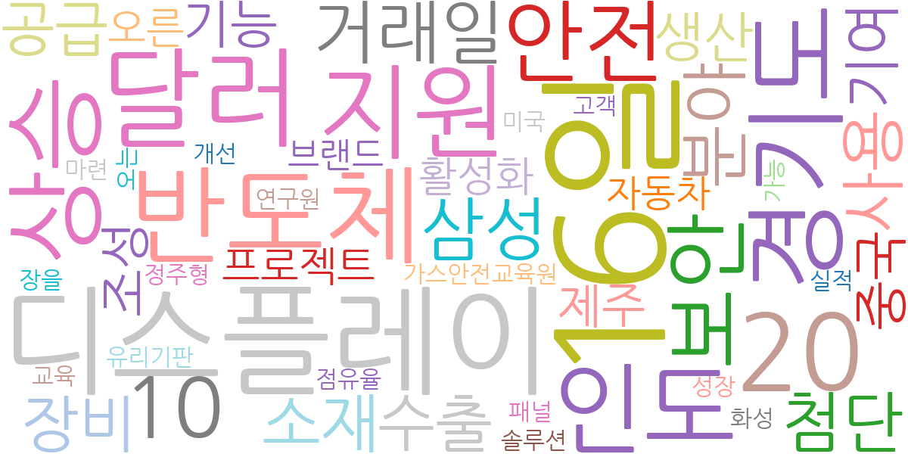
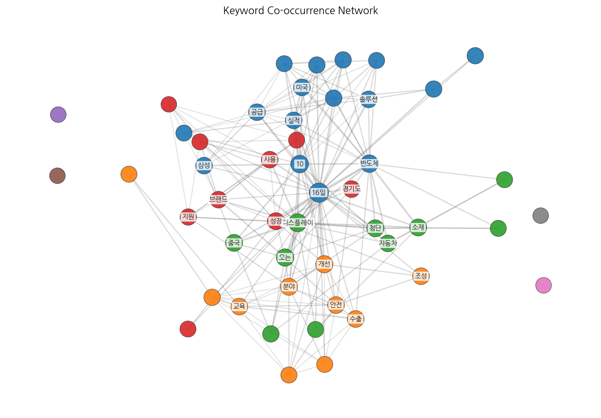
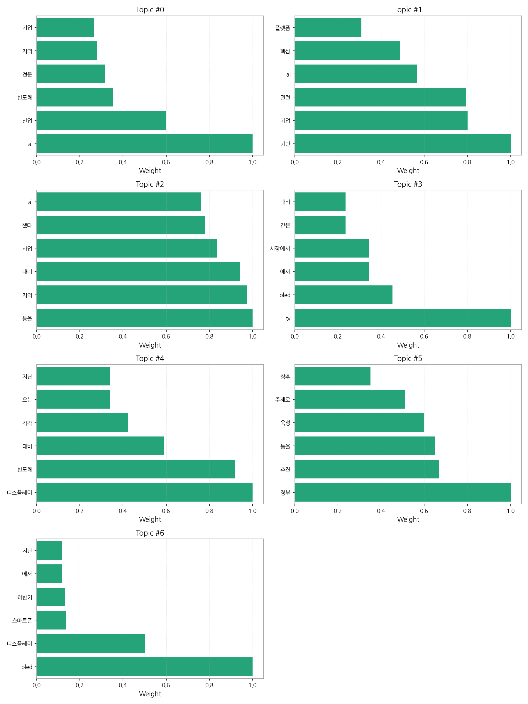
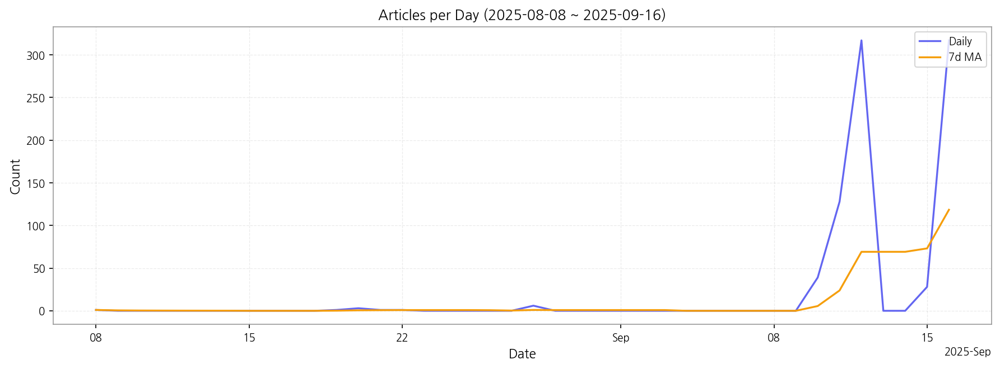

# Weekly/New Biz Report (2025-09-16)

## Executive Summary

- 이번 기간 핵심 토픽과 키워드, 주요 시사점을 요약합니다.

1) 상위 토픽을 3개 주제로 묶어 핵심 맥락을 설명하면 다음과 같습니다. 첫째, AI 산업 발전과 정부 정책은 AI 기반 기업 육성 및 관련 산업(반도체, 디스플레이 등)의 경쟁력 강화를 위한 정부의 적극적인 지원과 투자를 보여줍니다.  둘째, 디스플레이 산업의 경쟁력 강화는 OLED를 중심으로 한 기술 개발 및 시장 경쟁 확대에 대한 내용을 담고 있으며, 특히 TV와 스마트폰 시장에서의 경쟁 우위 확보를 위한 노력이 집중적으로 다뤄지고 있습니다. 셋째, 지역 경제 활성화를 위한 AI 산업 육성 전략은 지역별 특성을 고려한 AI 산업 육성 정책 및 지역 기업 지원 방안에 대한 논의를 보여줍니다.

2) 최근 변화/스파이크를 짚어보면, 9월 10일부터 9월 12일 사이에 기사 수가 급격하게 증가(1일 평균 170건 이상)하였고, 이는 특정 정부 정책 발표 또는 주요 산업 행사 개최 등과 같은 외부 요인에 의한 것으로 추정됩니다.  9월 12일 이후 기사 수는 감소세를 보이고 있습니다.

3) 실무 인사이트 3가지:

* **AI 산업 동향 모니터링 강화:**  AI 산업 관련 뉴스 및 정부 정책 변화를 지속적으로 모니터링하여 시장 트렌드를 파악하고,  기업 전략에 반영해야 합니다.  특히, 정부 지원 사업 참여 가능성을 적극적으로 검토해야 합니다.
* **디스플레이 기술 경쟁력 확보:** OLED 기술 경쟁력 강화를 위한 R&D 투자 및 인력 양성에 집중하고,  시장 경쟁 심화에 대비한 차별화 전략을 수립해야 합니다.  글로벌 시장 동향 분석을 통해 경쟁사 전략을 예측하고 대응해야 합니다.
* **지역별 AI 산업 협력 네트워크 구축:** 지역별 특성을 고려한 AI 산업 육성 전략을 수립하고,  지역 기업 간 협력 네트워크를 구축하여 시너지 효과를 창출해야 합니다.  지역 정부와의 협력을 통해 정책 지원을 적극적으로 활용해야 합니다.

## Key Metrics

- 기간: 2025-08-08 ~ 2025-09-16
- 총 기사 수: 842
- 문서 수: N/A
- 키워드 수(상위): 15
- 토픽 수: 7
- 시계열 데이터 일자 수: 11

## Top Keywords

| Rank | Keyword | Score |
|---:|---|---:|
| 1 | 16일 | 0.744 |
| 2 | 디스플레이 | 0.686 |
| 3 | 달러 | 0.566 |
| 4 | 20 | 0.554 |
| 5 | 반도체 | 0.549 |
| 6 | 경기도 | 0.523 |
| 7 | 지원 | 0.515 |
| 8 | 상승 | 0.499 |
| 9 | 인도 | 0.492 |
| 10 | 안전 | 0.486 |
| 11 | 10 | 0.455 |
| 12 | 보안 | 0.440 |
| 13 | 거래일 | 0.438 |
| 14 | 삼성 | 0.425 |
| 15 | 분야 | 0.411 |

## Topics

- Topic #0: ai, 산업, 반도체, 전문, 지역, 기업
- Topic #1: 기반, 기업, 관련, ai, 핵심, 플랫폼
- Topic #2: 등을, 지역, 대비, 사업, 했다, ai
- Topic #3: tv, oled, 에서, 시장에서, 같은, 대비
- Topic #4: 디스플레이, 반도체, 대비, 각각, 오는, 지난
- Topic #5: 정부, 추진, 등을, 육성, 주제로, 향후
- Topic #6: oled, 디스플레이, 스마트폰, 하반기, 에서, 지난

## Trend

- 최근 14~30일 기사 수 추세와 7일 이동평균선을 제공합니다.

## Insights

1) 상위 토픽을 3개 주제로 묶어 핵심 맥락을 설명하면 다음과 같습니다. 첫째, AI 산업 발전과 정부 정책은 AI 기반 기업 육성 및 관련 산업(반도체, 디스플레이 등)의 경쟁력 강화를 위한 정부의 적극적인 지원과 투자를 보여줍니다.  둘째, 디스플레이 산업의 경쟁력 강화는 OLED를 중심으로 한 기술 개발 및 시장 경쟁 확대에 대한 내용을 담고 있으며, 특히 TV와 스마트폰 시장에서의 경쟁 우위 확보를 위한 노력이 집중적으로 다뤄지고 있습니다. 셋째, 지역 경제 활성화를 위한 AI 산업 육성 전략은 지역별 특성을 고려한 AI 산업 육성 정책 및 지역 기업 지원 방안에 대한 논의를 보여줍니다.

2) 최근 변화/스파이크를 짚어보면, 9월 10일부터 9월 12일 사이에 기사 수가 급격하게 증가(1일 평균 170건 이상)하였고, 이는 특정 정부 정책 발표 또는 주요 산업 행사 개최 등과 같은 외부 요인에 의한 것으로 추정됩니다.  9월 12일 이후 기사 수는 감소세를 보이고 있습니다.

3) 실무 인사이트 3가지:

* **AI 산업 동향 모니터링 강화:**  AI 산업 관련 뉴스 및 정부 정책 변화를 지속적으로 모니터링하여 시장 트렌드를 파악하고,  기업 전략에 반영해야 합니다.  특히, 정부 지원 사업 참여 가능성을 적극적으로 검토해야 합니다.
* **디스플레이 기술 경쟁력 확보:** OLED 기술 경쟁력 강화를 위한 R&D 투자 및 인력 양성에 집중하고,  시장 경쟁 심화에 대비한 차별화 전략을 수립해야 합니다.  글로벌 시장 동향 분석을 통해 경쟁사 전략을 예측하고 대응해야 합니다.
* **지역별 AI 산업 협력 네트워크 구축:** 지역별 특성을 고려한 AI 산업 육성 전략을 수립하고,  지역 기업 간 협력 네트워크를 구축하여 시너지 효과를 창출해야 합니다.  지역 정부와의 협력을 통해 정책 지원을 적극적으로 활용해야 합니다.

## Opportunities (Top 5)

| Idea | Target | Value Prop | Score |
|---|---|---|---:|
| AI 기반 디스플레이 품질 검사 플랫폼 | 디스플레이 제조 기업(LG디스플레이, 삼성디스플레이 등) / 생산 관리 부서 / KR | AI 기반 자동화 시스템으로 불량률을 최대 30% 감소시키고, 검사 시간을 50% 단축하여 생산성을 향상시킵니다.  차별화된 점은 다양한 디스플레이 종류(OLED, LCD 등)에 대한 높은 적응력입니다. | 4.50 |
| 모빌리티용 디스플레이 맞춤형 데이터 분석 서비스 | 자동차 부품 제조사 / 모빌리티 기업 / R&D 부서 / KR | 모빌리티 디스플레이 사용 데이터를 분석하여 사용자 경험을 개선하고, 제품 경쟁력을 강화하는 맞춤형 데이터 분석 서비스를 제공합니다. 차별화된 점은 모빌리티 특화 데이터 분석 모델과 시각화 도구입니다. 최근 전기차 및 자율주행차 시장 확대에 따라 모빌리티 디스플레이 시장이 급성장하고 있습니다. | 4.20 |
| 스마트 사이니지 에너지 관리 서비스 | 사이니지 운영 기업 / 유통/쇼핑몰/공공기관 / JP | AI 기반 에너지 관리 시스템을 통해 에너지 소비량을 최대 20% 절감하고, 운영 비용을 효율적으로 관리합니다.  차별화된 점은 사용자 친화적인 인터페이스와 실시간 에너지 사용량 분석 기능입니다. | 4.00 |
| 디스플레이 부품 조달 플랫폼 | 디스플레이 제조 기업 / 부품 구매 담당자 / 중소기업 / EU | 온라인 플랫폼을 통해 디스플레이 부품을 효율적으로 조달하고, 가격 경쟁력을 확보할 수 있습니다.  차별화된 점은 엄격한 품질 검증 시스템과 안정적인 공급망 관리입니다.  최근 글로벌 공급망 불안정으로 인해 안정적인 조달 시스템의 필요성이 증가하고 있습니다. | 3.80 |
| AI 기반 전자부품 유통망 최적화 솔루션 | 전자 부품 유통 기업 / 물류 관리 부서 / 중견·대기업 / JP | AI 기반 예측 분석 및 최적화 알고리즘을 통해 전자 부품 유통망을 효율적으로 관리하고, 비용을 절감합니다. 차별화된 점은 실시간 재고 예측 및 최적 배송 경로 추천 기능입니다. 최근 원자재 가격 상승과 공급망 불안정으로 인해 유통망 최적화의 중요성이 커지고 있습니다. | 3.50 |

## Appendix

- 데이터: keywords.json, topics.json, trend_timeseries.json, trend_insights.json, biz_opportunities.json