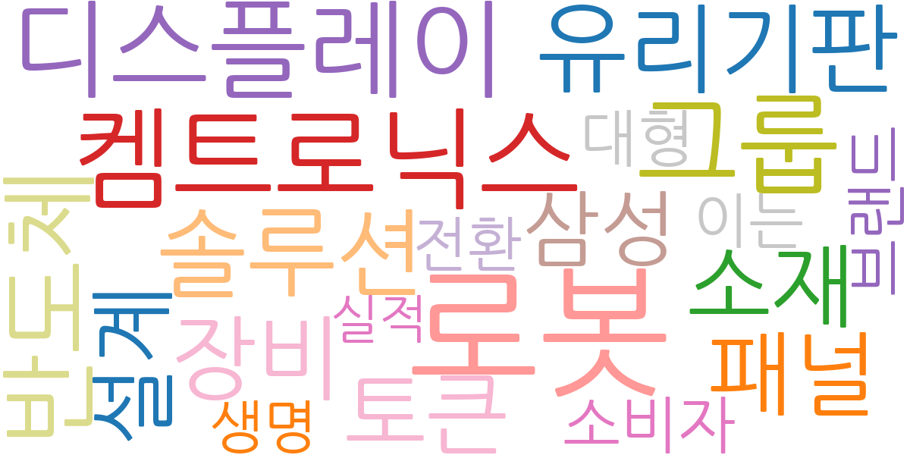
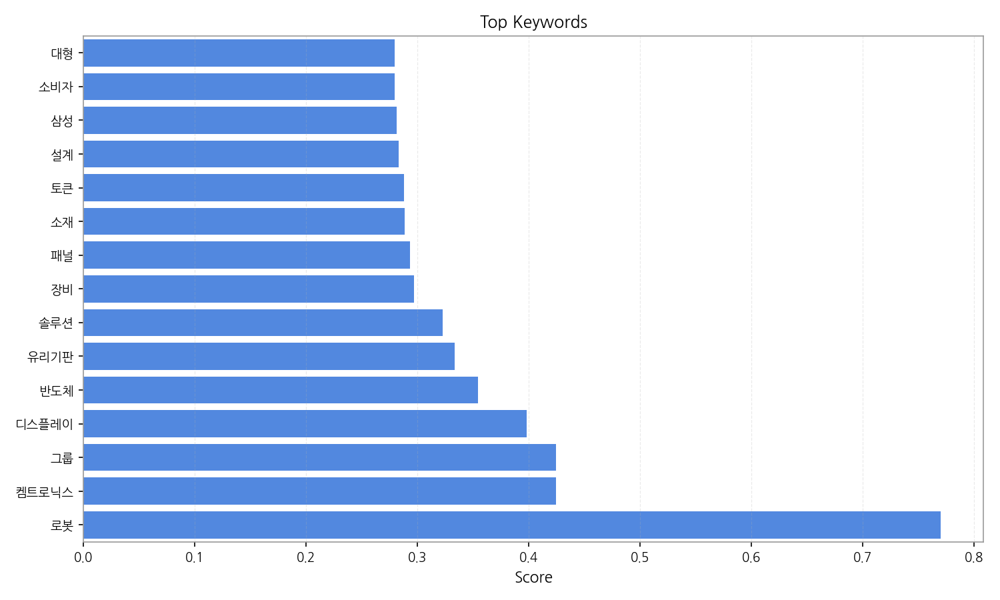
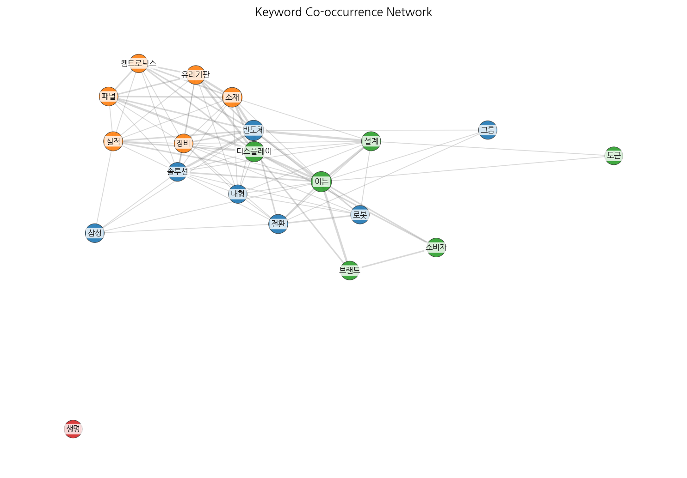
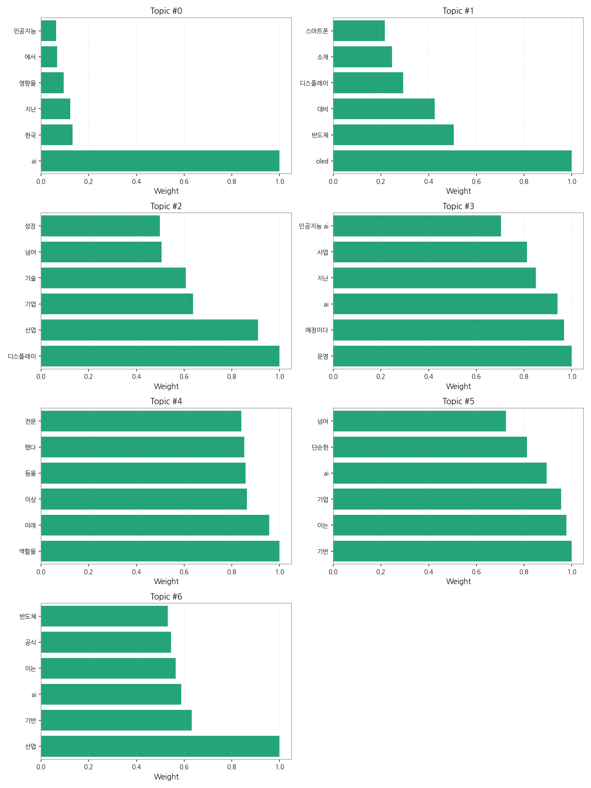
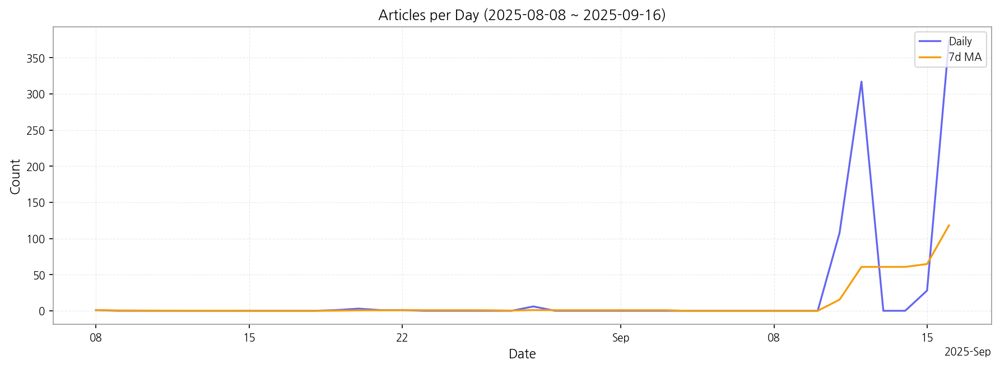

# Weekly/New Biz Report (2025-09-16)

## Executive Summary

- 이번 기간 핵심 토픽과 키워드, 주요 시사점을 요약합니다.

1) 상위 토픽을 3개 주제로 묶어 핵심 맥락을 설명하면 다음과 같습니다. 첫째, AI 기술의 한국 사회 전반에 대한 영향과 AI 기반 서비스 개발 및 운영에 대한 기사들이 다수를 차지합니다.  둘째, OLED를 중심으로 한 디스플레이 산업의 발전과 관련 소재, 기술 개발 및 시장 경쟁에 대한 내용이 주를 이룹니다.  셋째,  AI와 디스플레이 산업을 포함한 다양한 산업 분야의 성장과 기술 발전, 그리고 이를 뒷받침하는 기업들의 역할과 미래 전망에 대한 논의가 이루어지고 있습니다.

2) 최근 변화/스파이크를 짚어보면, 9월 11일부터 16일 사이에 기사 수가 급격하게 증가하는 현상이 나타났습니다. 이는 특정 이벤트 또는 정책 발표 등 외부 요인에 의한 것으로 추정되며,  해당 기간 동안 AI와 디스플레이 산업 관련 뉴스가 집중적으로 보도된 것으로 해석됩니다.

3) 실무 인사이트 3가지:

* **AI 및 디스플레이 산업 동향 모니터링 강화:**  9월 중순의 기사 급증 사례를 통해, 관련 산업의 뉴스를 실시간으로 모니터링하고, 핵심 키워드(AI, OLED, 디스플레이, 반도체 등)를 활용하여 중요한 이슈를 신속하게 파악하는 시스템을 구축해야 합니다.  주요 뉴스 소스를 지정하고, 키워드 알림 시스템을 구축하는 것이 효율적일 것입니다.
* **AI 및 디스플레이 기술 관련 전문가 네트워크 구축:**  산업 전문가들과의 네트워크를 통해 시장의 흐름을 정확하게 파악하고, 미래 전략을 수립하는 데 필요한 정보를 확보해야 합니다.  정기적인 미팅이나 세미나 참석을 통해 전문가들과 교류하고, 정보 공유 채널을 활성화하는 것이 중요합니다.
* **AI 및 디스플레이 기술 적용 가능성 검토:**  자사 사업과 AI 및 디스플레이 기술의 연관성을 분석하고, 기술 도입을 통한 효율성 증대 및 새로운 사업 기회 창출 가능성을 탐색해야 합니다.  기술 도입에 따른 비용과 효과를 분석하고, 단계적인 접근 전략을 수립하여 리스크를 최소화해야 합니다.

## Key Metrics

- 기간: 2025-08-08 ~ 2025-09-16
- 총 기사 수: 840
- 문서 수: N/A
- 키워드 수(상위): 15
- 토픽 수: 7
- 시계열 데이터 일자 수: 10

## Top Keywords

| Rank | Keyword | Score |
|---:|---|---:|
| 1 | 로봇 | 0.770 |
| 2 | 켐트로닉스 | 0.425 |
| 3 | 그룹 | 0.424 |
| 4 | 디스플레이 | 0.398 |
| 5 | 반도체 | 0.355 |
| 6 | 유리기판 | 0.334 |
| 7 | 솔루션 | 0.322 |
| 8 | 장비 | 0.297 |
| 9 | 패널 | 0.293 |
| 10 | 소재 | 0.288 |
| 11 | 토큰 | 0.288 |
| 12 | 설계 | 0.283 |
| 13 | 삼성 | 0.281 |
| 14 | 소비자 | 0.280 |
| 15 | 대형 | 0.280 |

## Topics

- Topic #0: ai, 한국, 지난, 영향을, 에서, 인공지능
- Topic #1: oled, 반도체, 대비, 디스플레이, 소재, 스마트폰
- Topic #2: 디스플레이, 산업, 기업, 기술, 넘어, 성장
- Topic #3: 운영, 예정이다, ai, 지난, 사업, 인공지능 ai
- Topic #4: 역할을, 미래, 이상, 등을, 했다, 전문
- Topic #5: 기반, 이는, 기업, ai, 단순한, 넘어
- Topic #6: 산업, 기반, ai, 이는, 공식, 반도체

## Trend

- 최근 14~30일 기사 수 추세와 7일 이동평균선을 제공합니다.

## Insights

1) 상위 토픽을 3개 주제로 묶어 핵심 맥락을 설명하면 다음과 같습니다. 첫째, AI 기술의 한국 사회 전반에 대한 영향과 AI 기반 서비스 개발 및 운영에 대한 기사들이 다수를 차지합니다.  둘째, OLED를 중심으로 한 디스플레이 산업의 발전과 관련 소재, 기술 개발 및 시장 경쟁에 대한 내용이 주를 이룹니다.  셋째,  AI와 디스플레이 산업을 포함한 다양한 산업 분야의 성장과 기술 발전, 그리고 이를 뒷받침하는 기업들의 역할과 미래 전망에 대한 논의가 이루어지고 있습니다.

2) 최근 변화/스파이크를 짚어보면, 9월 11일부터 16일 사이에 기사 수가 급격하게 증가하는 현상이 나타났습니다. 이는 특정 이벤트 또는 정책 발표 등 외부 요인에 의한 것으로 추정되며,  해당 기간 동안 AI와 디스플레이 산업 관련 뉴스가 집중적으로 보도된 것으로 해석됩니다.

3) 실무 인사이트 3가지:

* **AI 및 디스플레이 산업 동향 모니터링 강화:**  9월 중순의 기사 급증 사례를 통해, 관련 산업의 뉴스를 실시간으로 모니터링하고, 핵심 키워드(AI, OLED, 디스플레이, 반도체 등)를 활용하여 중요한 이슈를 신속하게 파악하는 시스템을 구축해야 합니다.  주요 뉴스 소스를 지정하고, 키워드 알림 시스템을 구축하는 것이 효율적일 것입니다.
* **AI 및 디스플레이 기술 관련 전문가 네트워크 구축:**  산업 전문가들과의 네트워크를 통해 시장의 흐름을 정확하게 파악하고, 미래 전략을 수립하는 데 필요한 정보를 확보해야 합니다.  정기적인 미팅이나 세미나 참석을 통해 전문가들과 교류하고, 정보 공유 채널을 활성화하는 것이 중요합니다.
* **AI 및 디스플레이 기술 적용 가능성 검토:**  자사 사업과 AI 및 디스플레이 기술의 연관성을 분석하고, 기술 도입을 통한 효율성 증대 및 새로운 사업 기회 창출 가능성을 탐색해야 합니다.  기술 도입에 따른 비용과 효과를 분석하고, 단계적인 접근 전략을 수립하여 리스크를 최소화해야 합니다.

## Opportunities (Top 5)

| Idea | Target | Value Prop | Score |
|---|---|---|---:|
| AI 기반 디스플레이 제조 공정 최적화 플랫폼 (KR) | LG디스플레이, 삼성디스플레이 등 대기업 디스플레이 제조사 (KR) | AI 기반 예측 모델을 통해 불량률을 최소화하고 생산성을 극대화합니다.  실시간 데이터 분석으로 문제 발생을 예측하고, 최적의 공정 조건을 제시하여 효율을 높입니다.  차별화 포인트는 실시간 예측 및 제어 기능을 통한 즉각적인 문제 해결입니다. | 4.50 |
| 디스플레이 산업 AI 기반 수요 예측 및 재고 관리 서비스 (JP) | 일본 디스플레이 부품 제조사 및 유통업체 (JP) | AI 기반 수요 예측 모델을 통해 정확한 수요 예측 및 재고 관리를 지원합니다.  시장 트렌드 및 경제 지표를 분석하여 최적의 재고 수준을 유지하도록 돕고, 재고 부족 및 과다로 인한 손실을 최소화합니다. 차별화 포인트는 일본 시장 특화 데이터 활용입니다. | 4.00 |
| 스마트 사이니지용 AI 기반 광고 플랫폼 (EU) | 유럽 지역 스마트 사이니지 운영 업체 및 광고 대행사 (EU) | AI 기반으로 실시간 시청자 분석 및 타겟팅 광고를 제공합니다.  광고 효과를 정확하게 측정하고, 광고주에게 데이터 기반 분석 보고서를 제공합니다.  차별화 포인트는 실시간 시청자 반응 분석 및 동적 광고 노출입니다. | 3.80 |
| 디스플레이 부품 조달 플랫폼 구축 및 파트너십 (KR) | 중소형 디스플레이 제조사 (KR) | 다양한 디스플레이 부품 공급업체를 연결하는 플랫폼을 제공합니다.  가격 비교 및 협상을 지원하고, 안정적인 부품 공급을 보장합니다.  차별화 포인트는 중소기업 맞춤형 가격 및 조달 시스템입니다. | 3.50 |
| 모빌리티용 디스플레이 시장 분석 및 전략 컨설팅 (EU) | 유럽 자동차 부품 제조사 및 디스플레이 제조사 (EU) | 모빌리티 디스플레이 시장 분석 및 전략 컨설팅 서비스를 제공합니다.  시장 트렌드, 경쟁 현황, 기술 동향 등을 분석하고, 최적의 시장 진출 전략을 수립하도록 지원합니다. 차별화 포인트는 유럽 시장 특화 분석 및 전문가 네트워크 활용입니다. | 3.20 |

## Appendix

- 데이터: keywords.json, topics.json, trend_timeseries.json, trend_insights.json, biz_opportunities.json