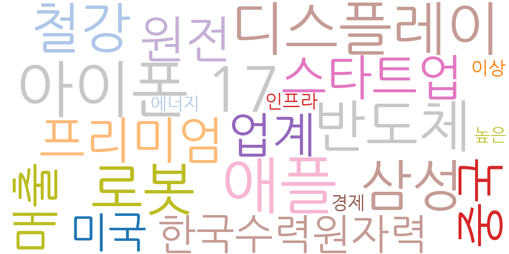
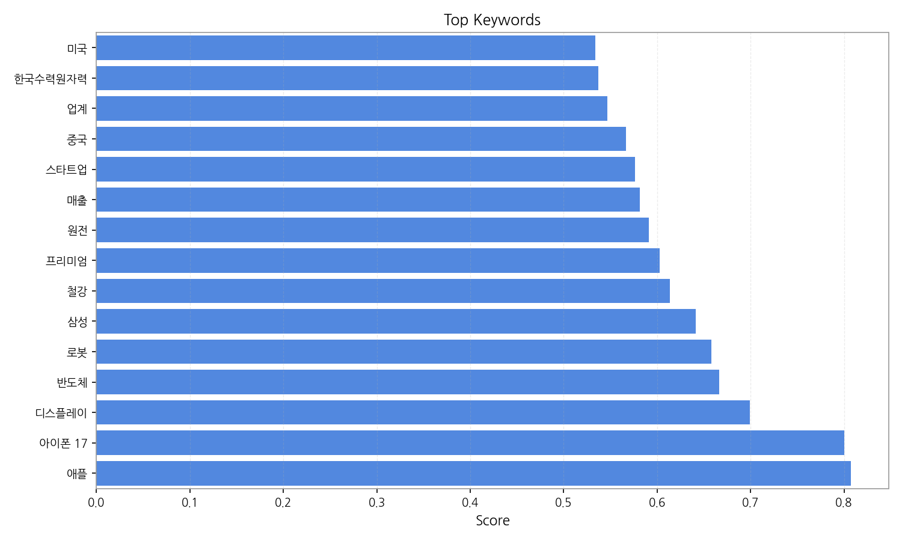
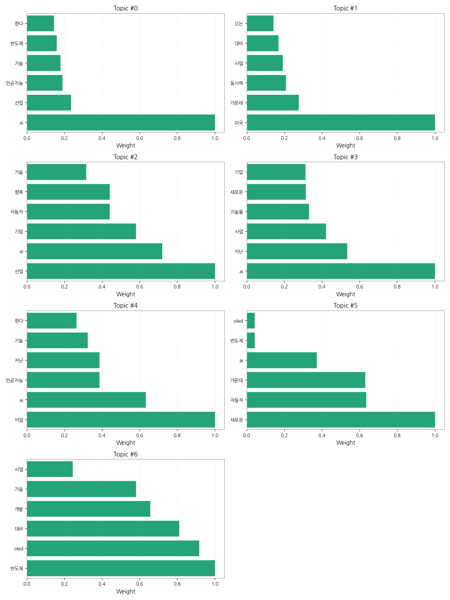
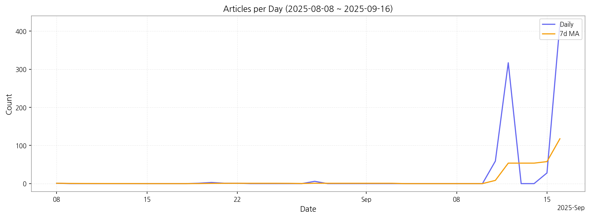

# Weekly/New Biz Report (2025-09-16)

## Executive Summary

- 이번 기간 핵심 토픽과 키워드, 주요 시사점을 요약합니다.

1) 상위 토픽을 3개 주제로 묶어 핵심 맥락을 설명하면 다음과 같습니다. 첫째, AI 산업 발전과 관련된 기술 및 산업 동향을 다루는 주제입니다.  AI 기술의 발전과 이를 기반으로 한 산업 변화, 특히 반도체 산업과의 연관성에 대한 뉴스가 주를 이룹니다. 둘째, 미국을 중심으로 한 글로벌 경쟁 및 사업 전략에 대한 내용입니다.  미국과의 경쟁 속에서 한국 기업들의 대응 전략과 향후 사업 계획 등이 주요 뉴스 토픽입니다. 셋째, 자동차 산업을 포함한 다양한 산업 분야에서의 AI 기술 도입 및 새로운 기술 개발에 대한 내용입니다.  AI 기반의 자동차 기술 개발, OLED 기술 등 새로운 기술 개발과 관련된 기사들이 이 주제에 포함됩니다.

2) 최근 변화/스파이크를 짚어보면, 9월 11일부터 9월 16일 사이에 기사 수가 급증했습니다.  특히 9월 12일에는 317건의 기사가 등장하여 이전보다 압도적으로 많은 기사가 생성되었는데, 이는 특정 이벤트 또는 정책 발표 등의 영향으로 추정됩니다.

3) 실무 인사이트 3가지:

* **미국 중심 글로벌 경쟁 심화 대응 전략 수립:** 미국과의 기술 경쟁 심화에 대응하여, AI, 반도체, 자동차 등 주요 산업 분야별 경쟁력 강화 방안을 구체적으로 마련하고, 정부 지원 정책과 연계한 실행 계획을 수립해야 합니다.
* **AI 기술 도입 및 활용 전략 강화:**  AI 기술을 자사 사업에 적용할 수 있는 구체적인 방안을 모색하고,  AI 기술 도입에 따른 인력 양성 및 교육 프로그램을 개발하여 경쟁력을 확보해야 합니다. 특히 자동차, 산업 자동화 등의 분야에 집중할 필요가 있습니다.
* **데이터 기반 뉴스 모니터링 시스템 구축:**  9월 초의 기사 급증 사례처럼, 핵심 키워드(AI, 반도체, 미국, 자동차 등)를 기반으로 한 실시간 뉴스 모니터링 시스템을 구축하여 시장 변화에 대한 신속한 대응 체계를 마련해야 합니다.  이를 통해 시장 트렌드 변화를 조기에 감지하고,  적시에 대응 전략을 수립할 수 있습니다.

## Key Metrics

- 기간: 2025-08-08 ~ 2025-09-16
- 총 기사 수: 836
- 문서 수: N/A
- 키워드 수(상위): 15
- 토픽 수: 7
- 시계열 데이터 일자 수: 10

## Top Keywords

| Rank | Keyword | Score |
|---:|---|---:|
| 1 | 애플 | 0.807 |
| 2 | 아이폰 17 | 0.800 |
| 3 | 디스플레이 | 0.699 |
| 4 | 반도체 | 0.667 |
| 5 | 로봇 | 0.658 |
| 6 | 삼성 | 0.642 |
| 7 | 철강 | 0.614 |
| 8 | 프리미엄 | 0.603 |
| 9 | 원전 | 0.591 |
| 10 | 매출 | 0.581 |
| 11 | 스타트업 | 0.577 |
| 12 | 중국 | 0.567 |
| 13 | 업계 | 0.547 |
| 14 | 한국수력원자력 | 0.537 |
| 15 | 미국 | 0.534 |

## Topics

- Topic #0: ai, 산업, 인공지능, 기술, 반도체, 한다
- Topic #1: 미국, 가운데, 동시에, 사업, 대비, 오는
- Topic #2: 산업, ai, 기업, 자동차, 향후, 기술
- Topic #3: ai, 지난, 사업, 기술을, 새로운, 기업
- Topic #4: 이달, ai, 인공지능, 지난, 기술, 한다
- Topic #5: 새로운, 자동차, 가운데, ai, 반도체, oled
- Topic #6: 반도체, oled, 대비, 개발, 기술, 사업

## Trend

- 최근 14~30일 기사 수 추세와 7일 이동평균선을 제공합니다.

## Insights

1) 상위 토픽을 3개 주제로 묶어 핵심 맥락을 설명하면 다음과 같습니다. 첫째, AI 산업 발전과 관련된 기술 및 산업 동향을 다루는 주제입니다.  AI 기술의 발전과 이를 기반으로 한 산업 변화, 특히 반도체 산업과의 연관성에 대한 뉴스가 주를 이룹니다. 둘째, 미국을 중심으로 한 글로벌 경쟁 및 사업 전략에 대한 내용입니다.  미국과의 경쟁 속에서 한국 기업들의 대응 전략과 향후 사업 계획 등이 주요 뉴스 토픽입니다. 셋째, 자동차 산업을 포함한 다양한 산업 분야에서의 AI 기술 도입 및 새로운 기술 개발에 대한 내용입니다.  AI 기반의 자동차 기술 개발, OLED 기술 등 새로운 기술 개발과 관련된 기사들이 이 주제에 포함됩니다.

2) 최근 변화/스파이크를 짚어보면, 9월 11일부터 9월 16일 사이에 기사 수가 급증했습니다.  특히 9월 12일에는 317건의 기사가 등장하여 이전보다 압도적으로 많은 기사가 생성되었는데, 이는 특정 이벤트 또는 정책 발표 등의 영향으로 추정됩니다.

3) 실무 인사이트 3가지:

* **미국 중심 글로벌 경쟁 심화 대응 전략 수립:** 미국과의 기술 경쟁 심화에 대응하여, AI, 반도체, 자동차 등 주요 산업 분야별 경쟁력 강화 방안을 구체적으로 마련하고, 정부 지원 정책과 연계한 실행 계획을 수립해야 합니다.
* **AI 기술 도입 및 활용 전략 강화:**  AI 기술을 자사 사업에 적용할 수 있는 구체적인 방안을 모색하고,  AI 기술 도입에 따른 인력 양성 및 교육 프로그램을 개발하여 경쟁력을 확보해야 합니다. 특히 자동차, 산업 자동화 등의 분야에 집중할 필요가 있습니다.
* **데이터 기반 뉴스 모니터링 시스템 구축:**  9월 초의 기사 급증 사례처럼, 핵심 키워드(AI, 반도체, 미국, 자동차 등)를 기반으로 한 실시간 뉴스 모니터링 시스템을 구축하여 시장 변화에 대한 신속한 대응 체계를 마련해야 합니다.  이를 통해 시장 트렌드 변화를 조기에 감지하고,  적시에 대응 전략을 수립할 수 있습니다.

## Opportunities (Top 5)

| Idea | Target | Value Prop | Score |
|---|---|---|---:|
| AI 기반 디스플레이 품질 검사 플랫폼 (KR) | 한국 디스플레이 제조 기업 (LG디스플레이, 삼성디스플레이 등), 중소형 디스플레이 부품 제조사, 연간 생산량 100만대 이상 기업 | AI 기반 자동화 시스템을 통해 불량률을 최대 30% 감소시키고, 생산 속도를 20% 향상시킵니다.  경쟁사 대비 높은 정확도와 빠른 처리 속도가 차별점입니다. | 4.50 |
| 스마트 팩토리 구축을 위한 AI 기반 예지보전 솔루션 (KR) | 한국 전자 제조 기업 (삼성전자, LG전자 등), 중견·중소 전자 부품 제조사,  연간 생산량 50만대 이상 기업 | AI 기반 예지보전 솔루션을 통해 설비 고장을 예측하고, 사전에 예방 조치를 취하여 생산 차질을 최소화합니다. 경쟁사 대비 높은 예측 정확도와 효율적인 유지보수 계획 수립이 차별점입니다. | 4.20 |
| 자율주행차용 디스플레이 부품 조달 파트너십 (JP) | 일본 자동차 부품 제조사, Tier 1 자동차 부품 공급업체,  자율주행 기술 개발 기업 | 한국 디스플레이 제조사와의 파트너십을 통해 고품질 디스플레이 부품을 안정적으로 공급합니다.  경쟁사 대비 가격 경쟁력과 납기 준수를 통해 차별화된 가치를 제공합니다. | 4.00 |
| AI 기반 사이니지 광고 플랫폼 서비스 (EU) | 유럽 지역 중소기업, 프랜차이즈 기업,  소매업체,  연간 마케팅 예산 50만 유로 이상 기업 | AI 기반의 정교한 타겟팅과 실시간 효과 측정을 통해 광고 효율을 극대화합니다.  경쟁사 대비 높은 ROI(투자수익률)를 제공하는 것이 차별점입니다. | 3.80 |
| 글로벌 전자부품 시장 분석 및 예측 데이터 서비스 (EU) | 유럽 전자부품 유통업체,  전자 제조 기업,  투자 기관,  연구 기관 | AI 기반의 정교한 시장 분석 및 예측 모델을 통해 정확하고 시의성 있는 시장 정보를 제공합니다. 경쟁사 대비 높은 예측 정확도와 다양한 시각화 도구 제공이 차별점입니다. | 3.50 |

## Appendix

- 데이터: keywords.json, topics.json, trend_timeseries.json, trend_insights.json, biz_opportunities.json