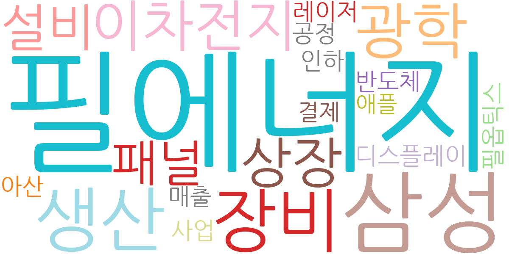
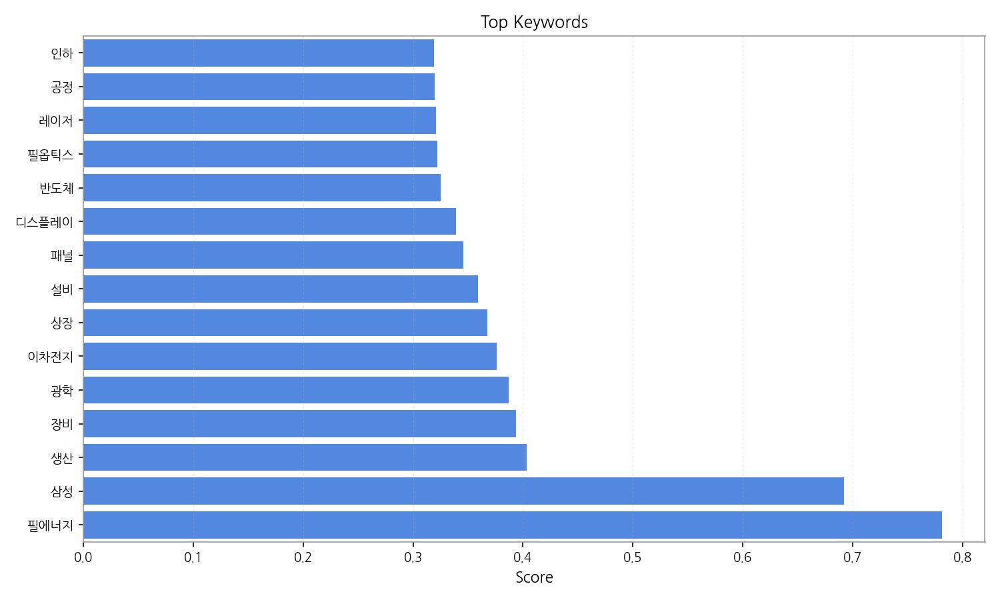
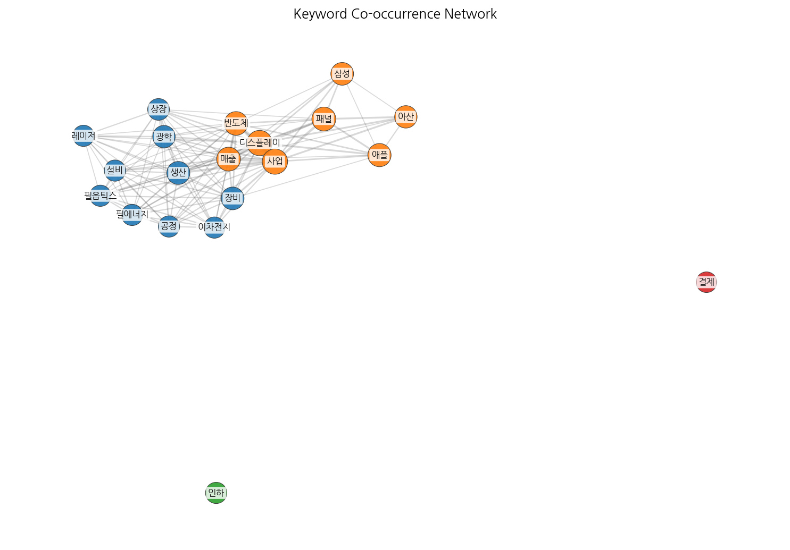
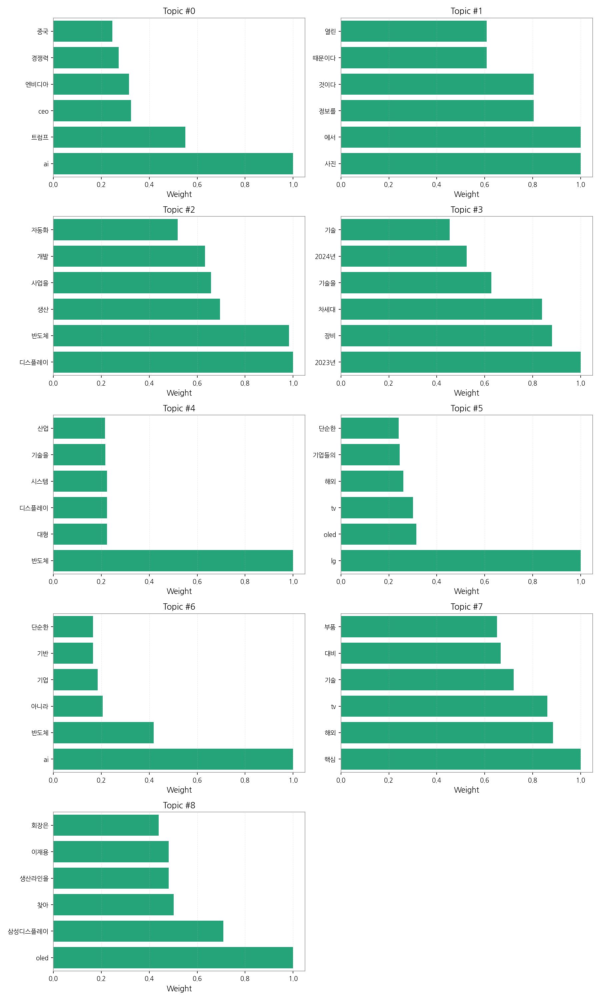
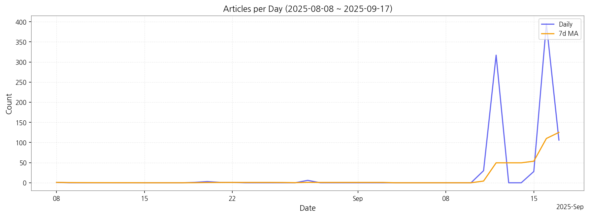

# Weekly/New Biz Report (2025-09-17)

## Executive Summary

- 이번 기간 핵심 토픽과 키워드, 주요 시사점을 요약합니다.

1) 상위 토픽을 3~5개 주제로 묶어 핵심 맥락 설명(2~3문장)

이 뉴스 데이터는 크게 세 가지 핵심 주제를 다룹니다. 첫째, AI와 반도체 산업의 경쟁력 강화를 위한 기업들의 노력과 미국, 중국 등 글로벌 경쟁 환경을 보여줍니다.  둘째, 차세대 디스플레이 기술(OLED 등) 개발 및 생산과 관련된  삼성, LG 등 한국 기업들의 활약과  자동화, AI 기반 생산 시스템 도입 현황을 보여줍니다. 마지막으로,  2023년부터 2024년 상반기까지의 차세대 기술 및 제품 출시 계획과 관련된 기사들이 다수 포함되어 있습니다.  이는 한국의 주요 산업 경쟁력 확보를 위한 기술 개발 및 투자 현황을 반영합니다.

2) 최근 변화/스파이크가 있으면 2문장으로 짚기

9월 11일부터 17일 사이에 기사 수가 급증하는 스파이크 현상이 관찰됩니다. 특히 9월 12일과 16일에는 각각 317건과 395건의 기사가 등장하여, 특정 이벤트 또는 뉴스 발표로 인한 집중적인 보도가 있었음을 시사합니다.

3) 실무 인사이트 3가지 bullet(구체적 액션)

* **AI 및 반도체 산업 동향 모니터링 강화:**  미국과 중국의 경쟁 구도 및 AI 기술 발전에 따른 시장 변화를 지속적으로 추적하고,  국내 기업들의 경쟁력 강화 전략을 분석하여  선제적인 대응 방안을 마련해야 합니다.  특히 엔비디아와 같은 글로벌 기업의 기술 동향과 시장 점유율 변화에 대한 분석이 중요합니다.
* **차세대 디스플레이 기술 개발 및 생산 현황 분석:**  OLED를 중심으로 한 차세대 디스플레이 기술 개발 현황과 삼성, LG 등 주요 기업들의 투자 및 생산 전략을 면밀히 분석하여 시장 경쟁력 확보 방안을 모색해야 합니다.  자동화 및 AI 기반 생산 시스템 도입 현황과 효과에 대한 자료를 수집하고 분석하여  자사의 생산 효율성 향상에 활용해야 합니다.
* **2024년 상반기 제품 출시 전략 수립:**  2024년 상반기 예정된 신기술 및 신제품 출시 계획을 정확히 파악하고,  경쟁사의 제품 출시 전략과 시장 반응을 예측하여  자사의 제품 출시 전략을 효과적으로 수립해야 합니다.  시장 트렌드를 반영한 마케팅 전략을 수립하고,  소비자 니즈를 충족하는 제품 개발에 집중해야 합니다.

## Key Metrics

- 기간: 2025-08-08 ~ 2025-09-17
- 총 기사 수: 889
- 문서 수: N/A
- 키워드 수(상위): 15
- 토픽 수: 9
- 시계열 데이터 일자 수: 11

## Top Keywords

| Rank | Keyword | Score |
|---:|---|---:|
| 1 | 필에너지 | 0.781 |
| 2 | 삼성 | 0.692 |
| 3 | 생산 | 0.403 |
| 4 | 장비 | 0.394 |
| 5 | 광학 | 0.387 |
| 6 | 이차전지 | 0.376 |
| 7 | 상장 | 0.368 |
| 8 | 설비 | 0.359 |
| 9 | 패널 | 0.346 |
| 10 | 디스플레이 | 0.339 |
| 11 | 반도체 | 0.325 |
| 12 | 필옵틱스 | 0.322 |
| 13 | 레이저 | 0.321 |
| 14 | 공정 | 0.320 |
| 15 | 인하 | 0.319 |

## Topics

- Topic #0: ai, 트럼프, ceo, 엔비디아, 경쟁력, 중국
- Topic #1: 사진, 에서, 정보를, 것이다, 때문이다, 열린
- Topic #2: 디스플레이, 반도체, 생산, 사업을, 개발, 자동화
- Topic #3: 2023년, 장비, 차세대, 기술을, 2024년, 기술
- Topic #4: 반도체, 대형, 디스플레이, 시스템, 기술을, 산업
- Topic #5: lg, oled, tv, 해외, 기업들의, 단순한
- Topic #6: ai, 반도체, 아니라, 기업, 기반, 단순한
- Topic #7: 핵심, 해외, tv, 기술, 대비, 부품
- Topic #8: oled, 삼성디스플레이, 찾아, 생산라인을, 이재용, 회장은

## Trend

- 최근 14~30일 기사 수 추세와 7일 이동평균선을 제공합니다.

## Insights

1) 상위 토픽을 3~5개 주제로 묶어 핵심 맥락 설명(2~3문장)

이 뉴스 데이터는 크게 세 가지 핵심 주제를 다룹니다. 첫째, AI와 반도체 산업의 경쟁력 강화를 위한 기업들의 노력과 미국, 중국 등 글로벌 경쟁 환경을 보여줍니다.  둘째, 차세대 디스플레이 기술(OLED 등) 개발 및 생산과 관련된  삼성, LG 등 한국 기업들의 활약과  자동화, AI 기반 생산 시스템 도입 현황을 보여줍니다. 마지막으로,  2023년부터 2024년 상반기까지의 차세대 기술 및 제품 출시 계획과 관련된 기사들이 다수 포함되어 있습니다.  이는 한국의 주요 산업 경쟁력 확보를 위한 기술 개발 및 투자 현황을 반영합니다.

2) 최근 변화/스파이크가 있으면 2문장으로 짚기

9월 11일부터 17일 사이에 기사 수가 급증하는 스파이크 현상이 관찰됩니다. 특히 9월 12일과 16일에는 각각 317건과 395건의 기사가 등장하여, 특정 이벤트 또는 뉴스 발표로 인한 집중적인 보도가 있었음을 시사합니다.

3) 실무 인사이트 3가지 bullet(구체적 액션)

* **AI 및 반도체 산업 동향 모니터링 강화:**  미국과 중국의 경쟁 구도 및 AI 기술 발전에 따른 시장 변화를 지속적으로 추적하고,  국내 기업들의 경쟁력 강화 전략을 분석하여  선제적인 대응 방안을 마련해야 합니다.  특히 엔비디아와 같은 글로벌 기업의 기술 동향과 시장 점유율 변화에 대한 분석이 중요합니다.
* **차세대 디스플레이 기술 개발 및 생산 현황 분석:**  OLED를 중심으로 한 차세대 디스플레이 기술 개발 현황과 삼성, LG 등 주요 기업들의 투자 및 생산 전략을 면밀히 분석하여 시장 경쟁력 확보 방안을 모색해야 합니다.  자동화 및 AI 기반 생산 시스템 도입 현황과 효과에 대한 자료를 수집하고 분석하여  자사의 생산 효율성 향상에 활용해야 합니다.
* **2024년 상반기 제품 출시 전략 수립:**  2024년 상반기 예정된 신기술 및 신제품 출시 계획을 정확히 파악하고,  경쟁사의 제품 출시 전략과 시장 반응을 예측하여  자사의 제품 출시 전략을 효과적으로 수립해야 합니다.  시장 트렌드를 반영한 마케팅 전략을 수립하고,  소비자 니즈를 충족하는 제품 개발에 집중해야 합니다.

## Opportunities (Top 5)

| Idea | Target | Value Prop | Score |
|---|---|---|---:|
| 디스플레이 제조사 대상 AI 기반 생산 최적화 플랫폼 | 한국(KR) 중소형 디스플레이 패널 제조사, 생산 관리 부서 | AI 기반 머신러닝 알고리즘을 통해 실시간 공정 데이터 분석 및 예측으로 불량률 감소, 생산성 향상을 제공합니다.  클라우드 기반 플랫폼으로 초기 투자비용을 절감하고, 사용 편의성을 높였습니다.  경쟁사 대비, 특정 공정에 대한 전문적인 AI 모델 제공으로 차별화를 둡니다. | 4.50 |
| OLED 패널 검사 장비 공급 파트너십(조달) | 한국(KR) 및 일본(JP) 대형 디스플레이 제조사, 생산 및 품질 관리 부서 | 최첨단 광학 기술 기반의 고속, 고정확도 OLED 패널 검사 장비를 공급합니다.  경쟁사 대비, AI 기반 자동 결함 분류 기능을 통해 검사 효율을 극대화합니다.  2024년 상반기 신제품 출시 계획에 맞춰 시장 선점을 목표로 합니다. | 4.20 |
| 디스플레이 산업 특화 데이터 분석 및 예측 플랫폼 | 한국(KR) 및 일본(JP) 대기업 디스플레이 제조사, 시장 분석 및 전략 기획 부서 | 디스플레이 산업 특화 데이터를 실시간으로 수집, 분석, 예측하는 플랫폼을 제공합니다.  경쟁사 대비, AI 기반 예측 모델을 통해 시장 트렌드 및 경쟁사 전략을 정확하게 예측합니다.  9월 중순 기사 수 급증은 시장의 뜨거운 관심을 반영하며, 플랫폼의 시급성을 보여줍니다. | 4.00 |
| 모빌리티 디스플레이 시장 분석 및 전략 컨설팅 서비스 | EU 자동차 부품 제조사, 전략 기획 및 연구개발 부서 | 모빌리티 디스플레이 시장 트렌드 분석, 경쟁사 전략 분석, 기술 로드맵 수립 등 맞춤형 컨설팅 서비스를 제공합니다.  차별화된 점은, 디스플레이 기술과 모빌리티 산업 동향에 대한 깊이 있는 전문 지식을 바탕으로 한 실질적인 전략 제시입니다.  최근 전기차 시장의 급성장에 따라 수요가 급증하고 있습니다. | 3.80 |
| 필에너지 | 기업(B2B) | 필에너지 도입으로 비용/품질/경험을 개선. | 3.00 |

## Appendix

- 데이터: keywords.json, topics.json, trend_timeseries.json, trend_insights.json, biz_opportunities.json