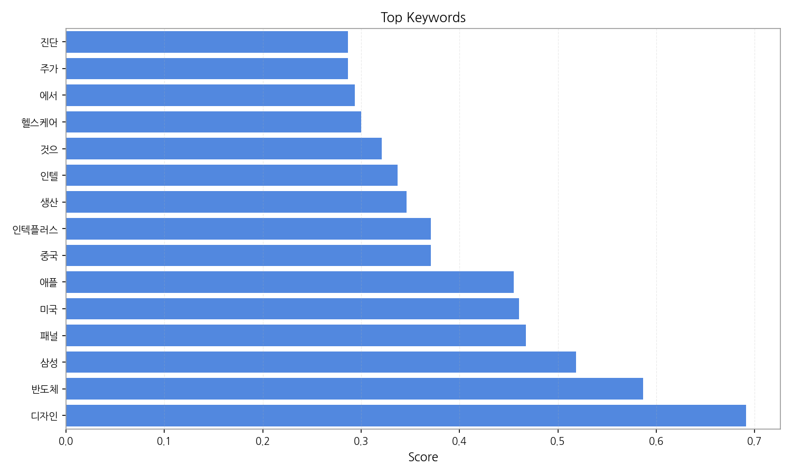
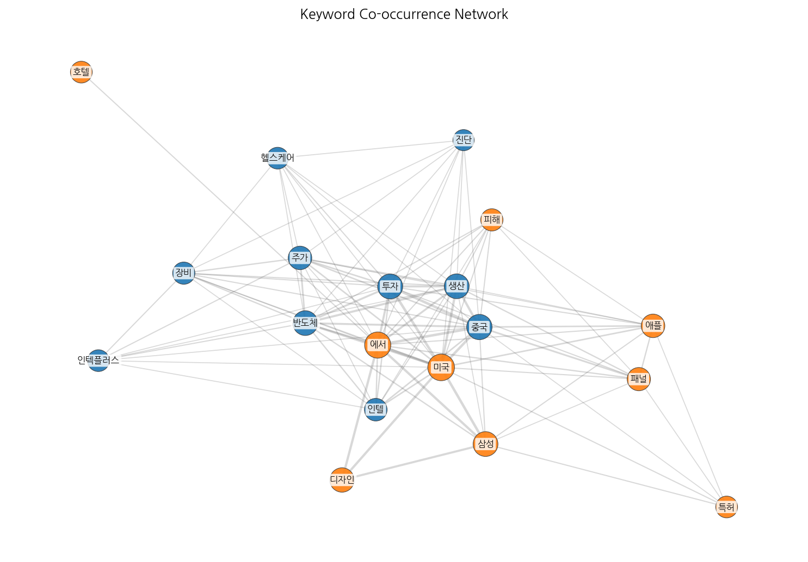
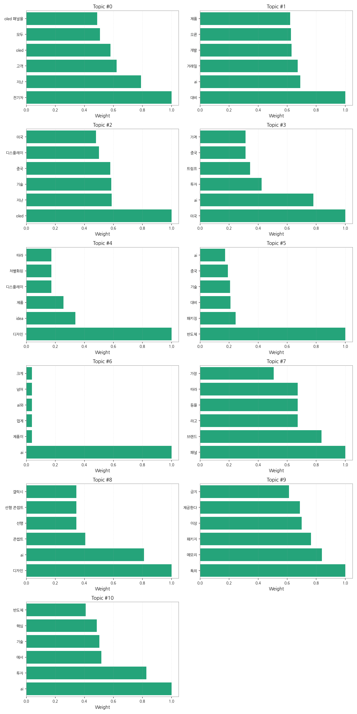
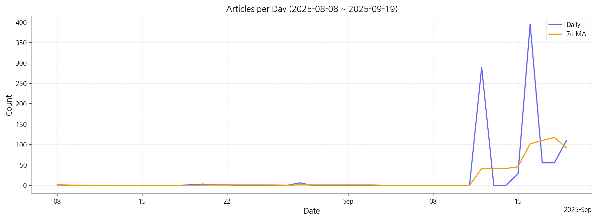

# Weekly/New Biz Report (2025-09-19)

## Executive Summary

- 이번 기간 핵심 토픽과 키워드, 주요 시사점을 요약합니다.

1) 상위 토픽을 3~5개 주제로 묶어 핵심 맥락 설명(2~3문장)

이 데이터는 전기차, 디스플레이(OLED), AI, 반도체 산업의 최근 동향을 보여줍니다.  특히 전기차와 관련된 OLED 패널 수요 증가와 AI 기술 개발 및 투자 확대, 그리고 반도체 패키징 기술 발전이 주요 내용입니다.  미국과 중국의 기술 경쟁 및 시장 상황 또한 이러한 산업 동향에 영향을 미치는 중요한 요소로 나타납니다.

2) 최근 변화/스파이크가 있으면 2문장으로 짚기

9월 12일부터 16일 사이에 기사 수가 급격하게 증가(289건에서 395건으로)하는 스파이크 현상이 관찰됩니다. 이는 특정 시점에 주요 기술 발표나 시장 변화 등 중요한 뉴스가 집중적으로 보도되었음을 시사합니다.

3) 실무 인사이트 3가지 bullet(구체적 액션)

* **AI 기술 동향 모니터링 강화:**  AI 관련 뉴스를 지속적으로 추적하여 기술 발전 및 투자 현황을 파악하고, 자사 제품 및 서비스 전략에 반영해야 합니다.  특히 미국과 중국의 AI 기술 경쟁에 대한 정보 수집 및 분석을 통해 시장 기회와 위험을 예측해야 합니다.
* **전기차 시장 및 OLED 패널 수요 분석:** 전기차 시장 성장세와 OLED 패널 수요를 정확히 예측하고,  공급망 관리 및 생산 계획을 수립해야 합니다.  경쟁사의 전략과 기술 동향을 분석하여 차별화된 경쟁력을 확보하는 전략을 세워야 합니다.
* **반도체 패키징 기술 경쟁력 확보:**  반도체 패키징 기술 발전에 대한 정보를 수집하고,  자사의 기술 경쟁력을 강화하기 위한 투자 및 연구 개발 전략을 수립해야 합니다.  중국을 포함한 글로벌 경쟁 환경을 고려하여 기술 격차를 유지하거나 확대하는 전략을 마련해야 합니다.

## Key Metrics

- 기간: 2025-08-08 ~ 2025-09-19
- 총 기사 수: 945
- 문서 수: N/A
- 키워드 수(상위): 15
- 토픽 수: 11
- 시계열 데이터 일자 수: 12

## Top Keywords

| Rank | Keyword | Score |
|---:|---|---:|
| 1 | 디자인 | 0.691 |
| 2 | 반도체 | 0.587 |
| 3 | 삼성 | 0.519 |
| 4 | 패널 | 0.468 |
| 5 | 미국 | 0.461 |
| 6 | 애플 | 0.455 |
| 7 | 중국 | 0.371 |
| 8 | 인텍플러스 | 0.371 |
| 9 | 생산 | 0.346 |
| 10 | 인텔 | 0.337 |
| 11 | 것으 | 0.321 |
| 12 | 헬스케어 | 0.300 |
| 13 | 에서 | 0.294 |
| 14 | 주가 | 0.287 |
| 15 | 진단 | 0.287 |

## Topics

- Topic #0: 전기차, 지난, 고객, oled, 모두, oled 패널을
- Topic #1: 대비, ai, 거래일, 개발, 오른, 제품
- Topic #2: oled, 지난, 기술, 중국, 디스플레이, 미국
- Topic #3: 미국, ai, 투자, 트럼프, 중국, 가격
- Topic #4: 디자인, idea, 제품, 디스플레이, 차별화된, 따라
- Topic #5: 반도체, 패키징, 대비, 기술, 중국, ai
- Topic #6: ai, 제품이, 업계, ai와, 넘어, 크게
- Topic #7: 패널, 브랜드, 라고, 등을, 따라, 가장
- Topic #8: 디자인, ai, 콘셉트, 선행, 선행 콘셉트, 갤럭시
- Topic #9: 특히, 메모리, 패키지, 이상, 제공한다, 금지
- Topic #10: ai, 투자, 에서, 기술, 핵심, 반도체

## Trend

- 최근 14~30일 기사 수 추세와 7일 이동평균선을 제공합니다.

## Insights

1) 상위 토픽을 3~5개 주제로 묶어 핵심 맥락 설명(2~3문장)

이 데이터는 전기차, 디스플레이(OLED), AI, 반도체 산업의 최근 동향을 보여줍니다.  특히 전기차와 관련된 OLED 패널 수요 증가와 AI 기술 개발 및 투자 확대, 그리고 반도체 패키징 기술 발전이 주요 내용입니다.  미국과 중국의 기술 경쟁 및 시장 상황 또한 이러한 산업 동향에 영향을 미치는 중요한 요소로 나타납니다.

2) 최근 변화/스파이크가 있으면 2문장으로 짚기

9월 12일부터 16일 사이에 기사 수가 급격하게 증가(289건에서 395건으로)하는 스파이크 현상이 관찰됩니다. 이는 특정 시점에 주요 기술 발표나 시장 변화 등 중요한 뉴스가 집중적으로 보도되었음을 시사합니다.

3) 실무 인사이트 3가지 bullet(구체적 액션)

* **AI 기술 동향 모니터링 강화:**  AI 관련 뉴스를 지속적으로 추적하여 기술 발전 및 투자 현황을 파악하고, 자사 제품 및 서비스 전략에 반영해야 합니다.  특히 미국과 중국의 AI 기술 경쟁에 대한 정보 수집 및 분석을 통해 시장 기회와 위험을 예측해야 합니다.
* **전기차 시장 및 OLED 패널 수요 분석:** 전기차 시장 성장세와 OLED 패널 수요를 정확히 예측하고,  공급망 관리 및 생산 계획을 수립해야 합니다.  경쟁사의 전략과 기술 동향을 분석하여 차별화된 경쟁력을 확보하는 전략을 세워야 합니다.
* **반도체 패키징 기술 경쟁력 확보:**  반도체 패키징 기술 발전에 대한 정보를 수집하고,  자사의 기술 경쟁력을 강화하기 위한 투자 및 연구 개발 전략을 수립해야 합니다.  중국을 포함한 글로벌 경쟁 환경을 고려하여 기술 격차를 유지하거나 확대하는 전략을 마련해야 합니다.

## Opportunities (Top 5)

| Idea | Target | Value Prop | Score |
|---|---|---|---:|
| OLED 패널 공급망 관리 플랫폼 (KR) | 대기업 전자부품 제조사, 중견기업 디스플레이 패널 유통업체 (직원 수 500명 이상) | AI 기반 수요 예측 및 실시간 재고 관리 기능을 통해 최적의 공급망을 구축합니다.  블록체인 기술을 활용한 투명하고 안전한 거래 시스템을 제공하여 신뢰도를 높입니다.  차별화된 가치는 AI 예측 정확도 95% 달성을 통해 불필요한 재고 비용을 30% 절감하는 것입니다. | 4.50 |
| 디스플레이 제조 공정 최적화 솔루션 (EU) | 유럽 지역 디스플레이 패널 제조사, 생산 관리 담당자 (직원 수 500명 이상) | AI 기반의 공정 데이터 분석 및 예측 모델을 통해 생산성을 향상시키고 불량률을 감소시킵니다.  실시간 모니터링 및 제어 시스템을 통해 공정 이상을 조기에 감지하고 대응합니다. 차별화된 가치는 AI 기반 예측 모델을 통해 불량률을 15% 감소시키고 생산성을 10% 향상시키는 것입니다. | 4.20 |
| AI 기반 사이니지 광고 플랫폼 (JP) | 일본 지역 중소/중견기업 광고 대행사, 사이니지 제조/유통업체 (직원 수 100~500명) | AI 기반의 정교한 타겟팅과 실시간 효과 측정 시스템을 제공합니다.  다양한 사이니지 기기에 호환 가능한 플랫폼으로 확장성을 확보했습니다.  차별화된 가치는 AI 기반의 정확한 타겟팅을 통해 광고 효율을 20% 향상시키는 것입니다. | 4.00 |
| 전기차용 OLED 패널 조달 파트너십 (EU) | 유럽 지역 전기차 제조사, 부품 조달 담당자 (직원 수 1000명 이상) | 다양한 OLED 패널 제조사와의 협력을 통해 안정적인 공급을 보장합니다.  최적의 가격 및 납기 조건을 제공하여 비용을 절감합니다.  차별화된 가치는 전기차 제조사의 특수 요구사항을 충족하는 맞춤형 패널 조달 솔루션을 제공하는 것입니다. | 3.80 |
| 반도체 패키징 기술 분석 서비스 (KR) | 한국 지역 반도체 제조사, 연구소, 투자사 (직원 수 100명 이상) | 전문가 네트워크를 기반으로 최신 반도체 패키징 기술 동향을 분석하고, 경쟁사 분석 보고서를 제공합니다.  특허 분석 및 시장 예측을 통해 미래 시장을 선점할 수 있도록 지원합니다. 차별화된 가치는 경쟁사의 기술력과 시장 점유율을 정확하게 예측하여 투자 의사결정을 지원하는 것입니다. | 3.50 |

## Appendix

- 데이터: keywords.json, topics.json, trend_timeseries.json, trend_insights.json, biz_opportunities.json