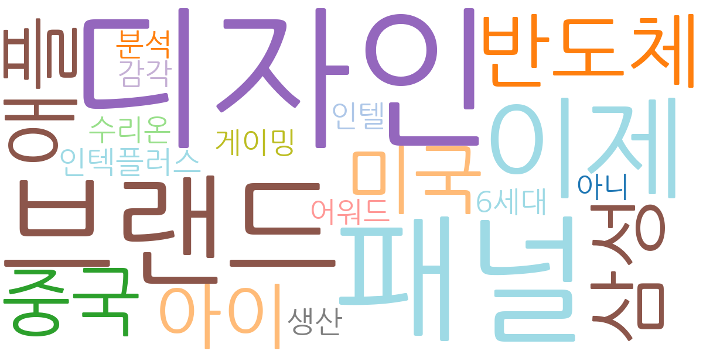
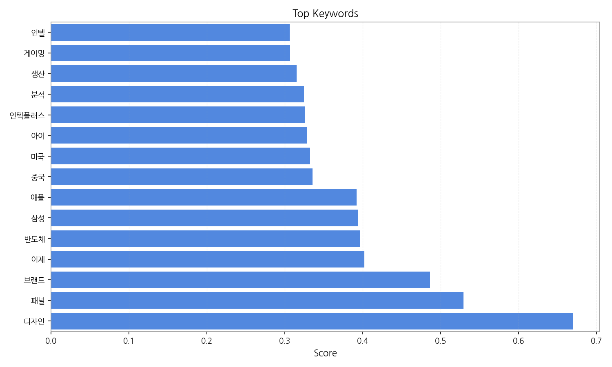
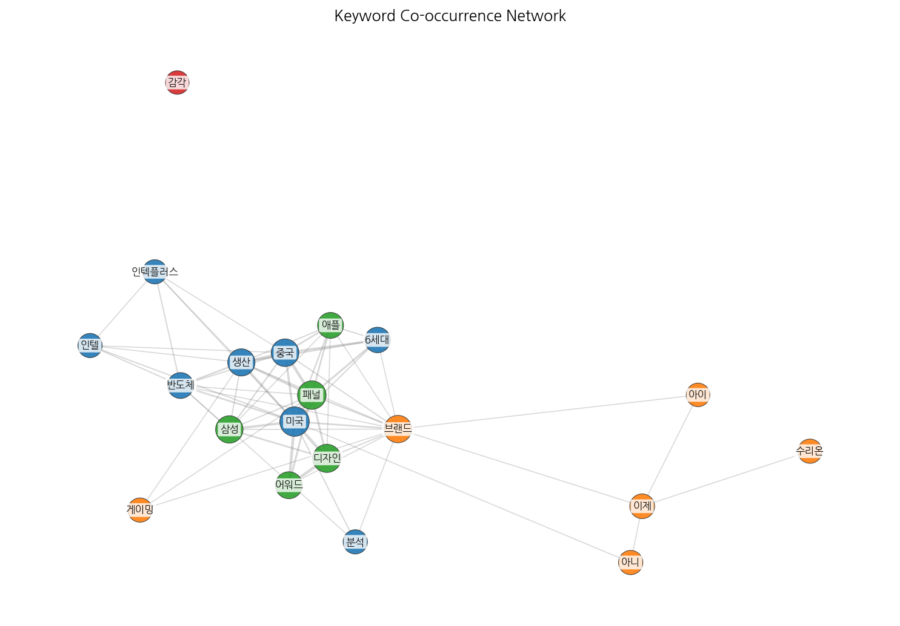
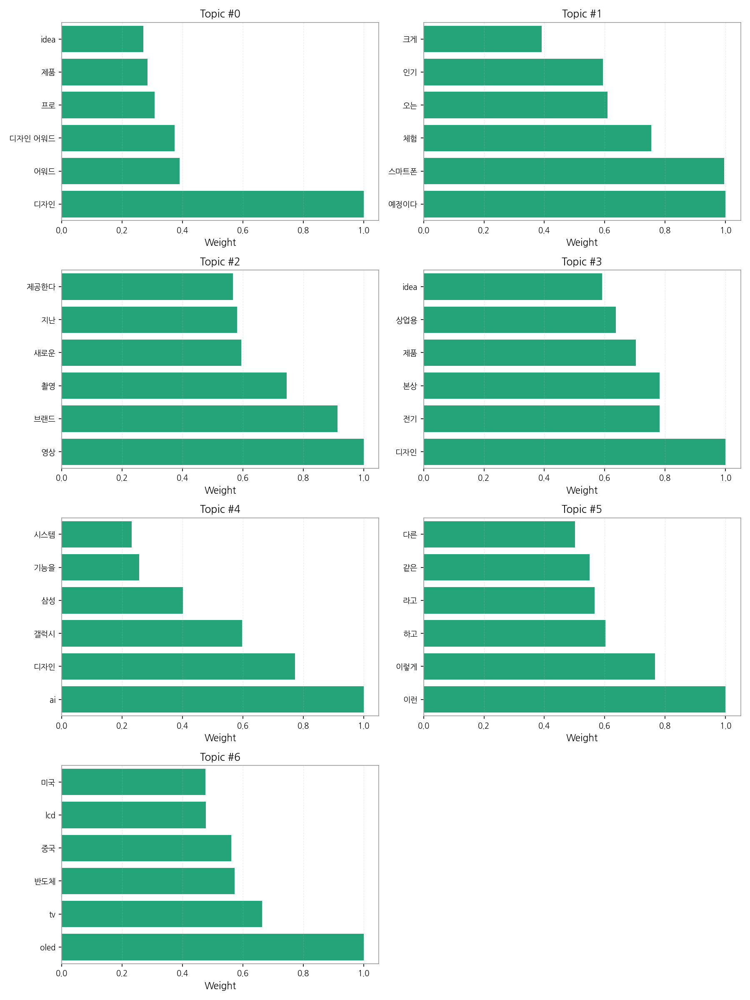
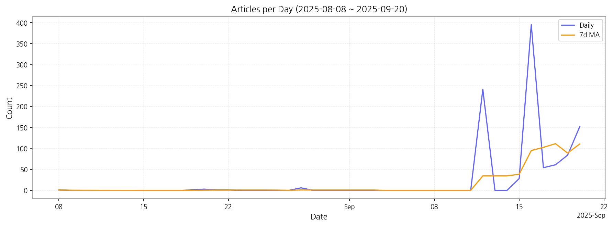

# Weekly/New Biz Report (2025-09-20)

## Executive Summary

- 이번 기간 핵심 토픽과 키워드, 주요 시사점을 요약합니다.

1) 상위 토픽을 3개 주제로 묶어 핵심 맥락을 설명하면 다음과 같습니다. 첫째, **디자인 어워드 및 제품 디자인** 관련 뉴스는 LG, idea 디자인 등 특정 기업과 디자인 트렌드를 중심으로 다루고 있습니다.  둘째, **스마트폰 출시 및 체험** 관련 뉴스는 LG 스마트폰의 출시 예정과 관련된 기대감과 인기를 반영하고 있습니다.  셋째, **영상 및 디스플레이 기술** 관련 뉴스는 새로운 영상 촬영 기술, OLED TV, 그리고 중국과 미국을 포함한 글로벌 시장 동향을 보여줍니다.  이 세 가지 주제는 모두 기술 및 디자인 업계의 최신 동향을 반영하고 있으며, 특히 LG와 삼성 등 주요 기업의 활동이 두드러지게 나타납니다.

2) 최근 변화/스파이크를 짚어보면, 9월 12일부터 9월 16일 사이에 기사 수가 급증했습니다.  이는 특정 이벤트, 제품 출시 또는 중요한 발표와 관련이 있을 가능성이 높으며, 이 기간 동안 특정 주제에 대한 관심이 폭발적으로 증가했음을 시사합니다.

3) 실무 인사이트 3가지:

* **9월 12일~16일 기사 분석:**  기사 급증 원인을 분석하여 향후 마케팅 전략에 활용합니다.  특정 제품 출시, 이벤트, 또는 뉴스 보도가 기사 증가의 원인이었는지 분석하고,  유사한 이벤트를 예측하여 선제적 대응 전략을 수립합니다.
* **주요 키워드 모니터링 강화:**  "LG", "스마트폰", "디자인", "OLED", "AI" 등 주요 키워드에 대한 실시간 모니터링 시스템을 구축하여 시장 트렌드 변화를 신속하게 파악합니다.  이를 통해 빠른 의사결정과 대응이 가능하도록 합니다.
* **경쟁사 분석 심화:**  삼성전자와 LG전자 등 경쟁사의 제품 출시 및 마케팅 전략을 면밀히 분석하여 자사 전략을 개선합니다.  경쟁사의 강점과 약점을 파악하고, 이를 바탕으로 차별화된 전략을 수립하여 시장 경쟁력을 확보합니다.

## Key Metrics

- 기간: 2025-08-08 ~ 2025-09-20
- 총 기사 수: 1,028
- 문서 수: N/A
- 키워드 수(상위): 15
- 토픽 수: 7
- 시계열 데이터 일자 수: 13

## Top Keywords

| Rank | Keyword | Score |
|---:|---|---:|
| 1 | 디자인 | 0.670 |
| 2 | 패널 | 0.529 |
| 3 | 브랜드 | 0.486 |
| 4 | 이제 | 0.402 |
| 5 | 반도체 | 0.397 |
| 6 | 삼성 | 0.394 |
| 7 | 애플 | 0.392 |
| 8 | 중국 | 0.336 |
| 9 | 미국 | 0.332 |
| 10 | 아이 | 0.328 |
| 11 | 인텍플러스 | 0.325 |
| 12 | 분석 | 0.325 |
| 13 | 생산 | 0.315 |
| 14 | 게이밍 | 0.306 |
| 15 | 인텔 | 0.306 |

## Topics

- Topic #0: 디자인, 어워드, 디자인 어워드, 프로, 제품, idea
- Topic #1: 예정이다, 스마트폰, 체험, 오는, 인기, 크게
- Topic #2: 영상, 브랜드, 촬영, 새로운, 지난, 제공한다
- Topic #3: 디자인, 전기, 본상, 제품, 상업용, idea
- Topic #4: ai, 디자인, 갤럭시, 삼성, 기능을, 시스템
- Topic #5: 이런, 이렇게, 하고, 라고, 같은, 다른
- Topic #6: oled, tv, 반도체, 중국, lcd, 미국

## Trend

- 최근 14~30일 기사 수 추세와 7일 이동평균선을 제공합니다.

## Insights

1) 상위 토픽을 3개 주제로 묶어 핵심 맥락을 설명하면 다음과 같습니다. 첫째, **디자인 어워드 및 제품 디자인** 관련 뉴스는 LG, idea 디자인 등 특정 기업과 디자인 트렌드를 중심으로 다루고 있습니다.  둘째, **스마트폰 출시 및 체험** 관련 뉴스는 LG 스마트폰의 출시 예정과 관련된 기대감과 인기를 반영하고 있습니다.  셋째, **영상 및 디스플레이 기술** 관련 뉴스는 새로운 영상 촬영 기술, OLED TV, 그리고 중국과 미국을 포함한 글로벌 시장 동향을 보여줍니다.  이 세 가지 주제는 모두 기술 및 디자인 업계의 최신 동향을 반영하고 있으며, 특히 LG와 삼성 등 주요 기업의 활동이 두드러지게 나타납니다.

2) 최근 변화/스파이크를 짚어보면, 9월 12일부터 9월 16일 사이에 기사 수가 급증했습니다.  이는 특정 이벤트, 제품 출시 또는 중요한 발표와 관련이 있을 가능성이 높으며, 이 기간 동안 특정 주제에 대한 관심이 폭발적으로 증가했음을 시사합니다.

3) 실무 인사이트 3가지:

* **9월 12일~16일 기사 분석:**  기사 급증 원인을 분석하여 향후 마케팅 전략에 활용합니다.  특정 제품 출시, 이벤트, 또는 뉴스 보도가 기사 증가의 원인이었는지 분석하고,  유사한 이벤트를 예측하여 선제적 대응 전략을 수립합니다.
* **주요 키워드 모니터링 강화:**  "LG", "스마트폰", "디자인", "OLED", "AI" 등 주요 키워드에 대한 실시간 모니터링 시스템을 구축하여 시장 트렌드 변화를 신속하게 파악합니다.  이를 통해 빠른 의사결정과 대응이 가능하도록 합니다.
* **경쟁사 분석 심화:**  삼성전자와 LG전자 등 경쟁사의 제품 출시 및 마케팅 전략을 면밀히 분석하여 자사 전략을 개선합니다.  경쟁사의 강점과 약점을 파악하고, 이를 바탕으로 차별화된 전략을 수립하여 시장 경쟁력을 확보합니다.

## Opportunities (Top 5)

| Idea | Target | Value Prop | Score |
|---|---|---|---:|
| 디스플레이 패널 조달 플랫폼 구축 (KR) | 디스플레이 패널을 사용하는 중소/중견 제조기업 (전자, 모빌리티, 사이니지 등), 대기업 구매 담당 부서 | 투명하고 효율적인 디스플레이 패널 조달 플랫폼을 제공하여 중소기업의 경쟁력 강화와 대기업의 원가 절감을 동시에 달성합니다.  블록체인 기반의 투명한 거래 시스템을 통해 신뢰도를 높입니다.  차별화 포인트는 실시간 가격 비교 및 경쟁 입찰 시스템을 통해 최적의 조달을 지원하는 것입니다. | 4.50 |
| AI 기반 디스플레이 디자인 솔루션 (JP) | 디스플레이 제조사 디자인팀, 제품 개발팀,  프리랜서 디자이너 | AI 기반 디자인 솔루션을 통해 디자인 시간 단축 및 비용 절감, 시장 트렌드를 반영한 최적의 디자인 제안을 제공합니다.  데이터 기반의 디자인 제안으로 객관성을 확보하고 디자인 일관성을 유지합니다. 차별화 포인트는 사용자의 피드백을 실시간으로 반영하는 AI 학습 기능입니다. | 4.00 |
| 스마트 사이니지 관리 및 분석 플랫폼 (EU) | 대형 쇼핑몰, 공항, 기업 본사 등 스마트 사이니지를 운영하는 기업, 광고 대행사 | 중앙 집중식 스마트 사이니지 관리 및 분석 플랫폼을 제공하여 효율적인 운영 및 광고 효과 극대화를 지원합니다.  실시간 모니터링 및 데이터 분석 기능을 통해 운영 전략 개선에 필요한 인사이트를 제공합니다. 차별화 포인트는 위치 기반 광고 타겟팅 기능을 통한 정교한 광고 효과 측정입니다. | 3.80 |
| 디스플레이 제조 공정 최적화 컨설팅 서비스 (KR) | 중소/중견 디스플레이 제조 기업, 생산 관리 부서 | 디스플레이 제조 공정 전문가의 컨설팅을 통해 생산성 향상과 원가 절감을 지원합니다.  최신 기술 및 공정 도입 전략 수립 및 실행을 지원합니다. 차별화 포인트는 데이터 기반의 객관적인 분석과 맞춤형 솔루션 제공입니다.  최근 9월의 기사 급증은 특정 제품 출시 또는 기술 발표와 관련이 있을 가능성이 높으며, 이에 대한 분석을 통해 최적의 공정 개선 방안을 제시할 수 있습니다. | 3.50 |
| 디자인 | 기업(B2B) | 디자인 도입으로 비용/품질/경험을 개선. | 3.00 |

## Appendix

- 데이터: keywords.json, topics.json, trend_timeseries.json, trend_insights.json, biz_opportunities.json