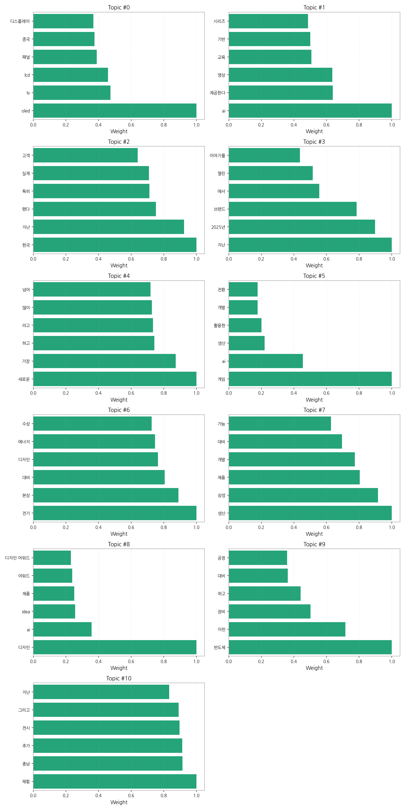

# Weekly/New Biz Report (2025-09-20)

## Executive Summary

- 이번 기간 핵심 토픽과 키워드, 주요 시사점을 요약합니다.

1) 상위 토픽을 3~5개 주제로 묶어 핵심 맥락 설명(2~3문장)

뉴스 기사는 크게 디스플레이 기술, AI 활용 및 서비스, 그리고 제품 디자인 및 생산 관련 이슈로 압축될 수 있습니다.  디스플레이 기술 부문에서는 OLED, LCD 패널 생산 및 중국과의 경쟁이 주요 내용이며, AI는 교육, 영상 서비스 등 다양한 분야에서 활용되는 모습을 보여줍니다.  마지막으로 제품 디자인, 생산, 그리고 삼성과 같은 주요 브랜드의 새로운 제품 출시 및 수상 소식이 주를 이루고 있습니다.  이러한 세 가지 주제는 서로 연관되어 있으며, 기술 발전과 시장 경쟁, 그리고 소비자 트렌드를 반영하고 있습니다.

2) 최근 변화/스파이크가 있으면 2문장으로 짚기

9월 12일부터 9월 20일 사이에 기사 수가 급격하게 증가하는 스파이크 현상이 관찰됩니다.  이는 특정 이벤트, 제품 출시, 또는 중요한 뉴스 발표 등으로 인해 언론의 집중도가 높아진 것을 시사합니다.

3) 실무 인사이트 3가지 bullet(구체적 액션)

* **9월 중순 기사 급증 원인 분석:** 9월 12일부터 20일 사이 기사 급증의 원인을 분석하여 향후 유사한 현상 발생 시 대응 전략을 수립합니다.  관련 키워드 분석 및 경쟁사 동향 조사를 통해 원인을 파악하고,  미디어 모니터링 시스템을 강화하여 신속한 대응 체계를 구축합니다.
* **주요 토픽별 콘텐츠 전략 수립:**  디스플레이, AI, 디자인/생산 등 주요 토픽에 대한 심층 분석을 통해 각 분야별 맞춤형 콘텐츠 전략을 수립합니다.  타겟 고객층을 명확히 설정하고,  그들의 니즈를 충족하는 정보를 제공하는 콘텐츠를 제작합니다.
* **AI 활용 및 기술 동향 모니터링 강화:** AI 기술의 발전과 활용 현황을 지속적으로 모니터링하고,  이를 기반으로 새로운 비즈니스 기회를 발굴합니다.  AI 관련 전문가 네트워크를 구축하고,  정기적인 기술 동향 보고서를 작성하여 경쟁력을 유지합니다.

## Key Metrics

- 기간: 2025-08-08 ~ 2025-09-20
- 총 기사 수: 1,155
- 문서 수: N/A
- 키워드 수(상위): 15
- 토픽 수: 11
- 시계열 데이터 일자 수: 13

## Top Keywords

| Rank | Keyword | Score |
|---:|---|---:|
| 1 | 패널 | 0.585 |
| 2 | 디스플레이 | 0.486 |
| 3 | 반도체 | 0.445 |
| 4 | 아이 | 0.400 |
| 5 | 삼성 | 0.394 |
| 6 | 애플 | 0.390 |
| 7 | 디자인 | 0.332 |
| 8 | 생산 | 0.325 |
| 9 | 분석 | 0.322 |
| 10 | 미국 | 0.310 |
| 11 | 인텔 | 0.304 |
| 12 | 개인 | 0.288 |
| 13 | 게임 | 0.284 |
| 14 | 고객 | 0.274 |
| 15 | 수상 | 0.263 |

## Topics

- Topic #0: oled, tv, lcd, 패널, 중국, 디스플레이
- Topic #1: ai, 제공한다, 영상, 교육, 기반, 시리즈
- Topic #2: 한국, 지난, 했다, 특히, 실제, 고객
- Topic #3: 지난, 2025년, 브랜드, 에서, 열린, 이야기를
- Topic #4: 새로운, 가장, 하고, 라고, 많이, 넘어
- Topic #5: 게임, ai, 생산, 활용한, 개발, 전환
- Topic #6: 전기, 본상, 대비, 디자인, 에너지, 수상
- Topic #7: 생산, 삼성, 제품, 개발, 대비, 가능
- Topic #8: 디자인, ai, idea, 제품, 어워드, 디자인 어워드
- Topic #9: 반도체, 이런, 장비, 하고, 대비, 공정
- Topic #10: 체험, 충남, 추가, 전시, 그리고, 지난

## Trend

- 최근 14~30일 기사 수 추세와 7일 이동평균선을 제공합니다.

## Insights

1) 상위 토픽을 3~5개 주제로 묶어 핵심 맥락 설명(2~3문장)

뉴스 기사는 크게 디스플레이 기술, AI 활용 및 서비스, 그리고 제품 디자인 및 생산 관련 이슈로 압축될 수 있습니다.  디스플레이 기술 부문에서는 OLED, LCD 패널 생산 및 중국과의 경쟁이 주요 내용이며, AI는 교육, 영상 서비스 등 다양한 분야에서 활용되는 모습을 보여줍니다.  마지막으로 제품 디자인, 생산, 그리고 삼성과 같은 주요 브랜드의 새로운 제품 출시 및 수상 소식이 주를 이루고 있습니다.  이러한 세 가지 주제는 서로 연관되어 있으며, 기술 발전과 시장 경쟁, 그리고 소비자 트렌드를 반영하고 있습니다.

2) 최근 변화/스파이크가 있으면 2문장으로 짚기

9월 12일부터 9월 20일 사이에 기사 수가 급격하게 증가하는 스파이크 현상이 관찰됩니다.  이는 특정 이벤트, 제품 출시, 또는 중요한 뉴스 발표 등으로 인해 언론의 집중도가 높아진 것을 시사합니다.

3) 실무 인사이트 3가지 bullet(구체적 액션)

* **9월 중순 기사 급증 원인 분석:** 9월 12일부터 20일 사이 기사 급증의 원인을 분석하여 향후 유사한 현상 발생 시 대응 전략을 수립합니다.  관련 키워드 분석 및 경쟁사 동향 조사를 통해 원인을 파악하고,  미디어 모니터링 시스템을 강화하여 신속한 대응 체계를 구축합니다.
* **주요 토픽별 콘텐츠 전략 수립:**  디스플레이, AI, 디자인/생산 등 주요 토픽에 대한 심층 분석을 통해 각 분야별 맞춤형 콘텐츠 전략을 수립합니다.  타겟 고객층을 명확히 설정하고,  그들의 니즈를 충족하는 정보를 제공하는 콘텐츠를 제작합니다.
* **AI 활용 및 기술 동향 모니터링 강화:** AI 기술의 발전과 활용 현황을 지속적으로 모니터링하고,  이를 기반으로 새로운 비즈니스 기회를 발굴합니다.  AI 관련 전문가 네트워크를 구축하고,  정기적인 기술 동향 보고서를 작성하여 경쟁력을 유지합니다.

## Opportunities (Top 5)

| Idea | Target | Value Prop | Score |
|---|---|---|---:|
| 디스플레이 패널 품질 예측 및 관리 플랫폼 (KR) | 한국 내 디스플레이 패널 제조사 (대기업 및 중견기업), 품질 관리 부서, 생산 관리 부서 | AI 기반 예측 분석으로 불량률을 최대 15% 감소시키고, 생산 효율을 10% 향상시키는 플랫폼입니다. 경쟁사 대비 차별점은 실시간 데이터 분석과 예측 모델의 정확도 향상에 있습니다. | 4.50 |
| 모빌리티 디스플레이 통합 관리 서비스 (KR) | 한국 내 모빌리티 기업, 자동차 제조사, 디스플레이 관리 부서 | 모빌리티 디스플레이 장치를 원격으로 통합 관리하는 서비스입니다. 경쟁사 대비 차별점은 AI 기반 예측 유지보수 기능입니다. | 4.20 |
| AI 기반 사이니지 광고 플랫폼 (JP) | 일본 내 중소 및 중견기업 마케팅 부서, 광고 대행사 | AI 기반으로 최적의 광고 타겟팅 및 효과 측정이 가능한 사이니지 광고 플랫폼입니다.  경쟁사 대비 차별점은 실시간 데이터 분석을 통한 광고 효율 최적화 기능입니다. | 4.00 |
| 디스플레이 산업 데이터 분석 및 예측 서비스 (EU) | 유럽 내 디스플레이 관련 기업 (제조, 유통, 연구), 경영 기획 부서, 시장 분석 부서 | 디스플레이 산업 데이터를 분석하고 미래 시장을 예측하는 서비스입니다. 경쟁사 대비 차별점은 특허 분석 및 기술 로드맵 예측 기능입니다. | 3.80 |
| 전자부품 조달 플랫폼 (EU) | 유럽 내 전자 제조업체 (중소 및 중견기업), 구매 부서 | 다양한 전자 부품을 효율적으로 조달할 수 있는 플랫폼입니다. 경쟁사 대비 차별점은 블록체인 기반 투명한 거래 시스템과 안정적인 공급망 관리입니다. | 3.50 |

## Appendix

- 데이터: keywords.json, topics.json, trend_timeseries.json, trend_insights.json, biz_opportunities.json