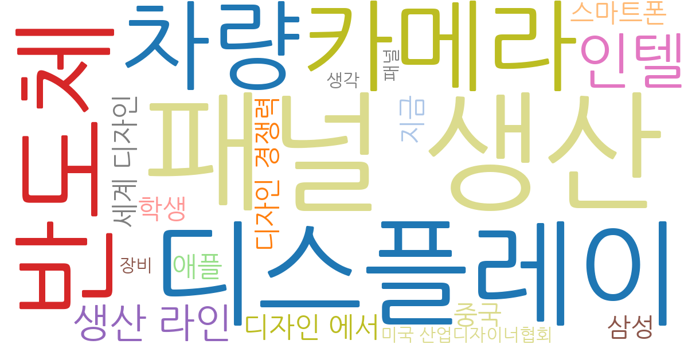
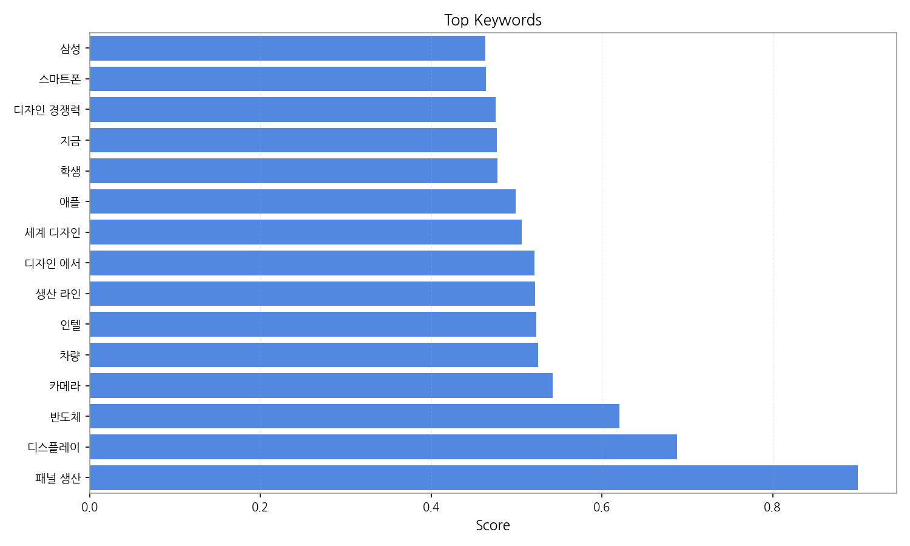
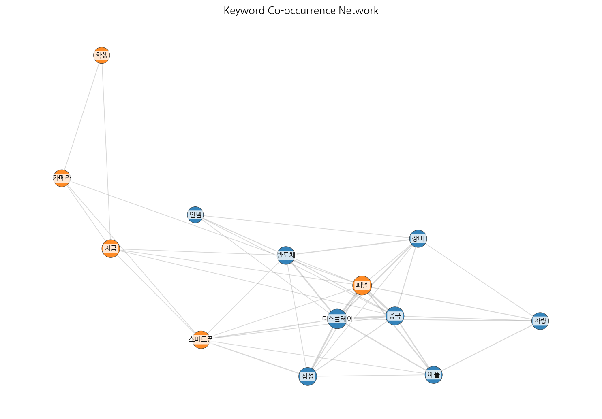
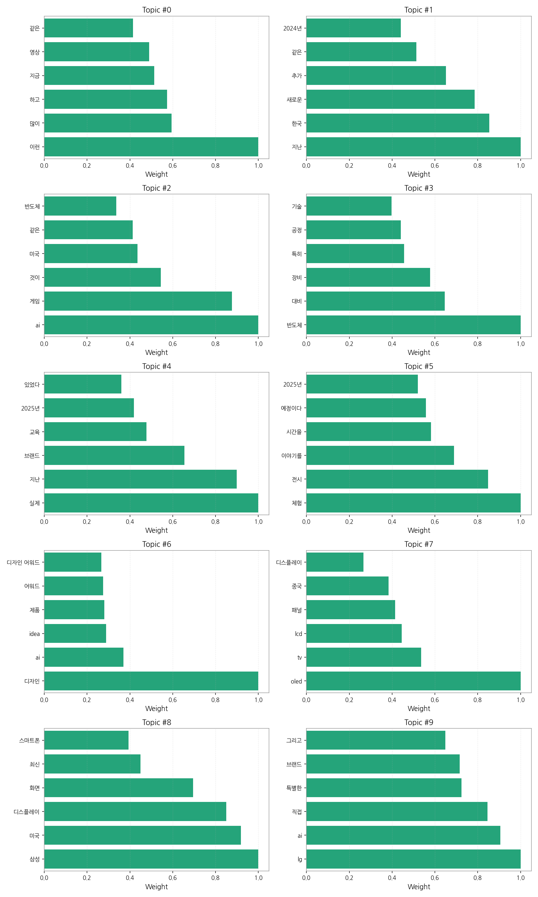
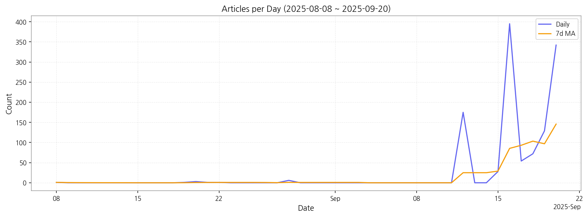

# Weekly/New Biz Report (2025-09-20)

## Executive Summary

- 이번 기간 핵심 토픽과 키워드, 주요 시사점을 요약합니다.

1) 상위 토픽을 3개 주제로 묶어 핵심 맥락을 설명하면 다음과 같습니다. 첫째, **첨단 기술 산업 동향**은 AI, 반도체, 디스플레이 기술 발전과 관련된 뉴스를 다룹니다.  AI 게임, 반도체 생산 및 장비, OLED/LCD 기술 등 첨단 기술 분야의 최신 트렌드와 경쟁 상황을 보여줍니다. 둘째, **국내 기업 경쟁력 및 전략**은 삼성, LG 등 국내 대기업의 기술 경쟁력, 미국 시장 진출 전략, 그리고 브랜드 이미지 제고 노력 등을 다룹니다.  특히,  AI 기술 활용 및 새로운 제품 개발에 대한 내용이 주를 이룹니다. 셋째, **미래 기술 전망 및 체험**은 2024년, 2025년 등 미래 시장 전망과 관련된 뉴스와  새로운 기술 체험 및 전시 관련 소식을 다룹니다.  미래 기술에 대한 기대감과 함께 관련 이벤트 및 전시회 정보를 제공합니다.

2) 최근 변화/스파이크를 짚어보면, 2025년 9월 12일부터 9월 20일 사이에 기사 수가 급증했습니다. 특히 9월 16일에는 395건의 기사가 발생하여 압도적인 스파이크를 보였는데, 이는 특정 기술 관련 대규모 행사 또는 발표가 있었음을 시사합니다.

3) 실무 인사이트 3가지:

* **9월 16일 기사 분석:** 9월 16일 급증한 기사들을 분석하여 어떤 이벤트 또는 발표가 있었는지 파악하고, 그 내용이 시장에 미치는 영향을 예측합니다.  관련 키워드를 중심으로 심층 분석을 진행하여 보고서를 작성합니다.
* **경쟁사 모니터링 강화:** 삼성, LG 등 국내 기업들의 AI, 반도체, 디스플레이 분야 기술 개발 및 시장 진출 전략을 면밀히 모니터링하고, 경쟁 우위를 확보하기 위한 전략을 수립합니다.  주요 경쟁사의 뉴스 및 보고서를 지속적으로 분석합니다.
* **미래 기술 트렌드 예측:** 2024년, 2025년 미래 기술 전망 관련 뉴스를 분석하여,  향후 기술 개발 방향 및 시장 변화를 예측하고,  선제적으로 대응할 수 있는 전략을 마련합니다.  미래 기술 전문가의 의견을 수렴하고, 시장 조사 자료를 활용합니다.

## Key Metrics

- 기간: 2025-08-08 ~ 2025-09-20
- 총 기사 수: 1,208
- 문서 수: N/A
- 키워드 수(상위): 15
- 토픽 수: 10
- 시계열 데이터 일자 수: 13

## Top Keywords

| Rank | Keyword | Score |
|---:|---|---:|
| 1 | 패널 생산 | 0.900 |
| 2 | 디스플레이 | 0.688 |
| 3 | 반도체 | 0.621 |
| 4 | 카메라 | 0.543 |
| 5 | 차량 | 0.525 |
| 6 | 인텔 | 0.523 |
| 7 | 생산 라인 | 0.521 |
| 8 | 디자인 에서 | 0.521 |
| 9 | 세계 디자인 | 0.506 |
| 10 | 애플 | 0.499 |
| 11 | 학생 | 0.477 |
| 12 | 지금 | 0.477 |
| 13 | 디자인 경쟁력 | 0.475 |
| 14 | 스마트폰 | 0.464 |
| 15 | 삼성 | 0.464 |

## Topics

- Topic #0: 이런, 많이, 하고, 지금, 영상, 같은
- Topic #1: 지난, 한국, 새로운, 추가, 같은, 2024년
- Topic #2: ai, 게임, 것이, 미국, 같은, 반도체
- Topic #3: 반도체, 대비, 장비, 특히, 공정, 기술
- Topic #4: 실제, 지난, 브랜드, 교육, 2025년, 있었다
- Topic #5: 체험, 전시, 이야기를, 시간을, 예정이다, 2025년
- Topic #6: 디자인, ai, idea, 제품, 어워드, 디자인 어워드
- Topic #7: oled, tv, lcd, 패널, 중국, 디스플레이
- Topic #8: 삼성, 미국, 디스플레이, 화면, 최신, 스마트폰
- Topic #9: lg, ai, 직접, 특별한, 브랜드, 그리고

## Trend

- 최근 14~30일 기사 수 추세와 7일 이동평균선을 제공합니다.

## Insights

1) 상위 토픽을 3개 주제로 묶어 핵심 맥락을 설명하면 다음과 같습니다. 첫째, **첨단 기술 산업 동향**은 AI, 반도체, 디스플레이 기술 발전과 관련된 뉴스를 다룹니다.  AI 게임, 반도체 생산 및 장비, OLED/LCD 기술 등 첨단 기술 분야의 최신 트렌드와 경쟁 상황을 보여줍니다. 둘째, **국내 기업 경쟁력 및 전략**은 삼성, LG 등 국내 대기업의 기술 경쟁력, 미국 시장 진출 전략, 그리고 브랜드 이미지 제고 노력 등을 다룹니다.  특히,  AI 기술 활용 및 새로운 제품 개발에 대한 내용이 주를 이룹니다. 셋째, **미래 기술 전망 및 체험**은 2024년, 2025년 등 미래 시장 전망과 관련된 뉴스와  새로운 기술 체험 및 전시 관련 소식을 다룹니다.  미래 기술에 대한 기대감과 함께 관련 이벤트 및 전시회 정보를 제공합니다.

2) 최근 변화/스파이크를 짚어보면, 2025년 9월 12일부터 9월 20일 사이에 기사 수가 급증했습니다. 특히 9월 16일에는 395건의 기사가 발생하여 압도적인 스파이크를 보였는데, 이는 특정 기술 관련 대규모 행사 또는 발표가 있었음을 시사합니다.

3) 실무 인사이트 3가지:

* **9월 16일 기사 분석:** 9월 16일 급증한 기사들을 분석하여 어떤 이벤트 또는 발표가 있었는지 파악하고, 그 내용이 시장에 미치는 영향을 예측합니다.  관련 키워드를 중심으로 심층 분석을 진행하여 보고서를 작성합니다.
* **경쟁사 모니터링 강화:** 삼성, LG 등 국내 기업들의 AI, 반도체, 디스플레이 분야 기술 개발 및 시장 진출 전략을 면밀히 모니터링하고, 경쟁 우위를 확보하기 위한 전략을 수립합니다.  주요 경쟁사의 뉴스 및 보고서를 지속적으로 분석합니다.
* **미래 기술 트렌드 예측:** 2024년, 2025년 미래 기술 전망 관련 뉴스를 분석하여,  향후 기술 개발 방향 및 시장 변화를 예측하고,  선제적으로 대응할 수 있는 전략을 마련합니다.  미래 기술 전문가의 의견을 수렴하고, 시장 조사 자료를 활용합니다.

## Opportunities (Top 5)

| Idea | Target | Value Prop | Score |
|---|---|---|---:|
| 디스플레이 패널 생산 라인 최적화 플랫폼 | KR 전자 제조사(LG디스플레이, 삼성디스플레이 등) / 생산 관리 부서 / 대기업 규모 | AI 기반 예측 분석 및 실시간 모니터링을 통해 생산 라인의 효율을 최대 15% 향상시키고 불량률을 5% 감소시킵니다.  경쟁사 대비 차별화된 AI 알고리즘을 통해 정확도 높은 예측 및 분석을 제공합니다. | 4.50 |
| 디스플레이 소재 조달 파트너십 프로그램 | KR 디스플레이 제조사 / 구매/조달 부서 / 대기업 규모 | 다양한 디스플레이 소재 공급업체와의 파트너십을 통해 안정적인 소재 공급과 가격 경쟁력을 확보할 수 있도록 지원합니다.  경쟁사 대비 폭넓은 네트워크와 전문적인 소싱 역량을 보유하고 있습니다.  9월 16일 대규모 기술 행사에서 발표된 새로운 소재 정보를 바탕으로 공급망을 확보할 수 있습니다. | 4.20 |
| 차량용 디스플레이 품질 관리 서비스 | EU 자동차 부품 제조사 / 품질 관리 부서 / 중견·중소기업 규모 | 다양한 환경 조건에서의 품질 검증 및 내구성 테스트를 제공하여 불량률을 최소화하고, 제품 신뢰도를 향상시킵니다. 경쟁사 대비 차별화된 자동화된 검사 시스템을 통해 검사 시간을 단축합니다. | 4.00 |
| B2B 디스플레이 사이니지 플랫폼 | JP 소매업체, 프랜차이즈 본사 / 마케팅/운영 부서 / 중견·대기업 규모 | 클라우드 기반의 원격 관리 시스템과 다양한 콘텐츠 제작 도구를 제공하여 사이니지 운영 및 관리의 효율성을 높입니다. 경쟁사 대비 직관적인 사용자 인터페이스와 다양한 콘텐츠 템플릿을 제공합니다. | 3.80 |
| AI 기반 디스플레이 시장 예측 분석 서비스 | EU 디스플레이 제조사 및 투자사 / 시장 분석 부서 / 대기업 및 투자사 규모 | AI 기반 시장 분석 및 예측 모델을 통해 정확한 시장 수요 예측 및 경쟁사 분석을 제공합니다. 경쟁사 대비 정교한 AI 알고리즘과 방대한 데이터베이스를 활용합니다. | 3.50 |

## Appendix

- 데이터: keywords.json, topics.json, trend_timeseries.json, trend_insights.json, biz_opportunities.json