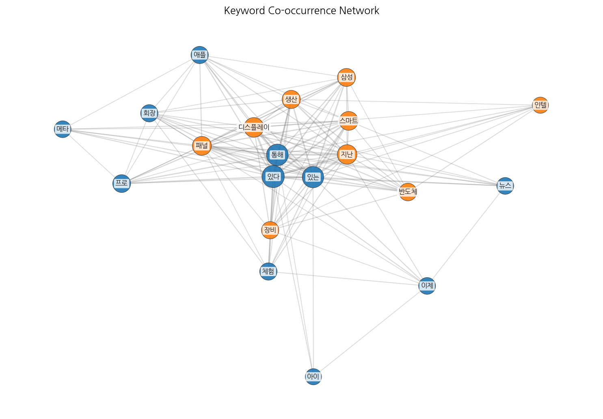
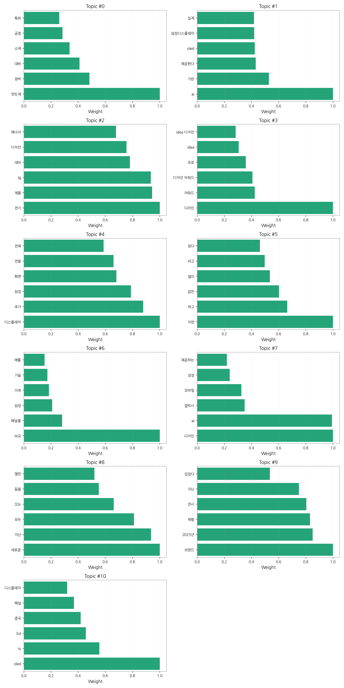

# Weekly/New Biz Report (2025-09-20)

## Executive Summary

- 이번 기간 핵심 토픽과 키워드, 주요 시사점을 요약합니다.

1) 상위 토픽을 3개 주제로 묶어 핵심 맥락을 설명하면 다음과 같습니다. 첫째, **반도체 및 디스플레이 산업의 기술 경쟁**입니다.  반도체 장비, 소재, AI 기반 공정 기술, OLED 및 LCD 디스플레이 기술 향상 등에 대한 기사가 다수를 차지하며, 삼성, LG 등 주요 기업의 기술 개발 및 경쟁이 주요 내용입니다. 둘째, **디자인 및 제품 경쟁력 강화**입니다.  전기 제품 디자인, 디자인 어워드 수상 소식, 그리고 제품 디자인 및 AI 기반 디자인 트렌드를 다루는 기사들이 이에 해당하며, 기업들의 디자인 경쟁력 강화 노력이 주목받고 있습니다. 셋째, **새로운 제품 출시 및 브랜드 마케팅**입니다.  새로운 제품 출시 소식, 브랜드 체험 전시, 온라인 서비스 출시 등의 기사들이 이 주제에 속하며, 기업들의 신제품 출시 전략과 브랜드 이미지 제고 노력이 보입니다.

2) 최근 변화/스파이크를 짚어보면, 2025년 9월 16일 기사 수가 급증(395건)한 것을 확인할 수 있습니다. 이는 특정 제품 출시, 주요 행사 개최 또는 중요한 산업 뉴스 발표 등의 이벤트와 관련이 있을 것으로 추정됩니다.  이후 9월 12일부터 20일까지 기사 수가 급격히 증가했다가 감소하는 추세를 보이는데, 이는 특정 시점에 집중된 이슈가 있었음을 시사합니다.

3) 실무 인사이트 3가지:

* **9월 16일 기사 급증 원인 분석:** 9월 16일 기사 급증의 원인을 분석하여 향후 유사한 이벤트 발생 시 대응 전략을 수립합니다.  관련 뉴스 및 보도자료를 분석하고,  소셜 미디어 트렌드를 모니터링하여 원인을 파악합니다.
* **주요 키워드 모니터링 시스템 구축:**  "반도체", "AI", "디자인", "디스플레이", "삼성", "LG" 등 주요 키워드를 실시간으로 모니터링하는 시스템을 구축하여 시장 트렌드 변화를 빠르게 감지하고 대응합니다.  뉴스 기사, 블로그, 소셜 미디어 등 다양한 채널의 데이터를 수집하고 분석하는 시스템을 활용합니다.
* **경쟁사 동향 분석 및 전략 수립:**  삼성, LG 등 경쟁사의 기술 개발, 제품 출시, 마케팅 전략 등을 분석하여 자사의 경쟁력 강화 방안을 모색합니다.  경쟁사의 뉴스 기사, 투자 정보, 특허 정보 등을 분석하고, SWOT 분석을 통해 자사의 강점과 약점을 파악하여 전략을 수립합니다.

## Key Metrics

- 기간: 2025-08-08 ~ 2025-09-20
- 총 기사 수: 1,262
- 문서 수: N/A
- 키워드 수(상위): 15
- 토픽 수: 11
- 시계열 데이터 일자 수: 13

## Top Keywords

| Rank | Keyword | Score |
|---:|---|---:|
| 1 | 있다 | 0.583 |
| 2 | 패널 | 0.399 |
| 3 | 디스플레이 | 0.352 |
| 4 | 애플 | 0.323 |
| 5 | 반도체 | 0.321 |
| 6 | 아이 | 0.316 |
| 7 | 이제 | 0.298 |
| 8 | 통해 | 0.293 |
| 9 | 삼성 | 0.281 |
| 10 | 프로 | 0.263 |
| 11 | 인텔 | 0.257 |
| 12 | 있는 | 0.256 |
| 13 | 지난 | 0.238 |
| 14 | 스마트 | 0.227 |
| 15 | 생산 | 0.226 |

## Topics

- Topic #0: 반도체, 장비, 대비, 소재, 공정, 특히
- Topic #1: ai, 기반, 제공한다, oled, 삼성디스플레이, 실제
- Topic #2: 전기, 제품, lg, 대비, 디자인, 에너지
- Topic #3: 디자인, 어워드, 디자인 어워드, 프로, idea, idea 디자인
- Topic #4: 디스플레이, 추가, 삼성, 화면, 전용, 전체
- Topic #5: 이런, 하고, 같은, 많이, 라고, 된다
- Topic #6: 미국, 패널을, 삼성, 가격, 기술, 애플
- Topic #7: 디자인, ai, 갤럭시, 모바일, 삼성, 제공하는
- Topic #8: 새로운, 지난, 모두, 오는, 등을, 열린
- Topic #9: 브랜드, 2025년, 체험, 전시, 지난, 있었다
- Topic #10: oled, tv, lcd, 중국, 패널, 디스플레이

## Trend

- 최근 14~30일 기사 수 추세와 7일 이동평균선을 제공합니다.

## Insights

1) 상위 토픽을 3개 주제로 묶어 핵심 맥락을 설명하면 다음과 같습니다. 첫째, **반도체 및 디스플레이 산업의 기술 경쟁**입니다.  반도체 장비, 소재, AI 기반 공정 기술, OLED 및 LCD 디스플레이 기술 향상 등에 대한 기사가 다수를 차지하며, 삼성, LG 등 주요 기업의 기술 개발 및 경쟁이 주요 내용입니다. 둘째, **디자인 및 제품 경쟁력 강화**입니다.  전기 제품 디자인, 디자인 어워드 수상 소식, 그리고 제품 디자인 및 AI 기반 디자인 트렌드를 다루는 기사들이 이에 해당하며, 기업들의 디자인 경쟁력 강화 노력이 주목받고 있습니다. 셋째, **새로운 제품 출시 및 브랜드 마케팅**입니다.  새로운 제품 출시 소식, 브랜드 체험 전시, 온라인 서비스 출시 등의 기사들이 이 주제에 속하며, 기업들의 신제품 출시 전략과 브랜드 이미지 제고 노력이 보입니다.

2) 최근 변화/스파이크를 짚어보면, 2025년 9월 16일 기사 수가 급증(395건)한 것을 확인할 수 있습니다. 이는 특정 제품 출시, 주요 행사 개최 또는 중요한 산업 뉴스 발표 등의 이벤트와 관련이 있을 것으로 추정됩니다.  이후 9월 12일부터 20일까지 기사 수가 급격히 증가했다가 감소하는 추세를 보이는데, 이는 특정 시점에 집중된 이슈가 있었음을 시사합니다.

3) 실무 인사이트 3가지:

* **9월 16일 기사 급증 원인 분석:** 9월 16일 기사 급증의 원인을 분석하여 향후 유사한 이벤트 발생 시 대응 전략을 수립합니다.  관련 뉴스 및 보도자료를 분석하고,  소셜 미디어 트렌드를 모니터링하여 원인을 파악합니다.
* **주요 키워드 모니터링 시스템 구축:**  "반도체", "AI", "디자인", "디스플레이", "삼성", "LG" 등 주요 키워드를 실시간으로 모니터링하는 시스템을 구축하여 시장 트렌드 변화를 빠르게 감지하고 대응합니다.  뉴스 기사, 블로그, 소셜 미디어 등 다양한 채널의 데이터를 수집하고 분석하는 시스템을 활용합니다.
* **경쟁사 동향 분석 및 전략 수립:**  삼성, LG 등 경쟁사의 기술 개발, 제품 출시, 마케팅 전략 등을 분석하여 자사의 경쟁력 강화 방안을 모색합니다.  경쟁사의 뉴스 기사, 투자 정보, 특허 정보 등을 분석하고, SWOT 분석을 통해 자사의 강점과 약점을 파악하여 전략을 수립합니다.

## Opportunities (Top 5)

| Idea | Target | Value Prop | Score |
|---|---|---|---:|
| 디스플레이 제조사 대상 AI 기반 공정 최적화 플랫폼 | KR/EU 디스플레이 제조사(삼성디스플레이, LG디스플레이 등), 중견/대기업 규모 | AI 기반 머신러닝 알고리즘을 통해 실시간 공정 데이터 분석 및 예측으로 불량률 감소, 생산성 향상, 원가 절감을 제공합니다. 경쟁사 대비 차별화된 점은 실시간 예측 기능과 다양한 디스플레이 패널 유형에 대한 적용 가능성입니다. | 4.50 |
| 디스플레이 패널 품질 검사 자동화 시스템 | EU 디스플레이 제조사, 중견/대기업 규모 | AI 기반 이미지 인식 기술을 활용하여 디스플레이 패널의 품질을 자동으로 검사하는 시스템을 제공하여 검사 시간 단축, 비용 절감, 검사 정확도 향상을 지원합니다. 경쟁사 대비 차별화된 점은 고해상도 이미지 분석과 다양한 결함 유형에 대한 높은 검출 정확도입니다. | 4.20 |
| 모빌리티용 투명 디스플레이 부품 조달 플랫폼 | JP 모빌리티 기업(자동차 부품 제조사, 완성차 업체), 중견/대기업 규모 | 다양한 투명 디스플레이 부품(센서, 필름, 제어기 등)을 한 곳에서 조달할 수 있는 플랫폼을 제공하여 원활한 공급망 관리와 가격 경쟁력을 확보할 수 있도록 지원합니다. 경쟁사 대비 차별화된 점은 모빌리티 특화 부품에 대한 전문성과 신뢰성 있는 공급망 확보입니다. | 4.00 |
| AI 기반 사이니지 콘텐츠 제작 및 배포 서비스 | KR 소매업, 프랜차이즈, 광고 대행사, 중소/중견기업 규모 | AI 기반 자동 콘텐츠 생성 및 맞춤형 배포 서비스를 제공하여 콘텐츠 제작 시간 단축, 비용 절감, 운영 효율 증대를 지원합니다. 경쟁사 대비 차별화된 점은 AI 기반의 자동화된 콘텐츠 생성 기능과 데이터 기반의 효과 측정 시스템입니다. | 3.80 |
| B2B 디스플레이 디자인 트렌드 분석 및 예측 서비스 | KR/JP 전자 제품 제조사, 디자인 회사, 중소/중견기업 규모 | 빅데이터 분석 및 AI 기술을 활용하여 디스플레이 디자인 트렌드를 분석하고 미래를 예측하는 서비스를 제공합니다. 경쟁사 대비 차별화된 점은 정확한 예측 모델과 시각화된 분석 결과 제공입니다. | 3.50 |

## Appendix

- 데이터: keywords.json, topics.json, trend_timeseries.json, trend_insights.json, biz_opportunities.json