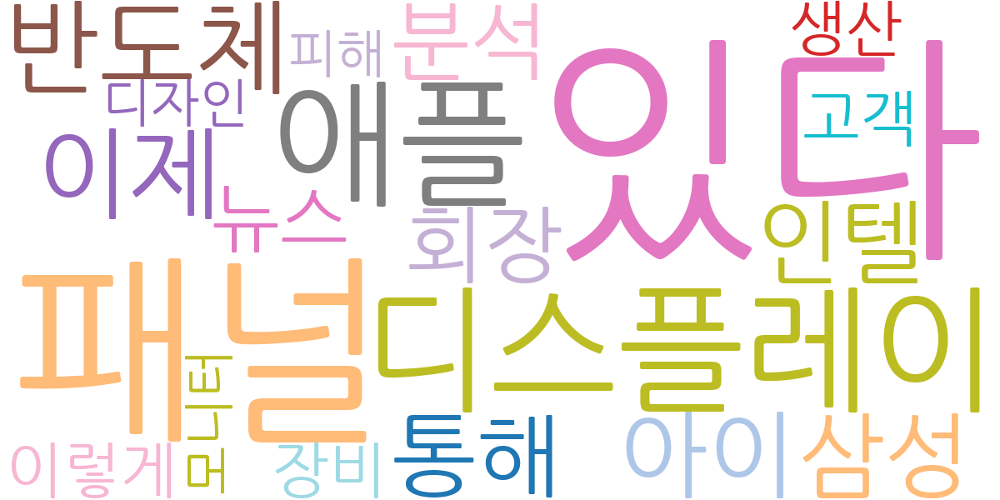
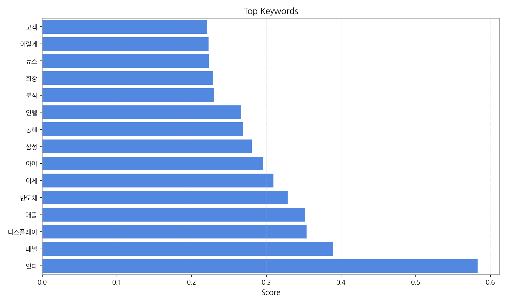
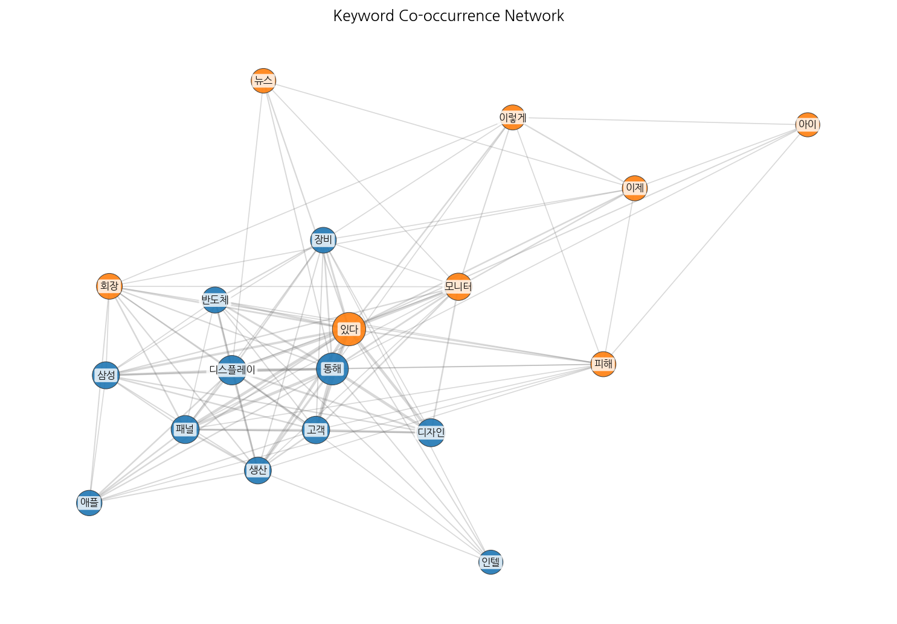
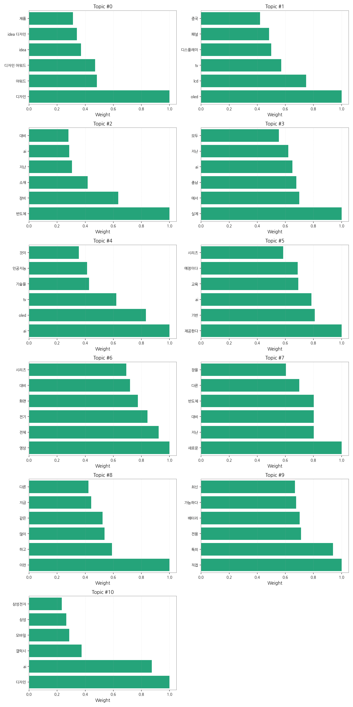
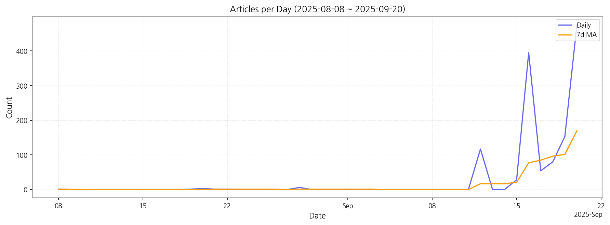

# Weekly/New Biz Report (2025-09-20)

## Executive Summary

- 이번 기간 핵심 토픽과 키워드, 주요 시사점을 요약합니다.

1) 상위 토픽을 3~5개 주제로 묶어 핵심 맥락 설명(2~3문장)

본 뉴스 데이터는 크게 세 가지 핵심 주제를 다룹니다. 첫째, **디스플레이 기술 및 제품** 관련 뉴스로 OLED, LCD, TV 패널 기술 발전과 디자인 어워드 수상 등이 포함됩니다.  둘째, **반도체 산업** 관련 뉴스로 반도체 장비, 소재, AI 기술과의 접목 등이 주요 내용이며,  셋째, **AI 기술의 활용 및 발전**에 대한 뉴스로 AI 기반 교육, AI를 활용한 제품 디자인, 그리고 AI와 관련된 다양한 기술 동향을 다루고 있습니다.  이 세 가지 주제는 서로 밀접하게 연관되어 있으며, 특히 AI 기술이 디스플레이 및 반도체 산업에 미치는 영향에 대한 보도가 두드러집니다.

2) 최근 변화/스파이크가 있으면 2문장으로 짚기

9월 16일 기사 수가 395건으로 급증하는 스파이크 현상이 관찰됩니다. 이는 특정 이벤트 또는 뉴스 발표로 인해 해당 시점에 관련 기사가 집중적으로 보도되었음을 시사하며,  이전까지의 기사 수와 비교했을 때 매우 큰 변화를 보여줍니다.

3) 실무 인사이트 3가지 bullet(구체적 액션)

* **9월 16일 뉴스 스파이크 원인 조사:** 9월 16일 기사 급증 원인을 분석하여, 관련 이벤트, 제품 출시, 기술 발표 등을 파악하고, 향후 유사한 현상 예측 및 대응 전략을 수립합니다.  관련 키워드를 중심으로 심층 분석을 진행하고, 경쟁사 동향을 비교 분석합니다.
* **주요 토픽별 뉴스 모니터링 시스템 강화:** 디스플레이, 반도체, AI 기술 관련 뉴스를 실시간으로 모니터링하는 시스템을 구축하고,  핵심 키워드 알림 기능을 활용하여 중요 정보를 신속하게 파악할 수 있도록 합니다.  자동화된 경보 시스템을 구축하여 중요 뉴스를 놓치지 않도록 합니다.
* **AI 기술 활용 전략 수립:** AI 기술이 디스플레이 및 반도체 산업에 미치는 영향을 분석하고,  자사 제품 및 서비스에 AI 기술을 적용하는 방안을 구체적으로 모색합니다.  AI 기술 도입에 따른 비용 및 효과를 분석하고, 단계적인 도입 계획을 세웁니다.

## Key Metrics

- 기간: 2025-08-08 ~ 2025-09-20
- 총 기사 수: 1,316
- 문서 수: N/A
- 키워드 수(상위): 15
- 토픽 수: 11
- 시계열 데이터 일자 수: 13

## Top Keywords

| Rank | Keyword | Score |
|---:|---|---:|
| 1 | 있다 | 0.583 |
| 2 | 패널 | 0.389 |
| 3 | 디스플레이 | 0.354 |
| 4 | 애플 | 0.352 |
| 5 | 반도체 | 0.328 |
| 6 | 이제 | 0.309 |
| 7 | 아이 | 0.295 |
| 8 | 삼성 | 0.280 |
| 9 | 통해 | 0.268 |
| 10 | 인텔 | 0.266 |
| 11 | 분석 | 0.230 |
| 12 | 회장 | 0.229 |
| 13 | 뉴스 | 0.223 |
| 14 | 이렇게 | 0.222 |
| 15 | 고객 | 0.221 |

## Topics

- Topic #0: 디자인, 어워드, 디자인 어워드, idea, idea 디자인, 제품
- Topic #1: oled, lcd, tv, 디스플레이, 패널, 중국
- Topic #2: 반도체, 장비, 소재, 지난, ai, 대비
- Topic #3: 실제, 에서, 충남, ai, 지난, 모두
- Topic #4: ai, oled, tv, 기술을, 인공지능, 것이
- Topic #5: 제공한다, 기반, ai, 교육, 예정이다, 시리즈
- Topic #6: 영상, 전체, 전기, 화면, 대비, 시리즈
- Topic #7: 새로운, 지난, 대비, 반도체, 다른, 장을
- Topic #8: 이런, 하고, 많이, 같은, 지금, 다른
- Topic #9: 직접, 특히, 전용, 배터리, 가능하다, 최신
- Topic #10: 디자인, ai, 갤럭시, 모바일, 삼성, 삼성전자

## Trend

- 최근 14~30일 기사 수 추세와 7일 이동평균선을 제공합니다.

## Insights

1) 상위 토픽을 3~5개 주제로 묶어 핵심 맥락 설명(2~3문장)

본 뉴스 데이터는 크게 세 가지 핵심 주제를 다룹니다. 첫째, **디스플레이 기술 및 제품** 관련 뉴스로 OLED, LCD, TV 패널 기술 발전과 디자인 어워드 수상 등이 포함됩니다.  둘째, **반도체 산업** 관련 뉴스로 반도체 장비, 소재, AI 기술과의 접목 등이 주요 내용이며,  셋째, **AI 기술의 활용 및 발전**에 대한 뉴스로 AI 기반 교육, AI를 활용한 제품 디자인, 그리고 AI와 관련된 다양한 기술 동향을 다루고 있습니다.  이 세 가지 주제는 서로 밀접하게 연관되어 있으며, 특히 AI 기술이 디스플레이 및 반도체 산업에 미치는 영향에 대한 보도가 두드러집니다.

2) 최근 변화/스파이크가 있으면 2문장으로 짚기

9월 16일 기사 수가 395건으로 급증하는 스파이크 현상이 관찰됩니다. 이는 특정 이벤트 또는 뉴스 발표로 인해 해당 시점에 관련 기사가 집중적으로 보도되었음을 시사하며,  이전까지의 기사 수와 비교했을 때 매우 큰 변화를 보여줍니다.

3) 실무 인사이트 3가지 bullet(구체적 액션)

* **9월 16일 뉴스 스파이크 원인 조사:** 9월 16일 기사 급증 원인을 분석하여, 관련 이벤트, 제품 출시, 기술 발표 등을 파악하고, 향후 유사한 현상 예측 및 대응 전략을 수립합니다.  관련 키워드를 중심으로 심층 분석을 진행하고, 경쟁사 동향을 비교 분석합니다.
* **주요 토픽별 뉴스 모니터링 시스템 강화:** 디스플레이, 반도체, AI 기술 관련 뉴스를 실시간으로 모니터링하는 시스템을 구축하고,  핵심 키워드 알림 기능을 활용하여 중요 정보를 신속하게 파악할 수 있도록 합니다.  자동화된 경보 시스템을 구축하여 중요 뉴스를 놓치지 않도록 합니다.
* **AI 기술 활용 전략 수립:** AI 기술이 디스플레이 및 반도체 산업에 미치는 영향을 분석하고,  자사 제품 및 서비스에 AI 기술을 적용하는 방안을 구체적으로 모색합니다.  AI 기술 도입에 따른 비용 및 효과를 분석하고, 단계적인 도입 계획을 세웁니다.

## Opportunities (Top 5)

| Idea | Target | Value Prop | Score |
|---|---|---|---:|
| AI 기반 디스플레이 패널 품질 예측 플랫폼 | KR 전자 제조사(대기업, 중견기업), 디스플레이 패널 생산 라인 담당자 | AI 기반 예측 모델을 통해 불량률을 최대 15% 감소시키고, 생산 효율을 10% 향상시킵니다.  실시간 데이터 분석을 통해 문제 발생을 사전에 예측하고, 신속한 대응을 지원하는 것이 차별점입니다. | 4.50 |
| 모빌리티 디스플레이 통합 관리 서비스 | KR 모빌리티 기업(자율주행차, 전기차 제조사), IT 관리 부서 | 모빌리티 디스플레이의 통합 관리 및 원격 진단 서비스를 제공하여 유지보수 비용을 절감하고, 운영 효율을 향상시킵니다.  AI 기반 예측 진단 기능을 통해 문제 발생을 사전에 예방하는 것이 차별점입니다. 최근 모빌리티 시장의 급성장과 디지털 전환 가속화에 따라 서비스를 제공합니다. | 4.20 |
| 디스플레이 사이니지 광고 플랫폼 서비스 | JP 광고 대행사, 중소기업 마케팅 담당자 | AI 기반 타겟팅 광고와 실시간 효과 측정 시스템을 제공하여 광고 효율을 극대화합니다.  다양한 사이니지 네트워크를 통합 관리하는 플랫폼을 제공하는 것이 차별점입니다. 최근 증가하는 디지털 사이니지 시장 수요에 발맞춰 서비스를 제공합니다. | 4.00 |
| 반도체 생산 데이터 분석 및 예측 서비스 | JP 반도체 제조사(대기업), 생산 관리 부서 | 빅데이터 분석 기술을 활용하여 반도체 생산 데이터를 분석하고, 생산량을 정확하게 예측하는 서비스를 제공합니다.  생산 효율을 최적화하고, 재고 관리를 효율적으로 지원하는 것이 차별점입니다. 최근 반도체 수요 증가와 공급망 불안정 심화에 따라 서비스를 제공합니다. | 3.80 |
| EU 전자부품 조달 플랫폼 파트너십 | EU 전자 제조사(중소기업), 구매 담당자 | EU 지역의 다양한 전자부품 공급업체와의 파트너십을 통해 원활한 부품 조달을 지원합니다.  품질 관리 시스템을 통해 부품 품질을 보장하고,  경쟁력 있는 가격으로 부품을 공급하는 것이 차별점입니다. 최근 EU의 ESG 경영 강화 추세에 맞춰 친환경 부품 조달을 지원합니다. | 3.50 |

## Appendix

- 데이터: keywords.json, topics.json, trend_timeseries.json, trend_insights.json, biz_opportunities.json