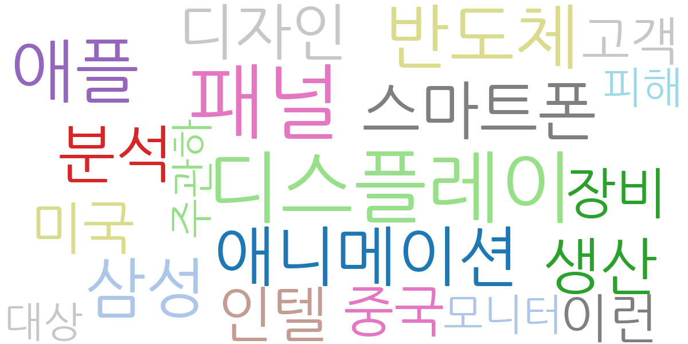
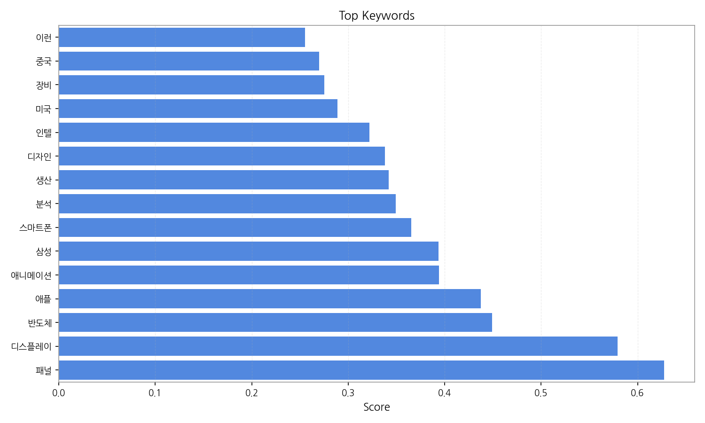
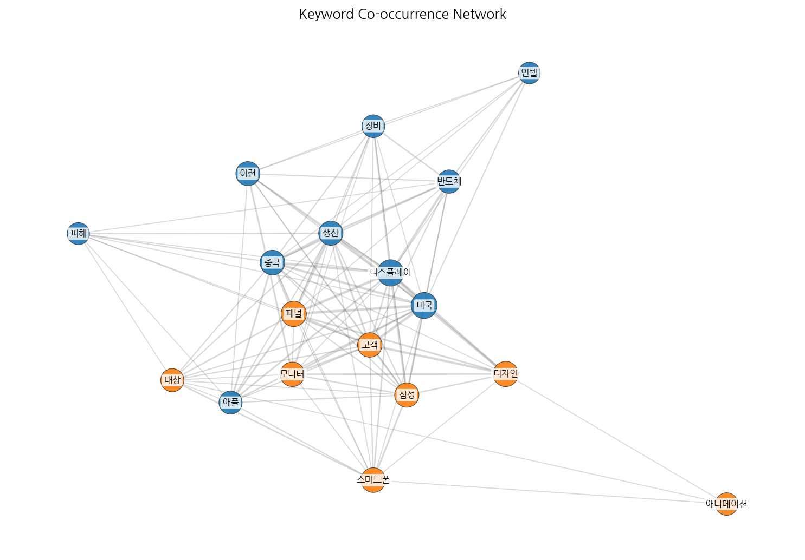
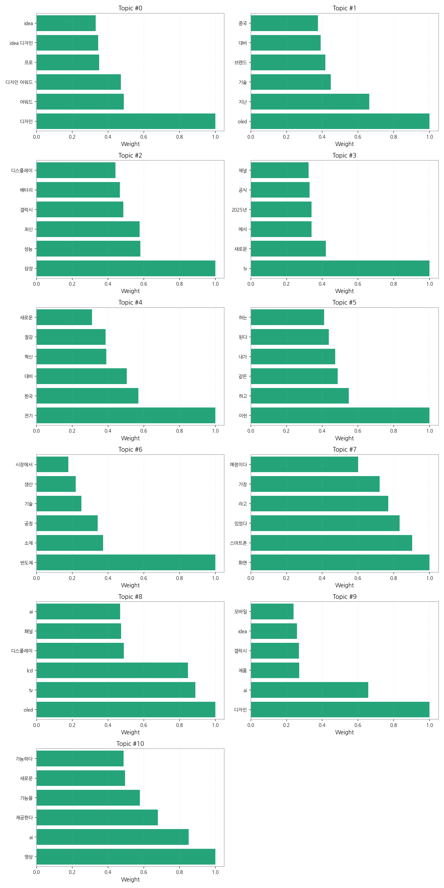
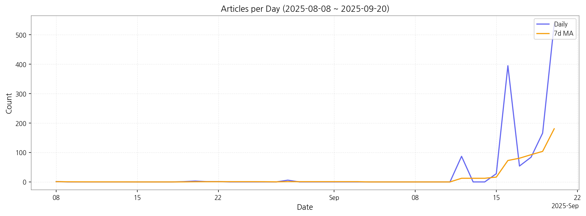

# Weekly/New Biz Report (2025-09-20)

## Executive Summary

- 이번 기간 핵심 토픽과 키워드, 주요 시사점을 요약합니다.

1) 상위 토픽을 3개 주제로 묶어 핵심 맥락을 설명하면 다음과 같습니다. 첫째, **삼성전자의 최신 제품 및 기술**에 대한 뉴스가 주를 이룹니다.  갤럭시 시리즈의 성능, OLED 및 LCD 디스플레이 기술, 그리고 새로운 TV 모델 출시 등 삼성전자의 다양한 제품 라인업과 기술적 혁신에 대한 내용이 주요하게 다뤄지고 있습니다. 둘째, **디자인 및 AI 기술** 관련 뉴스가 두드러집니다.  제품 디자인 어워드 수상 소식과 AI 기반의 영상 처리 기술, 디자인에 AI를 접목한 새로운 제품 개발 등 디자인과 AI 기술의 융합이 중요한 화두임을 보여줍니다. 마지막으로, **전기차 및 에너지 효율** 관련 뉴스도 상당 부분을 차지합니다.  전기차 관련 기술 혁신과 에너지 절감 기술에 대한 보도를 통해 친환경 기술 및 에너지 효율 향상에 대한 사회적 관심을 반영하고 있습니다.

2) 최근 변화/스파이크를 살펴보면, 9월 16일 기사 수가 급증(395건)한 것을 확인할 수 있습니다. 이는 특정 제품 출시 발표 또는 중요한 기술 발표와 같은 주요 이벤트가 있었음을 시사합니다.  이후에도 9월 중순부터 9월 말까지 기사 수가 꾸준히 높게 유지되고 있어 해당 이벤트의 영향이 지속되고 있음을 알 수 있습니다.

3) 실무 인사이트 3가지:

* **9월 16일 이벤트 분석:** 9월 16일 기사 급증 원인을 분석하여 향후 마케팅 전략에 반영합니다.  어떤 이벤트가 기사 급증을 야기했는지, 어떤 매체에서 주로 보도되었는지,  긍정적/부정적 여론은 어떠했는지 등을 자세히 분석합니다.
* **주요 키워드 모니터링 강화:**  "OLED", "갤럭시", "AI", "디자인", "전기차" 등 주요 키워드에 대한 실시간 모니터링 시스템을 강화하여 시장 트렌드 변화를 신속하게 파악하고 대응합니다.  소셜 미디어, 뉴스 기사, 온라인 커뮤니티 등 다양한 채널을 통해 모니터링을 수행합니다.
* **콘텐츠 전략 재검토:**  데이터 분석 결과를 바탕으로 콘텐츠 전략을 재검토합니다.  삼성전자 제품 및 기술, 디자인, AI, 전기차 등 주요 주제에 대한 콘텐츠 제작을 강화하고,  소비자 관심도가 높은 주제를 중심으로 콘텐츠를 기획합니다.  또한,  영상 콘텐츠 제작을 확대하여 소비자 참여를 유도합니다.

## Key Metrics

- 기간: 2025-08-08 ~ 2025-09-20
- 총 기사 수: 1,365
- 문서 수: N/A
- 키워드 수(상위): 15
- 토픽 수: 11
- 시계열 데이터 일자 수: 13

## Top Keywords

| Rank | Keyword | Score |
|---:|---|---:|
| 1 | 패널 | 0.628 |
| 2 | 디스플레이 | 0.579 |
| 3 | 반도체 | 0.449 |
| 4 | 애플 | 0.438 |
| 5 | 애니메이션 | 0.394 |
| 6 | 삼성 | 0.394 |
| 7 | 스마트폰 | 0.366 |
| 8 | 분석 | 0.349 |
| 9 | 생산 | 0.342 |
| 10 | 디자인 | 0.338 |
| 11 | 인텔 | 0.322 |
| 12 | 미국 | 0.289 |
| 13 | 장비 | 0.275 |
| 14 | 중국 | 0.270 |
| 15 | 이런 | 0.255 |

## Topics

- Topic #0: 디자인, 어워드, 디자인 어워드, 프로, idea 디자인, idea
- Topic #1: oled, 지난, 기술, 브랜드, 대비, 중국
- Topic #2: 삼성, 성능, 최신, 갤럭시, 배터리, 디스플레이
- Topic #3: tv, 새로운, 에서, 2025년, 공식, 채널
- Topic #4: 전기, 한국, 대비, 혁신, 절감, 새로운
- Topic #5: 이런, 하고, 같은, 내가, 된다, 하는
- Topic #6: 반도체, 소재, 공정, 기술, 생산, 시장에서
- Topic #7: 화면, 스마트폰, 있었다, 라고, 가장, 예정이다
- Topic #8: oled, tv, lcd, 디스플레이, 패널, ai
- Topic #9: 디자인, ai, 제품, 갤럭시, idea, 모바일
- Topic #10: 영상, ai, 제공한다, 기능을, 새로운, 가능하다

## Trend

- 최근 14~30일 기사 수 추세와 7일 이동평균선을 제공합니다.

## Insights

1) 상위 토픽을 3개 주제로 묶어 핵심 맥락을 설명하면 다음과 같습니다. 첫째, **삼성전자의 최신 제품 및 기술**에 대한 뉴스가 주를 이룹니다.  갤럭시 시리즈의 성능, OLED 및 LCD 디스플레이 기술, 그리고 새로운 TV 모델 출시 등 삼성전자의 다양한 제품 라인업과 기술적 혁신에 대한 내용이 주요하게 다뤄지고 있습니다. 둘째, **디자인 및 AI 기술** 관련 뉴스가 두드러집니다.  제품 디자인 어워드 수상 소식과 AI 기반의 영상 처리 기술, 디자인에 AI를 접목한 새로운 제품 개발 등 디자인과 AI 기술의 융합이 중요한 화두임을 보여줍니다. 마지막으로, **전기차 및 에너지 효율** 관련 뉴스도 상당 부분을 차지합니다.  전기차 관련 기술 혁신과 에너지 절감 기술에 대한 보도를 통해 친환경 기술 및 에너지 효율 향상에 대한 사회적 관심을 반영하고 있습니다.

2) 최근 변화/스파이크를 살펴보면, 9월 16일 기사 수가 급증(395건)한 것을 확인할 수 있습니다. 이는 특정 제품 출시 발표 또는 중요한 기술 발표와 같은 주요 이벤트가 있었음을 시사합니다.  이후에도 9월 중순부터 9월 말까지 기사 수가 꾸준히 높게 유지되고 있어 해당 이벤트의 영향이 지속되고 있음을 알 수 있습니다.

3) 실무 인사이트 3가지:

* **9월 16일 이벤트 분석:** 9월 16일 기사 급증 원인을 분석하여 향후 마케팅 전략에 반영합니다.  어떤 이벤트가 기사 급증을 야기했는지, 어떤 매체에서 주로 보도되었는지,  긍정적/부정적 여론은 어떠했는지 등을 자세히 분석합니다.
* **주요 키워드 모니터링 강화:**  "OLED", "갤럭시", "AI", "디자인", "전기차" 등 주요 키워드에 대한 실시간 모니터링 시스템을 강화하여 시장 트렌드 변화를 신속하게 파악하고 대응합니다.  소셜 미디어, 뉴스 기사, 온라인 커뮤니티 등 다양한 채널을 통해 모니터링을 수행합니다.
* **콘텐츠 전략 재검토:**  데이터 분석 결과를 바탕으로 콘텐츠 전략을 재검토합니다.  삼성전자 제품 및 기술, 디자인, AI, 전기차 등 주요 주제에 대한 콘텐츠 제작을 강화하고,  소비자 관심도가 높은 주제를 중심으로 콘텐츠를 기획합니다.  또한,  영상 콘텐츠 제작을 확대하여 소비자 참여를 유도합니다.

## Opportunities (Top 5)

| Idea | Target | Value Prop | Score |
|---|---|---|---:|
| 디스플레이 제조사 대상 AI 기반 생산 효율 관리 플랫폼 | KR 전자 제조업체(디스플레이 패널 생산), 중견/대기업, 생산 관리 부서 | AI 기반 예측 분석으로 불량률 감소 및 생산 효율 향상을 제공합니다.  실시간 데이터 모니터링 및 이상 징후 조기 감지 기능을 통해 문제 발생 전 예방적 조치가 가능합니다.  경쟁사 대비 차별화된 AI 알고리즘을 통해 정확도 높은 예측 및 분석을 제공합니다. | 4.50 |
| B2B 디스플레이 사이니지 맞춤형 디자인 서비스 | JP 중소/중견기업, 마케팅/홍보 부서,  매장 운영 사업자 | AI 기반 디자인 자동 생성 및 전문 디자이너 협업을 통해 기업 맞춤형 사이니지 디자인을 빠르고 저렴하게 제공합니다.  다양한 디자인 템플릿과 브랜드 가이드라인 연동으로 브랜드 일관성을 유지하며,  실시간 디자인 수정 및 피드백을 통해 만족도를 높입니다.  경쟁사 대비 빠른 제작 기간과 합리적인 가격을 제공하는 것이 차별점입니다. | 4.00 |
| 전기차용 디스플레이 부품 조달 플랫폼 | EU 전기차 제조사, 부품 구매 담당자, 대기업 | 다양한 디스플레이 부품 공급업체를 연결하고,  투명한 가격 비교 및 품질 관리 시스템을 제공하는 플랫폼입니다.  실시간 재고 확인 및 주문 관리 기능을 통해 부품 수급 안정성을 확보하고,  AI 기반 부품 추천 기능을 통해 최적의 부품 선택을 지원합니다.  경쟁사 대비 다양한 부품 선택지와 효율적인 조달 시스템을 제공하는 것이 차별점입니다. | 3.80 |
| 디스플레이 산업 데이터 분석 및 예측 서비스 | KR 디스플레이 관련 기업,  시장 분석 담당자,  중소/중견기업 | 다양한 데이터 소스를 활용하여 디스플레이 시장 동향을 분석하고 미래를 예측하는 서비스입니다.  AI 기반 예측 모델을 통해 정확도 높은 시장 예측 및 경쟁사 분석을 제공하며,  맞춤형 시장 분석 보고서를 통해 의사결정을 지원합니다.  경쟁사 대비 정확하고 시의적절한 데이터 분석 및 예측을 제공하는 것이 차별점입니다. | 3.50 |
| 패널 | 기업(B2B) | 패널 도입으로 비용/품질/경험을 개선. | 3.00 |

## Appendix

- 데이터: keywords.json, topics.json, trend_timeseries.json, trend_insights.json, biz_opportunities.json