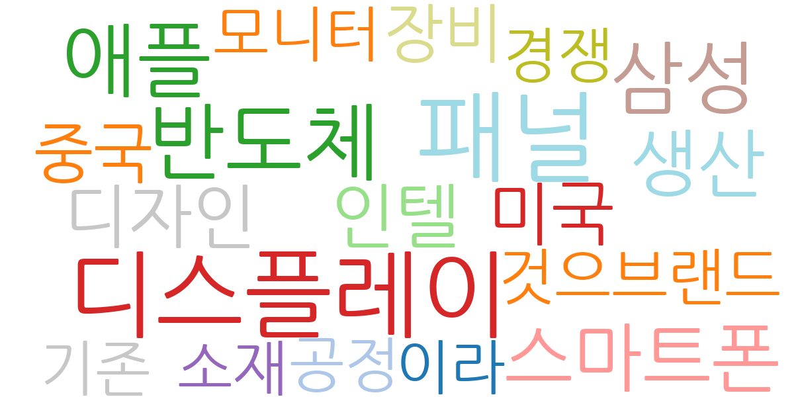
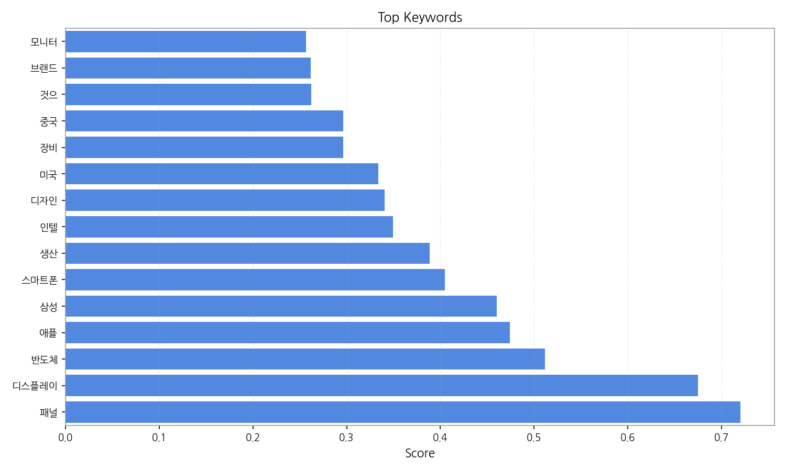
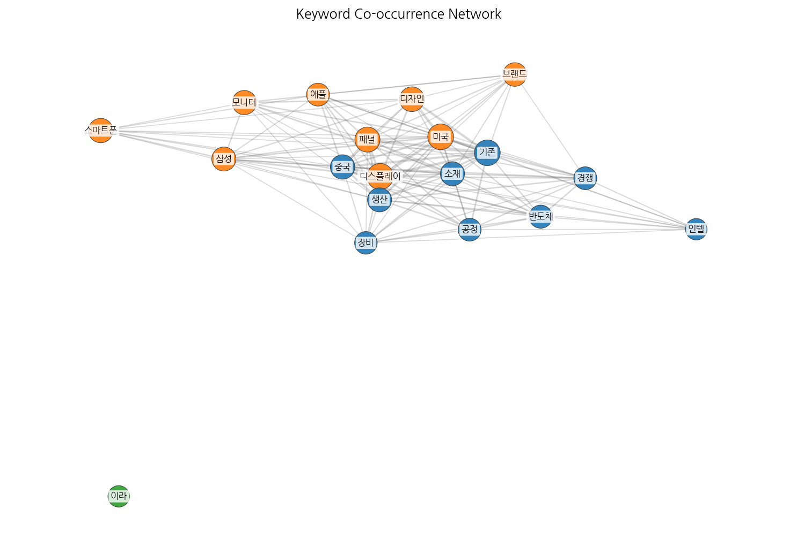
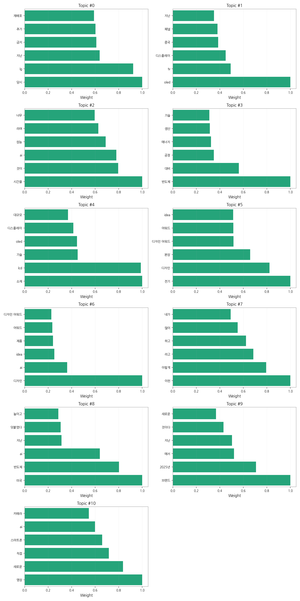
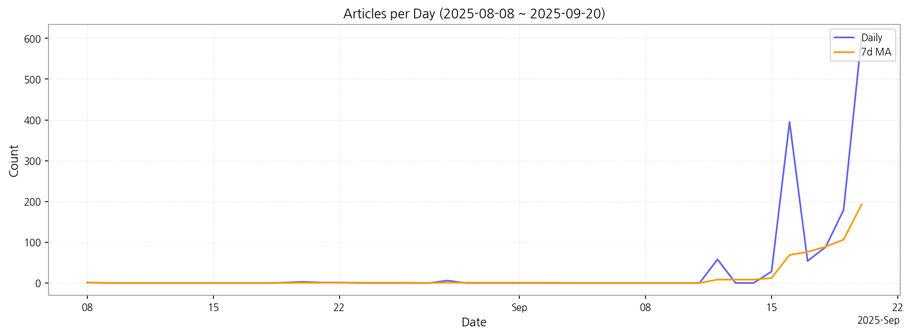

# Weekly/New Biz Report (2025-09-20)

## Executive Summary

- 이번 기간 핵심 토픽과 키워드, 주요 시사점을 요약합니다.

1) 상위 토픽을 3~5개 주제로 묶어 핵심 맥락 설명(2~3문장)

데이터는 크게 세 가지 핵심 주제로 묶을 수 있습니다. 첫째,  디스플레이 기술 및 시장 경쟁(topic 1, 4, 5)으로 OLED와 LCD 기술 경쟁, 중국과 미국 시장의 영향, 그리고 새로운 디스플레이 소재 개발에 대한 뉴스가 다수를 차지합니다. 둘째,  AI 기술과 관련된 제품 및 서비스 동향(topic 2, 3, 6, 8, 10)으로 AI 기반 스마트폰 카메라, AI 성능 향상, AI 디자인 어워드 수상 등 AI 기술이 다양한 분야에 적용되는 현황을 보여줍니다. 마지막으로,  반도체 및 전자 제품 시장의 동향(topic 3, 8, 9)으로 반도체 공정 기술, 에너지 효율, 그리고 새로운 브랜드 전략 등에 대한 뉴스가 포함되어 있습니다.  이 세 가지 주제는 서로 밀접하게 연관되어 있으며, 기술 발전과 시장 경쟁의 흐름을 반영합니다.

2) 최근 변화/스파이크가 있으면 2문장으로 짚기

9월 16일 기사 수가 급증(395건)한 것을 확인할 수 있습니다. 이는 특정 이벤트 또는 뉴스 발표로 인한 것으로 추정되며,  해당 시점 전후의 기사 내용 분석을 통해 구체적인 원인을 파악해야 합니다.

3) 실무 인사이트 3가지 bullet(구체적 액션)

* **9월 16일 기사 급증 원인 분석:** 9월 16일 급증한 기사들을 분석하여 어떤 이벤트나 뉴스가 기사 폭증을 야기했는지 파악하고,  향후 유사한 상황 발생 시 대응 전략을 수립합니다.  이는 특정 기술, 제품 출시, 또는 시장 변화에 대한 신속한 대응을 위한 중요한 정보입니다.
* **주요 토픽별 키워드 추출 및 모니터링 시스템 구축:**  각 토픽의 상위 키워드를 활용하여 실시간 뉴스 모니터링 시스템을 구축합니다. 이를 통해 시장 동향을 실시간으로 파악하고,  경쟁사의 움직임을 예측하여 선제적으로 대응할 수 있습니다.
* **AI 기술 및 시장 경쟁 심화에 대한 전략 수립:** AI 기술이 다양한 분야에 적용되는 추세를 고려하여,  자사 제품 및 서비스에 AI 기술을 접목하는 방안을 모색하고,  시장 경쟁 심화에 대한 대응 전략을 수립합니다.  이는 미래 시장 경쟁력 확보를 위한 필수적인 과정입니다.

## Key Metrics

- 기간: 2025-08-08 ~ 2025-09-20
- 총 기사 수: 1,419
- 문서 수: N/A
- 키워드 수(상위): 15
- 토픽 수: 11
- 시계열 데이터 일자 수: 13

## Top Keywords

| Rank | Keyword | Score |
|---:|---|---:|
| 1 | 패널 | 0.720 |
| 2 | 디스플레이 | 0.675 |
| 3 | 반도체 | 0.512 |
| 4 | 애플 | 0.474 |
| 5 | 삼성 | 0.460 |
| 6 | 스마트폰 | 0.405 |
| 7 | 생산 | 0.389 |
| 8 | 인텔 | 0.349 |
| 9 | 디자인 | 0.340 |
| 10 | 미국 | 0.334 |
| 11 | 장비 | 0.297 |
| 12 | 중국 | 0.296 |
| 13 | 것으 | 0.262 |
| 14 | 브랜드 | 0.262 |
| 15 | 모니터 | 0.257 |

## Topics

- Topic #0: 당시, lg, 지난, 금지, 추가, 재배포
- Topic #1: oled, tv, 디스플레이, 중국, 패널, 지난
- Topic #2: 시간을, 것이, ai, 성능, 라며, 너무
- Topic #3: 반도체, 대비, 공정, 에너지, 생산, 기술
- Topic #4: 소재, lcd, 기술, oled, 디스플레이, 대규모
- Topic #5: 전기, 디자인, 본상, 디자인 어워드, 어워드, idea
- Topic #6: 디자인, ai, idea, 제품, 어워드, 디자인 어워드
- Topic #7: 이런, 이렇게, 라고, 하고, 많이, 내가
- Topic #8: 미국, 반도체, ai, 지난, 덧붙였다, 높이고
- Topic #9: 브랜드, 2025년, 에서, 지난, 것이다, 새로운
- Topic #10: 영상, 새로운, 직접, 스마트폰, ai, 카메라

## Trend

- 최근 14~30일 기사 수 추세와 7일 이동평균선을 제공합니다.

## Insights

1) 상위 토픽을 3~5개 주제로 묶어 핵심 맥락 설명(2~3문장)

데이터는 크게 세 가지 핵심 주제로 묶을 수 있습니다. 첫째,  디스플레이 기술 및 시장 경쟁(topic 1, 4, 5)으로 OLED와 LCD 기술 경쟁, 중국과 미국 시장의 영향, 그리고 새로운 디스플레이 소재 개발에 대한 뉴스가 다수를 차지합니다. 둘째,  AI 기술과 관련된 제품 및 서비스 동향(topic 2, 3, 6, 8, 10)으로 AI 기반 스마트폰 카메라, AI 성능 향상, AI 디자인 어워드 수상 등 AI 기술이 다양한 분야에 적용되는 현황을 보여줍니다. 마지막으로,  반도체 및 전자 제품 시장의 동향(topic 3, 8, 9)으로 반도체 공정 기술, 에너지 효율, 그리고 새로운 브랜드 전략 등에 대한 뉴스가 포함되어 있습니다.  이 세 가지 주제는 서로 밀접하게 연관되어 있으며, 기술 발전과 시장 경쟁의 흐름을 반영합니다.

2) 최근 변화/스파이크가 있으면 2문장으로 짚기

9월 16일 기사 수가 급증(395건)한 것을 확인할 수 있습니다. 이는 특정 이벤트 또는 뉴스 발표로 인한 것으로 추정되며,  해당 시점 전후의 기사 내용 분석을 통해 구체적인 원인을 파악해야 합니다.

3) 실무 인사이트 3가지 bullet(구체적 액션)

* **9월 16일 기사 급증 원인 분석:** 9월 16일 급증한 기사들을 분석하여 어떤 이벤트나 뉴스가 기사 폭증을 야기했는지 파악하고,  향후 유사한 상황 발생 시 대응 전략을 수립합니다.  이는 특정 기술, 제품 출시, 또는 시장 변화에 대한 신속한 대응을 위한 중요한 정보입니다.
* **주요 토픽별 키워드 추출 및 모니터링 시스템 구축:**  각 토픽의 상위 키워드를 활용하여 실시간 뉴스 모니터링 시스템을 구축합니다. 이를 통해 시장 동향을 실시간으로 파악하고,  경쟁사의 움직임을 예측하여 선제적으로 대응할 수 있습니다.
* **AI 기술 및 시장 경쟁 심화에 대한 전략 수립:** AI 기술이 다양한 분야에 적용되는 추세를 고려하여,  자사 제품 및 서비스에 AI 기술을 접목하는 방안을 모색하고,  시장 경쟁 심화에 대한 대응 전략을 수립합니다.  이는 미래 시장 경쟁력 확보를 위한 필수적인 과정입니다.

## Opportunities (Top 5)

| Idea | Target | Value Prop | Score |
|---|---|---|---:|
| 디스플레이 패널 재활용 플랫폼 구축 (KR) | 디스플레이 제조사, 전자제품 제조사, 폐기물 처리 업체 (대기업 및 중견기업) | 폐기 디스플레이 패널의 효율적인 재활용 및 재사용 플랫폼을 제공하여 환경 규제 준수 및 ESG 경영에 기여합니다.  자원 낭비 감소와 재활용 시장 활성화를 통해 새로운 수익 창출 기회를 제공합니다.  플랫폼을 통해 투명하고 효율적인 재활용 프로세스를 제공하는 것이 차별화 포인트입니다. | 4.50 |
| AI 기반 디스플레이 품질 검사 서비스 (JP) | 디스플레이 패널 제조사, 모바일 기기 제조사 (대기업) | AI 기반 자동화된 품질 검사 시스템을 통해 검사 시간 단축 및 인건비 절감을 제공합니다.  인간의 눈으로는 감지하기 어려운 미세 결함까지 정확하게 검출하여 불량률을 최소화합니다.  AI 알고리즘의 지속적인 학습을 통한 정확도 향상이 차별화 포인트입니다. | 4.20 |
| 모빌리티 디스플레이 시장 분석 및 예측 서비스 (EU) | 자동차 부품 제조사, 디스플레이 제조사, 투자사 (대기업) | 모빌리티 분야 디스플레이 시장에 대한 심층 분석 및 미래 예측 서비스를 제공합니다.  시장 동향, 기술 트렌드, 경쟁 환경 등을 종합적으로 분석하여 기업의 의사결정을 지원합니다.  정확한 데이터 기반 예측 모델과 전문가 분석이 차별화 포인트입니다. | 4.00 |
| 스마트 사이니지 관리 플랫폼 (EU) | 광고 대행사, 유통업체, 공공기관 (중견기업 이상) | 다수의 스마트 사이니지를 통합 관리할 수 있는 클라우드 기반 플랫폼을 제공합니다.  콘텐츠 관리, 원격 제어, 장애 관리 등을 효율적으로 지원하며,  실시간 데이터 분석을 통해 광고 효과를 극대화합니다.  다국어 지원 및 다양한 사이니지 기기 호환성이 차별화 포인트입니다. | 3.80 |
| 디스플레이 부품 조달 파트너십 (KR) | 디스플레이 제조사, 중소기업 부품 공급업체 | 디스플레이 제조사와 중소기업 부품 공급업체를 연결하는 파트너십 프로그램을 통해 안정적인 부품 조달 및 판로 확보를 지원합니다.  품질 관리 및 기술 지원을 제공하여 상호 협력을 강화합니다.  신뢰할 수 있는 부품 공급망 구축을 통한 리스크 관리가 차별화 포인트입니다. | 3.50 |

## Appendix

- 데이터: keywords.json, topics.json, trend_timeseries.json, trend_insights.json, biz_opportunities.json