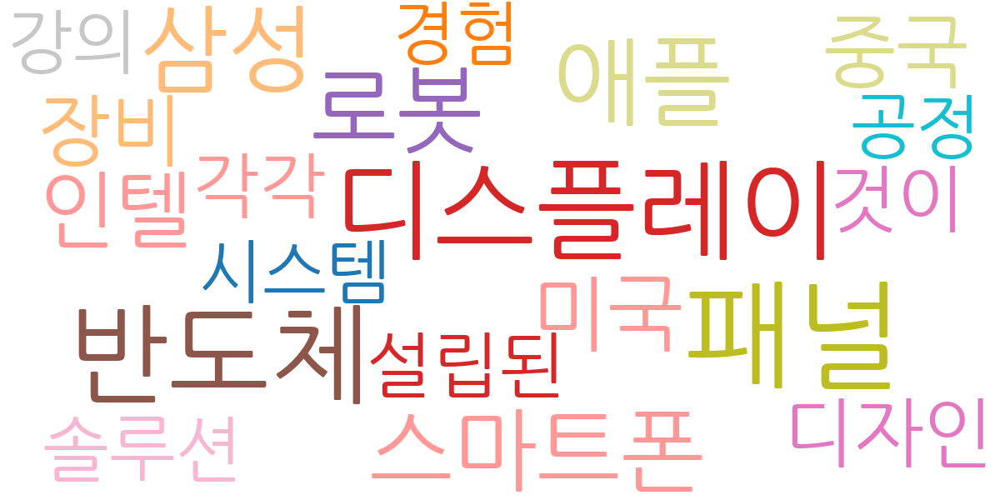
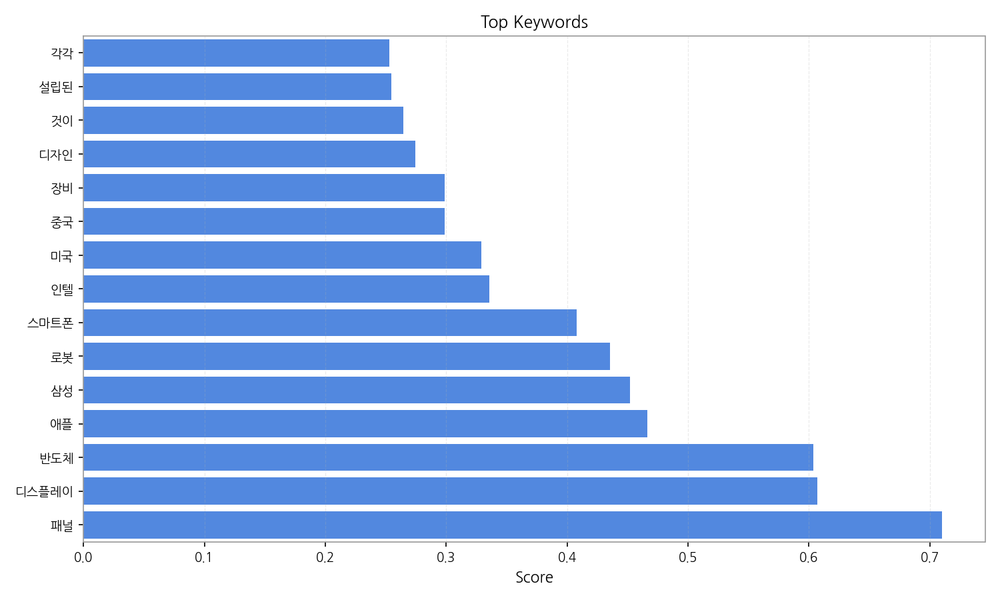
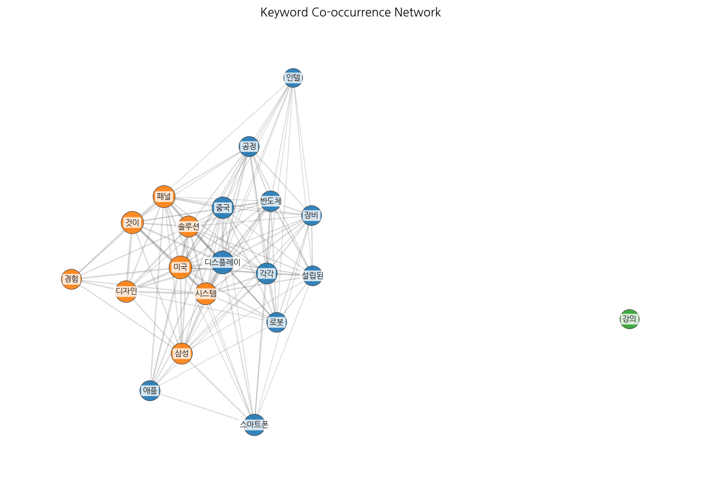
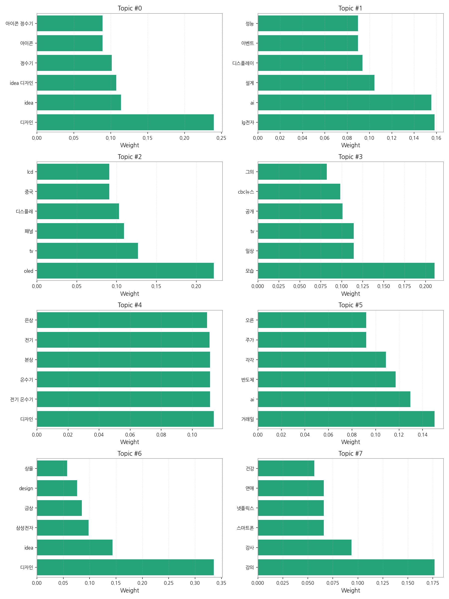
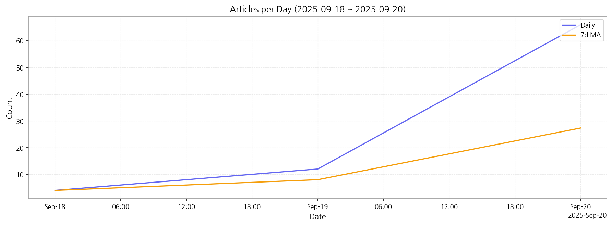

# Weekly/New Biz Report (2025-09-20)

## Executive Summary

- 이번 기간 핵심 토픽과 키워드, 주요 시사점을 요약합니다.

주요 5개 토픽이 도출되었고, 최근 3일 시계열을 기반으로 트렌드가 산출되었습니다.

## Key Metrics

- 기간: 2025-09-18 ~ 2025-09-20
- 총 기사 수: 82
- 문서 수: N/A
- 키워드 수(상위): 15
- 토픽 수: 8
- 시계열 데이터 일자 수: 3

## Top Keywords

| Rank | Keyword | Score |
|---:|---|---:|
| 1 | 패널 | 0.710 |
| 2 | 디스플레이 | 0.607 |
| 3 | 반도체 | 0.604 |
| 4 | 애플 | 0.466 |
| 5 | 삼성 | 0.452 |
| 6 | 로봇 | 0.436 |
| 7 | 스마트폰 | 0.408 |
| 8 | 인텔 | 0.336 |
| 9 | 미국 | 0.329 |
| 10 | 중국 | 0.299 |
| 11 | 장비 | 0.299 |
| 12 | 디자인 | 0.274 |
| 13 | 것이 | 0.265 |
| 14 | 설립된 | 0.255 |
| 15 | 각각 | 0.253 |

## Topics

- Topic #0: 디자인, idea, idea 디자인, 정수기, 아이콘, 아이콘 정수기
- Topic #1: lg전자, ai, 설계, 디스플레이, 이벤트, 성능
- Topic #2: oled, tv, 패널, 디스플레, 중국, lcd
- Topic #3: 모습, 일상, tv, 공개, cbc뉴스, 그의
- Topic #4: 디자인, 전기 온수기, 온수기, 본상, 전기, 은상
- Topic #5: 거래일, ai, 반도체, 각각, 주가, 오른
- Topic #6: 디자인, idea, 삼성전자, 금상, design, 상을
- Topic #7: 강의, 강사, 스마트폰, 넷플릭스, 연애, 건강

## Trend

- 최근 14~30일 기사 수 추세와 7일 이동평균선을 제공합니다.

## Insights

주요 5개 토픽이 도출되었고, 최근 3일 시계열을 기반으로 트렌드가 산출되었습니다.

## Opportunities (Top 5)

| Idea | Target | Value Prop | Score |
|---|---|---|---:|
| 스마트 사이니지 에너지 관리 솔루션 | 사이니지 제조사, 유통업체, 광고 대행사 (JP, 중소기업~대기업) | AI 기반 에너지 관리 솔루션을 통해 사이니지 에너지 소비량을 최적화하고, 운영 비용을 절감하며, 탄소 배출량을 감소시킵니다.  실시간 모니터링 및 제어 기능을 통해 에너지 사용 효율을 극대화하는 것이 차별점입니다. | 4.50 |
| 디스플레이 패널 재활용 플랫폼 | 디스플레이 제조사, 전자제품 수리업체, 폐기물 처리업체 (KR, 중소기업~대기업) | 폐기 디스플레이 패널의 효율적인 재활용 및 재사용을 위한 플랫폼을 제공하여 환경 규제 준수를 돕고, 비용 절감 및 새로운 수익 창출 기회를 제공합니다.  다양한 패널 종류에 대한 데이터베이스 구축을 통해 재활용 가치를 극대화하는 것이 차별점입니다. | 4.20 |
| B2B 전자부품 조달 플랫폼 | 전자 제조업체,  자동차 부품 제조업체 (EU, 중견기업~대기업) | 다양한 전자부품 공급업체를 연결하고,  투명하고 효율적인 조달 시스템을 제공하여 가격 경쟁력을 확보하고,  조달 과정을 간소화합니다.  블록체인 기반의 투명한 거래 시스템을 통해 신뢰성을 높이는 것이 차별점입니다. | 4.00 |
| 모빌리티 디스플레이 디자인 파트너십 | 자동차 제조사, 모빌리티 서비스 제공업체 (KR, 대기업) | 디자인 전문 기업과의 파트너십을 통해 차별화된 모빌리티 디스플레이 디자인을 제공합니다.  사용자 중심 디자인 및 최첨단 기술을 결합하여 혁신적인 사용자 경험을 제공하는 것이 차별점입니다.  최근 자율주행 기술 발전으로 인해 차량 내 디스플레이 중요성이 증대되고 있습니다. | 3.80 |
| 디스플레이 산업 예측 분석 서비스 | 디스플레이 제조사, 투자사, 시장조사 기관 (JP, 대기업) | 빅데이터 분석 및 AI 기술을 활용하여 디스플레이 시장의 미래를 예측하고,  사업 전략 수립에 필요한 정보를 제공합니다.  다양한 데이터 소스를 통합하여 정확도 높은 예측 모델을 구축하는 것이 차별점입니다. | 3.50 |

## Appendix

- 데이터: keywords.json, topics.json, trend_timeseries.json, trend_insights.json, biz_opportunities.json