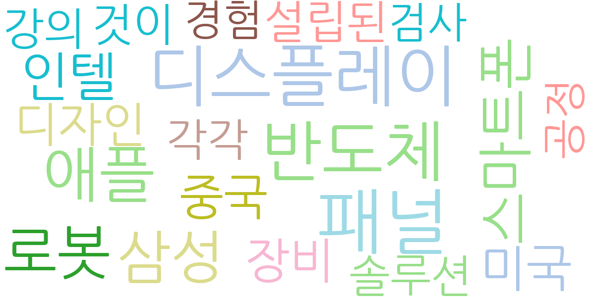
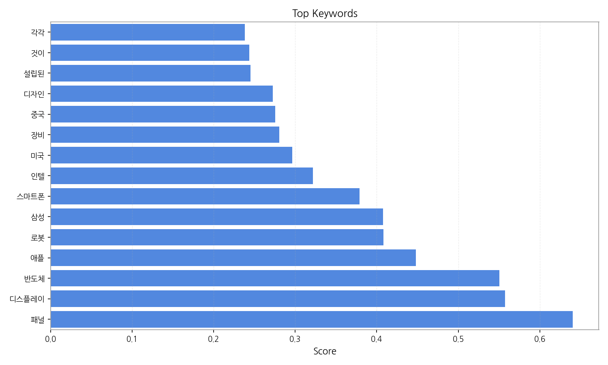
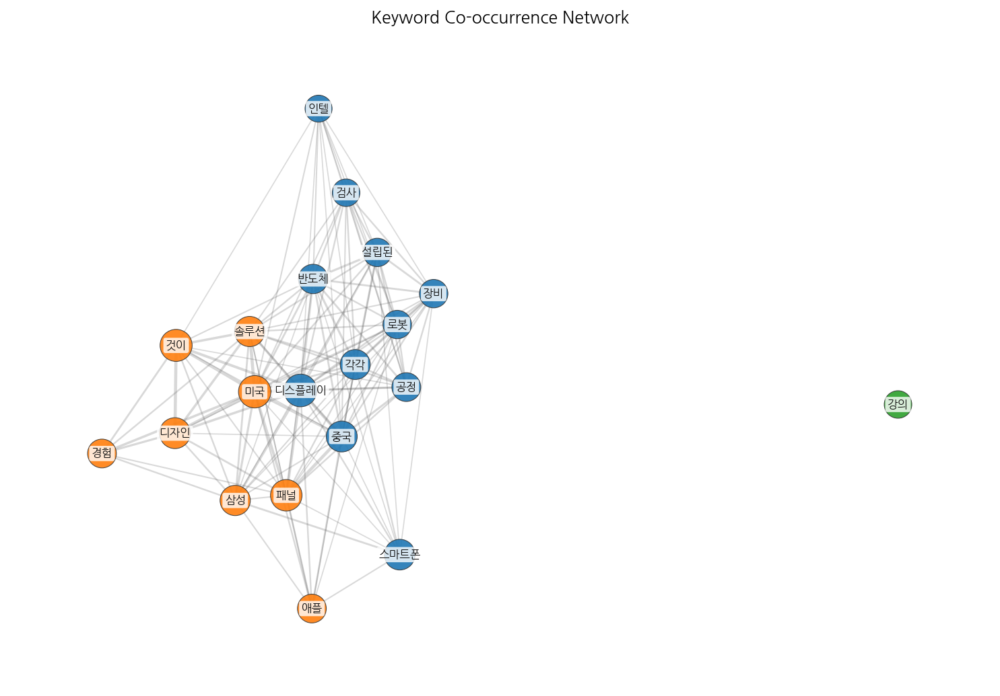
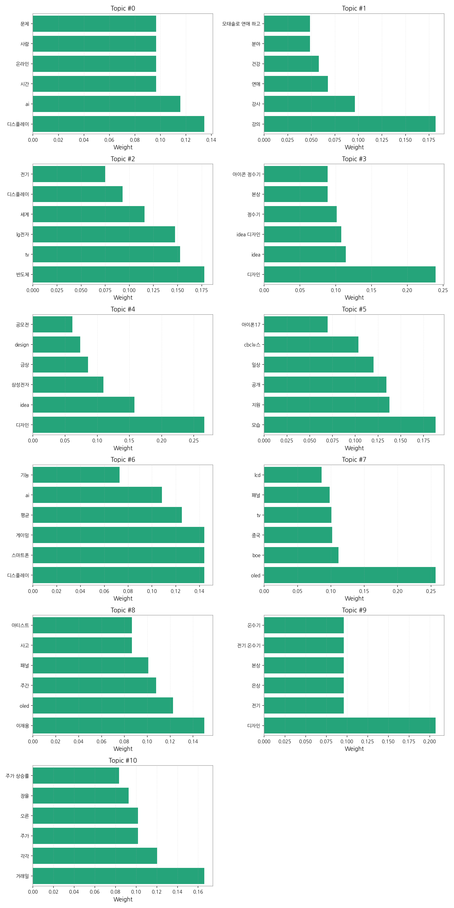
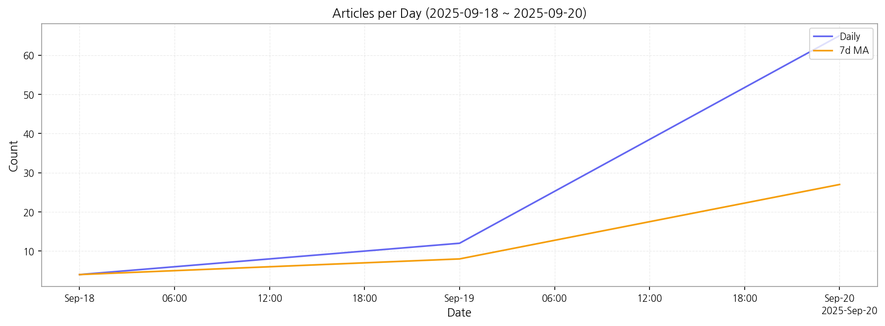

# Weekly/New Biz Report (2025-09-20)

## Executive Summary

- 이번 기간 핵심 토픽과 키워드, 주요 시사점을 요약합니다.

주요 5개 토픽이 도출되었고, 최근 3일 시계열을 기반으로 트렌드가 산출되었습니다.

## Key Metrics

- 기간: 2025-09-18 ~ 2025-09-20
- 총 기사 수: 81
- 문서 수: N/A
- 키워드 수(상위): 15
- 토픽 수: 11
- 시계열 데이터 일자 수: 3

## Top Keywords

| Rank | Keyword | Score |
|---:|---|---:|
| 1 | 패널 | 0.641 |
| 2 | 디스플레이 | 0.558 |
| 3 | 반도체 | 0.551 |
| 4 | 애플 | 0.448 |
| 5 | 로봇 | 0.408 |
| 6 | 삼성 | 0.408 |
| 7 | 스마트폰 | 0.379 |
| 8 | 인텔 | 0.322 |
| 9 | 미국 | 0.296 |
| 10 | 장비 | 0.281 |
| 11 | 중국 | 0.276 |
| 12 | 디자인 | 0.272 |
| 13 | 설립된 | 0.245 |
| 14 | 것이 | 0.244 |
| 15 | 각각 | 0.238 |

## Topics

- Topic #0: 디스플레이, ai, 시간, 온라인, 사람, 문제
- Topic #1: 강의, 강사, 연애, 건강, 분야, 모태솔로 연애 하고
- Topic #2: 반도체, tv, lg전자, 세계, 디스플레이, 전기
- Topic #3: 디자인, idea, idea 디자인, 정수기, 본상, 아이콘 정수기
- Topic #4: 디자인, idea, 삼성전자, 금상, design, 공모전
- Topic #5: 모습, 지원, 공개, 일상, cbc뉴스, 아이폰17
- Topic #6: 디스플레이, 스마트폰, 게이밍, 평균, ai, 기능
- Topic #7: oled, boe, 중국, tv, 패널, lcd
- Topic #8: 이재용, oled, 주간, 패널, 사고, 아티스트
- Topic #9: 디자인, 전기, 은상, 본상, 전기 온수기, 온수기
- Topic #10: 거래일, 각각, 주가, 오른, 장을, 주가 상승률

## Trend

- 최근 14~30일 기사 수 추세와 7일 이동평균선을 제공합니다.

## Insights

주요 5개 토픽이 도출되었고, 최근 3일 시계열을 기반으로 트렌드가 산출되었습니다.

## Opportunities (Top 5)

| Idea | Target | Value Prop | Score |
|---|---|---|---:|
| 패널 | 기업(B2B) | 패널 도입으로 비용/품질/경험을 개선. | 3.00 |
| 디스플레이 | 기업(B2B) | 디스플레이 도입으로 비용/품질/경험을 개선. | 3.00 |
| 반도체 | 기업(B2B) | 반도체 도입으로 비용/품질/경험을 개선. | 3.00 |
| 애플 | 기업(B2B) | 애플 도입으로 비용/품질/경험을 개선. | 3.00 |
| 로봇 | 기업(B2B) | 로봇 도입으로 비용/품질/경험을 개선. | 3.00 |

## Appendix

- 데이터: keywords.json, topics.json, trend_timeseries.json, trend_insights.json, biz_opportunities.json