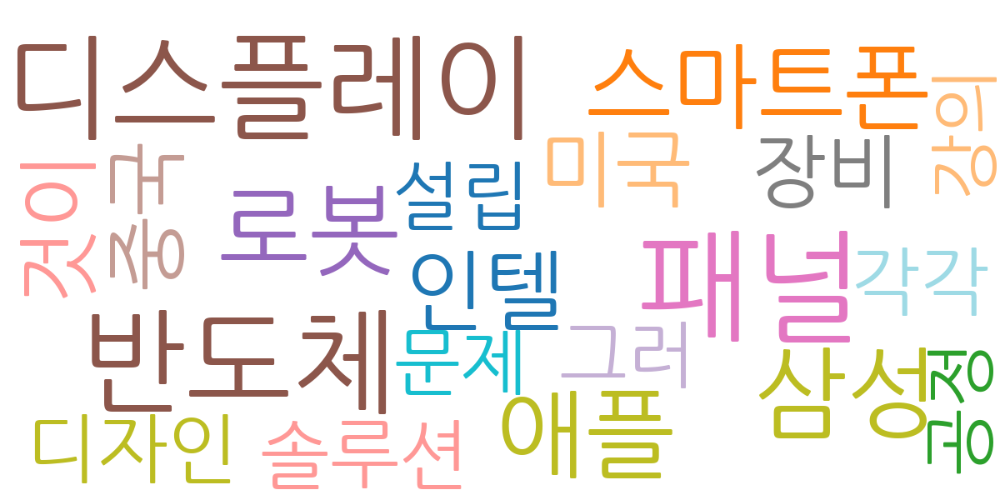
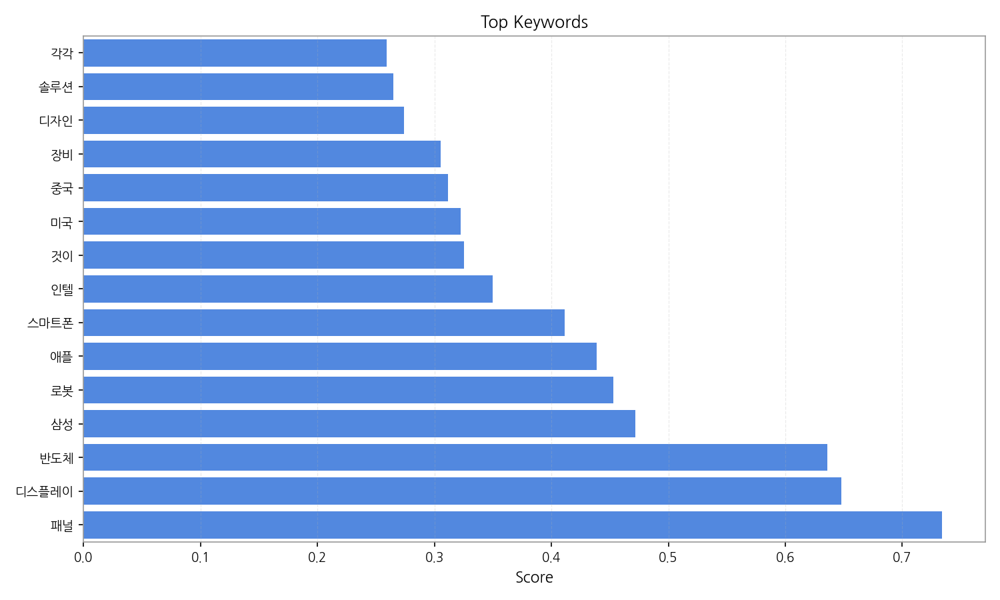
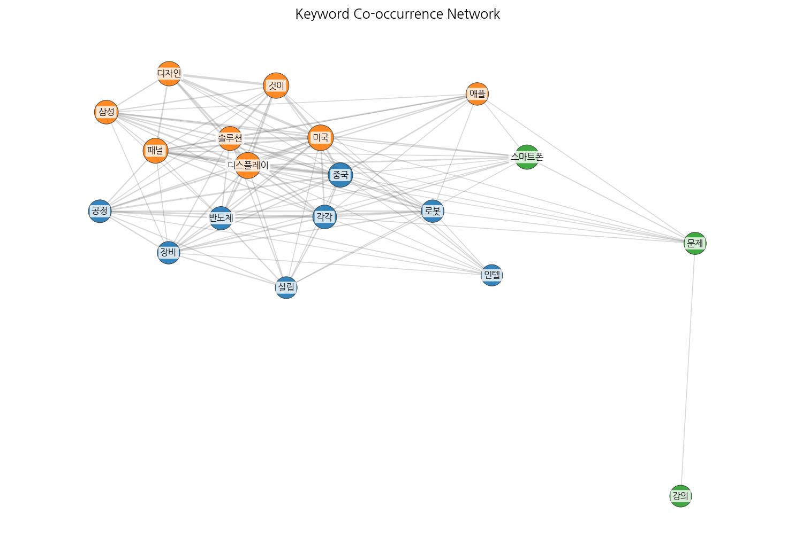
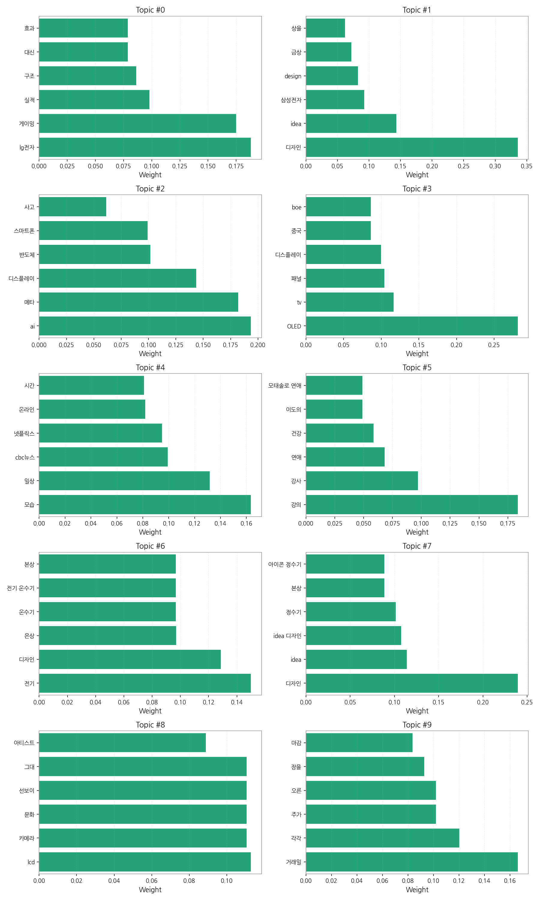
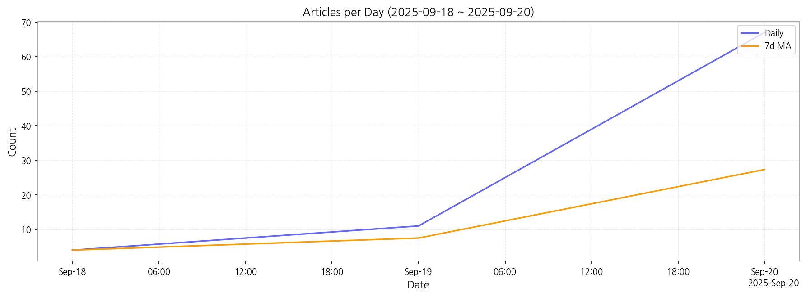

# Weekly/New Biz Report (2025-09-20)

## Executive Summary

- 이번 기간 핵심 토픽과 키워드, 주요 시사점을 요약합니다.

주요 5개 토픽이 도출되었고, 최근 3일 시계열을 기반으로 트렌드가 산출되었습니다.

## Key Metrics

- 기간: 2025-09-18 ~ 2025-09-20
- 총 기사 수: 82
- 문서 수: N/A
- 키워드 수(상위): 15
- 토픽 수: 10
- 시계열 데이터 일자 수: 3

## Top Keywords

| Rank | Keyword | Score |
|---:|---|---:|
| 1 | 패널 | 0.734 |
| 2 | 디스플레이 | 0.648 |
| 3 | 반도체 | 0.636 |
| 4 | 삼성 | 0.472 |
| 5 | 로봇 | 0.453 |
| 6 | 애플 | 0.439 |
| 7 | 스마트폰 | 0.412 |
| 8 | 인텔 | 0.350 |
| 9 | 것이 | 0.325 |
| 10 | 미국 | 0.322 |
| 11 | 중국 | 0.311 |
| 12 | 장비 | 0.305 |
| 13 | 디자인 | 0.274 |
| 14 | 솔루션 | 0.265 |
| 15 | 각각 | 0.259 |

## Topics

- Topic #0: lg전자, 게이밍, 실적, 구조, 대신, 효과
- Topic #1: 디자인, idea, 삼성전자, design, 금상, 상을
- Topic #2: ai, 메타, 디스플레이, 반도체, 스마트폰, 사고
- Topic #3: OLED, tv, 패널, 디스플레이, 중국, boe
- Topic #4: 모습, 일상, cbc뉴스, 넷플릭스, 온라인, 시간
- Topic #5: 강의, 강사, 연애, 건강, 이도의, 모태솔로 연애
- Topic #6: 전기, 디자인, 은상, 온수기, 전기 온수기, 본상
- Topic #7: 디자인, idea, idea 디자인, 정수기, 본상, 아이콘 정수기
- Topic #8: lcd, 카메라, 문화, 선보이, 그대, 아티스트
- Topic #9: 거래일, 각각, 주가, 오른, 장을, 마감

## Trend

- 최근 14~30일 기사 수 추세와 7일 이동평균선을 제공합니다.

## Insights

주요 5개 토픽이 도출되었고, 최근 3일 시계열을 기반으로 트렌드가 산출되었습니다.

## Opportunities (Top 5)

| Idea | Target | Value Prop | Score |
|---|---|---|---:|
| 디스플레이 패널 재활용 플랫폼 구축 (KR) | 디스플레이 제조사, 전자제품 수리업체, 폐기물 처리업체 (대기업 및 중견기업) | 폐기 디스플레이 패널의 효율적인 재활용 및 자원 순환 시스템 구축.  투명하고 효율적인 거래 시스템 제공.  ESG 경영 평가 지표 개선 및 관련 규제 준수 지원.  차별화 포인트: 블록체인 기반의 투명한 거래 시스템을 통해 신뢰도 향상. | 4.50 |
| 스마트 사이니지용 AI 기반 콘텐츠 제작 서비스 (JP) | 사이니지 제조사, 광고 대행사, 소매업체 (중소기업 및 대기업) | AI 기반 자동 콘텐츠 생성으로 제작 시간 및 비용 절감.  데이터 분석 기반의 최적화된 콘텐츠 제공.  다양한 사이니지 환경에 맞춤형 콘텐츠 제공.  차별화 포인트: 실시간 데이터 연동을 통한 동적 콘텐츠 제공. | 4.00 |
| 패널 | 기업(B2B) | 패널 도입으로 비용/품질/경험을 개선. | 3.00 |
| 디스플레이 | 기업(B2B) | 디스플레이 도입으로 비용/품질/경험을 개선. | 3.00 |
| 반도체 | 기업(B2B) | 반도체 도입으로 비용/품질/경험을 개선. | 3.00 |

## Appendix

- 데이터: keywords.json, topics.json, trend_timeseries.json, trend_insights.json, biz_opportunities.json