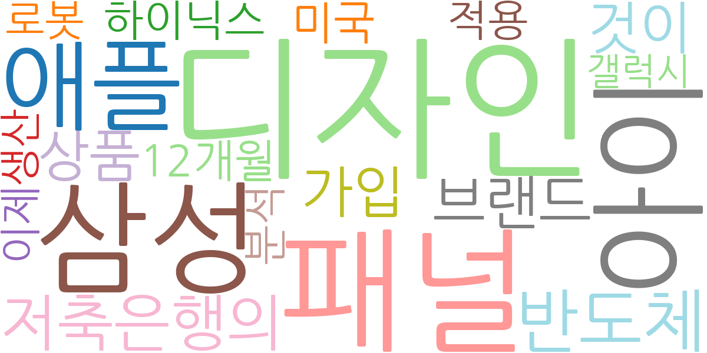
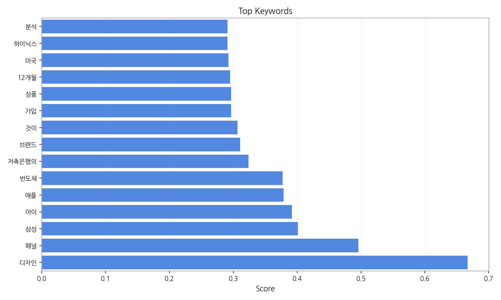
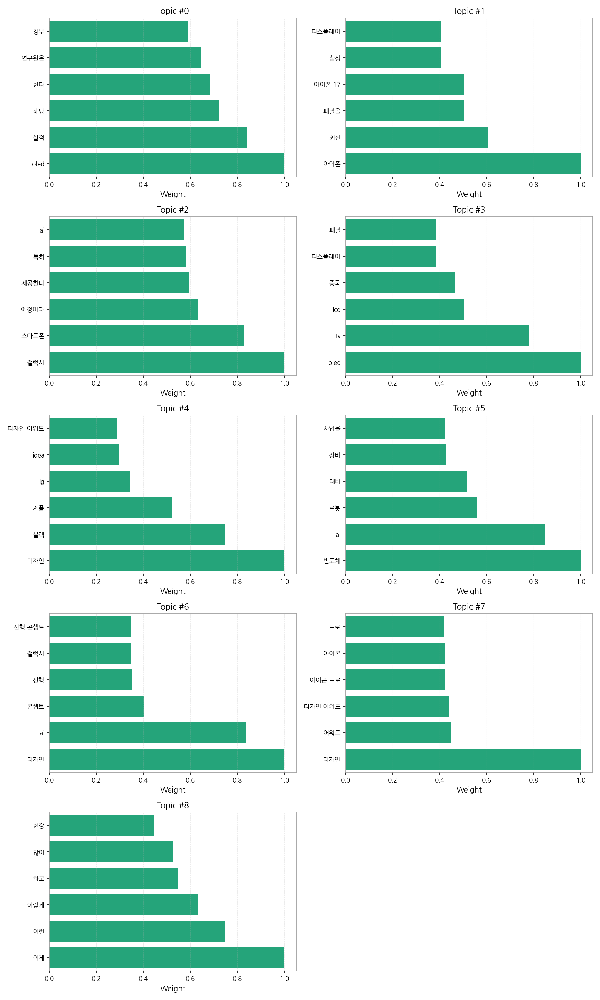
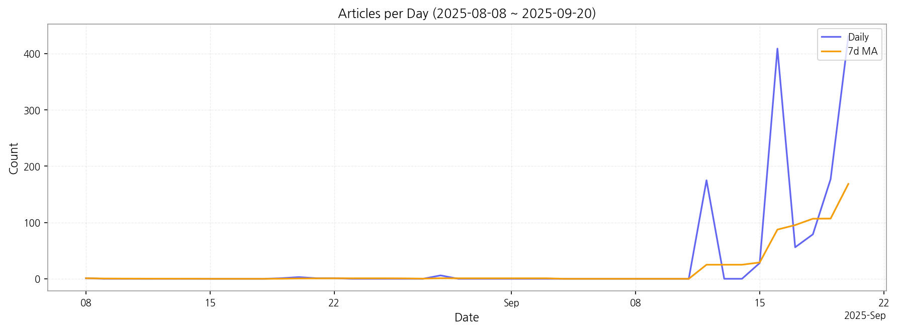

# Weekly/New Biz Report (2025-09-20)

## Executive Summary

- 이번 기간 핵심 토픽과 키워드, 주요 시사점을 요약합니다.

## 뉴스 토픽 분석 및 실무 인사이트

**1. 핵심 맥락 설명 (3가지 주제)**

*   **디스플레이 기술 경쟁 심화:** OLED 기술을 중심으로 LG디스플레이의 실적, 아이폰 및 갤럭시 등 스마트폰의 디스플레이 패널 경쟁, 그리고 LCD에서 OLED로의 전환 움직임이 활발하게 나타나고 있습니다. 특히 아이폰 17과 같은 차세대 제품에 대한 기대감과 함께 전력 효율 및 배터리 기술 개선에 대한 관심이 높습니다.
*   **AI 기반 스마트 기기 혁신:** 갤럭시 스마트폰을 중심으로 AI 기술이 접목된 프리미엄 기능 제공에 대한 기대감이 높으며, 반도체 산업에서도 AI 기술을 활용한 로봇 및 영상 처리 기술 개발이 활발하게 진행되고 있습니다. 디자인 분야에서도 AI를 활용한 새로운 콘셉트 및 사용자 경험 개선에 대한 연구가 이루어지고 있습니다.
*   **디자인 경쟁력 강화:** 다양한 디자인 어워드에서 LG, 코웨이 등 국내 기업들의 디자인 경쟁력을 확인할 수 있으며, 특히 블랙 색상을 활용한 제품 디자인과 사용자 중심의 디자인 철학이 강조되고 있습니다. AI 기술을 활용한 디자인 콘셉트 개발 및 저시력자를 위한 디자인 솔루션 제공 등 사회적 가치를 창출하는 디자인에 대한 관심도 높아지고 있습니다.

**2. 최근 변화/스파이크**

2025년 9월 16일과 20일에 기사 수가 급증했는데, 이는 새로운 갤럭시 스마트폰 출시 또는 아이폰 17 관련 발표와 같은 특정 이벤트와 관련되었을 가능성이 높습니다. 이러한 급증은 디스플레이 기술, AI 기능, 디자인 혁신에 대한 대중의 높은 관심을 반영합니다.

**3. 실무 인사이트**

*   **OLED 기술 투자 확대 및 차별화 전략 강화:** OLED 기술 경쟁이 심화되는 가운데, 고해상도, 저전력 소비, 플렉서블 디스플레이 등 차별화된 기술 개발에 집중하고, TV, 스마트폰, 자동차 등 다양한 분야로의 적용을 확대해야 합니다.
*   **AI 기반 사용자 경험 혁신:** AI 기술을 활용하여 사용자 맞춤형 기능 제공, 음성 인식 및 자연어 처리 기술 개선, 그리고 시각 보조 기술 개발 등 사용자 경험을 혁신하고, 새로운 비즈니스 모델을 창출해야 합니다.
*   **지속 가능한 디자인 및 사회적 가치 창출:** 친환경 소재 사용, 에너지 효율 향상, 그리고 장애인 및 노약자를 위한 디자인 솔루션 개발 등 지속 가능한 디자인을 추구하고, 사회적 가치를 창출하는 디자인을 통해 기업의 이미지를 제고해야 합니다.

## Key Metrics

- 기간: 2025-08-08 ~ 2025-09-20
- 총 기사 수: 1,368
- 문서 수: N/A
- 키워드 수(상위): 15
- 토픽 수: 9
- 시계열 데이터 일자 수: 13

## Top Keywords

| Rank | Keyword | Score |
|---:|---|---:|
| 1 | 디자인 | 0.667 |
| 2 | 패널 | 0.496 |
| 3 | 삼성 | 0.401 |
| 4 | 아이 | 0.392 |
| 5 | 애플 | 0.378 |
| 6 | 반도체 | 0.377 |
| 7 | 저축은행의 | 0.324 |
| 8 | 브랜드 | 0.311 |
| 9 | 것이 | 0.307 |
| 10 | 가입 | 0.296 |
| 11 | 상품 | 0.296 |
| 12 | 12개월 | 0.295 |
| 13 | 미국 | 0.292 |
| 14 | 하이닉스 | 0.291 |
| 15 | 분석 | 0.291 |

## Topics

- oled, 실적, 해당 (#0)
  - 대표 단어: oled, 실적, 해당, 한다, 연구원은, 경우
- 아이폰, 최신, 패널을 (#1)
  - 대표 단어: 아이폰, 최신, 패널을, 아이폰 17, 삼성, 디스플레이
- 갤럭시, 스마트폰, 예정이다 (#2)
  - 대표 단어: 갤럭시, 스마트폰, 예정이다, 제공한다, 특히, ai
- oled, tv, lcd (#3)
  - 대표 단어: oled, tv, lcd, 중국, 디스플레이, 패널
- 디자인, 블랙, 제품 (#4)
  - 대표 단어: 디자인, 블랙, 제품, lg, idea, 디자인 어워드
- 반도체, ai, 로봇 (#5)
  - 대표 단어: 반도체, ai, 로봇, 대비, 장비, 사업을
- 디자인, ai, 콘셉트 (#6)
  - 대표 단어: 디자인, ai, 콘셉트, 선행, 갤럭시, 선행 콘셉트
- 디자인, 어워드, 디자인 어워드 (#7)
  - 대표 단어: 디자인, 어워드, 디자인 어워드, 아이콘 프로, 아이콘, 프로
- 이제, 이런, 이렇게 (#8)
  - 대표 단어: 이제, 이런, 이렇게, 하고, 많이, 현장

## Trend

- 최근 14~30일 기사 수 추세와 7일 이동평균선을 제공합니다.

## Insights

## 뉴스 토픽 분석 및 실무 인사이트

**1. 핵심 맥락 설명 (3가지 주제)**

*   **디스플레이 기술 경쟁 심화:** OLED 기술을 중심으로 LG디스플레이의 실적, 아이폰 및 갤럭시 등 스마트폰의 디스플레이 패널 경쟁, 그리고 LCD에서 OLED로의 전환 움직임이 활발하게 나타나고 있습니다. 특히 아이폰 17과 같은 차세대 제품에 대한 기대감과 함께 전력 효율 및 배터리 기술 개선에 대한 관심이 높습니다.
*   **AI 기반 스마트 기기 혁신:** 갤럭시 스마트폰을 중심으로 AI 기술이 접목된 프리미엄 기능 제공에 대한 기대감이 높으며, 반도체 산업에서도 AI 기술을 활용한 로봇 및 영상 처리 기술 개발이 활발하게 진행되고 있습니다. 디자인 분야에서도 AI를 활용한 새로운 콘셉트 및 사용자 경험 개선에 대한 연구가 이루어지고 있습니다.
*   **디자인 경쟁력 강화:** 다양한 디자인 어워드에서 LG, 코웨이 등 국내 기업들의 디자인 경쟁력을 확인할 수 있으며, 특히 블랙 색상을 활용한 제품 디자인과 사용자 중심의 디자인 철학이 강조되고 있습니다. AI 기술을 활용한 디자인 콘셉트 개발 및 저시력자를 위한 디자인 솔루션 제공 등 사회적 가치를 창출하는 디자인에 대한 관심도 높아지고 있습니다.

**2. 최근 변화/스파이크**

2025년 9월 16일과 20일에 기사 수가 급증했는데, 이는 새로운 갤럭시 스마트폰 출시 또는 아이폰 17 관련 발표와 같은 특정 이벤트와 관련되었을 가능성이 높습니다. 이러한 급증은 디스플레이 기술, AI 기능, 디자인 혁신에 대한 대중의 높은 관심을 반영합니다.

**3. 실무 인사이트**

*   **OLED 기술 투자 확대 및 차별화 전략 강화:** OLED 기술 경쟁이 심화되는 가운데, 고해상도, 저전력 소비, 플렉서블 디스플레이 등 차별화된 기술 개발에 집중하고, TV, 스마트폰, 자동차 등 다양한 분야로의 적용을 확대해야 합니다.
*   **AI 기반 사용자 경험 혁신:** AI 기술을 활용하여 사용자 맞춤형 기능 제공, 음성 인식 및 자연어 처리 기술 개선, 그리고 시각 보조 기술 개발 등 사용자 경험을 혁신하고, 새로운 비즈니스 모델을 창출해야 합니다.
*   **지속 가능한 디자인 및 사회적 가치 창출:** 친환경 소재 사용, 에너지 효율 향상, 그리고 장애인 및 노약자를 위한 디자인 솔루션 개발 등 지속 가능한 디자인을 추구하고, 사회적 가치를 창출하는 디자인을 통해 기업의 이미지를 제고해야 합니다.

## Opportunities (Top 5)

| Idea | Target | Value Prop | Score |
|---|---|---|---:|
| 디스플레이 제조 공정 데이터 기반 수율 예측 및 최적화 플랫폼 (EU) | 디스플레이 패널 제조사 (EU) | 실시간 공정 데이터 분석, AI 기반 수율 예측 모델, 공정 조건 최적화 솔루션, 수율 향상 및 비용 절감 효과를 제공합니다. 차별화 포인트는 '실시간 데이터' 기반의 예측 정확도입니다. | 4.50 |
| AI 기반 디지털 사이니지 콘텐츠 자동 생성 및 관리 플랫폼 (KR) | 중소규모 리테일 매장, 프랜차이즈, 병원, 학교 등 디지털 사이니지를 운영하는 사업자 (KR) | AI 기반 콘텐츠 자동 생성 및 최적화, 실시간 콘텐츠 업데이트 및 관리, 사용자 맞춤형 콘텐츠 추천, 운영 비용 절감 효과를 제공합니다. 차별화 포인트는 'AI 기반'으로 콘텐츠 제작의 진입 장벽을 낮춘 것입니다. | 4.20 |
| 디스플레이 기반 인터랙티브 광고 플랫폼 (JP) | 광고 대행사, 브랜드 마케터, 리테일 매장 (JP) | 터치스크린, 모션 인식, AR/VR 등 다양한 인터랙션 기술 지원, 사용자 행동 분석 기반 광고 효과 측정, 개인 맞춤형 광고 제공, 광고 참여율 및 브랜드 인지도 향상에 기여합니다. 차별화 포인트는 '양방향 소통'을 통한 광고 몰입도 향상입니다. | 4.00 |
| 모빌리티 디스플레이 품질 검사 자동화 솔루션 (JP) | 자동차 제조사, 디스플레이 패널 제조사 (JP) | AI 기반 이미지 분석 기술을 활용하여 디스플레이 패널의 결함을 자동으로 검출하고, 검사 시간 단축 및 비용 절감, 검사 정확도 향상, 데이터 기반 품질 관리 시스템 구축을 지원합니다. 차별화 포인트는 'AI 이미지 분석'을 통한 정밀 검사입니다. | 3.90 |
| 친환경 디스플레이 부품 조달 플랫폼 (KR) | 디스플레이 제조사, 전자 제품 제조사 (KR) | 친환경 부품 공급망 정보 제공, 부품별 환경 영향 평가 정보 제공, 친환경 부품 구매 및 조달 지원, ESG 경영 성과 향상에 기여합니다. 차별화 포인트는 'ESG' 가치를 부품 조달에 반영한 것입니다. | 3.70 |

## Appendix

- 데이터: keywords.json, topics.json, trend_timeseries.json, trend_insights.json, biz_opportunities.json