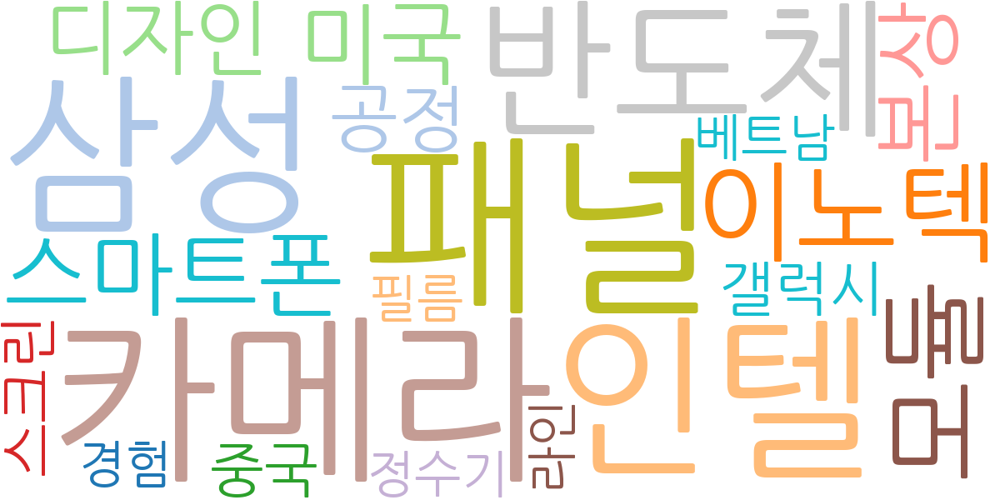
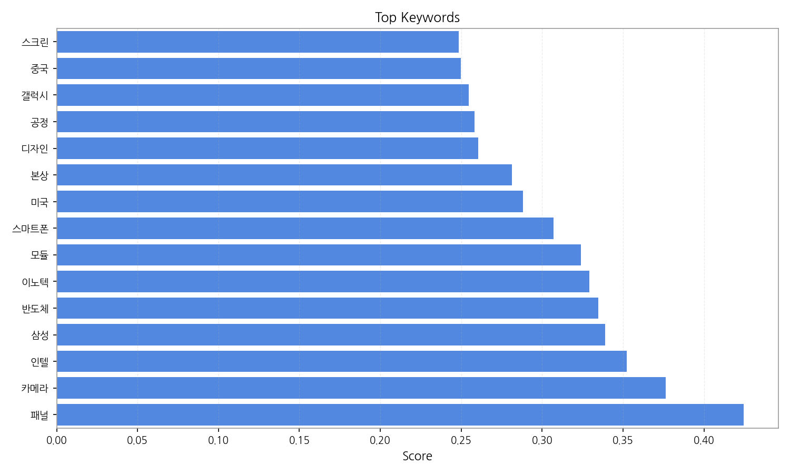
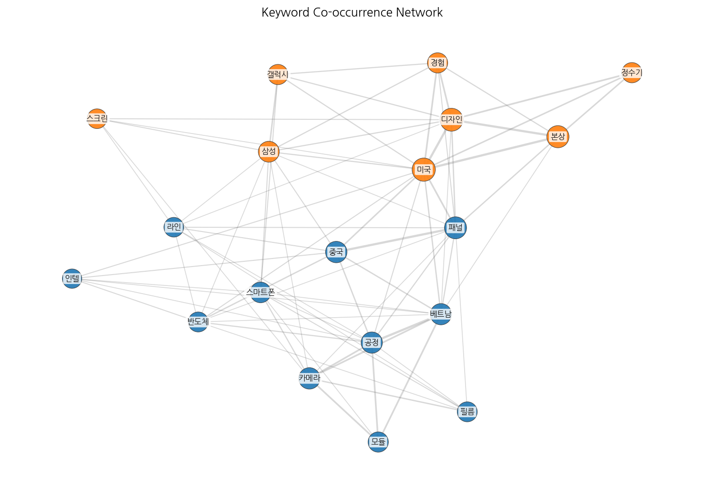
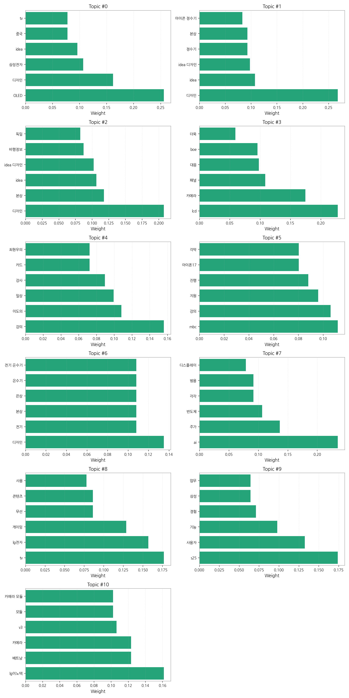
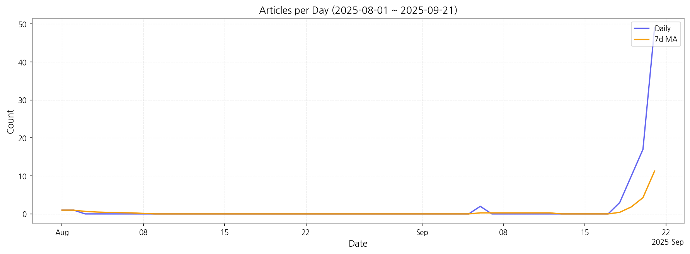

# Weekly/New Biz Report (2025-09-21)

## Executive Summary

- 이번 기간 핵심 토픽과 키워드, 주요 시사점을 요약합니다.

주요 5개 토픽이 도출되었고, 최근 7일 시계열을 기반으로 트렌드가 산출되었습니다.

## Key Metrics

- 기간: 2025-08-01 ~ 2025-09-21
- 총 기사 수: 83
- 문서 수: N/A
- 키워드 수(상위): 15
- 토픽 수: 11
- 시계열 데이터 일자 수: 7

## Top Keywords

| Rank | Keyword | Score |
|---:|---|---:|
| 1 | 패널 | 0.425 |
| 2 | 카메라 | 0.377 |
| 3 | 인텔 | 0.352 |
| 4 | 삼성 | 0.339 |
| 5 | 반도체 | 0.335 |
| 6 | 이노텍 | 0.329 |
| 7 | 모듈 | 0.324 |
| 8 | 스마트폰 | 0.307 |
| 9 | 미국 | 0.288 |
| 10 | 본상 | 0.281 |
| 11 | 디자인 | 0.261 |
| 12 | 공정 | 0.258 |
| 13 | 갤럭시 | 0.255 |
| 14 | 중국 | 0.250 |
| 15 | 스크린 | 0.249 |

## Topics

- Topic #0: OLED, 디자인, 삼성전자, idea, 중국, tv
- Topic #1: 디자인, idea, idea 디자인, 정수기, 본상, 아이콘 정수기
- Topic #2: 디자인, 본상, idea, idea 디자인, 비행정보, 독일
- Topic #3: lcd, 카메라, 패널, 대응, boe, 더욱
- Topic #4: 강의, 이도의, 일상, 강사, 카드, 최현우의
- Topic #5: mbc, 강의, 지원, 진행, 아이폰17, 각막
- Topic #6: 디자인, 전기, 본상, 은상, 온수기, 전기 온수기
- Topic #7: ai, 주가, 반도체, 각각, 범용, 디스플레이
- Topic #8: tv, lg전자, 게이밍, 무선, 콘텐츠, 사용
- Topic #9: s25, 사용자, 기능, 경험, 삼성, 업무
- Topic #10: lg이노텍, 베트남, 카메라, v3, 모듈, 카메라 모듈

## Trend

- 최근 14~30일 기사 수 추세와 7일 이동평균선을 제공합니다.

## Insights

주요 5개 토픽이 도출되었고, 최근 7일 시계열을 기반으로 트렌드가 산출되었습니다.

## Opportunities (Top 5)

| Idea | Target | Value Prop | Score |
|---|---|---|---:|
| 패널 | 기업(B2B) | 패널 도입으로 비용/품질/경험을 개선. | 3.00 |
| 카메라 | 기업(B2B) | 카메라 도입으로 비용/품질/경험을 개선. | 3.00 |
| 인텔 | 기업(B2B) | 인텔 도입으로 비용/품질/경험을 개선. | 3.00 |
| 삼성 | 기업(B2B) | 삼성 도입으로 비용/품질/경험을 개선. | 3.00 |
| 반도체 | 기업(B2B) | 반도체 도입으로 비용/품질/경험을 개선. | 3.00 |

## Appendix

- 데이터: keywords.json, topics.json, trend_timeseries.json, trend_insights.json, biz_opportunities.json