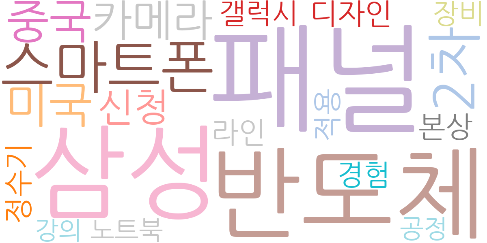
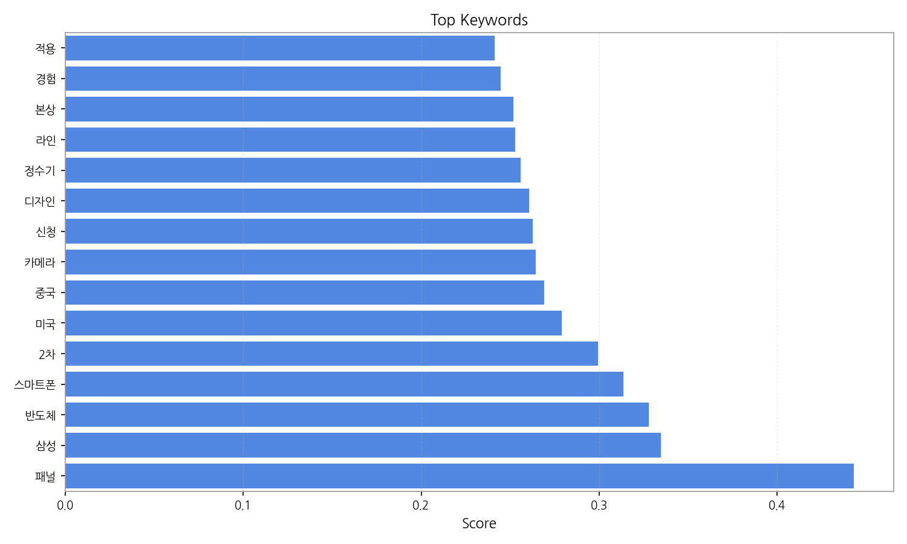
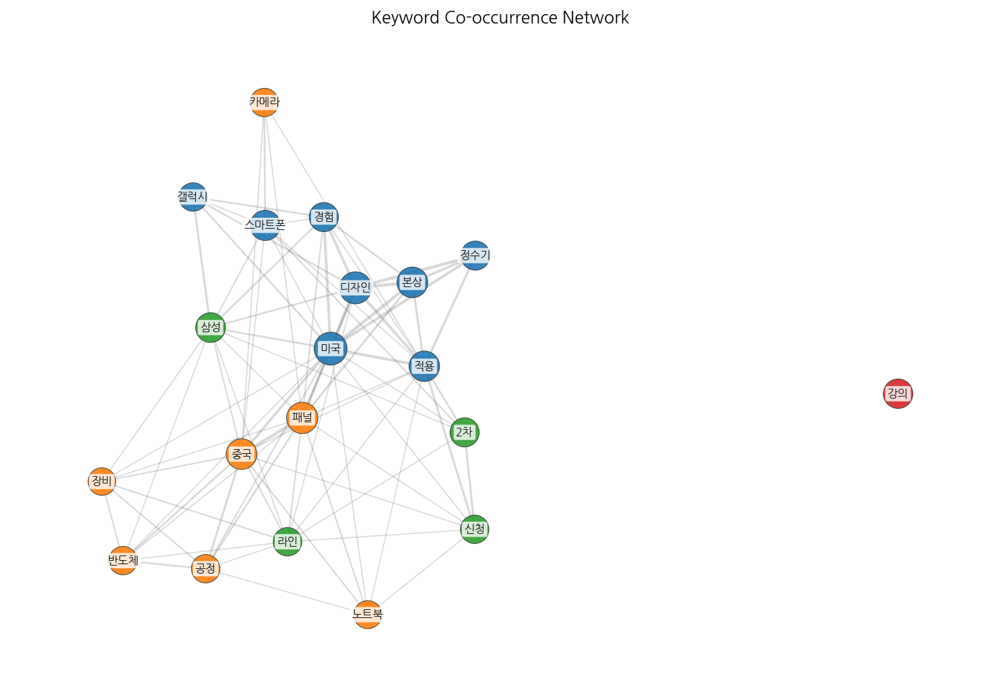
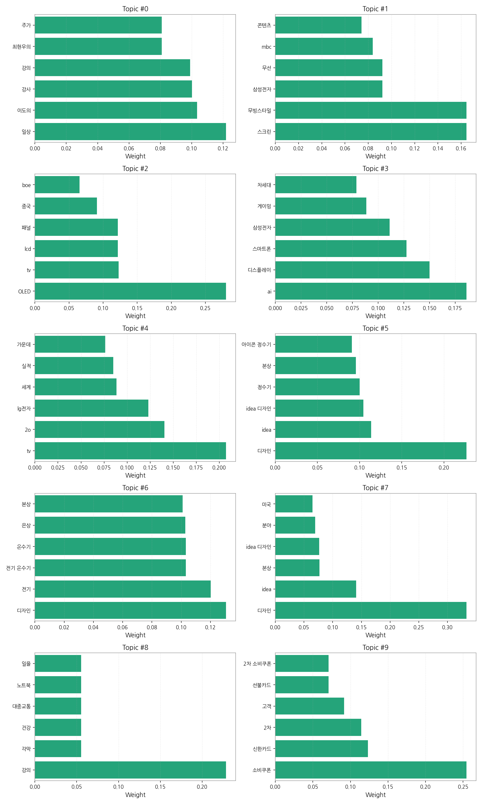
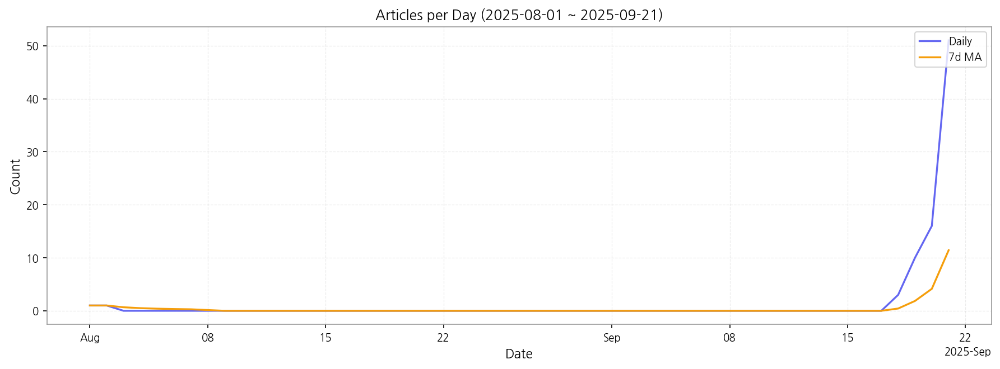

# Weekly/New Biz Report (2025-09-21)

## Executive Summary

- 이번 기간 핵심 토픽과 키워드, 주요 시사점을 요약합니다.

주요 5개 토픽이 도출되었고, 최근 6일 시계열을 기반으로 트렌드가 산출되었습니다.

## Key Metrics

- 기간: 2025-08-01 ~ 2025-09-21
- 총 기사 수: 82
- 문서 수: N/A
- 키워드 수(상위): 15
- 토픽 수: 10
- 시계열 데이터 일자 수: 6

## Top Keywords

| Rank | Keyword | Score |
|---:|---|---:|
| 1 | 패널 | 0.443 |
| 2 | 삼성 | 0.335 |
| 3 | 반도체 | 0.328 |
| 4 | 스마트폰 | 0.314 |
| 5 | 2차 | 0.299 |
| 6 | 미국 | 0.279 |
| 7 | 중국 | 0.269 |
| 8 | 카메라 | 0.264 |
| 9 | 신청 | 0.263 |
| 10 | 디자인 | 0.261 |
| 11 | 정수기 | 0.256 |
| 12 | 라인 | 0.253 |
| 13 | 본상 | 0.252 |
| 14 | 경험 | 0.245 |
| 15 | 적용 | 0.241 |

## Topics

- Topic #0: 일상, 이도의, 강사, 강의, 최현우의, 주가
- Topic #1: 스크린, 무빙스타일, 삼성전자, 무선, mbc, 콘텐츠
- Topic #2: OLED, tv, lcd, 패널, 중국, boe
- Topic #3: ai, 디스플레이, 스마트폰, 삼성전자, 게이밍, 차세대
- Topic #4: tv, 2o, lg전자, 세계, 실적, 가운데
- Topic #5: 디자인, idea, idea 디자인, 정수기, 본상, 아이콘 정수기
- Topic #6: 디자인, 전기, 전기 온수기, 온수기, 은상, 본상
- Topic #7: 디자인, idea, 본상, idea 디자인, 분야, 미국
- Topic #8: 강의, 각막, 건강, 대중교통, 노트북, 일을
- Topic #9: 소비쿠폰, 신한카드, 2차, 고객, 선불카드, 2차 소비쿠폰

## Trend

- 최근 14~30일 기사 수 추세와 7일 이동평균선을 제공합니다.

## Insights

주요 5개 토픽이 도출되었고, 최근 6일 시계열을 기반으로 트렌드가 산출되었습니다.

## Opportunities (Top 5)

| Idea | Target | Value Prop | Score |
|---|---|---|---:|
| AI 기반 디스플레이 제조 공정 최적화 및 예측 분석 플랫폼 | 디스플레이 패널 제조업체, 반도체 및 전자 부품 제조 기업 (KR) | AI 기반의 실시간 데이터 분석과 예측 모델을 통해 공정 변수를 최적화하고, 잠재적 불량 발생을 사전에 경고하여 생산 수율을 최대 15% 향상시키고 비용을 절감합니다. 기존 시스템과 연동하여 AI 기반의 예측 분석 및 실시간 최적화를 제공하는 것이 차별점입니다. | 4.80 |
| 글로벌 전자 부품 공급망 리스크 예측 및 대체 조달 플랫폼 | 대형 전자제품 제조사, 자동차 부품 제조사, 방위산업체 (JP) | AI 기반의 글로벌 뉴스, 정책, 시장 데이터를 분석하여 잠재적 공급망 리스크를 예측하고, 전 세계 공급업체 네트워크를 통해 실시간으로 대체 부품 및 조달 경로를 제안합니다. AI 기반의 실시간 글로벌 데이터 분석을 통해 잠재적 공급망 리스크를 예측하고 대안을 제시하는 것이 차별점입니다. | 4.70 |
| AI 기반 스마트 기기 디자인 협업 및 시뮬레이션 플랫폼 | 스마트폰/가전제품 제조사 디자인팀, 제품 개발 R&D 부서, 디자인 컨설팅 에이전시 (KR) | AI가 초기 디자인 아이디어 생성, 사용자 피드백 분석, 3D 모델링 및 시뮬레이션까지 디자인 프로세스 전반을 지원하여 개발 시간을 단축하고, 혁신적인 디자인을 빠르게 구현할 수 있도록 돕습니다. AI가 초기 디자인 컨셉 제안부터 사용자 피드백 분석까지 디자인 프로세스 전반에 걸쳐 협업을 지원하여, 디자이너의 창의성을 증폭시키고 개발 시간을 단축하는 것이 차별점입니다. | 4.60 |
| 모듈형 스마트 사이니지 및 콘텐츠 관리 솔루션 | 대형 리테일 체인, 공항/기차역 등 모빌리티 운영사, 스마트 빌딩 관리 기업 (EU) | 하드웨어 모듈화와 클라우드 기반 콘텐츠 관리 시스템을 결합하여, 고객의 특정 환경과 브랜드 아이덴티티에 맞춰 빠르고 유연하게 구축 및 운영 가능한 스마트 사이니지 솔루션을 제공합니다. 하드웨어 모듈화와 소프트웨어 커스터마이징을 결합하여 다양한 환경에 빠르게 적용 가능한 유연성을 제공하는 것이 차별점입니다. | 4.50 |
| 친환경 디스플레이 패널 순환 경제 솔루션 (조달-재활용) | 디스플레이 제조사, 대형 사이니지/TV 유통사, IT 기기 재활용 전문 기업 (KR) | 재활용 가능한 소재로 제작된 친환경 패널 조달부터, 사용 후 패널의 수거, 분해, 재활용까지 전 과정을 통합 관리하는 솔루션을 제공하여 기업의 ESG 목표 달성을 지원하고 자원 순환 경제에 기여합니다. 디스플레이 패널의 전 생애주기(조달-사용-재활용)를 아우르는 통합 솔루션을 제공하여 환경적 가치와 비용 효율성을 동시에 추구하는 것이 차별점입니다. | 4.30 |

## Appendix

- 데이터: keywords.json, topics.json, trend_timeseries.json, trend_insights.json, biz_opportunities.json