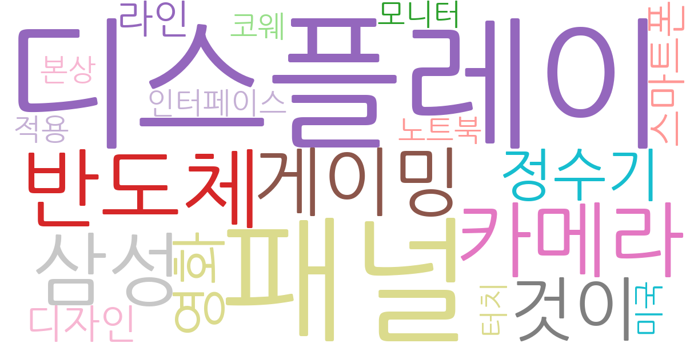
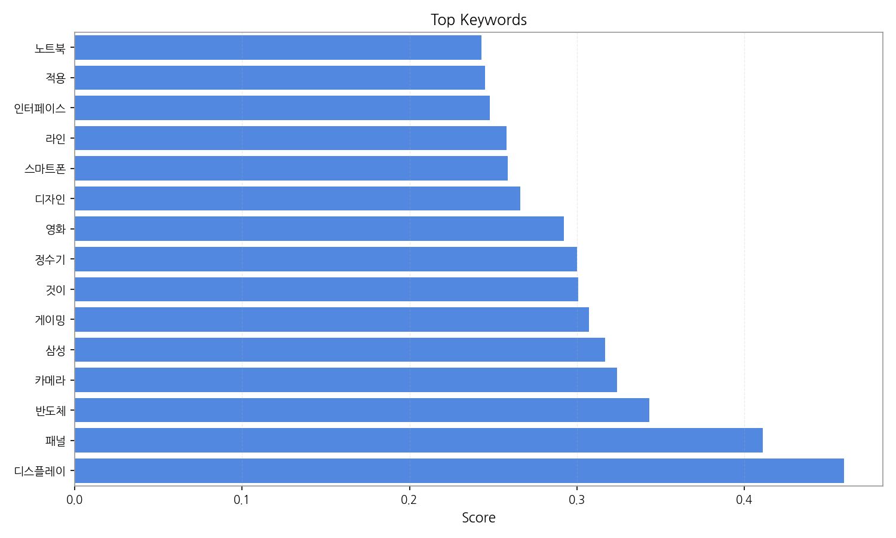
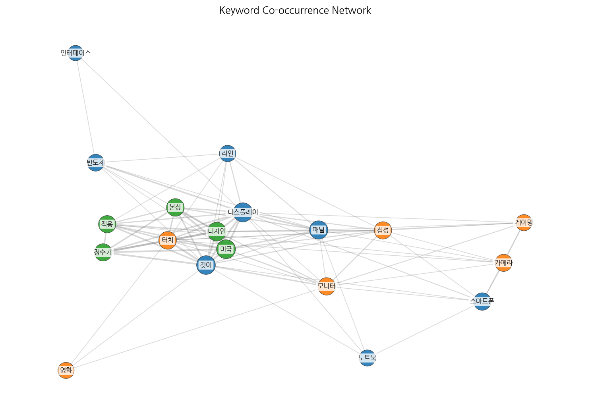
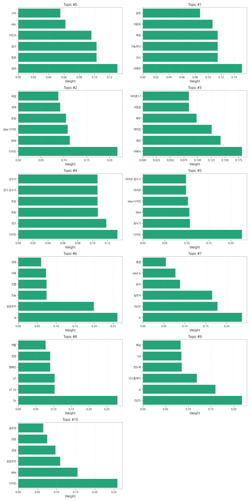
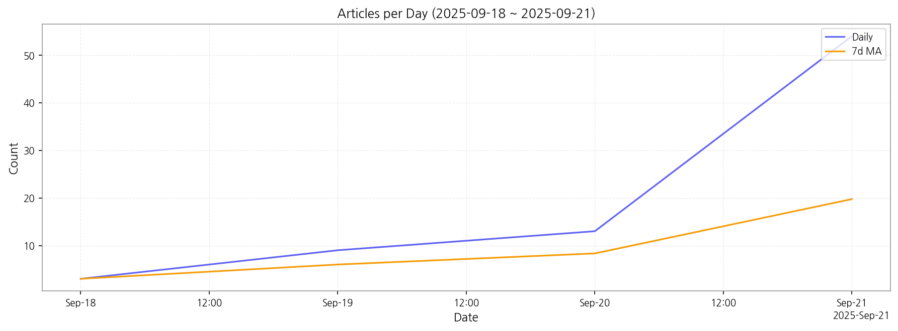

# Weekly/New Biz Report (2025-09-21)

## Executive Summary

- 이번 기간 핵심 토픽과 키워드, 주요 시사점을 요약합니다.

주요 5개 토픽이 도출되었고, 최근 4일 시계열을 기반으로 트렌드가 산출되었습니다.

## Key Metrics

- 기간: 2025-09-18 ~ 2025-09-21
- 총 기사 수: 79
- 문서 수: N/A
- 키워드 수(상위): 15
- 토픽 수: 11
- 시계열 데이터 일자 수: 4

## Top Keywords

| Rank | Keyword | Score |
|---:|---|---:|
| 1 | 디스플레이 | 0.460 |
| 2 | 패널 | 0.411 |
| 3 | 반도체 | 0.343 |
| 4 | 카메라 | 0.324 |
| 5 | 삼성 | 0.317 |
| 6 | 게이밍 | 0.307 |
| 7 | 것이 | 0.301 |
| 8 | 정수기 | 0.300 |
| 9 | 영화 | 0.292 |
| 10 | 디자인 | 0.266 |
| 11 | 스마트폰 | 0.259 |
| 12 | 라인 | 0.258 |
| 13 | 인터페이스 | 0.248 |
| 14 | 적용 | 0.245 |
| 15 | 노트북 | 0.243 |

## Topics

- Topic #0: 강의, 일상, 강사, 이도의, mbc, 스타
- Topic #1: 카메라, 오는, 가능하다, 확장, 가운데, 같은
- Topic #2: 디자인, idea, idea 디자인, 본상, 세계, 독일
- Topic #3: 카메라, 생산, 게이밍, 배우, 사업장, 아이폰17
- Topic #4: 디자인, 전기, 본상, 은상, 전기 온수기, 온수기
- Topic #5: 디자인, 정수기, idea, idea 디자인, 아이콘, 아이콘 정수기
- Topic #6: ai, 삼성전자, 오늘, 진행, 더욱, 세계
- Topic #7: tv, OLED, lg전자, 분석, oled tv, 환경
- Topic #8: 2o, o1 2o, o1, 캠페인, 전장, 역할
- Topic #9: OLED, ai, 디스플레이, 반도체, lcd, 패널
- Topic #10: 디자인, idea, 삼성전자, 삼성, 금상, 공모전

## Trend

- 최근 14~30일 기사 수 추세와 7일 이동평균선을 제공합니다.

## Insights

주요 5개 토픽이 도출되었고, 최근 4일 시계열을 기반으로 트렌드가 산출되었습니다.

## Opportunities (Top 5)

| Idea | Target | Value Prop | Score |
|---|---|---|---:|
| 디스플레이 | 기업(B2B) | 디스플레이 도입으로 비용/품질/경험을 개선. | 3.00 |
| 패널 | 기업(B2B) | 패널 도입으로 비용/품질/경험을 개선. | 3.00 |
| 반도체 | 기업(B2B) | 반도체 도입으로 비용/품질/경험을 개선. | 3.00 |
| 카메라 | 기업(B2B) | 카메라 도입으로 비용/품질/경험을 개선. | 3.00 |
| 삼성 | 기업(B2B) | 삼성 도입으로 비용/품질/경험을 개선. | 3.00 |

## Appendix

- 데이터: keywords.json, topics.json, trend_timeseries.json, trend_insights.json, biz_opportunities.json