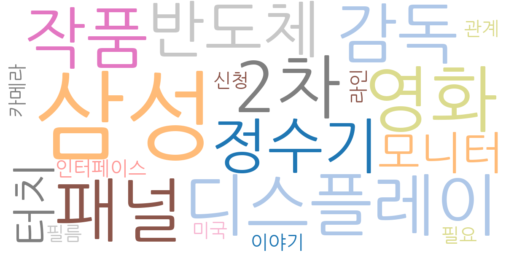
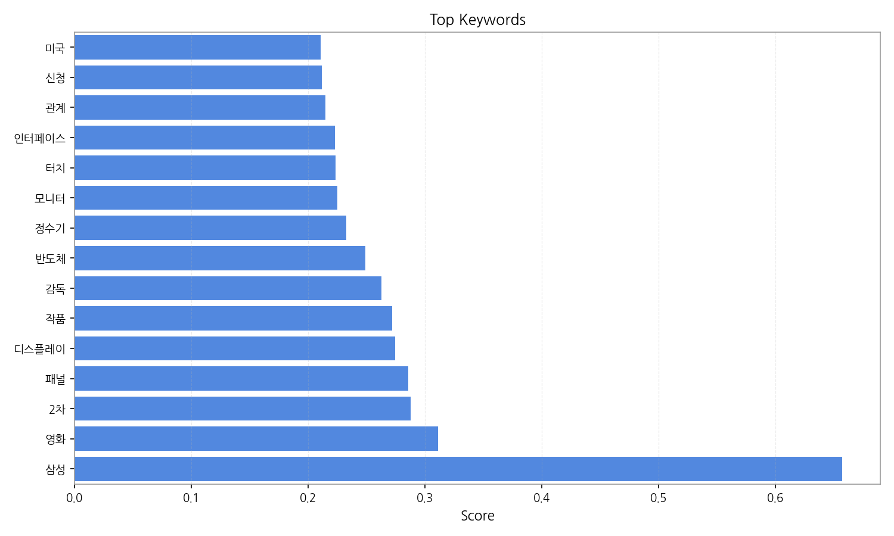
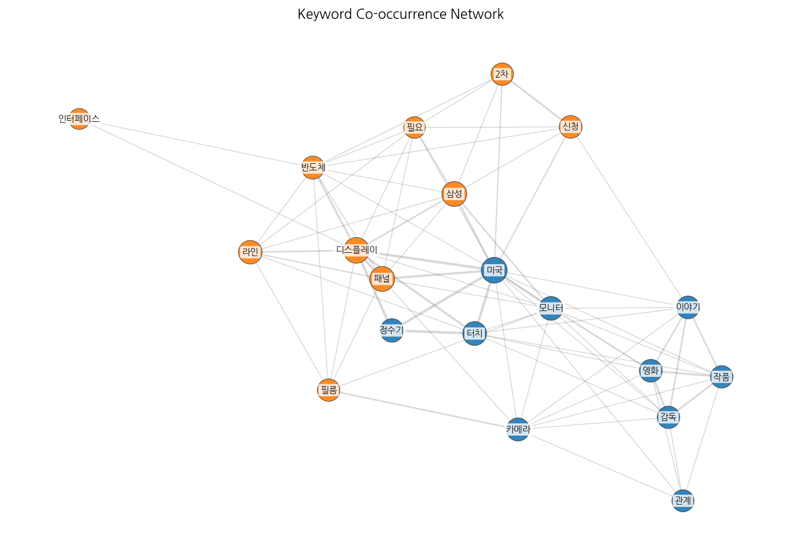
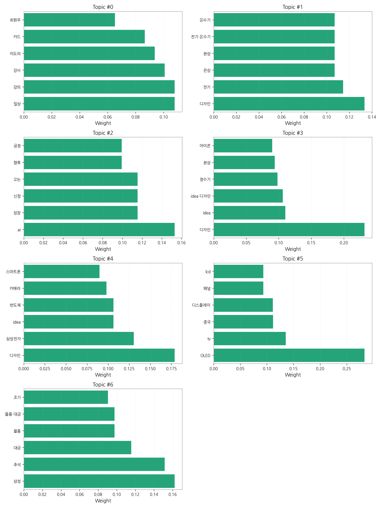
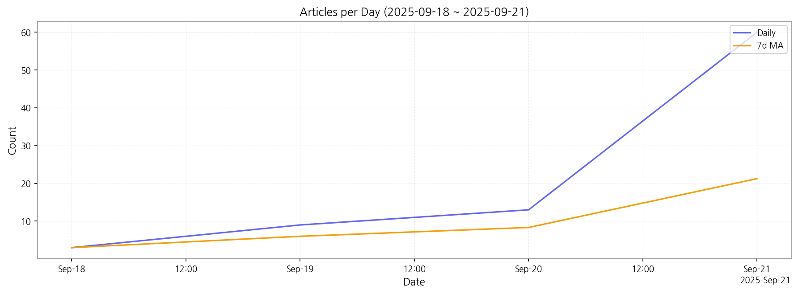

# Weekly/New Biz Report (2025-09-21)

## Executive Summary

- 이번 기간 핵심 토픽과 키워드, 주요 시사점을 요약합니다.

주요 5개 토픽이 도출되었고, 최근 4일 시계열을 기반으로 트렌드가 산출되었습니다.

## Key Metrics

- 기간: 2025-09-18 ~ 2025-09-21
- 총 기사 수: 85
- 문서 수: N/A
- 키워드 수(상위): 15
- 토픽 수: 7
- 시계열 데이터 일자 수: 4

## Top Keywords

| Rank | Keyword | Score |
|---:|---|---:|
| 1 | 삼성 | 0.657 |
| 2 | 영화 | 0.311 |
| 3 | 2차 | 0.288 |
| 4 | 패널 | 0.285 |
| 5 | 디스플레이 | 0.274 |
| 6 | 작품 | 0.272 |
| 7 | 감독 | 0.263 |
| 8 | 반도체 | 0.249 |
| 9 | 정수기 | 0.233 |
| 10 | 모니터 | 0.225 |
| 11 | 터치 | 0.223 |
| 12 | 인터페이스 | 0.223 |
| 13 | 관계 | 0.215 |
| 14 | 신청 | 0.212 |
| 15 | 미국 | 0.210 |

## Topics

- Topic #0: 일상, 강의, 강사, 이도의, 카드, 최현우
- Topic #1: 디자인, 전기, 은상, 본상, 전기 온수기, 온수기
- Topic #2: ai, 성장, 신청, 오는, 향후, 공정
- Topic #3: 디자인, idea, idea 디자인, 정수기, 본상, 아이콘
- Topic #4: 디자인, 삼성전자, idea, 반도체, 카메라, 스마트폰
- Topic #5: OLED, tv, 중국, 디스플레이, 패널, lcd
- Topic #6: 삼성, 추석, 대금, 물품, 물품 대금, 조기

## Trend

- 최근 14~30일 기사 수 추세와 7일 이동평균선을 제공합니다.

## Insights

주요 5개 토픽이 도출되었고, 최근 4일 시계열을 기반으로 트렌드가 산출되었습니다.

## Opportunities (Top 5)

| Idea | Target | Value Prop | Score |
|---|---|---|---:|
| 디스플레이 패널 품질 관리 플랫폼 | 삼성디스플레이, LG디스플레이 등 대형 디스플레이 제조업체, 중소형 패널 제조사 (KR) | AI 기반 자동화된 품질 검사 시스템을 통해 불량률 감소 및 생산성 향상. 실시간 데이터 분석으로 문제점 조기 발견 및 예방 가능.  차별화 포인트:  다양한 디스플레이 패널 종류에 대한 맞춤형 품질 검사 알고리즘 제공. | 4.50 |
| B2B 사이니지 콘텐츠 제작 및 배포 플랫폼 | 백화점, 쇼핑몰, 호텔, 공항 등 대형 상업 시설 운영사, 프랜차이즈 본사 (JP) | 클라우드 기반의 콘텐츠 제작 및 배포 플랫폼 제공. 직관적인 인터페이스와 다양한 템플릿 제공으로 콘텐츠 제작 시간 단축. 다양한 기기와의 호환성 보장. 차별화 포인트:  AI 기반 콘텐츠 자동 생성 기능 제공. | 4.00 |
| 삼성 | 기업(B2B) | 삼성 도입으로 비용/품질/경험을 개선. | 3.00 |
| 영화 | 기업(B2B) | 영화 도입으로 비용/품질/경험을 개선. | 3.00 |
| 2차 | 기업(B2B) | 2차 도입으로 비용/품질/경험을 개선. | 3.00 |

## Appendix

- 데이터: keywords.json, topics.json, trend_timeseries.json, trend_insights.json, biz_opportunities.json