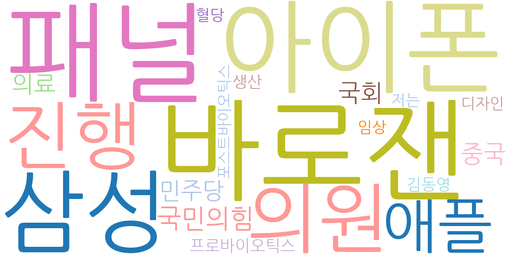
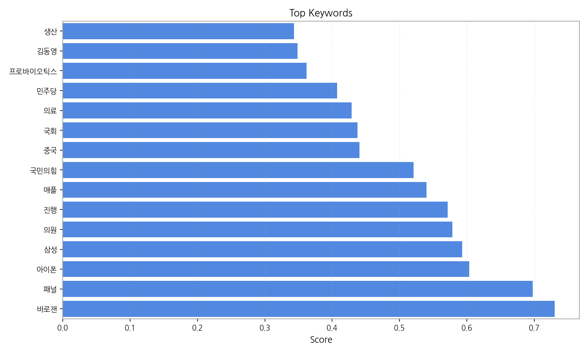
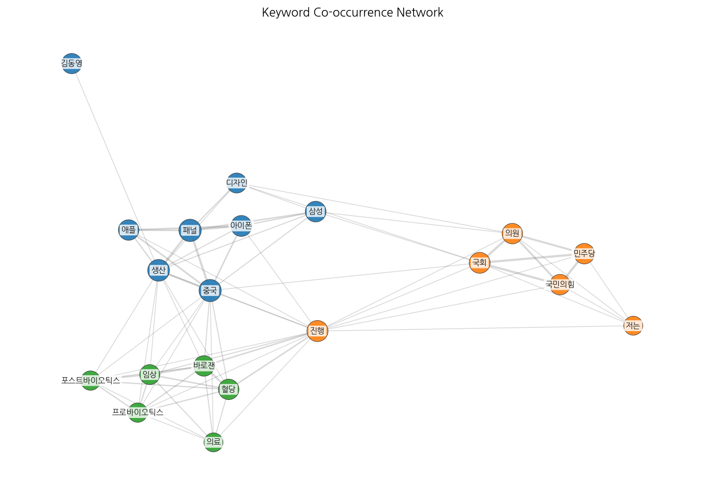
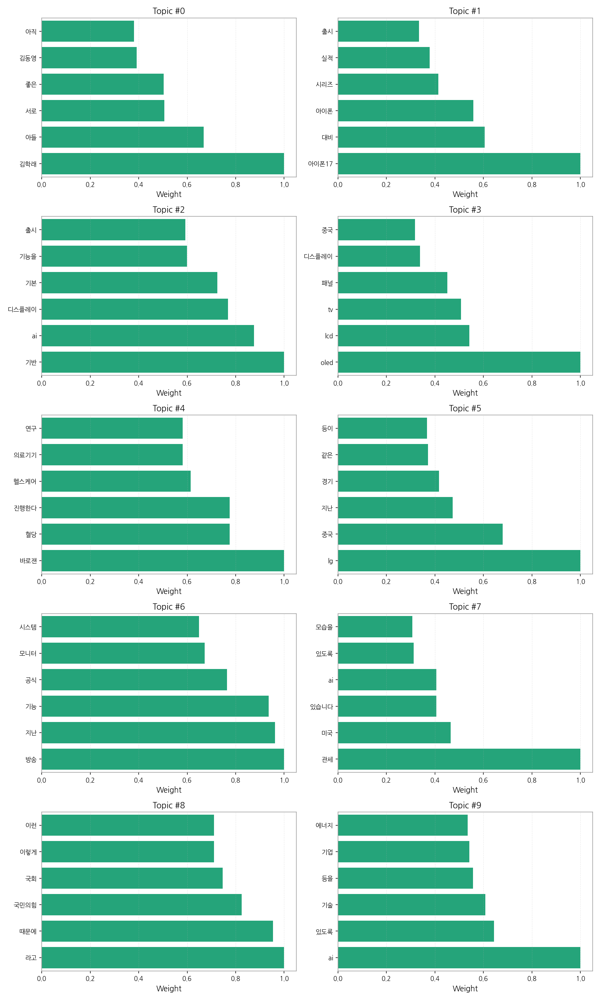
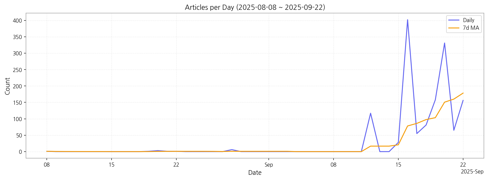

# Weekly/New Biz Report (2025-09-22)

## Executive Summary

- 이번 기간 핵심 토픽과 키워드, 주요 시사점을 요약합니다.

## 뉴스 토픽 분석 및 실무 인사이트

**1. 핵심 맥락 설명 (주제별 그룹핑)**

*   **IT 기술 및 산업 동향:** 아이폰17 출시 관련 전망 (Topic 1), AI 기반 디스플레이 기술 및 차량 관련 기능 출시 (Topic 2), OLED/LCD TV 패널 시장 동향 (Topic 3), AI 기술 및 에너지 분야 기업 동향 (Topic 9) 등을 묶어볼 수 있습니다. 이는 IT 기술 발전과 디스플레이 시장 경쟁 심화, AI 기술의 다양한 산업 적용이라는 큰 흐름을 보여줍니다.
*   **건강 및 헬스케어:** 바로잰 혈당 측정기 관련 헬스케어 연구 (Topic 4)는 건강 관리 및 의료기기 시장의 성장 가능성을 시사합니다. 개인 맞춤형 헬스케어 솔루션에 대한 관심이 높아지고 있음을 알 수 있습니다.
*   **정치 및 사회 이슈:** 국민의힘, 윤석열, 추미애 등 정치 관련 키워드 (Topic 8)는 정치권의 주요 논쟁과 갈등을 반영합니다. 사회 전반의 정치적 관심사를 파악하는 데 도움이 됩니다.
*   **방송 및 엔터테인먼트:** 방송 기능, 모니터 시스템 관련 소식 (Topic 6)과 김학래 아들 관련 방송 출연 (Topic 0)은 방송 콘텐츠 및 연예계 이슈에 대한 대중의 관심을 보여줍니다. 미디어 트렌드 변화를 엿볼 수 있습니다.
*   **경제 및 무역:** 관세, 미국, AI, 자동차 관련 내용 (Topic 7)과 LG, 중국, 삼성 등 기업 경쟁력 관련 내용 (Topic 5)은 글로벌 무역 환경 변화와 기업 경쟁 심화에 대한 우려를 나타냅니다. 국제 정세가 국내 경제에 미치는 영향을 파악할 수 있습니다.

**2. 최근 변화/스파이크**

*   2025년 9월 16일 기사 수가 402건으로 급증했으며, 9월 19일과 20일에도 각각 158건, 331건으로 높은 수치를 기록했습니다. 이는 특정 이슈에 대한 관심이 집중되었거나, 대규모 이벤트가 발생했음을 의미하며, 해당 날짜의 토픽 분석을 통해 원인을 파악해야 합니다.
*   9월 12일 이후 기사 수가 전반적으로 증가한 것은 특정 토픽에 대한 관심이 높아졌거나, 새로운 트렌드가 부상했음을 시사합니다. 특히 IT 기술 및 산업 동향 관련 토픽의 변화를 주목할 필요가 있습니다.

**3. 실무 인사이트**

*   **IT 및 디스플레이 산업 종사자:** 아이폰17, OLED/LCD 패널 관련 기술 개발 및 시장 경쟁력 강화 전략을 수립하고, AI 기반 디스플레이 기술 개발에 투자하여 미래 시장을 선점해야 합니다.
*   **헬스케어 및 의료기기 사업 종사자:** 개인 맞춤형 혈당 관리 솔루션 개발 및 헬스케어 서비스 확대를 통해 빠르게 성장하는 시장에 진입하고, AI 기술을 활용한 건강 관리 서비스 개발을 고려해야 합니다.
*   **미디어 및 엔터테인먼트 사업 종사자:** 방송 콘텐츠 트렌드를 분석하고, 시청자 참여형 콘텐츠 개발 및 새로운 미디어 플랫폼 활용 전략을 수립하여 경쟁력을 강화해야 합니다.

## Key Metrics

- 기간: 2025-08-08 ~ 2025-09-22
- 총 기사 수: 1,406
- 문서 수: N/A
- 키워드 수(상위): 15
- 토픽 수: 10
- 시계열 데이터 일자 수: 15

## Top Keywords

| Rank | Keyword | Score |
|---:|---|---:|
| 1 | 바로잰 | 0.730 |
| 2 | 패널 | 0.698 |
| 3 | 아이폰 | 0.604 |
| 4 | 삼성 | 0.593 |
| 5 | 의원 | 0.578 |
| 6 | 진행 | 0.571 |
| 7 | 애플 | 0.540 |
| 8 | 국민의힘 | 0.521 |
| 9 | 중국 | 0.441 |
| 10 | 국회 | 0.438 |
| 11 | 의료 | 0.429 |
| 12 | 민주당 | 0.407 |
| 13 | 프로바이오틱스 | 0.362 |
| 14 | 김동영 | 0.349 |
| 15 | 생산 | 0.343 |

## Topics

- 김학래, 아들, 서로 (#0)
  - 대표 단어: 김학래, 아들, 서로, 좋은, 김동영, 아직
- 아이폰17, 대비, 아이폰 (#1)
  - 대표 단어: 아이폰17, 대비, 아이폰, 시리즈, 실적, 출시
- 기반, ai, 디스플레이 (#2)
  - 대표 단어: 기반, ai, 디스플레이, 기본, 기능을, 출시
- oled, lcd, tv (#3)
  - 대표 단어: oled, lcd, tv, 패널, 디스플레이, 중국
- 바로잰, 혈당, 진행한다 (#4)
  - 대표 단어: 바로잰, 혈당, 진행한다, 헬스케어, 의료기기, 연구
- lg, 중국, 지난 (#5)
  - 대표 단어: lg, 중국, 지난, 경기, 같은, 등이
- 방송, 지난, 기능 (#6)
  - 대표 단어: 방송, 지난, 기능, 공식, 모니터, 시스템
- 관세, 미국, 있습니다 (#7)
  - 대표 단어: 관세, 미국, 있습니다, ai, 있도록, 모습을
- 라고, 때문에, 국민의힘 (#8)
  - 대표 단어: 라고, 때문에, 국민의힘, 국회, 이렇게, 이런
- ai, 있도록, 기술 (#9)
  - 대표 단어: ai, 있도록, 기술, 등을, 기업, 에너지

## Trend

- 최근 14~30일 기사 수 추세와 7일 이동평균선을 제공합니다.

## Insights

## 뉴스 토픽 분석 및 실무 인사이트

**1. 핵심 맥락 설명 (주제별 그룹핑)**

*   **IT 기술 및 산업 동향:** 아이폰17 출시 관련 전망 (Topic 1), AI 기반 디스플레이 기술 및 차량 관련 기능 출시 (Topic 2), OLED/LCD TV 패널 시장 동향 (Topic 3), AI 기술 및 에너지 분야 기업 동향 (Topic 9) 등을 묶어볼 수 있습니다. 이는 IT 기술 발전과 디스플레이 시장 경쟁 심화, AI 기술의 다양한 산업 적용이라는 큰 흐름을 보여줍니다.
*   **건강 및 헬스케어:** 바로잰 혈당 측정기 관련 헬스케어 연구 (Topic 4)는 건강 관리 및 의료기기 시장의 성장 가능성을 시사합니다. 개인 맞춤형 헬스케어 솔루션에 대한 관심이 높아지고 있음을 알 수 있습니다.
*   **정치 및 사회 이슈:** 국민의힘, 윤석열, 추미애 등 정치 관련 키워드 (Topic 8)는 정치권의 주요 논쟁과 갈등을 반영합니다. 사회 전반의 정치적 관심사를 파악하는 데 도움이 됩니다.
*   **방송 및 엔터테인먼트:** 방송 기능, 모니터 시스템 관련 소식 (Topic 6)과 김학래 아들 관련 방송 출연 (Topic 0)은 방송 콘텐츠 및 연예계 이슈에 대한 대중의 관심을 보여줍니다. 미디어 트렌드 변화를 엿볼 수 있습니다.
*   **경제 및 무역:** 관세, 미국, AI, 자동차 관련 내용 (Topic 7)과 LG, 중국, 삼성 등 기업 경쟁력 관련 내용 (Topic 5)은 글로벌 무역 환경 변화와 기업 경쟁 심화에 대한 우려를 나타냅니다. 국제 정세가 국내 경제에 미치는 영향을 파악할 수 있습니다.

**2. 최근 변화/스파이크**

*   2025년 9월 16일 기사 수가 402건으로 급증했으며, 9월 19일과 20일에도 각각 158건, 331건으로 높은 수치를 기록했습니다. 이는 특정 이슈에 대한 관심이 집중되었거나, 대규모 이벤트가 발생했음을 의미하며, 해당 날짜의 토픽 분석을 통해 원인을 파악해야 합니다.
*   9월 12일 이후 기사 수가 전반적으로 증가한 것은 특정 토픽에 대한 관심이 높아졌거나, 새로운 트렌드가 부상했음을 시사합니다. 특히 IT 기술 및 산업 동향 관련 토픽의 변화를 주목할 필요가 있습니다.

**3. 실무 인사이트**

*   **IT 및 디스플레이 산업 종사자:** 아이폰17, OLED/LCD 패널 관련 기술 개발 및 시장 경쟁력 강화 전략을 수립하고, AI 기반 디스플레이 기술 개발에 투자하여 미래 시장을 선점해야 합니다.
*   **헬스케어 및 의료기기 사업 종사자:** 개인 맞춤형 혈당 관리 솔루션 개발 및 헬스케어 서비스 확대를 통해 빠르게 성장하는 시장에 진입하고, AI 기술을 활용한 건강 관리 서비스 개발을 고려해야 합니다.
*   **미디어 및 엔터테인먼트 사업 종사자:** 방송 콘텐츠 트렌드를 분석하고, 시청자 참여형 콘텐츠 개발 및 새로운 미디어 플랫폼 활용 전략을 수립하여 경쟁력을 강화해야 합니다.

## Opportunities (Top 5)

| Idea | Target | Value Prop | Score |
|---|---|---|---:|
| 디스플레이 품질 검사 AI 솔루션 (KR) | 국내 디스플레이 제조사, 전자 제품 OEM/ODM 기업 (중견/대기업) | AI 기반의 자동화된 디스플레이 품질 검사 솔루션을 통해 검사 시간 단축, 인건비 절감, 검사 정확도 향상, 데이터 기반의 품질 관리 시스템 구축을 제공합니다. 기존 육안 검사의 한계를 극복하고, 객관적인 데이터 기반의 품질 관리를 가능하게 합니다. | 4.20 |
| 전자 부품 조달 리스크 관리 서비스 (EU) | EU 지역 전자 제품 제조사, 자동차 부품 제조사 (대기업) | AI 기반의 공급망 리스크 예측 및 관리 서비스를 제공하여, 부품 조달 관련 리스크를 사전에 감지하고, 최적의 조달 전략을 수립할 수 있도록 지원합니다. 차별화 포인트는 ESG 요소를 고려한 지속 가능한 공급망 구축을 돕는 것입니다. | 4.00 |
| 맞춤형 디스플레이 소재 추천 서비스 (KR) | 국내 디스플레이 제조사, 소재 개발 기업, 연구 기관 (중견/대기업) | 디스플레이 기술 및 요구 성능에 맞는 최적의 소재를 추천하고, 소재 성능 데이터, 공급망 정보, 기술 동향 등을 제공하는 데이터 기반 서비스입니다. 차별화 포인트는 자체 개발한 AI 알고리즘을 통해 최적의 소재 조합을 제안하는 것입니다. | 3.90 |
| 모빌리티-디스플레이 연동 광고 플랫폼 (JP) | 일본 택시/버스 운영사, 광고 대행사, 지역 상점, 프랜차이즈 (중소/중견기업) | 모빌리티 데이터와 디스플레이 광고를 연동하여, 실시간 위치, 시간, 승객 특성 기반의 타겟팅 광고를 제공하고, 광고 효과를 정밀하게 측정할 수 있는 플랫폼입니다. 차별화 포인트는 개인정보보호 규제를 준수하면서도, 광고 효율을 극대화하는 것입니다. | 3.80 |
| 사이니지 콘텐츠 저작권 관리 플랫폼 (KR) | 디지털 사이니지 콘텐츠 제작사, 광고 대행사, 사이니지 운영사 (중소/중견기업) | 블록체인 기반의 저작권 관리 플랫폼을 통해 콘텐츠 등록, 사용 내역 추적, 저작권료 자동 정산 등을 제공하여, 저작권 보호 및 투명한 수익 배분을 가능하게 합니다. 차별화 포인트는 블록체인 기술을 활용하여 위변조가 불가능한 저작권 증명 시스템을 구축하는 것입니다. | 3.50 |

## Appendix

- 데이터: keywords.json, topics.json, trend_timeseries.json, trend_insights.json, biz_opportunities.json