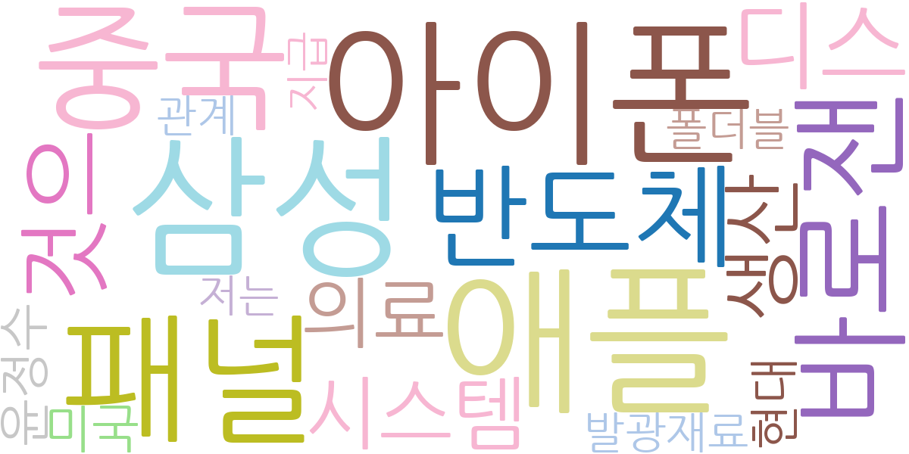
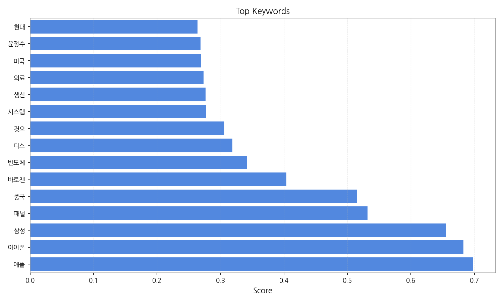
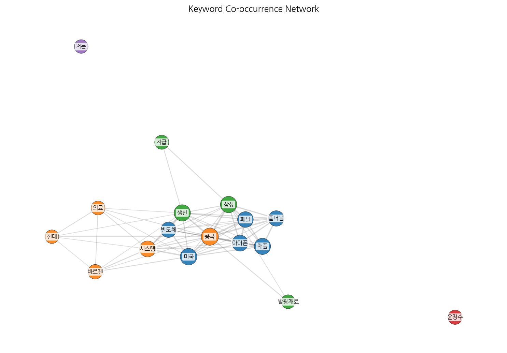
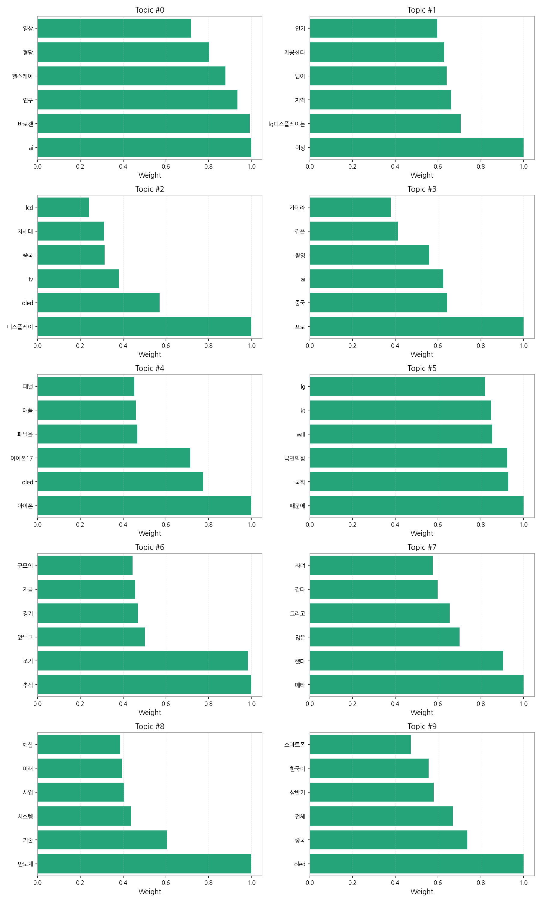
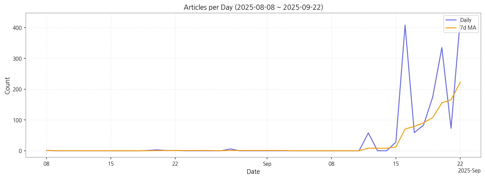

# Weekly/New Biz Report (2025-09-22)

## Executive Summary

- 이번 기간 핵심 토픽과 키워드, 주요 시사점을 요약합니다.

## 뉴스 토픽 분석 요약

**1. 핵심 맥락 설명:**

*   **디스플레이 기술 경쟁 심화:** OLED를 중심으로 차세대 디스플레이 기술 개발 경쟁이 치열하며, 특히 중국 기업들의 성장과 한국 기업과의 경쟁 구도가 두드러집니다. 아이폰 등 주요 스마트폰 제조사들의 디스플레이 패널 채택 동향과 관련 기술 혁신이 주요 관심사입니다.
*   **AI 기술의 헬스케어 및 이미지 분야 적용 확대:** AI 기술이 헬스케어 분야, 특히 혈당 관리 및 의료 영상 분석 등에 활발하게 적용되고 있으며, 관련 연구 개발 및 의료기기 상용화가 진행 중입니다. AI 기반 카메라 기술 발전과 스마트폰 촬영 기능 향상도 주목받고 있습니다.
*   **정치 및 경제 이슈:** 추석을 앞두고 자금 공급, 민생 경제 관련 정책 논의가 활발하며, 국회 및 주요 정당들의 활동과 관련된 이슈들이 보도되고 있습니다. 또한, 반도체 산업 경쟁력 강화 및 미래 기술 확보를 위한 정부 및 기업의 노력이 지속적으로 나타납니다.

**2. 최근 변화/스파이크:**

*   2025년 9월 16일과 22일에 기사 수가 급증했는데, 이는 디스플레이 기술 경쟁 심화, AI 기술의 헬스케어 적용 확대, 정치 및 경제 이슈와 관련된 특정 사건이나 발표가 있었음을 시사합니다. 특히 9월 22일은 가장 높은 기사 수를 기록하여 해당 날짜에 주요 이슈가 집중되었을 가능성이 높습니다.

**3. 실무 인사이트:**

*   **디스플레이 산업 경쟁력 강화 전략 수립:** OLED 기술 우위를 유지하고, 스트레처블 디스플레이 등 차세대 기술 개발에 집중 투자하여 중국 기업과의 기술 격차를 벌리는 전략을 수립해야 합니다.
*   **AI 헬스케어 시장 선점:** AI 기반 헬스케어 솔루션 개발 및 상용화를 가속화하고, 의료기기 인증 및 규제 대응 전략을 마련하여 시장 진입 장벽을 낮춰야 합니다.
*   **정치 및 경제 이슈 모니터링 강화:** 추석 등 주요 명절을 앞두고 발생하는 경제 정책 변화 및 정치적 이슈에 대한 모니터링을 강화하고, 기업 경영 전략에 반영하여 불확실성을 최소화해야 합니다.

## Key Metrics

- 기간: 2025-08-08 ~ 2025-09-22
- 총 기사 수: 1,657
- 문서 수: N/A
- 키워드 수(상위): 15
- 토픽 수: 10
- 시계열 데이터 일자 수: 15

## Top Keywords

| Rank | Keyword | Score |
|---:|---|---:|
| 1 | 애플 | 0.698 |
| 2 | 아이폰 | 0.682 |
| 3 | 삼성 | 0.656 |
| 4 | 패널 | 0.532 |
| 5 | 중국 | 0.515 |
| 6 | 바로잰 | 0.404 |
| 7 | 반도체 | 0.341 |
| 8 | 디스 | 0.319 |
| 9 | 것으 | 0.306 |
| 10 | 시스템 | 0.277 |
| 11 | 생산 | 0.276 |
| 12 | 의료 | 0.273 |
| 13 | 미국 | 0.269 |
| 14 | 윤정수 | 0.269 |
| 15 | 현대 | 0.264 |

## Topics

- ai, 바로잰, 연구 (#0)
  - 대표 단어: ai, 바로잰, 연구, 헬스케어, 혈당, 영상
- 이상, lg디스플레이는, 지역 (#1)
  - 대표 단어: 이상, lg디스플레이는, 지역, 넘어, 제공한다, 인기
- 디스플레이, oled, tv (#2)
  - 대표 단어: 디스플레이, oled, tv, 중국, 차세대, lcd
- 프로, 중국, ai (#3)
  - 대표 단어: 프로, 중국, ai, 촬영, 같은, 카메라
- 아이폰, oled, 아이폰17 (#4)
  - 대표 단어: 아이폰, oled, 아이폰17, 패널을, 애플, 패널
- 때문에, 국회, 국민의힘 (#5)
  - 대표 단어: 때문에, 국회, 국민의힘, will, kt, lg
- 추석, 조기, 앞두고 (#6)
  - 대표 단어: 추석, 조기, 앞두고, 경기, 자금, 규모의
- 메타, 했다, 많은 (#7)
  - 대표 단어: 메타, 했다, 많은, 그리고, 같다, 라며
- 반도체, 기술, 시스템 (#8)
  - 대표 단어: 반도체, 기술, 시스템, 사업, 미래, 핵심
- oled, 중국, 전체 (#9)
  - 대표 단어: oled, 중국, 전체, 상반기, 한국이, 스마트폰

## Trend

- 최근 14~30일 기사 수 추세와 7일 이동평균선을 제공합니다.

## Insights

## 뉴스 토픽 분석 요약

**1. 핵심 맥락 설명:**

*   **디스플레이 기술 경쟁 심화:** OLED를 중심으로 차세대 디스플레이 기술 개발 경쟁이 치열하며, 특히 중국 기업들의 성장과 한국 기업과의 경쟁 구도가 두드러집니다. 아이폰 등 주요 스마트폰 제조사들의 디스플레이 패널 채택 동향과 관련 기술 혁신이 주요 관심사입니다.
*   **AI 기술의 헬스케어 및 이미지 분야 적용 확대:** AI 기술이 헬스케어 분야, 특히 혈당 관리 및 의료 영상 분석 등에 활발하게 적용되고 있으며, 관련 연구 개발 및 의료기기 상용화가 진행 중입니다. AI 기반 카메라 기술 발전과 스마트폰 촬영 기능 향상도 주목받고 있습니다.
*   **정치 및 경제 이슈:** 추석을 앞두고 자금 공급, 민생 경제 관련 정책 논의가 활발하며, 국회 및 주요 정당들의 활동과 관련된 이슈들이 보도되고 있습니다. 또한, 반도체 산업 경쟁력 강화 및 미래 기술 확보를 위한 정부 및 기업의 노력이 지속적으로 나타납니다.

**2. 최근 변화/스파이크:**

*   2025년 9월 16일과 22일에 기사 수가 급증했는데, 이는 디스플레이 기술 경쟁 심화, AI 기술의 헬스케어 적용 확대, 정치 및 경제 이슈와 관련된 특정 사건이나 발표가 있었음을 시사합니다. 특히 9월 22일은 가장 높은 기사 수를 기록하여 해당 날짜에 주요 이슈가 집중되었을 가능성이 높습니다.

**3. 실무 인사이트:**

*   **디스플레이 산업 경쟁력 강화 전략 수립:** OLED 기술 우위를 유지하고, 스트레처블 디스플레이 등 차세대 기술 개발에 집중 투자하여 중국 기업과의 기술 격차를 벌리는 전략을 수립해야 합니다.
*   **AI 헬스케어 시장 선점:** AI 기반 헬스케어 솔루션 개발 및 상용화를 가속화하고, 의료기기 인증 및 규제 대응 전략을 마련하여 시장 진입 장벽을 낮춰야 합니다.
*   **정치 및 경제 이슈 모니터링 강화:** 추석 등 주요 명절을 앞두고 발생하는 경제 정책 변화 및 정치적 이슈에 대한 모니터링을 강화하고, 기업 경영 전략에 반영하여 불확실성을 최소화해야 합니다.

## Opportunities (Top 5)

| Idea | Target | Value Prop | Score |
|---|---|---|---:|
| XR 글래스용 초고해상도 마이크로 OLED 솔루션 | 북미 빅테크 기업 (Apple, Meta, Google 등) | 현존 최고 수준의 초고해상도(10,000 PPI 이상) 마이크로 OLED 디스플레이 제공. 차별점: 자체 개발된 신소재 발광층, 고효율/저전력 소자 구조, 웨이퍼 레벨 광학 기술 적용. | 4.50 |
| AI 기반 디스플레이 공정 자동화 및 수율 개선 솔루션 | 디스플레이 패널 제조사 (LG Display, Samsung Display, BOE 등) | AI 기반 공정 자동화 및 수율 개선 솔루션 제공. 차별점: 머신러닝 기반 불량 예측 모델, 실시간 공정 제어 시스템, 이상 감지 및 자동 복구 기능. | 4.30 |
| 차량용 AR HUD (Augmented Reality Head-Up Display) 솔루션 | 글로벌 완성차 OEM (BMW, Mercedes-Benz, 현대자동차 등) | 운전자 시야를 유지하면서 안전 운전을 지원하는 몰입형 AR HUD 제공. 차별점: MicroLED 기반 고휘도/고해상도 디스플레이, AI 기반 실시간 객체 인식 및 정보 제공, OTA 업데이트 지원. | 4.20 |
| 차세대 QD-MicroLED 소재 및 부품 솔루션 | 디스플레이 패널 제조사 (LG Display, Samsung Display, BOE 등) | 고효율, 고색재현율 QD-MicroLED 소재 및 부품 제공. 차별점: 자체 개발된 QD 소재 합성 기술, MicroLED 전사 기술, 봉지 기술 적용. | 4.00 |
| IT 기기용 스트레처블 OLED 패널 솔루션 | 글로벌 스마트폰 제조사 (Samsung Electronics, Apple, Xiaomi 등) | 자유로운 변형이 가능한 스트레처블 OLED 패널 제공. 차별점: 신축성 기판 및 전극 소재, 유연 소자 설계 기술, 내구성 강화 코팅 기술 적용. | 3.80 |

## Appendix

- 데이터: keywords.json, topics.json, trend_timeseries.json, trend_insights.json, biz_opportunities.json