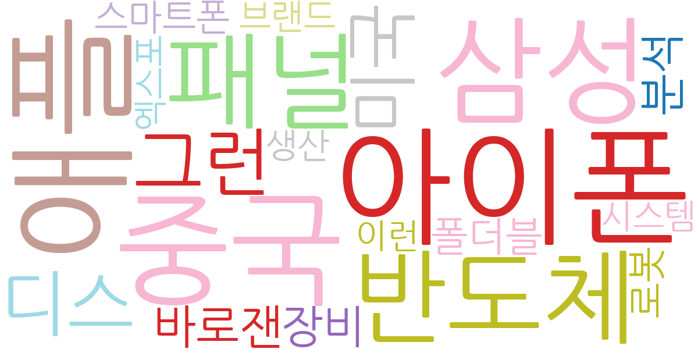
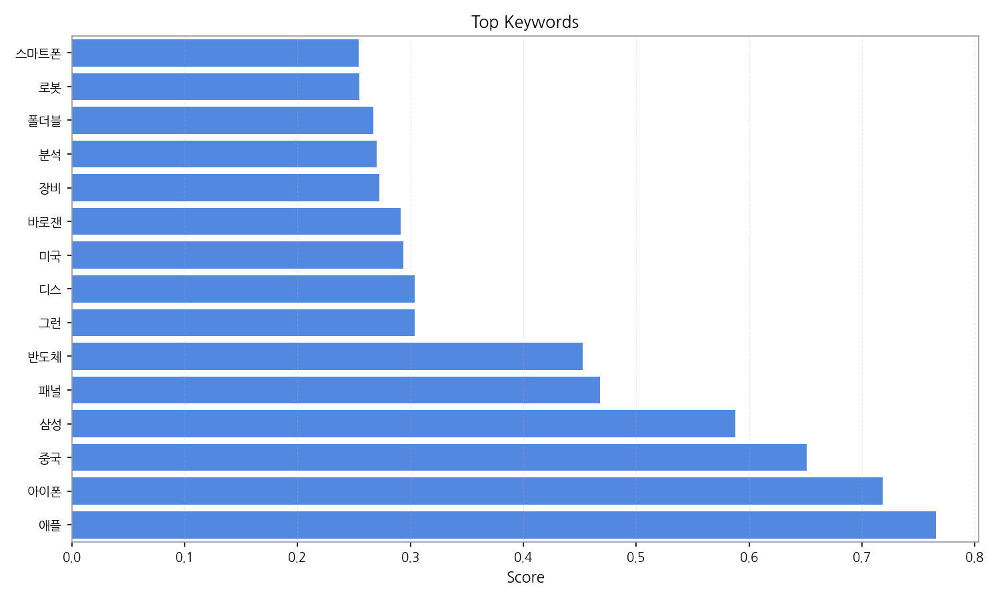
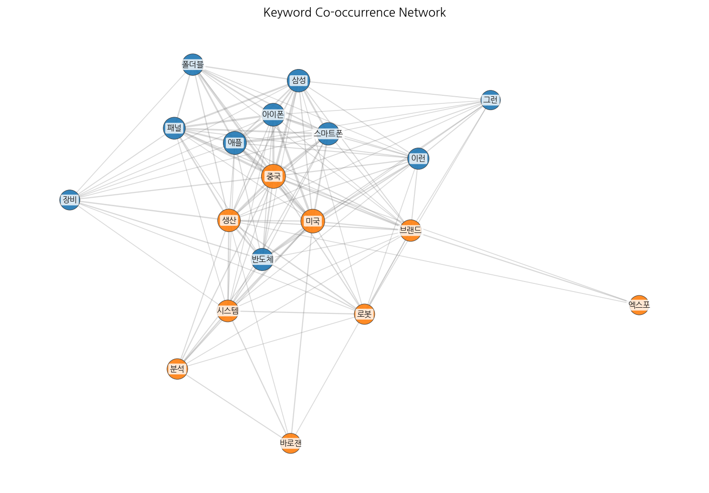
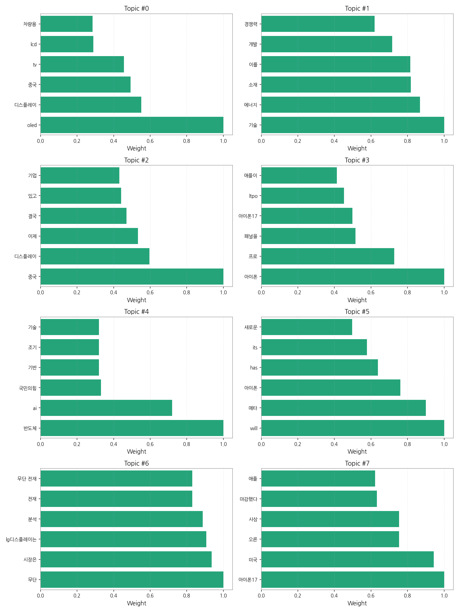
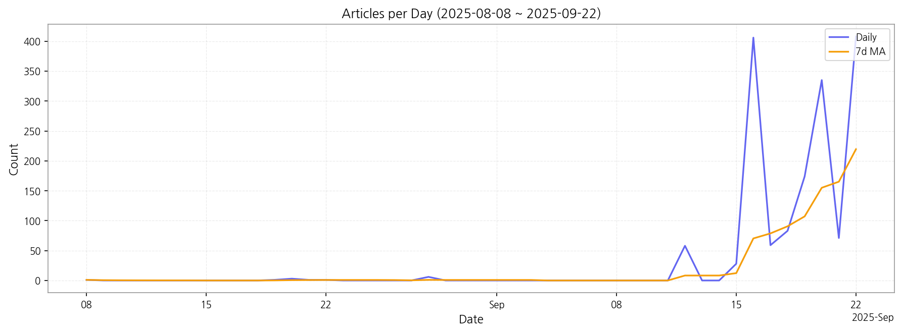

# Weekly/New Biz Report (2025-09-22)

## Executive Summary

- 이번 기간 핵심 토픽과 키워드, 주요 시사점을 요약합니다.

## 뉴스 토픽 분석 및 실무 인사이트

**1. 핵심 맥락 설명 (3가지 주제)**

*   **디스플레이 산업 경쟁 심화:** OLED 기술을 중심으로 디스플레이 시장 경쟁이 심화되고 있으며, 특히 중국 기업들의 성장과 한국 기업들의 기술 경쟁력 확보 노력이 두드러집니다. 차량용 디스플레이 시장 또한 중요한 성장 동력으로 부상하고 있습니다.
*   **미래 기술 투자 및 개발:** 에너지, 소재, AI, 반도체 등 미래 기술 분야에 대한 국가적 투자와 기업들의 기술 개발 경쟁이 활발하게 이루어지고 있으며, 기술 경쟁력 확보를 위한 인프라 구축의 중요성이 강조됩니다.
*   **아이폰 및 IT 기기 관련 동향:** 아이폰 17을 포함한 차세대 아이폰 시리즈와 메타의 AR 기기 등 IT 기기 시장의 최신 동향과 기술 혁신에 대한 관심이 높습니다. 특히 디스플레이 패널 기술과 AI 기술의 발전이 주요 이슈로 부각되고 있습니다.

**2. 최근 변화/스파이크**

*   2025년 9월 16일과 22일에 기사 수가 급증했는데, 이는 아이폰 17 관련 정보 공개 또는 디스플레이 기술 관련 주요 발표와 같은 특정 이벤트가 있었을 가능성이 높습니다. 이러한 스파이크는 시장의 높은 관심도를 반영하며, 관련 기업들의 마케팅 활동이나 투자 결정에 영향을 미칠 수 있습니다.

**3. 실무 인사이트**

*   **디스플레이 기술 경쟁력 강화:** OLED 기술 고도화 및 차세대 디스플레이 기술 개발에 집중 투자하고, 특히 차량용 디스플레이 시장과 같은 새로운 성장 동력을 적극적으로 발굴해야 합니다.
*   **미래 기술 분야 협력 및 투자 확대:** AI, 반도체, 에너지 소재 등 미래 기술 분야에서 기술 경쟁력 확보를 위해 정부, 기업, 연구기관 간의 협력을 강화하고, 적극적인 투자와 인재 양성을 추진해야 합니다.
*   **IT 기기 시장 트렌드 주시 및 선제적 대응:** 아이폰, AR 기기 등 IT 기기 시장의 최신 트렌드를 지속적으로 모니터링하고, 새로운 기술과 폼팩터에 대한 선제적인 연구 개발을 통해 시장 변화에 빠르게 대응해야 합니다.

## Key Metrics

- 기간: 2025-08-08 ~ 2025-09-22
- 총 기사 수: 1,635
- 문서 수: N/A
- 키워드 수(상위): 15
- 토픽 수: 8
- 시계열 데이터 일자 수: 15

## Top Keywords

| Rank | Keyword | Score |
|---:|---|---:|
| 1 | 애플 | 0.765 |
| 2 | 아이폰 | 0.719 |
| 3 | 중국 | 0.651 |
| 4 | 삼성 | 0.588 |
| 5 | 패널 | 0.468 |
| 6 | 반도체 | 0.452 |
| 7 | 그런 | 0.304 |
| 8 | 디스 | 0.304 |
| 9 | 미국 | 0.294 |
| 10 | 바로잰 | 0.291 |
| 11 | 장비 | 0.273 |
| 12 | 분석 | 0.270 |
| 13 | 폴더블 | 0.267 |
| 14 | 로봇 | 0.255 |
| 15 | 스마트폰 | 0.254 |

## Topics

- oled, 디스플레이, 중국 (#0)
  - 대표 단어: oled, 디스플레이, 중국, tv, lcd, 차량용
- 기술, 에너지, 소재 (#1)
  - 대표 단어: 기술, 에너지, 소재, 이를, 개발, 경쟁력
- 중국, 디스플레이, 이제 (#2)
  - 대표 단어: 중국, 디스플레이, 이제, 결국, 있고, 기업
- 아이폰, 프로, 패널을 (#3)
  - 대표 단어: 아이폰, 프로, 패널을, 아이폰17, ltpo, 애플이
- 반도체, ai, 국민의힘 (#4)
  - 대표 단어: 반도체, ai, 국민의힘, 기반, 조기, 기술
- will, 메타, 아이폰 (#5)
  - 대표 단어: will, 메타, 아이폰, has, its, 새로운
- 무단, 시장은, lg디스플레이는 (#6)
  - 대표 단어: 무단, 시장은, lg디스플레이는, 분석, 전재, 무단 전재
- 아이폰17, 미국, 오른 (#7)
  - 대표 단어: 아이폰17, 미국, 오른, 사상, 마감했다, 애플

## Trend

- 최근 14~30일 기사 수 추세와 7일 이동평균선을 제공합니다.

## Insights

## 뉴스 토픽 분석 및 실무 인사이트

**1. 핵심 맥락 설명 (3가지 주제)**

*   **디스플레이 산업 경쟁 심화:** OLED 기술을 중심으로 디스플레이 시장 경쟁이 심화되고 있으며, 특히 중국 기업들의 성장과 한국 기업들의 기술 경쟁력 확보 노력이 두드러집니다. 차량용 디스플레이 시장 또한 중요한 성장 동력으로 부상하고 있습니다.
*   **미래 기술 투자 및 개발:** 에너지, 소재, AI, 반도체 등 미래 기술 분야에 대한 국가적 투자와 기업들의 기술 개발 경쟁이 활발하게 이루어지고 있으며, 기술 경쟁력 확보를 위한 인프라 구축의 중요성이 강조됩니다.
*   **아이폰 및 IT 기기 관련 동향:** 아이폰 17을 포함한 차세대 아이폰 시리즈와 메타의 AR 기기 등 IT 기기 시장의 최신 동향과 기술 혁신에 대한 관심이 높습니다. 특히 디스플레이 패널 기술과 AI 기술의 발전이 주요 이슈로 부각되고 있습니다.

**2. 최근 변화/스파이크**

*   2025년 9월 16일과 22일에 기사 수가 급증했는데, 이는 아이폰 17 관련 정보 공개 또는 디스플레이 기술 관련 주요 발표와 같은 특정 이벤트가 있었을 가능성이 높습니다. 이러한 스파이크는 시장의 높은 관심도를 반영하며, 관련 기업들의 마케팅 활동이나 투자 결정에 영향을 미칠 수 있습니다.

**3. 실무 인사이트**

*   **디스플레이 기술 경쟁력 강화:** OLED 기술 고도화 및 차세대 디스플레이 기술 개발에 집중 투자하고, 특히 차량용 디스플레이 시장과 같은 새로운 성장 동력을 적극적으로 발굴해야 합니다.
*   **미래 기술 분야 협력 및 투자 확대:** AI, 반도체, 에너지 소재 등 미래 기술 분야에서 기술 경쟁력 확보를 위해 정부, 기업, 연구기관 간의 협력을 강화하고, 적극적인 투자와 인재 양성을 추진해야 합니다.
*   **IT 기기 시장 트렌드 주시 및 선제적 대응:** 아이폰, AR 기기 등 IT 기기 시장의 최신 트렌드를 지속적으로 모니터링하고, 새로운 기술과 폼팩터에 대한 선제적인 연구 개발을 통해 시장 변화에 빠르게 대응해야 합니다.

## Opportunities (Top 5)

| Idea | Target | Value Prop | Score |
|---|---|---|---:|
| 개인 맞춤형 XR 글래스용 초저전력 마이크로디스플레이 솔루션 | 북미 빅테크 기업, XR 기기 제조사 | 초저전력 소모, 고해상도, 고주사율 마이크로디스플레이 제공. 경량화 및 발열 최소화. 개인 맞춤형 디자인 및 기능 제공. 몰입감 있는 XR 경험 극대화. | 4.50 |
| 차량용 HUD 증강현실 미디어 플랫폼 | 글로벌 완성차 OEM, 프리미엄 차량 구매 고객 | 운전 중 안전하고 몰입감 있는 AR 기반 미디어 경험 제공. HUD를 통해 내비게이션, 엔터테인먼트, 광고 등 다양한 정보 제공. 운전자 맞춤형 콘텐츠 추천 및 제스처 기반 인터페이스 지원. | 4.20 |
| AI 기반 디스플레이 공정 자동화 및 수율 예측 솔루션 | 디스플레이 제조사, 반도체 제조사 | AI 기반 공정 자동화 및 수율 예측. 불량 발생 가능성 최소화 및 생산 효율성 극대화. 데이터 기반 의사 결정 지원. 제조 비용 절감. | 4.00 |
| IT 기기용 벤더블 OLED 패널 | 글로벌 스마트폰 제조사, 태블릿 제조사 | 뛰어난 내구성과 화질을 갖춘 벤더블 OLED 패널 제공. 다양한 폼팩터 디자인 지원. 휴대성 및 사용성 극대화. 차세대 IT 기기 시장 선점. | 3.80 |
| QD-Color Filter 기반 고색재현율 IT용 OLED 패널 | 그래픽 디자이너, 영상 편집 전문가, 사진 작가 | 기존 OLED 대비 월등한 색재현율 및 색 정확도 제공. 전문가용 작업 환경에 최적화된 디스플레이 솔루션 제공. 고화질 콘텐츠 제작 효율성 향상. | 3.50 |

## Appendix

- 데이터: keywords.json, topics.json, trend_timeseries.json, trend_insights.json, biz_opportunities.json