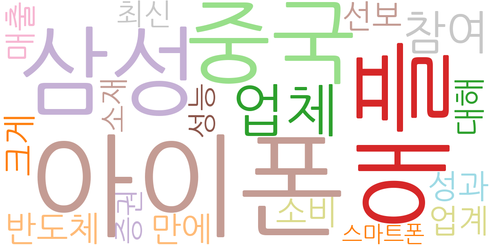
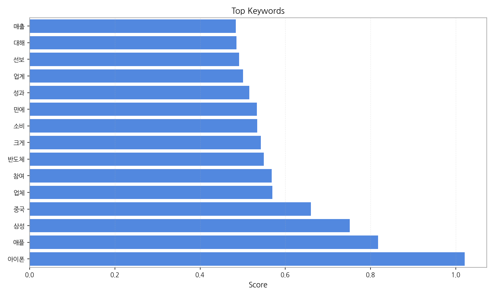
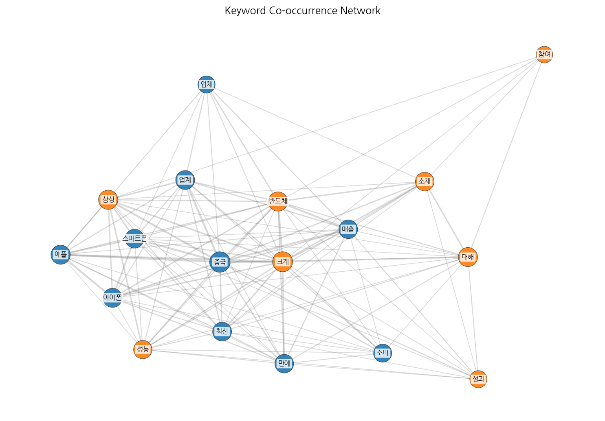
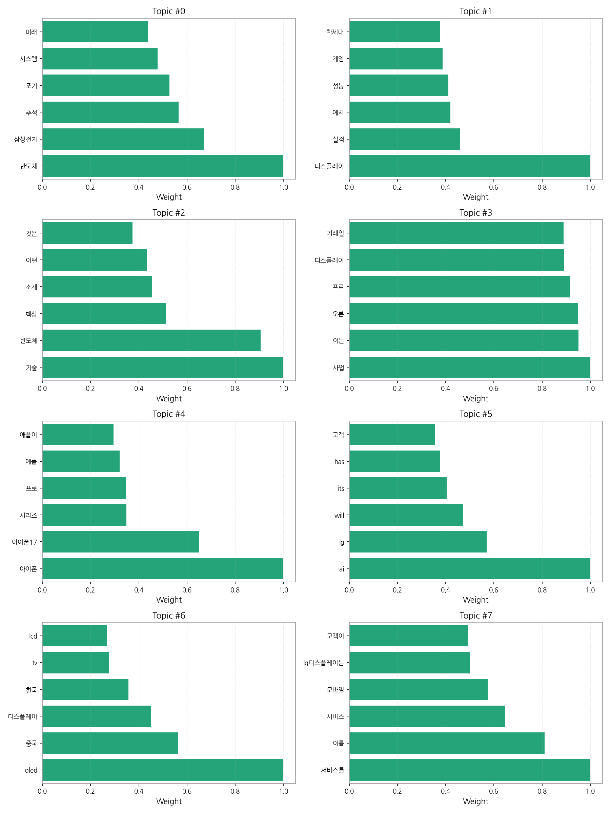
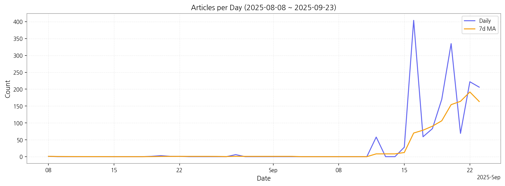

# Weekly/New Biz Report (2025-09-23)

## Executive Summary

- 이번 기간 핵심 토픽과 키워드, 주요 시사점을 요약합니다.

## 데일리 인텔리전스 브리핑

**1. 핵심 맥락:**

*   **OLED 시장 경쟁 심화 및 기술 혁신 가속화:** OLED가 디스플레이 산업의 핵심 기술로 자리매김하면서, 중국 업체의 시장 참여 확대와 함께 한국 기업과의 경쟁이 심화되고 있습니다. 동시에 아이폰을 필두로 한 프리미엄 모바일 기기 시장에서 디스플레이 성능 향상 요구가 높아지면서 차세대 디스플레이 기술 개발 경쟁이 가속화되고 있습니다.
*   **AI 기술 융합을 통한 디스플레이 사업 확장:** AI 기술이 디스플레이 산업 전반에 걸쳐 융합되면서 새로운 사업 기회가 창출되고 있습니다. 특히, AI 기반 화질 개선, 맞춤형 콘텐츠 제공, 사용자 인터페이스 혁신 등을 통해 디스플레이의 가치를 높이는 방향으로 발전하고 있으며, LG를 비롯한 주요 기업들이 AI 기술을 적극적으로 도입하고 있습니다.

**2. 최근 변화/스파이크:**

*   **2025년 9월 16일 기사 수 급증:** 9월 16일에 기사 수가 급증한 것은 '아이폰' 관련 뉴스와 '중국' 업체 관련 뉴스가 복합적으로 작용한 결과로 추정됩니다. 이는 아이폰 신제품 출시와 관련된 디스플레이 패널 공급망 변화, 중국 업체의 OLED 시장 점유율 확대 등이 복합적으로 작용한 결과로 해석될 수 있습니다. 특히, '아이폰17' 관련 키워드는 차세대 디스플레이 기술에 대한 높은 관심을 반영합니다.

**3. 실무 인사이트:**

*   **차세대 디스플레이 기술 개발 로드맵 재검토:** 아이폰을 비롯한 프리미엄 모바일 기기 시장의 고성능 디스플레이 요구에 대응하기 위해, 마이크로 LED, QD-OLED 등 차세대 디스플레이 기술 개발 로드맵을 재검토하고 투자 우선순위를 조정해야 합니다.
*   **AI 기반 디스플레이 솔루션 사업화:** AI 기술을 활용한 화질 개선, 맞춤형 콘텐츠 제공, 사용자 인터페이스 혁신 등 디스플레이 솔루션을 개발하고, 이를 스마트 TV, 모바일 기기, 차량용 디스플레이 등 다양한 분야에 적용하여 새로운 수익 모델을 창출해야 합니다.
*   **중국 시장 경쟁 전략 수립:** 중국 업체의 OLED 시장 점유율 확대에 대응하기 위해, 가격 경쟁력 강화, 기술 차별화, 현지 파트너십 구축 등 다각적인 경쟁 전략을 수립해야 합니다. 특히, 차량용 디스플레이 시장과 같이 성장 가능성이 높은 분야에서 경쟁 우위를 확보하는 것이 중요합니다.

## Key Metrics

- 기간: 2025-08-08 ~ 2025-09-23
- 총 기사 수: 1,647
- 문서 수: N/A
- 키워드 수(상위): 15
- 토픽 수: 8
- 시계열 데이터 일자 수: 16

## Top Keywords

| Rank | Keyword | Score |
|---:|---|---:|
| 1 | 아이폰 | 1.021 |
| 2 | 애플 | 0.818 |
| 3 | 삼성 | 0.751 |
| 4 | 중국 | 0.660 |
| 5 | 업체 | 0.570 |
| 6 | 참여 | 0.568 |
| 7 | 반도체 | 0.550 |
| 8 | 크게 | 0.542 |
| 9 | 소비 | 0.534 |
| 10 | 만에 | 0.534 |
| 11 | 성과 | 0.515 |
| 12 | 업계 | 0.501 |
| 13 | 선보 | 0.491 |
| 14 | 대해 | 0.486 |
| 15 | 매출 | 0.484 |

## Topics

- 반도체, 삼성전자, 추석 (#0)
  - 대표 단어: 반도체, 삼성전자, 추석, 조기, 시스템, 미래
- 디스플레이, 실적, 에서 (#1)
  - 대표 단어: 디스플레이, 실적, 에서, 성능, 게임, 차세대
- 기술, 반도체, 핵심 (#2)
  - 대표 단어: 기술, 반도체, 핵심, 소재, 어떤, 것은
- 사업, 이는, 오른 (#3)
  - 대표 단어: 사업, 이는, 오른, 프로, 디스플레이, 거래일
- 아이폰, 아이폰17, 시리즈 (#4)
  - 대표 단어: 아이폰, 아이폰17, 시리즈, 프로, 애플, 애플이
- ai, lg, will (#5)
  - 대표 단어: ai, lg, will, its, has, 고객
- oled, 중국, 디스플레이 (#6)
  - 대표 단어: oled, 중국, 디스플레이, 한국, tv, lcd
- 서비스를, 이를, 서비스 (#7)
  - 대표 단어: 서비스를, 이를, 서비스, 모바일, lg디스플레이는, 고객이

## Trend

- 최근 14~30일 기사 수 추세와 7일 이동평균선을 제공합니다.

## Insights

## 데일리 인텔리전스 브리핑

**1. 핵심 맥락:**

*   **OLED 시장 경쟁 심화 및 기술 혁신 가속화:** OLED가 디스플레이 산업의 핵심 기술로 자리매김하면서, 중국 업체의 시장 참여 확대와 함께 한국 기업과의 경쟁이 심화되고 있습니다. 동시에 아이폰을 필두로 한 프리미엄 모바일 기기 시장에서 디스플레이 성능 향상 요구가 높아지면서 차세대 디스플레이 기술 개발 경쟁이 가속화되고 있습니다.
*   **AI 기술 융합을 통한 디스플레이 사업 확장:** AI 기술이 디스플레이 산업 전반에 걸쳐 융합되면서 새로운 사업 기회가 창출되고 있습니다. 특히, AI 기반 화질 개선, 맞춤형 콘텐츠 제공, 사용자 인터페이스 혁신 등을 통해 디스플레이의 가치를 높이는 방향으로 발전하고 있으며, LG를 비롯한 주요 기업들이 AI 기술을 적극적으로 도입하고 있습니다.

**2. 최근 변화/스파이크:**

*   **2025년 9월 16일 기사 수 급증:** 9월 16일에 기사 수가 급증한 것은 '아이폰' 관련 뉴스와 '중국' 업체 관련 뉴스가 복합적으로 작용한 결과로 추정됩니다. 이는 아이폰 신제품 출시와 관련된 디스플레이 패널 공급망 변화, 중국 업체의 OLED 시장 점유율 확대 등이 복합적으로 작용한 결과로 해석될 수 있습니다. 특히, '아이폰17' 관련 키워드는 차세대 디스플레이 기술에 대한 높은 관심을 반영합니다.

**3. 실무 인사이트:**

*   **차세대 디스플레이 기술 개발 로드맵 재검토:** 아이폰을 비롯한 프리미엄 모바일 기기 시장의 고성능 디스플레이 요구에 대응하기 위해, 마이크로 LED, QD-OLED 등 차세대 디스플레이 기술 개발 로드맵을 재검토하고 투자 우선순위를 조정해야 합니다.
*   **AI 기반 디스플레이 솔루션 사업화:** AI 기술을 활용한 화질 개선, 맞춤형 콘텐츠 제공, 사용자 인터페이스 혁신 등 디스플레이 솔루션을 개발하고, 이를 스마트 TV, 모바일 기기, 차량용 디스플레이 등 다양한 분야에 적용하여 새로운 수익 모델을 창출해야 합니다.
*   **중국 시장 경쟁 전략 수립:** 중국 업체의 OLED 시장 점유율 확대에 대응하기 위해, 가격 경쟁력 강화, 기술 차별화, 현지 파트너십 구축 등 다각적인 경쟁 전략을 수립해야 합니다. 특히, 차량용 디스플레이 시장과 같이 성장 가능성이 높은 분야에서 경쟁 우위를 확보하는 것이 중요합니다.

## Opportunities (Top 5)

| Idea | Target | Value Prop | Score |
|---|---|---|---:|
| 초고해상도 마이크로 LED 기반 AR 글래스용 디스플레이 모듈 | 북미 빅테크 기업 (AR/VR 디바이스 제조사) | 최고 수준의 해상도, 밝기, 명암비를 제공하여 몰입감 있는 AR 경험 구현, 소형화 및 저전력 설계를 통해 AR 글래스 디자인 자유도 향상 | 4.50 |
| AI 기반 디스플레이 공정 자동화 및 수율 개선 솔루션 | 국내외 디스플레이 패널 제조사 | 공정 자동화 및 최적화, 불량 예측 및 조기 대응, 수율 향상 및 생산 비용 절감 | 4.30 |
| AI 기반 개인 맞춤형 차량용 디스플레이 솔루션 | 글로벌 완성차 OEM (프리미엄 브랜드 중심) | 운전자 맞춤형 정보 제공, 안전 운전 지원, 엔터테인먼트 경험 극대화를 통해 차량 가치 향상 및 브랜드 차별화 | 4.20 |
| QD-Color Filter 기반 고색재현율 OLED 소재 | 글로벌 OLED 패널 제조사 (LG디스플레이, 삼성디스플레이) | OLED의 장점은 유지하면서 색재현율 극대화, 기존 OLED 제조 공정과의 호환성 확보, 차세대 디스플레이 시장 선점 | 4.00 |
| IT 기기용 벤더블 OLED 패널 | 글로벌 IT 기기 제조사 (삼성전자, LG전자, Apple) | 휴대성 및 사용성 극대화, 새로운 폼팩터 디자인 가능성 제시, 차별화된 사용자 경험 제공 | 3.80 |

## Appendix

- 데이터: keywords.json, topics.json, trend_timeseries.json, trend_insights.json, biz_opportunities.json