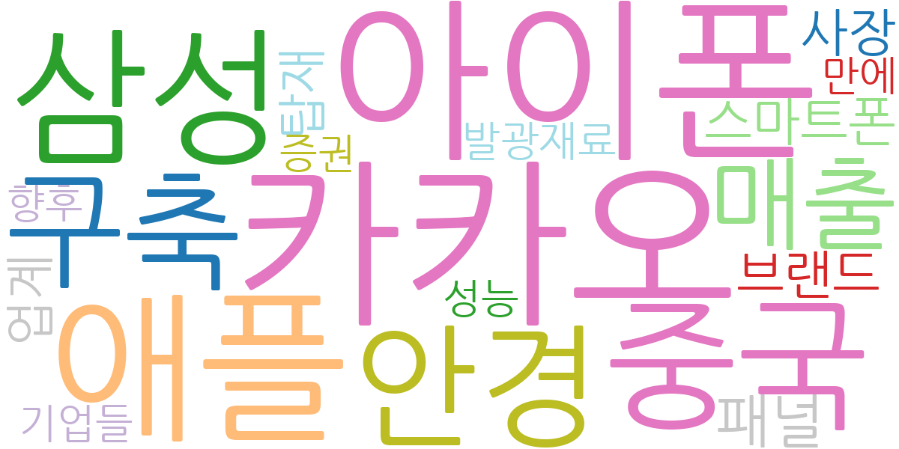
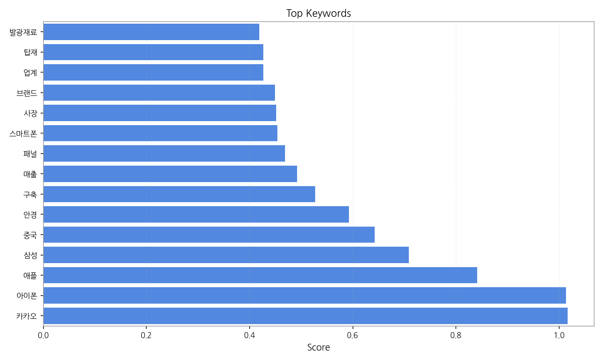
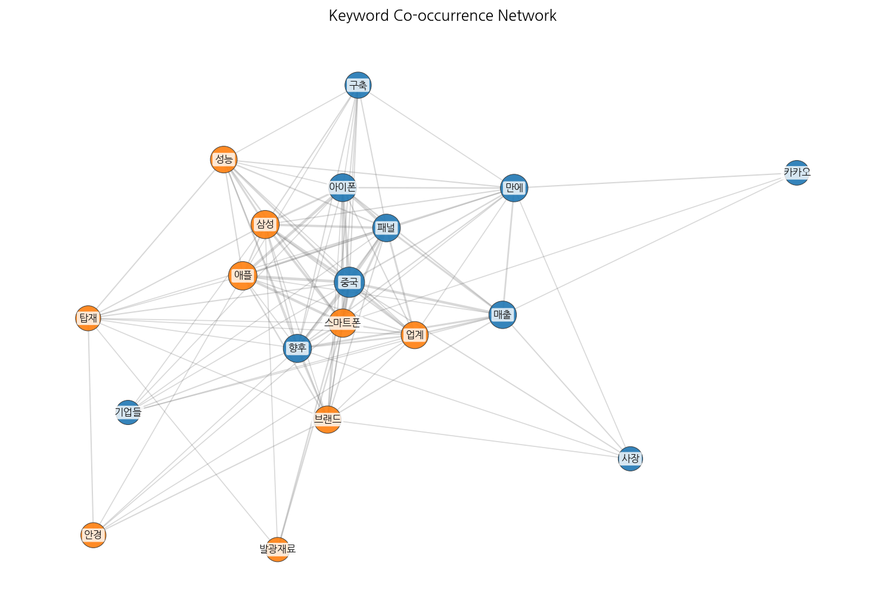
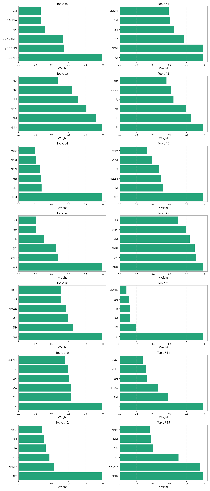

# Weekly/New Biz Report (2025-09-23)

## Executive Summary

- 이번 기간 핵심 토픽과 키워드, 주요 시사점을 요약합니다.

## 데일리 인텔리전스 브리핑 (디스플레이 산업)

**1. 핵심 맥락:**

*   **OLED 시장 경쟁 심화 및 기술 혁신 가속화:** OLED 관련 토픽(Topic 6)과 '디스플레이', 'LG디스플레이', '중국', '패널', '스마트폰' 등의 키워드를 통해 OLED 시장 경쟁이 심화되고 있으며, 특히 중국 시장에서의 경쟁 우위 확보를 위한 기술 혁신이 중요해지고 있음을 알 수 있습니다. 동시에 '차량용' OLED 언급은 새로운 응용처 확대를 위한 노력이 진행 중임을 시사합니다.
*   **AI 기술 융합 및 사업 확장 모색:** AI 관련 토픽(Topic 9, 11)과 '기업', '성장', '한국', '플랫폼' 등의 키워드를 통해 디스플레이 산업 전반에 AI 기술 융합이 활발하게 이루어지고 있으며, 새로운 사업 기회 발굴 및 기존 사업 고도화를 위한 노력이 진행 중임을 파악할 수 있습니다. AR/VR 관련 토픽(Topic 10) 또한 AI와 함께 디스플레이 기술의 미래를 이끌어갈 핵심 동력으로 작용할 가능성이 높습니다.
*   **아이폰 17 출시 관련 동향 주목:** '아이폰', '아이폰17', '애플', '카메라' 등의 키워드를 포함하는 토픽(Topic 13)은 아이폰 17 출시와 관련된 시장의 높은 관심도를 보여줍니다. 특히 '프로', '시리즈' 등의 키워드를 통해 고사양 모델에 대한 기대감이 높으며, 디스플레이 기술 변화에 대한 관심이 집중되고 있음을 알 수 있습니다.

**2. 최근 변화/스파이크:**

*   **2025년 9월 16일 급증:** 2025년 9월 16일에 기사 수가 급증한 것은 '아이폰', '애플', '중국', '패널', '스마트폰' 등의 키워드와 연관되어 있을 가능성이 높습니다. 이는 아이폰 17 출시 임박에 따른 기대감 고조, 중국 시장 내 경쟁 심화, 새로운 디스플레이 패널 기술 적용 가능성 등이 복합적으로 작용한 결과로 추론할 수 있습니다. 특히, 아이폰 17에 적용될 디스플레이 기술 관련 뉴스가 집중적으로 보도되면서 스파이크가 발생했을 가능성이 높습니다.

**3. 실무 인사이트:**

*   **차세대 OLED 기술 개발 및 투자 확대:** 중국 시장 경쟁 우위 확보 및 차량용, AR/VR 등 새로운 응용처 확대를 위해 차세대 OLED 기술(탠덤 OLED, 플렉서블 OLED 등) 개발 및 투자를 확대해야 합니다. 특히, AI 기술과의 융합을 통해 디스플레이 성능을 극대화하고 사용자 경험을 향상시키는 방향으로 연구 개발을 진행해야 합니다.
*   **AI 기반 디스플레이 솔루션 개발 및 사업화:** AI 기술을 활용하여 디스플레이 화질 개선, 전력 효율 향상, 사용자 맞춤형 콘텐츠 제공 등 다양한 솔루션을 개발하고 사업화해야 합니다. 특히, AI 기반 이미지 처리 기술, 객체 인식 기술 등을 디스플레이에 적용하여 새로운 가치를 창출할 수 있습니다.
*   **애플 아이폰 17 출시 관련 시장 동향 면밀 분석:** 아이폰 17에 적용될 디스플레이 기술 변화를 면밀히 분석하고, 경쟁사 제품과의 차별화 전략을 수립해야 합니다. 특히, 아이폰 17에 폴더블 디스플레이, 언더 패널 카메라(UPC) 등 혁신적인 기술이 적용될 가능성을 염두에 두고 관련 기술 개발에 적극적으로 투자해야 합니다.

## Key Metrics

- 기간: 2025-08-08 ~ 2025-09-23
- 총 기사 수: 1,639
- 문서 수: N/A
- 키워드 수(상위): 15
- 토픽 수: 14
- 시계열 데이터 일자 수: 16

## Top Keywords

| Rank | Keyword | Score |
|---:|---|---:|
| 1 | 카카오 | 1.017 |
| 2 | 아이폰 | 1.013 |
| 3 | 애플 | 0.841 |
| 4 | 삼성 | 0.709 |
| 5 | 중국 | 0.642 |
| 6 | 안경 | 0.593 |
| 7 | 구축 | 0.527 |
| 8 | 매출 | 0.492 |
| 9 | 패널 | 0.469 |
| 10 | 스마트폰 | 0.454 |
| 11 | 사장 | 0.452 |
| 12 | 브랜드 | 0.449 |
| 13 | 업계 | 0.427 |
| 14 | 탑재 | 0.426 |
| 15 | 발광재료 | 0.419 |

## Topics

- 디스플레이, lg디스플레이, lg디스플레이는 (#0)
  - 대표 단어: 디스플레이, lg디스플레이, lg디스플레이는, 성능, 디스플레이는, 등의
- 어떤, 어떻게, 것은 (#1)
  - 대표 단어: 어떤, 어떻게, 것은, 것이, 해서, 과정에서
- 것이다, 산업, 에너지 (#2)
  - 대표 단어: 것이다, 산업, 에너지, 미래, 이를, 개발
- will, its, has (#3)
  - 대표 단어: will, its, has, lg, company, also
- 반도체, 미국, 사업 (#4)
  - 대표 단어: 반도체, 미국, 사업, 메모리, 시스템, 사업을
- 인도, 게임, 지원한다 (#5)
  - 대표 단어: 인도, 게임, 지원한다, 추석, 규모의, 서비스
- oled, 디스플레이, 중국 (#6)
  - 대표 단어: oled, 디스플레이, 중국, tv, 패널, lcd
- 모습을, 실적, 하지만 (#7)
  - 대표 단어: 모습을, 실적, 하지만, 가장, 삼성sdi, 라며
- 홍보, 공동, 연구 (#8)
  - 대표 단어: 홍보, 공동, 연구, 바탕으로, lcd, 기술을
- ai, 기업, 성장 (#9)
  - 대표 단어: ai, 기업, 성장, lg, 한국, 인공지능
- ar, 오는, 인도 (#10)
  - 대표 단어: ar, 오는, 인도, 현지, vr, 디스플레이
- ai, 기업, 카카오톡 (#11)
  - 대표 단어: ai, 기업, 카카오톡, 한국, 서비스, 기업의
- 탁류, 박서함은, 디즈니 (#12)
  - 대표 단어: 탁류, 박서함은, 디즈니, 너무, 많이, 작품을
- 아이폰, 아이폰17, 프로 (#13)
  - 대표 단어: 아이폰, 아이폰17, 프로, 애플, 카메라, 시리즈

## Trend

- 최근 14~30일 기사 수 추세와 7일 이동평균선을 제공합니다.

## Insights

## 데일리 인텔리전스 브리핑 (디스플레이 산업)

**1. 핵심 맥락:**

*   **OLED 시장 경쟁 심화 및 기술 혁신 가속화:** OLED 관련 토픽(Topic 6)과 '디스플레이', 'LG디스플레이', '중국', '패널', '스마트폰' 등의 키워드를 통해 OLED 시장 경쟁이 심화되고 있으며, 특히 중국 시장에서의 경쟁 우위 확보를 위한 기술 혁신이 중요해지고 있음을 알 수 있습니다. 동시에 '차량용' OLED 언급은 새로운 응용처 확대를 위한 노력이 진행 중임을 시사합니다.
*   **AI 기술 융합 및 사업 확장 모색:** AI 관련 토픽(Topic 9, 11)과 '기업', '성장', '한국', '플랫폼' 등의 키워드를 통해 디스플레이 산업 전반에 AI 기술 융합이 활발하게 이루어지고 있으며, 새로운 사업 기회 발굴 및 기존 사업 고도화를 위한 노력이 진행 중임을 파악할 수 있습니다. AR/VR 관련 토픽(Topic 10) 또한 AI와 함께 디스플레이 기술의 미래를 이끌어갈 핵심 동력으로 작용할 가능성이 높습니다.
*   **아이폰 17 출시 관련 동향 주목:** '아이폰', '아이폰17', '애플', '카메라' 등의 키워드를 포함하는 토픽(Topic 13)은 아이폰 17 출시와 관련된 시장의 높은 관심도를 보여줍니다. 특히 '프로', '시리즈' 등의 키워드를 통해 고사양 모델에 대한 기대감이 높으며, 디스플레이 기술 변화에 대한 관심이 집중되고 있음을 알 수 있습니다.

**2. 최근 변화/스파이크:**

*   **2025년 9월 16일 급증:** 2025년 9월 16일에 기사 수가 급증한 것은 '아이폰', '애플', '중국', '패널', '스마트폰' 등의 키워드와 연관되어 있을 가능성이 높습니다. 이는 아이폰 17 출시 임박에 따른 기대감 고조, 중국 시장 내 경쟁 심화, 새로운 디스플레이 패널 기술 적용 가능성 등이 복합적으로 작용한 결과로 추론할 수 있습니다. 특히, 아이폰 17에 적용될 디스플레이 기술 관련 뉴스가 집중적으로 보도되면서 스파이크가 발생했을 가능성이 높습니다.

**3. 실무 인사이트:**

*   **차세대 OLED 기술 개발 및 투자 확대:** 중국 시장 경쟁 우위 확보 및 차량용, AR/VR 등 새로운 응용처 확대를 위해 차세대 OLED 기술(탠덤 OLED, 플렉서블 OLED 등) 개발 및 투자를 확대해야 합니다. 특히, AI 기술과의 융합을 통해 디스플레이 성능을 극대화하고 사용자 경험을 향상시키는 방향으로 연구 개발을 진행해야 합니다.
*   **AI 기반 디스플레이 솔루션 개발 및 사업화:** AI 기술을 활용하여 디스플레이 화질 개선, 전력 효율 향상, 사용자 맞춤형 콘텐츠 제공 등 다양한 솔루션을 개발하고 사업화해야 합니다. 특히, AI 기반 이미지 처리 기술, 객체 인식 기술 등을 디스플레이에 적용하여 새로운 가치를 창출할 수 있습니다.
*   **애플 아이폰 17 출시 관련 시장 동향 면밀 분석:** 아이폰 17에 적용될 디스플레이 기술 변화를 면밀히 분석하고, 경쟁사 제품과의 차별화 전략을 수립해야 합니다. 특히, 아이폰 17에 폴더블 디스플레이, 언더 패널 카메라(UPC) 등 혁신적인 기술이 적용될 가능성을 염두에 두고 관련 기술 개발에 적극적으로 투자해야 합니다.

## Opportunities (Top 5)

| Idea | Target | Value Prop | Score |
|---|---|---|---:|
| 메타버스 협업용 초저지연 XR 글래스 | 북미 빅테크 기업 (메타버스 플랫폼 사업자), 글로벌 엔터프라이즈 기업 | 초저지연 통신 및 고해상도 마이크로디스플레이 기술을 통해 현실과 같은 몰입감 제공, 경량 디자인 및 인체공학적 설계로 장시간 사용 편의성 극대화, 실시간 3D 아바타 트래킹 및 제스처 인식 기능 지원 | 4.50 |
| AR 글래스용 초소형/고효율 Micro-LED 모듈 | AR 글래스 제조사, 북미 빅테크 기업 (AR/VR 디바이스 개발 부서) | 초소형/경량 디자인으로 AR 글래스 휴대성 극대화, 높은 밝기 및 명암비로 선명한 AR 경험 제공, 저전력 설계로 배터리 사용 시간 증대 | 4.30 |
| 차량용 HUD(Head-Up Display) 증강현실 솔루션 | 글로벌 완성차 OEM (Tier 1 공급사 포함) | 운전자의 시선 이동 최소화 및 직관적인 정보 제공으로 안전 운전 환경 조성, AR 기반의 풍부한 정보 제공으로 사용자 경험 극대화, 기존 HUD 대비 넓은 시야각 및 고해상도 제공 | 4.20 |
| IT 기기용 탠덤 OLED 기반 초고화질/저전력 디스플레이 | 글로벌 스마트폰 제조사 (애플, 삼성전자), IT 기기 OEM | 기존 OLED 대비 2배 이상 향상된 밝기 및 수명 제공, 저전력 설계로 배터리 사용 시간 증대, 폴더블, 롤러블 등 다양한 폼팩터 지원 | 4.00 |
| AI 기반 디스플레이 공정 자동화 및 수율 예측 솔루션 | 디스플레이 제조사 (OLED, LCD, MicroLED) | AI 기반의 실시간 공정 데이터 분석 및 수율 예측, 공정 자동화 및 최적화로 생산 효율성 극대화, 불량 예측 및 조기 대응으로 불량률 감소, 인건비 절감 및 생산 비용 감소 | 3.80 |

## Appendix

- 데이터: keywords.json, topics.json, trend_timeseries.json, trend_insights.json, biz_opportunities.json