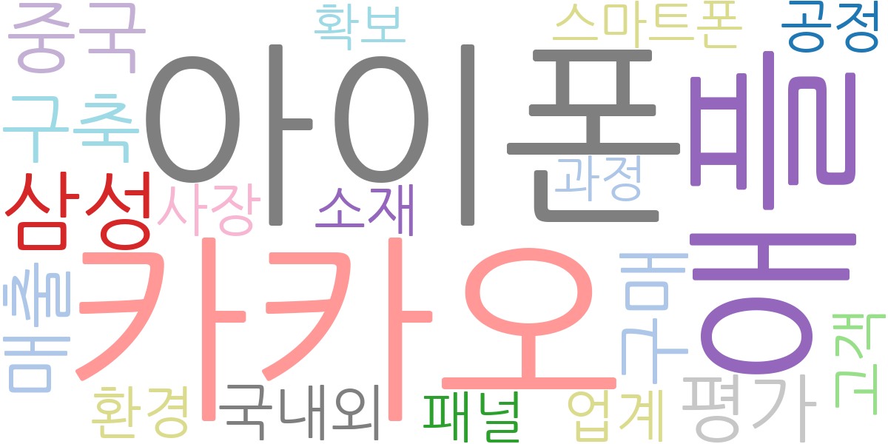
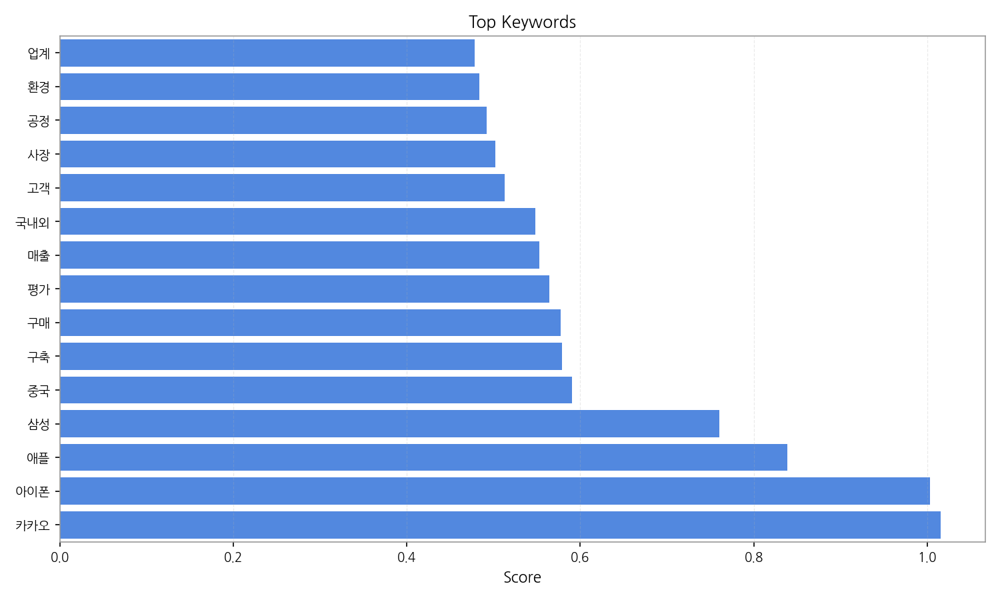
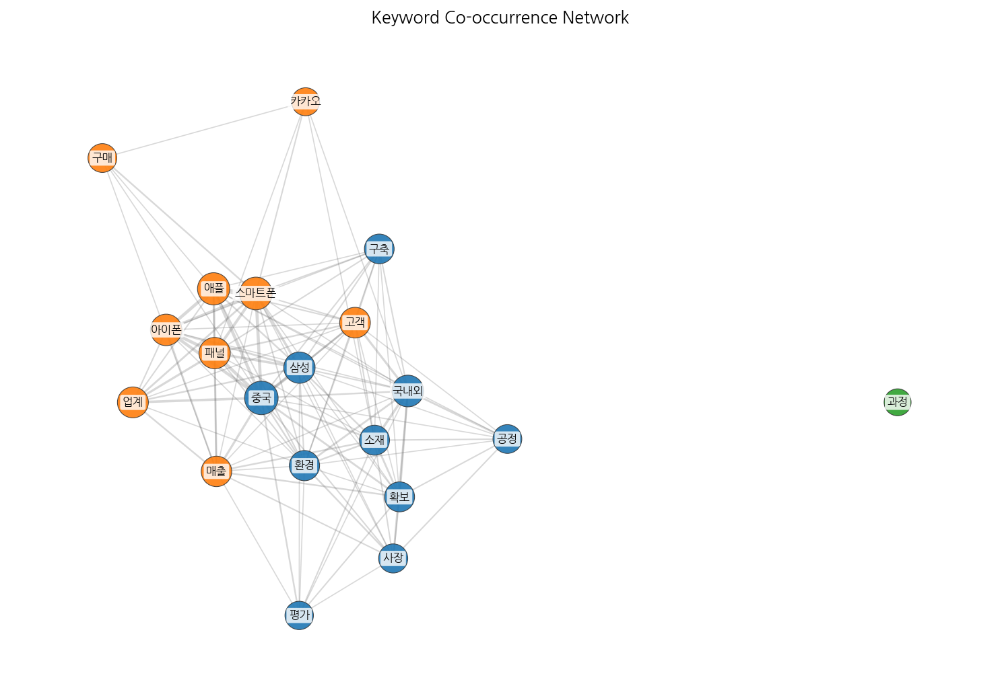
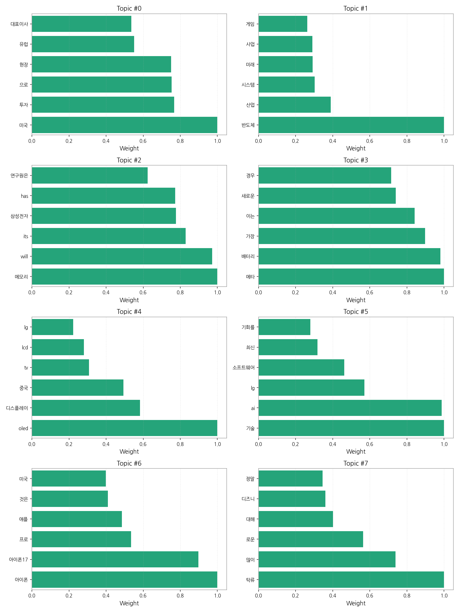
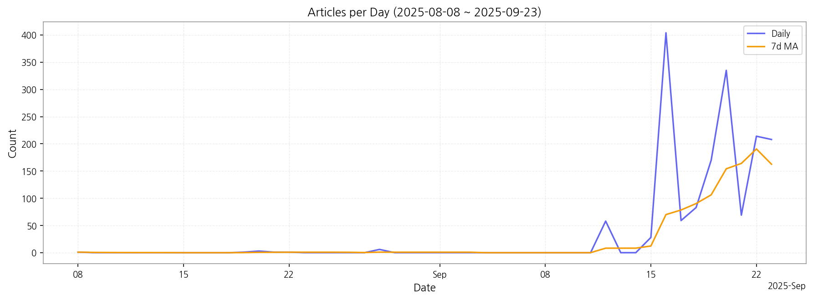

# Weekly/New Biz Report (2025-09-23)

## Executive Summary

- 이번 기간 핵심 토픽과 키워드, 주요 시사점을 요약합니다.

## 데일리 인텔리전스 브리핑

**1. 핵심 맥락:**

*   **OLED 시장 경쟁 심화 및 기술 혁신 가속화:** 'OLED', '디스플레이', '중국', '아이폰', '애플' 키워드를 통해 OLED 시장에서 중국 업체의 성장과 애플의 아이폰을 중심으로 한 OLED 채택 확대가 경쟁 심화를 야기하고 있음을 알 수 있으며, '메타', '배터리', '디스플레이', '소재' 키워드는 메타버스 기기 및 배터리 기술 발전에 따른 새로운 디스플레이 소재 혁신이 활발하게 진행 중임을 시사합니다.
*   **미래 기술 투자 및 사업 다각화:** '반도체', '산업', '시스템', '미래', '사업', 'AI', '기술' 키워드는 디스플레이 산업의 미래를 위해 반도체, AI 기술과의 융합을 통한 사업 다각화 및 기술 경쟁력 확보가 중요해지고 있음을 나타냅니다. 특히 '미국', '투자', '유럽' 키워드는 해외 투자를 통한 시장 확대 및 기술 확보 전략이 활발하게 추진되고 있음을 보여줍니다.

**2. 최근 변화/스파이크:**

*   **2025년 9월 16일 기사 수 급증:** 9월 16일에 기사 수가 404건으로 급증한 것은 '아이폰', '애플', '삼성', '중국' 키워드와 연관 지어 볼 때, 아이폰 신제품 출시, 애플의 디스플레이 공급망 변화, 또는 삼성과 중국 업체 간의 디스플레이 시장 경쟁 관련 이슈가 복합적으로 작용한 결과로 추정됩니다. 특히 아이폰 관련 뉴스가 디스플레이 산업에 미치는 영향력이 매우 크다는 것을 알 수 있습니다.

**3. 실무 인사이트:**

*   **차세대 디스플레이 소재 개발 및 투자 확대:** 메타버스 시장 확대를 고려하여 VR/AR 기기에 적합한 고성능, 저전력 디스플레이 소재 개발에 집중하고, 관련 기술을 보유한 스타트업 투자 또는 협력을 적극적으로 추진해야 합니다.
*   **AI 기반 디스플레이 기술 경쟁력 강화:** AI 기술을 활용하여 디스플레이 화질 개선, 전력 효율 최적화, 생산 공정 자동화 등 다양한 분야에서 기술 혁신을 추진하고, AI 기반 디스플레이 솔루션 개발을 통해 새로운 시장 기회를 창출해야 합니다.
*   **중국 시장 변화에 대한 민감한 대응:** 중국 디스플레이 업체의 기술력 향상 및 시장 점유율 확대에 대한 지속적인 모니터링을 통해 경쟁 우위를 유지하기 위한 차별화된 기술 전략 및 시장 전략을 수립하고, 중국 시장 내 파트너십 강화 또는 새로운 사업 모델 개발을 고려해야 합니다.

## Key Metrics

- 기간: 2025-08-08 ~ 2025-09-23
- 총 기사 수: 1,641
- 문서 수: N/A
- 키워드 수(상위): 15
- 토픽 수: 8
- 시계열 데이터 일자 수: 16

## Top Keywords

| Rank | Keyword | Score |
|---:|---|---:|
| 1 | 카카오 | 1.016 |
| 2 | 아이폰 | 1.003 |
| 3 | 애플 | 0.838 |
| 4 | 삼성 | 0.760 |
| 5 | 중국 | 0.590 |
| 6 | 구축 | 0.579 |
| 7 | 구매 | 0.577 |
| 8 | 평가 | 0.564 |
| 9 | 매출 | 0.553 |
| 10 | 국내외 | 0.548 |
| 11 | 고객 | 0.512 |
| 12 | 사장 | 0.502 |
| 13 | 공정 | 0.492 |
| 14 | 환경 | 0.483 |
| 15 | 업계 | 0.478 |

## Topics

- 미국, 투자, 으로 (#0)
  - 대표 단어: 미국, 투자, 으로, 현장, 유럽, 대표이사
- 반도체, 산업, 시스템 (#1)
  - 대표 단어: 반도체, 산업, 시스템, 미래, 사업, 게임
- 메모리, will, its (#2)
  - 대표 단어: 메모리, will, its, 삼성전자, has, 연구원은
- 메타, 배터리, 가장 (#3)
  - 대표 단어: 메타, 배터리, 가장, 이는, 새로운, 경우
- oled, 디스플레이, 중국 (#4)
  - 대표 단어: oled, 디스플레이, 중국, tv, lcd, lg
- 기술, ai, lg (#5)
  - 대표 단어: 기술, ai, lg, 소프트웨어, 최신, 기회를
- 아이폰, 아이폰17, 프로 (#6)
  - 대표 단어: 아이폰, 아이폰17, 프로, 애플, 것은, 미국
- 탁류, 많이, 로운 (#7)
  - 대표 단어: 탁류, 많이, 로운, 대해, 디즈니, 정말

## Trend

- 최근 14~30일 기사 수 추세와 7일 이동평균선을 제공합니다.

## Insights

## 데일리 인텔리전스 브리핑

**1. 핵심 맥락:**

*   **OLED 시장 경쟁 심화 및 기술 혁신 가속화:** 'OLED', '디스플레이', '중국', '아이폰', '애플' 키워드를 통해 OLED 시장에서 중국 업체의 성장과 애플의 아이폰을 중심으로 한 OLED 채택 확대가 경쟁 심화를 야기하고 있음을 알 수 있으며, '메타', '배터리', '디스플레이', '소재' 키워드는 메타버스 기기 및 배터리 기술 발전에 따른 새로운 디스플레이 소재 혁신이 활발하게 진행 중임을 시사합니다.
*   **미래 기술 투자 및 사업 다각화:** '반도체', '산업', '시스템', '미래', '사업', 'AI', '기술' 키워드는 디스플레이 산업의 미래를 위해 반도체, AI 기술과의 융합을 통한 사업 다각화 및 기술 경쟁력 확보가 중요해지고 있음을 나타냅니다. 특히 '미국', '투자', '유럽' 키워드는 해외 투자를 통한 시장 확대 및 기술 확보 전략이 활발하게 추진되고 있음을 보여줍니다.

**2. 최근 변화/스파이크:**

*   **2025년 9월 16일 기사 수 급증:** 9월 16일에 기사 수가 404건으로 급증한 것은 '아이폰', '애플', '삼성', '중국' 키워드와 연관 지어 볼 때, 아이폰 신제품 출시, 애플의 디스플레이 공급망 변화, 또는 삼성과 중국 업체 간의 디스플레이 시장 경쟁 관련 이슈가 복합적으로 작용한 결과로 추정됩니다. 특히 아이폰 관련 뉴스가 디스플레이 산업에 미치는 영향력이 매우 크다는 것을 알 수 있습니다.

**3. 실무 인사이트:**

*   **차세대 디스플레이 소재 개발 및 투자 확대:** 메타버스 시장 확대를 고려하여 VR/AR 기기에 적합한 고성능, 저전력 디스플레이 소재 개발에 집중하고, 관련 기술을 보유한 스타트업 투자 또는 협력을 적극적으로 추진해야 합니다.
*   **AI 기반 디스플레이 기술 경쟁력 강화:** AI 기술을 활용하여 디스플레이 화질 개선, 전력 효율 최적화, 생산 공정 자동화 등 다양한 분야에서 기술 혁신을 추진하고, AI 기반 디스플레이 솔루션 개발을 통해 새로운 시장 기회를 창출해야 합니다.
*   **중국 시장 변화에 대한 민감한 대응:** 중국 디스플레이 업체의 기술력 향상 및 시장 점유율 확대에 대한 지속적인 모니터링을 통해 경쟁 우위를 유지하기 위한 차별화된 기술 전략 및 시장 전략을 수립하고, 중국 시장 내 파트너십 강화 또는 새로운 사업 모델 개발을 고려해야 합니다.

## Opportunities (Top 5)

| Idea | Target | Value Prop | Score |
|---|---|---|---:|
| 초고해상도 마이크로 OLED 기반 AR 글래스용 디스플레이 모듈 | 북미 빅테크 기업 (AR/VR 디바이스 개발 부서) | 기존 대비 2배 이상 높은 해상도와 밝기를 제공하는 초고해상도 마이크로 OLED 디스플레이 모듈. 향상된 화질과 몰입감, 저전력 설계로 AR 글래스 사용 시간 극대화. 경쟁사 대비 뛰어난 소형화 기술 및 생산 능력. | 4.50 |
| AI 기반 디스플레이 공정 자동화 및 수율 예측 시스템 | 디스플레이 제조 기업 (OLED, MicroLED 라인) | AI 기반 실시간 데이터 분석 및 예측 모델을 통해 디스플레이 제조 공정의 효율성 극대화. 불량 발생 가능성을 사전에 감지하여 수율 향상 및 비용 절감. 경쟁사 대비 높은 정확도의 예측 모델 및 사용자 친화적인 인터페이스 제공. | 4.30 |
| AI 기반 차량용 HUD 증강현실 솔루션 | 글로벌 완성차 OEM (프리미엄 브랜드 중심) | AI 기반 객체 인식 및 예측 기술을 통해 운전자에게 실시간 도로 상황 정보를 증강현실로 제공, 운전 편의성 및 안전성 극대화. 경쟁사 대비 높은 몰입감과 정확도를 제공하는 차세대 HUD 솔루션. | 4.20 |
| 퀀텀닷 컬러 필터 기반 MicroLED 디스플레이 | 프리미엄 TV 제조사, 디지털 사이니지 기업 | 퀀텀닷 컬러 필터 기술을 통해 MicroLED 디스플레이의 색 재현율과 휘도 향상, 생산 비용 절감. 기존 MicroLED 디스플레이 대비 뛰어난 화질과 에너지 효율을 제공하며, 다양한 크기의 디스플레이에 적용 가능. 경쟁사 대비 높은 양산 능력 및 가격 경쟁력. | 4.00 |
| IT 기기용 벤더블 OLED 패널 솔루션 | 글로벌 스마트폰 제조사, 태블릿 제조사 | 기존 벤더블 OLED 대비 향상된 내구성과 유연성을 제공하는 벤더블 OLED 패널 솔루션. 힌지리스 디자인 구현 및 UTG 대체 소재 적용으로 폴더블 기기의 디자인 혁신 및 사용자 경험 향상. 경쟁사 대비 뛰어난 벤딩 수명 및 화질 안정성. | 3.80 |

## Appendix

- 데이터: keywords.json, topics.json, trend_timeseries.json, trend_insights.json, biz_opportunities.json