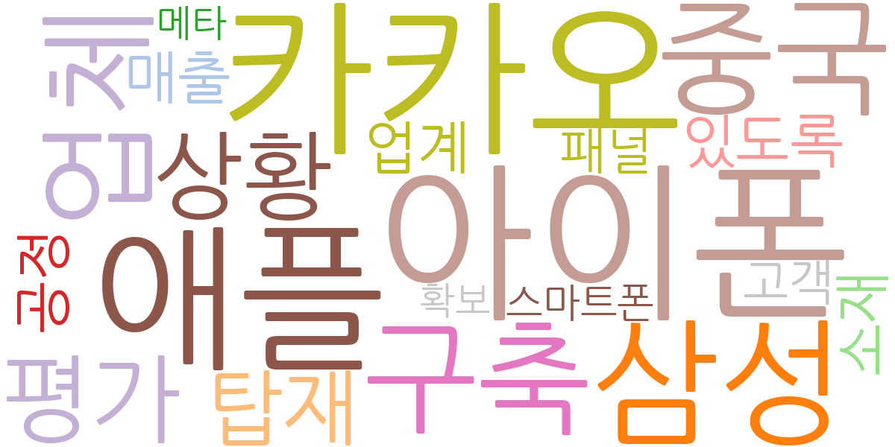
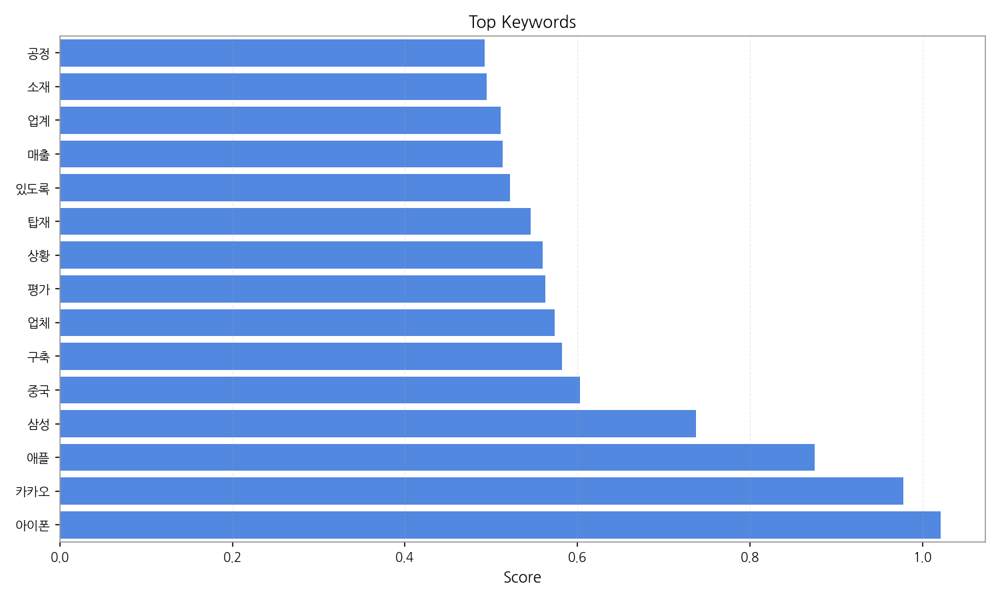
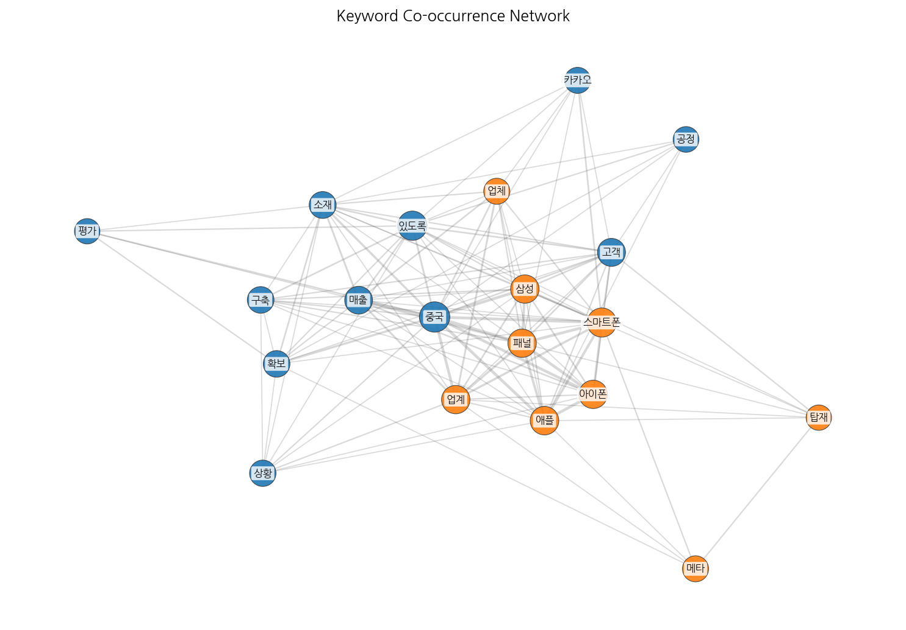
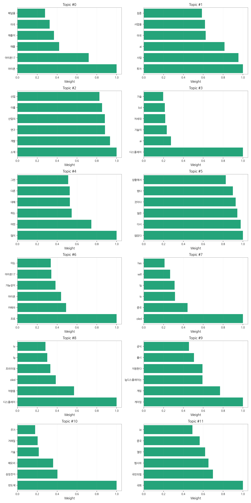
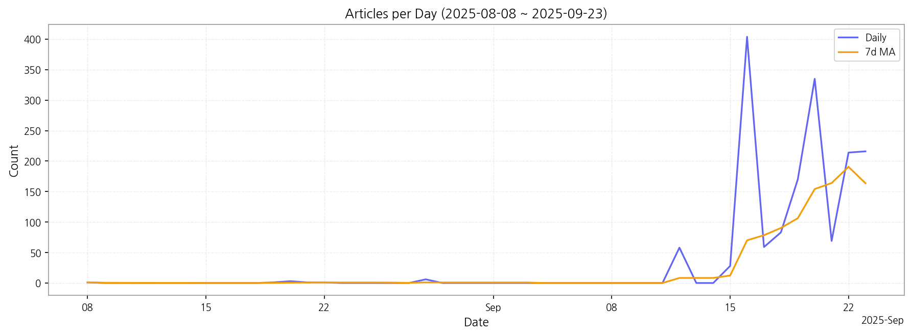

# Weekly/New Biz Report (2025-09-23)

## Executive Summary

- 이번 기간 핵심 토픽과 키워드, 주요 시사점을 요약합니다.

## 데일리 인텔리전스 브리핑 (디스플레이 산업)

**1. 핵심 맥락:**

*   **애플 아이폰 시리즈의 디스플레이 기술 경쟁 심화:** 아이폰17 관련 토픽(Topic 0, 6)에서 '아이폰', '애플', '삼성', 'LTPO' 등의 키워드가 높은 비중을 차지하는 것으로 보아, 차세대 아이폰 디스플레이 기술, 특히 LTPO 기술 적용 및 공급망 경쟁이 치열하게 전개되고 있음을 시사합니다. 이는 디스플레이 업체들에게 고성능, 저전력 디스플레이 기술 확보의 중요성을 강조합니다.
*   **AI 기술 융합을 통한 디스플레이 산업 혁신 가속화:** '디스플레이', 'AI', '기술', '차세대' 등의 키워드가 Topic 3에 집중된 것은 AI 기술이 디스플레이 산업 전반에 걸쳐 혁신을 주도하고 있음을 나타냅니다. 소재 개발(Topic 2)에서도 AI가 언급되는 것을 볼 때, AI는 디스플레이 성능 향상뿐 아니라 신소재 개발에도 중요한 역할을 수행하고 있습니다.
*   **OLED 기술 경쟁 심화 및 시장 확대:** 'OLED', '차량용', '프리미엄', 'LG', 'TV' 등의 키워드가 Topic 8에 나타나는 것은 OLED 기술이 프리미엄 TV 시장뿐 아니라 차량용 디스플레이 시장에서도 빠르게 성장하고 있음을 보여줍니다. 특히 중국 시장(Topic 7)에서의 OLED 경쟁 심화는 주목할 만한 부분입니다.

**2. 최근 변화/스파이크:**

*   **2025년 9월 16일 데이터 급증:** 9월 16일 기사 수가 404건으로 급증한 것은 아이폰 관련 토픽과 연관된 것으로 추정됩니다. '아이폰', '애플', '삼성' 등의 키워드를 고려할 때, 아이폰17 출시 관련 루머, 스펙 정보 유출, 또는 디스플레이 공급망 관련 이슈 등이 복합적으로 작용한 결과로 해석할 수 있습니다. 9월 19일, 20일, 22일, 23일의 높은 기사 수도 같은 맥락으로 해석할 수 있습니다.

**3. 실무 인사이트:**

*   **차세대 디스플레이 기술 개발 및 확보:** 아이폰 시리즈의 디스플레이 기술 경쟁 심화에 대응하기 위해 LTPO, MicroLED 등 차세대 디스플레이 기술 개발에 투자를 확대하고, 관련 특허 확보에 주력해야 합니다.
*   **AI 기반 디스플레이 솔루션 개발:** AI 기술을 활용하여 디스플레이 화질 개선, 전력 효율 최적화, 사용자 인터페이스 고도화 등 다양한 분야에서 혁신적인 솔루션을 개발해야 합니다. 특히 소재 개발 단계에서 AI를 적극적으로 활용하여 경쟁 우위를 확보해야 합니다.
*   **차량용 OLED 디스플레이 시장 공략:** 차량용 디스플레이 시장의 성장 가능성에 주목하고, 고화질, 고신뢰성을 갖춘 차량용 OLED 디스플레이 개발 및 공급에 집중해야 합니다. 특히 프리미엄 차량 시장을 중심으로 차별화된 기술력을 선보여야 합니다.

## Key Metrics

- 기간: 2025-08-08 ~ 2025-09-23
- 총 기사 수: 1,649
- 문서 수: N/A
- 키워드 수(상위): 15
- 토픽 수: 12
- 시계열 데이터 일자 수: 16

## Top Keywords

| Rank | Keyword | Score |
|---:|---|---:|
| 1 | 아이폰 | 1.021 |
| 2 | 카카오 | 0.978 |
| 3 | 애플 | 0.875 |
| 4 | 삼성 | 0.738 |
| 5 | 중국 | 0.603 |
| 6 | 구축 | 0.582 |
| 7 | 업체 | 0.574 |
| 8 | 평가 | 0.563 |
| 9 | 상황 | 0.559 |
| 10 | 탑재 | 0.546 |
| 11 | 있도록 | 0.521 |
| 12 | 매출 | 0.514 |
| 13 | 업계 | 0.511 |
| 14 | 소재 | 0.495 |
| 15 | 공정 | 0.492 |

## Topics

- 아이폰, 아이폰17, 애플 (#0)
  - 대표 단어: 아이폰, 아이폰17, 애플, 애플이, 미국, 패널을
- 투자, 사업, ai (#1)
  - 대표 단어: 투자, 사업, ai, 미국, 사업을, 집중
- 소재, 개발, 연구 (#2)
  - 대표 단어: 소재, 개발, 연구, 산업의, 이를, 산업
- 디스플레이, ai, 기술이 (#3)
  - 대표 단어: 디스플레이, ai, 기술이, 차세대, lcd, 기술
- 많이, 어떤, 하는 (#4)
  - 대표 단어: 많이, 어떤, 하는, 대해, 다른, 그런
- 않았다, 다시, 않은 (#5)
  - 대표 단어: 않았다, 다시, 않은, 것이다, 됐다, 상황에서
- 프로, 카메라, 아이폰 (#6)
  - 대표 단어: 프로, 카메라, 아이폰, 가능성이, 아이폰17, 이는
- oled, 중국, tv (#7)
  - 대표 단어: oled, 중국, tv, lg, will, has
- 디스플레이, 차량용, oled (#8)
  - 대표 단어: 디스플레이, 차량용, oled, 프리미엄, lg, tv
- 게이밍, 게임, lg디스플레이는 (#9)
  - 대표 단어: 게이밍, 게임, lg디스플레이는, 지원한다, 출시, 공식
- 반도체, 삼성전자, 메모리 (#10)
  - 대표 단어: 반도체, 삼성전자, 메모리, 기술, 거래일, 주가
- 국회, 국민의힘, 법사위 (#11)
  - 대표 단어: 국회, 국민의힘, 법사위, 열린, 중국, kt

## Trend

- 최근 14~30일 기사 수 추세와 7일 이동평균선을 제공합니다.

## Insights

## 데일리 인텔리전스 브리핑 (디스플레이 산업)

**1. 핵심 맥락:**

*   **애플 아이폰 시리즈의 디스플레이 기술 경쟁 심화:** 아이폰17 관련 토픽(Topic 0, 6)에서 '아이폰', '애플', '삼성', 'LTPO' 등의 키워드가 높은 비중을 차지하는 것으로 보아, 차세대 아이폰 디스플레이 기술, 특히 LTPO 기술 적용 및 공급망 경쟁이 치열하게 전개되고 있음을 시사합니다. 이는 디스플레이 업체들에게 고성능, 저전력 디스플레이 기술 확보의 중요성을 강조합니다.
*   **AI 기술 융합을 통한 디스플레이 산업 혁신 가속화:** '디스플레이', 'AI', '기술', '차세대' 등의 키워드가 Topic 3에 집중된 것은 AI 기술이 디스플레이 산업 전반에 걸쳐 혁신을 주도하고 있음을 나타냅니다. 소재 개발(Topic 2)에서도 AI가 언급되는 것을 볼 때, AI는 디스플레이 성능 향상뿐 아니라 신소재 개발에도 중요한 역할을 수행하고 있습니다.
*   **OLED 기술 경쟁 심화 및 시장 확대:** 'OLED', '차량용', '프리미엄', 'LG', 'TV' 등의 키워드가 Topic 8에 나타나는 것은 OLED 기술이 프리미엄 TV 시장뿐 아니라 차량용 디스플레이 시장에서도 빠르게 성장하고 있음을 보여줍니다. 특히 중국 시장(Topic 7)에서의 OLED 경쟁 심화는 주목할 만한 부분입니다.

**2. 최근 변화/스파이크:**

*   **2025년 9월 16일 데이터 급증:** 9월 16일 기사 수가 404건으로 급증한 것은 아이폰 관련 토픽과 연관된 것으로 추정됩니다. '아이폰', '애플', '삼성' 등의 키워드를 고려할 때, 아이폰17 출시 관련 루머, 스펙 정보 유출, 또는 디스플레이 공급망 관련 이슈 등이 복합적으로 작용한 결과로 해석할 수 있습니다. 9월 19일, 20일, 22일, 23일의 높은 기사 수도 같은 맥락으로 해석할 수 있습니다.

**3. 실무 인사이트:**

*   **차세대 디스플레이 기술 개발 및 확보:** 아이폰 시리즈의 디스플레이 기술 경쟁 심화에 대응하기 위해 LTPO, MicroLED 등 차세대 디스플레이 기술 개발에 투자를 확대하고, 관련 특허 확보에 주력해야 합니다.
*   **AI 기반 디스플레이 솔루션 개발:** AI 기술을 활용하여 디스플레이 화질 개선, 전력 효율 최적화, 사용자 인터페이스 고도화 등 다양한 분야에서 혁신적인 솔루션을 개발해야 합니다. 특히 소재 개발 단계에서 AI를 적극적으로 활용하여 경쟁 우위를 확보해야 합니다.
*   **차량용 OLED 디스플레이 시장 공략:** 차량용 디스플레이 시장의 성장 가능성에 주목하고, 고화질, 고신뢰성을 갖춘 차량용 OLED 디스플레이 개발 및 공급에 집중해야 합니다. 특히 프리미엄 차량 시장을 중심으로 차별화된 기술력을 선보여야 합니다.

## Opportunities (Top 5)

| Idea | Target | Value Prop | Score |
|---|---|---|---:|
| 초저전력 MicroLED 기반 AR 글래스용 디스플레이 모듈 | 북미 빅테크 기업 (AR/VR 디바이스 제조사) | 경쟁사 대비 2배 이상 긴 배터리 사용 시간, 탁월한 야외 시인성, 초경량 디자인 구현, AR 글래스 몰입감 극대화 | 4.50 |
| AI 기반 디스플레이 공정 자동화 및 수율 예측 솔루션 | 디스플레이 패널 제조사 | 공정 자동화 및 최적화, 실시간 수율 예측 및 불량 감지, 생산 비용 절감 및 생산성 향상, 데이터 기반 의사 결정 지원 | 4.30 |
| AI 기반 차량용 HUD 증강 현실 솔루션 | 글로벌 완성차 OEM (프리미엄 브랜드 중심) | AI 기반 실시간 증강 현실 정보 제공으로 운전 안전성 극대화, 사용자 맞춤형 HUD 인터페이스, 경쟁사 대비 월등한 정보 시인성 및 직관성 제공 | 4.20 |
| 퀀텀닷(QD) 기반 색변환층을 활용한 MicroLED 디스플레이 | 프리미엄 TV 제조사, AR/VR 디바이스 제조사 | 색 재현율 및 색 균일도 극대화, 시야각 특성 개선, 기존 MicroLED 디스플레이 대비 월등한 화질 제공 | 4.00 |
| IT 기기용 플렉서블 OLED 기반 폴더블/롤러블 디스플레이 솔루션 | 글로벌 스마트폰 제조사, IT 기기 제조사 | 업계 최고 수준의 내구성 및 벤딩 반경, 최소화된 화면 주름, 얇고 가벼운 디자인 구현, 차별화된 사용자 경험 제공 | 3.80 |

## Appendix

- 데이터: keywords.json, topics.json, trend_timeseries.json, trend_insights.json, biz_opportunities.json