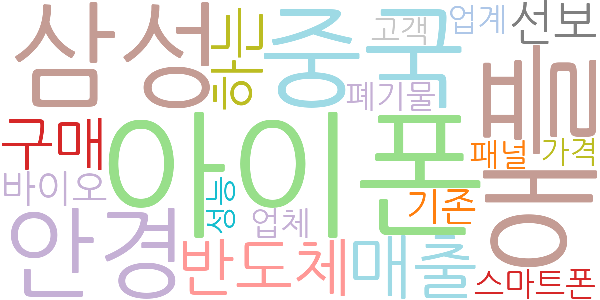
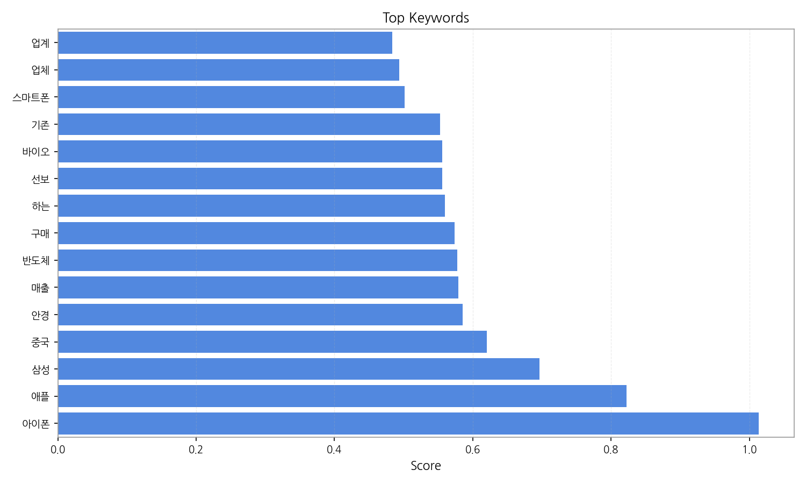
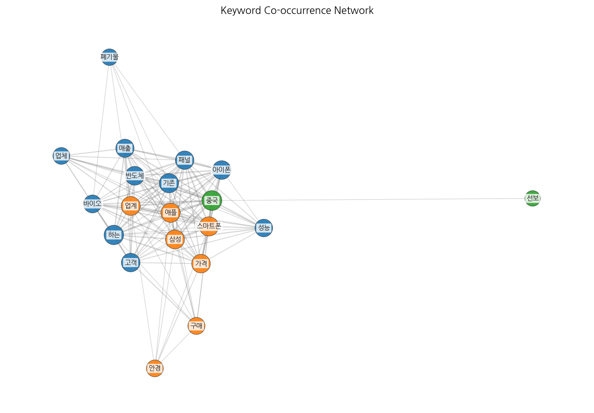
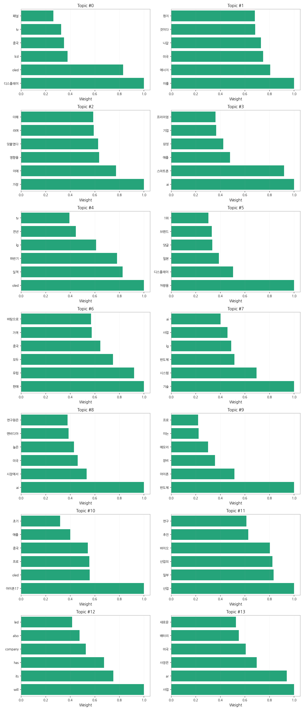
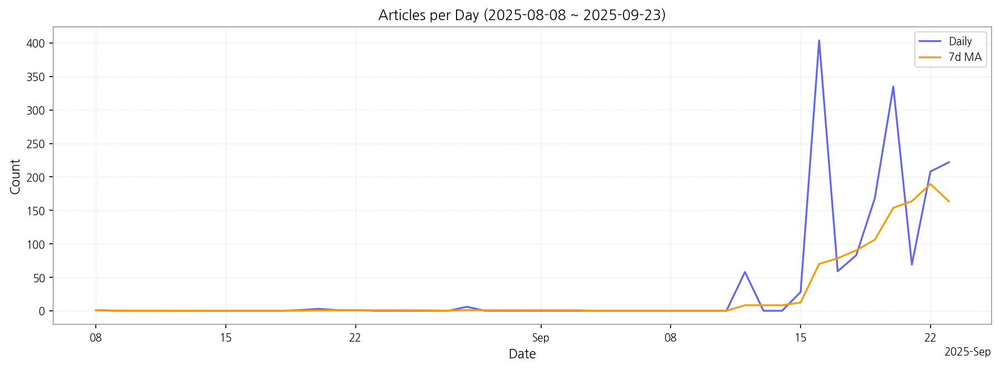

# Weekly/New Biz Report (2025-09-23)

## Executive Summary

- 이번 기간 핵심 토픽과 키워드, 주요 시사점을 요약합니다.

## 데일리 인텔리전스 브리핑 (디스플레이 산업)

**1. 핵심 맥락:**

*   **OLED 시장 경쟁 심화 및 기술 혁신 가속화:** '디스플레이', 'OLED', '아이폰', '애플', '삼성' 키워드를 통해 OLED 시장 경쟁이 심화되고 있음을 알 수 있으며, 특히 '아이폰17', '프로' 등의 키워드는 스마트폰을 중심으로 OLED 기술 혁신이 가속화되고 있음을 시사합니다. 이는 '차세대 디스플레이' 기술 개발 경쟁으로 이어질 가능성이 높습니다.
*   **AI 기반 디스플레이 기술 및 응용 확대:** 'AI', '스마트폰', '차량용 디스플레이' 키워드를 통해 AI 기술이 디스플레이 산업 전반에 걸쳐 적용되고 있으며, 특히 스마트폰과 차량용 디스플레이 분야에서 AI 기반 기능 및 솔루션에 대한 수요가 증가하고 있음을 파악할 수 있습니다.

**2. 최근 변화/스파이크:**

*   **2025년 9월 16일 기사 수 급증:** 9월 16일에 기사 수가 404건으로 급증한 것은 '아이폰', '애플', '삼성', '중국' 키워드와 연관 지어 볼 때, 아이폰17 관련 OLED 디스플레이 공급망 변화, 중국 디스플레이 업체들의 OLED 기술 경쟁력 강화, 또는 삼성의 새로운 디스플레이 기술 발표 등과 관련된 시장의 높은 관심도를 반영하는 것으로 추론됩니다. 특히 '아이폰17', 'oled' 토픽과 연관지어 볼 때, 아이폰17의 OLED 디스플레이 채택과 관련된 이슈가 시장의 주요 관심사였음을 알 수 있습니다.

**3. 실무 인사이트:**

*   **사업 개발:**
    *   **프리미엄 스마트폰 OLED 시장 공략:** 아이폰17을 포함한 프리미엄 스마트폰 시장의 OLED 디스플레이 수요 증가에 대응하기 위해, 고해상도, 저전력 소비, 폴더블 등 차세대 OLED 기술 개발 및 생산 능력 확대에 집중해야 합니다.
    *   **차량용 디스플레이 시장 진출 확대:** AI 기반의 첨단 운전자 보조 시스템(ADAS) 및 인포테인먼트 시스템에 최적화된 고품질 차량용 디스플레이 개발 및 공급을 통해 빠르게 성장하는 차량용 디스플레이 시장에서 경쟁 우위를 확보해야 합니다.

*   **기술 기획:**
    *   **AI 기반 디스플레이 기술 개발 강화:** AI 기반 화질 개선, 전력 효율 최적화, 사용자 인터페이스 개선 등 디스플레이 성능 향상을 위한 AI 기술 연구 개발 투자를 확대하고, 관련 특허 확보에 주력해야 합니다.

## Key Metrics

- 기간: 2025-08-08 ~ 2025-09-23
- 총 기사 수: 1,647
- 문서 수: N/A
- 키워드 수(상위): 15
- 토픽 수: 14
- 시계열 데이터 일자 수: 16

## Top Keywords

| Rank | Keyword | Score |
|---:|---|---:|
| 1 | 아이폰 | 1.014 |
| 2 | 애플 | 0.822 |
| 3 | 삼성 | 0.697 |
| 4 | 중국 | 0.621 |
| 5 | 안경 | 0.585 |
| 6 | 매출 | 0.580 |
| 7 | 반도체 | 0.578 |
| 8 | 구매 | 0.573 |
| 9 | 하는 | 0.560 |
| 10 | 선보 | 0.556 |
| 11 | 바이오 | 0.556 |
| 12 | 기존 | 0.553 |
| 13 | 스마트폰 | 0.502 |
| 14 | 업체 | 0.494 |
| 15 | 업계 | 0.483 |

## Topics

- 디스플레이, oled, lcd (#0)
  - 대표 단어: 디스플레이, oled, lcd, 중국, tv, 패널
- 이를, 에너지, 미국 (#1)
  - 대표 단어: 이를, 에너지, 미국, 나갈, 것이다, 현지
- 가장, 이에, 영향을 (#2)
  - 대표 단어: 가장, 이에, 영향을, 덧붙였다, 라며, 더해
- ai, 스마트폰, 애플 (#3)
  - 대표 단어: ai, 스마트폰, 애플, 삼성, 기업, 프리미엄
- oled, 실적, 하반기 (#4)
  - 대표 단어: oled, 실적, 하반기, lg, 전년, tv
- 차량용, 디스플레이, 일본 (#5)
  - 대표 단어: 차량용, 디스플레이, 일본, 댓글, 브랜드, 1위
- 판매, 유럽, 모두 (#6)
  - 대표 단어: 판매, 유럽, 모두, 중국, 가격, 바탕으로
- 기술, 시스템, 반도체 (#7)
  - 대표 단어: 기술, 시스템, 반도체, lg, 사업, ai
- ai, 시장에서, 미국 (#8)
  - 대표 단어: ai, 시장에서, 미국, 높은, 엔비디아, 연구원은
- 반도체, 아이폰, 장비 (#9)
  - 대표 단어: 반도체, 아이폰, 장비, 메모리, 이는, 프로
- 아이폰17, oled, 프로 (#10)
  - 대표 단어: 아이폰17, oled, 프로, 중국, 애플, 초기
- 산업, 일부, 산업의 (#11)
  - 대표 단어: 산업, 일부, 산업의, 바이오, 추진, 연구
- will, its, has (#12)
  - 대표 단어: will, its, has, company, also, led
- 사업, ar, 사장은 (#13)
  - 대표 단어: 사업, ar, 사장은, 미국, 배터리, 새로운

## Trend

- 최근 14~30일 기사 수 추세와 7일 이동평균선을 제공합니다.

## Insights

## 데일리 인텔리전스 브리핑 (디스플레이 산업)

**1. 핵심 맥락:**

*   **OLED 시장 경쟁 심화 및 기술 혁신 가속화:** '디스플레이', 'OLED', '아이폰', '애플', '삼성' 키워드를 통해 OLED 시장 경쟁이 심화되고 있음을 알 수 있으며, 특히 '아이폰17', '프로' 등의 키워드는 스마트폰을 중심으로 OLED 기술 혁신이 가속화되고 있음을 시사합니다. 이는 '차세대 디스플레이' 기술 개발 경쟁으로 이어질 가능성이 높습니다.
*   **AI 기반 디스플레이 기술 및 응용 확대:** 'AI', '스마트폰', '차량용 디스플레이' 키워드를 통해 AI 기술이 디스플레이 산업 전반에 걸쳐 적용되고 있으며, 특히 스마트폰과 차량용 디스플레이 분야에서 AI 기반 기능 및 솔루션에 대한 수요가 증가하고 있음을 파악할 수 있습니다.

**2. 최근 변화/스파이크:**

*   **2025년 9월 16일 기사 수 급증:** 9월 16일에 기사 수가 404건으로 급증한 것은 '아이폰', '애플', '삼성', '중국' 키워드와 연관 지어 볼 때, 아이폰17 관련 OLED 디스플레이 공급망 변화, 중국 디스플레이 업체들의 OLED 기술 경쟁력 강화, 또는 삼성의 새로운 디스플레이 기술 발표 등과 관련된 시장의 높은 관심도를 반영하는 것으로 추론됩니다. 특히 '아이폰17', 'oled' 토픽과 연관지어 볼 때, 아이폰17의 OLED 디스플레이 채택과 관련된 이슈가 시장의 주요 관심사였음을 알 수 있습니다.

**3. 실무 인사이트:**

*   **사업 개발:**
    *   **프리미엄 스마트폰 OLED 시장 공략:** 아이폰17을 포함한 프리미엄 스마트폰 시장의 OLED 디스플레이 수요 증가에 대응하기 위해, 고해상도, 저전력 소비, 폴더블 등 차세대 OLED 기술 개발 및 생산 능력 확대에 집중해야 합니다.
    *   **차량용 디스플레이 시장 진출 확대:** AI 기반의 첨단 운전자 보조 시스템(ADAS) 및 인포테인먼트 시스템에 최적화된 고품질 차량용 디스플레이 개발 및 공급을 통해 빠르게 성장하는 차량용 디스플레이 시장에서 경쟁 우위를 확보해야 합니다.

*   **기술 기획:**
    *   **AI 기반 디스플레이 기술 개발 강화:** AI 기반 화질 개선, 전력 효율 최적화, 사용자 인터페이스 개선 등 디스플레이 성능 향상을 위한 AI 기술 연구 개발 투자를 확대하고, 관련 특허 확보에 주력해야 합니다.

## Opportunities (Top 5)

| Idea | Target | Value Prop | Score |
|---|---|---|---:|
| 초고해상도 마이크로 OLED 기반 AR 글래스용 디스플레이 모듈 | 북미 빅테크 기업 (AR/VR 디바이스 제조사) | 최고 수준의 몰입형 AR 경험 제공 (초고해상도, 고휘도, 넓은 시야각, 경량화) | 4.50 |
| AI 기반 개인 맞춤형 차량용 디스플레이 솔루션 | 글로벌 완성차 OEM (프리미엄 브랜드 중심) | 운전자 맞춤형 정보 제공, 안전 운전 지원, 인포테인먼트 경험 극대화 (AI 기반 시선 추적, 제스처 인식, 음성 제어 기술 통합) | 4.20 |
| 퀀텀닷(QD) 기반 컬러 필터리스 OLED 기술 | 글로벌 TV 제조사 (프리미엄 라인업) | 최고 수준의 화질과 에너지 효율 제공 (컬러 필터리스, 높은 색 재현율, 넓은 시야각) | 4.00 |
| IT 기기용 폴더블 OLED 패널 솔루션 | 글로벌 IT 기기 제조사 (태블릿, 노트북) | 향상된 내구성과 주름 개선, 다양한 폼팩터 지원 (UTG, 힌지 기술, 저온 폴리실리콘(LTPO) 기술 적용) | 3.80 |
| AI 기반 디스플레이 공정 자동화 및 수율 예측 솔루션 | 국내외 디스플레이 제조사 | 공정 자동화, 수율 향상, 비용 절감 (AI 기반 실시간 데이터 분석, 이상 감지, 예측 모델링) | 3.50 |

## Appendix

- 데이터: keywords.json, topics.json, trend_timeseries.json, trend_insights.json, biz_opportunities.json