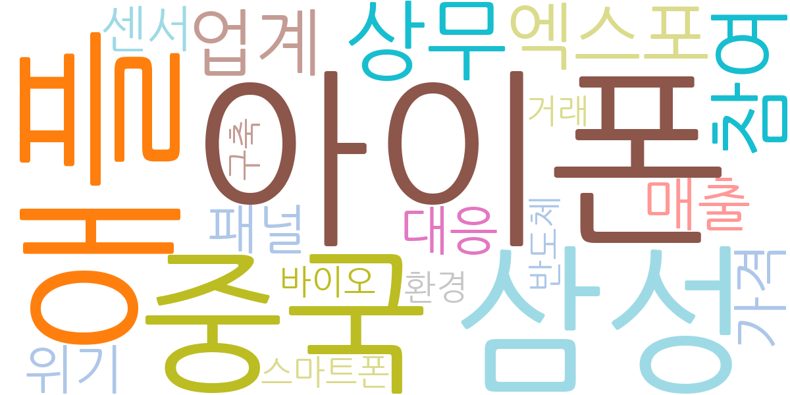
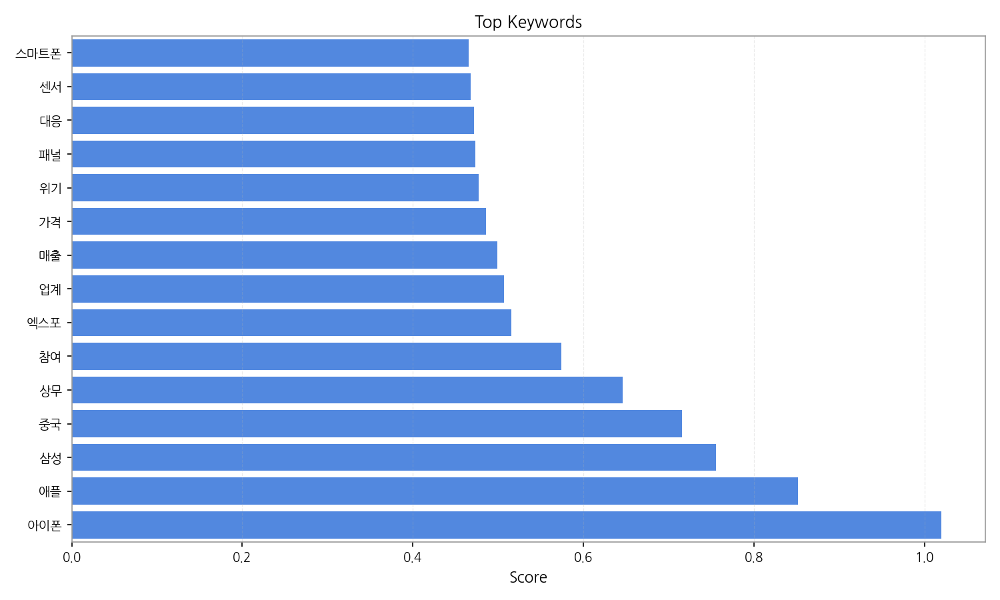
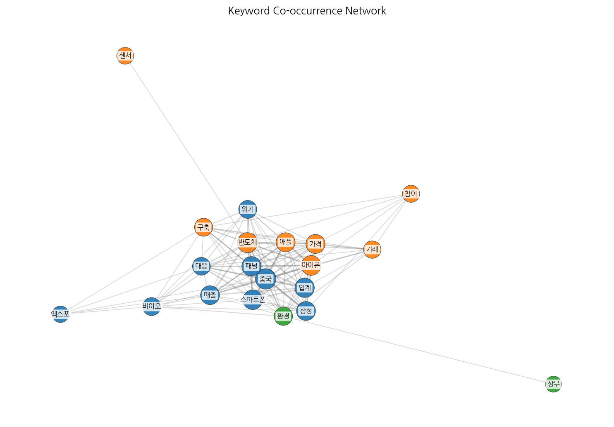
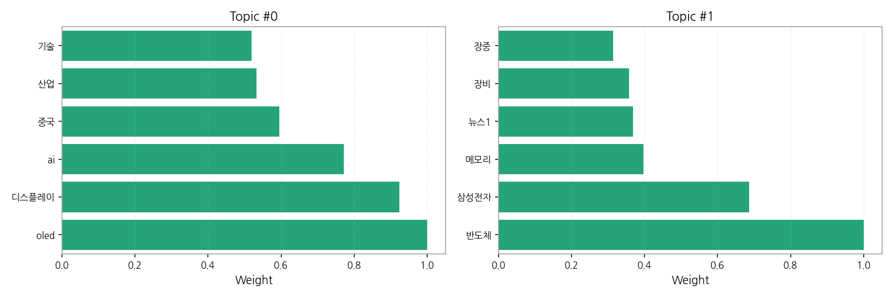
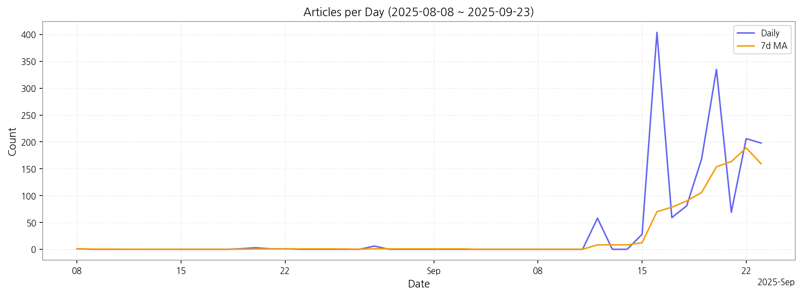

# Weekly/New Biz Report (2025-09-23)

## Executive Summary

- 이번 기간 핵심 토픽과 키워드, 주요 시사점을 요약합니다.

## 데일리 인텔리전스 브리핑 (디스플레이 산업)

**1. 핵심 맥락:**

*   **OLED & AI 융합 가속화:** 디스플레이 산업은 OLED 기술을 중심으로 AI 기술과의 융합을 통해 새로운 성장 동력을 모색하고 있으며, 특히 TV 및 아이폰 등 프리미엄 제품군에서 AI 기반 화질 개선, 사용자 경험 최적화 등의 혁신이 기대됩니다. 중국 기업들의 OLED 시장 진출 확대는 경쟁 심화를 야기하며, 기술 우위 확보 및 차별화 전략 수립의 중요성을 강조합니다.
*   **반도체 시장 변동성 확대:** 삼성전자를 중심으로 반도체, 특히 메모리 반도체 시장의 변동성이 커지고 있으며, 이는 디스플레이 산업의 투자 및 생산 계획에 영향을 미칠 수 있습니다. 반도체 장비 수급 및 가격 변동에 대한 지속적인 모니터링이 필요합니다.
*   **아이폰 & 중국 시장 중요성 부각:** 아이폰 관련 키워드와 중국 시장 관련 키워드가 동시에 상위에 랭크된 것은, 아이폰의 디스플레이 공급망에서 중국 기업의 영향력이 확대되고 있음을 시사합니다. 또한, 중국 시장에서의 아이폰 판매량 변화가 디스플레이 산업 전반에 미치는 영향력이 커지고 있음을 의미합니다.

**2. 최근 변화/스파이크:**

*   **2025년 9월 16일 기사 수 급증:** 9월 16일에 기사 수가 404건으로 급증한 것은 "아이폰", "애플", "삼성", "중국", "엑스포" 등의 키워드와 연관되어 있습니다. 이는 아이폰 신제품 출시를 앞두고 삼성과 중국 기업 간의 디스플레이 공급 경쟁 심화, 또는 관련 기술 발표가 있었을 가능성을 시사합니다. 특히 중국 상무부의 엑스포 참여 관련 뉴스는 중국 디스플레이 산업의 기술력 향상과 글로벌 시장 진출 의지를 보여주는 것으로 해석됩니다. 9월 19일, 20일, 22일, 23일에도 높은 기사 수를 유지하는 것으로 보아, 해당 이슈가 지속적으로 시장의 관심을 받고 있음을 알 수 있습니다.

**3. 실무 인사이트:**

*   **AI 기반 디스플레이 기술 개발 및 투자 확대:** AI 기술을 활용한 화질 개선, 전력 효율 증대, 사용자 맞춤형 기능 개발 등에 집중 투자하여 OLED 디스플레이의 경쟁력을 강화하고, 프리미엄 시장에서의 점유율을 확대해야 합니다.
*   **중국 시장 맞춤형 전략 수립:** 중국 시장의 특성을 고려한 제품 개발, 마케팅 전략 수립, 현지 파트너십 강화 등을 통해 중국 시장에서의 경쟁 우위를 확보해야 합니다. 특히 중국 기업과의 기술 격차를 유지하고, 차별화된 가치를 제공하는 것이 중요합니다.
*   **반도체 공급망 다변화 및 리스크 관리 강화:** 반도체 수급 불안정성에 대비하여 공급망을 다변화하고, 재고 관리 시스템을 고도화하여 생산 차질을 최소화해야 합니다. 또한, 반도체 가격 변동에 대한 시나리오별 대응 계획을 수립하여 수익성 악화를 방지해야 합니다.

## Key Metrics

- 기간: 2025-08-08 ~ 2025-09-23
- 총 기사 수: 1,619
- 문서 수: N/A
- 키워드 수(상위): 15
- 토픽 수: 2
- 시계열 데이터 일자 수: 16

## Top Keywords

| Rank | Keyword | Score |
|---:|---|---:|
| 1 | 아이폰 | 1.020 |
| 2 | 애플 | 0.851 |
| 3 | 삼성 | 0.756 |
| 4 | 중국 | 0.716 |
| 5 | 상무 | 0.646 |
| 6 | 참여 | 0.574 |
| 7 | 엑스포 | 0.516 |
| 8 | 업계 | 0.507 |
| 9 | 매출 | 0.499 |
| 10 | 가격 | 0.485 |
| 11 | 위기 | 0.477 |
| 12 | 패널 | 0.473 |
| 13 | 대응 | 0.472 |
| 14 | 센서 | 0.468 |
| 15 | 스마트폰 | 0.465 |

## Topics

- oled, 디스플레이, ai (#0)
  - 대표 단어: oled, 디스플레이, ai, 중국, 산업, 기술
- 반도체, 삼성전자, 메모리 (#1)
  - 대표 단어: 반도체, 삼성전자, 메모리, 뉴스1, 장비, 장중

## Trend

- 최근 14~30일 기사 수 추세와 7일 이동평균선을 제공합니다.

## Insights

## 데일리 인텔리전스 브리핑 (디스플레이 산업)

**1. 핵심 맥락:**

*   **OLED & AI 융합 가속화:** 디스플레이 산업은 OLED 기술을 중심으로 AI 기술과의 융합을 통해 새로운 성장 동력을 모색하고 있으며, 특히 TV 및 아이폰 등 프리미엄 제품군에서 AI 기반 화질 개선, 사용자 경험 최적화 등의 혁신이 기대됩니다. 중국 기업들의 OLED 시장 진출 확대는 경쟁 심화를 야기하며, 기술 우위 확보 및 차별화 전략 수립의 중요성을 강조합니다.
*   **반도체 시장 변동성 확대:** 삼성전자를 중심으로 반도체, 특히 메모리 반도체 시장의 변동성이 커지고 있으며, 이는 디스플레이 산업의 투자 및 생산 계획에 영향을 미칠 수 있습니다. 반도체 장비 수급 및 가격 변동에 대한 지속적인 모니터링이 필요합니다.
*   **아이폰 & 중국 시장 중요성 부각:** 아이폰 관련 키워드와 중국 시장 관련 키워드가 동시에 상위에 랭크된 것은, 아이폰의 디스플레이 공급망에서 중국 기업의 영향력이 확대되고 있음을 시사합니다. 또한, 중국 시장에서의 아이폰 판매량 변화가 디스플레이 산업 전반에 미치는 영향력이 커지고 있음을 의미합니다.

**2. 최근 변화/스파이크:**

*   **2025년 9월 16일 기사 수 급증:** 9월 16일에 기사 수가 404건으로 급증한 것은 "아이폰", "애플", "삼성", "중국", "엑스포" 등의 키워드와 연관되어 있습니다. 이는 아이폰 신제품 출시를 앞두고 삼성과 중국 기업 간의 디스플레이 공급 경쟁 심화, 또는 관련 기술 발표가 있었을 가능성을 시사합니다. 특히 중국 상무부의 엑스포 참여 관련 뉴스는 중국 디스플레이 산업의 기술력 향상과 글로벌 시장 진출 의지를 보여주는 것으로 해석됩니다. 9월 19일, 20일, 22일, 23일에도 높은 기사 수를 유지하는 것으로 보아, 해당 이슈가 지속적으로 시장의 관심을 받고 있음을 알 수 있습니다.

**3. 실무 인사이트:**

*   **AI 기반 디스플레이 기술 개발 및 투자 확대:** AI 기술을 활용한 화질 개선, 전력 효율 증대, 사용자 맞춤형 기능 개발 등에 집중 투자하여 OLED 디스플레이의 경쟁력을 강화하고, 프리미엄 시장에서의 점유율을 확대해야 합니다.
*   **중국 시장 맞춤형 전략 수립:** 중국 시장의 특성을 고려한 제품 개발, 마케팅 전략 수립, 현지 파트너십 강화 등을 통해 중국 시장에서의 경쟁 우위를 확보해야 합니다. 특히 중국 기업과의 기술 격차를 유지하고, 차별화된 가치를 제공하는 것이 중요합니다.
*   **반도체 공급망 다변화 및 리스크 관리 강화:** 반도체 수급 불안정성에 대비하여 공급망을 다변화하고, 재고 관리 시스템을 고도화하여 생산 차질을 최소화해야 합니다. 또한, 반도체 가격 변동에 대한 시나리오별 대응 계획을 수립하여 수익성 악화를 방지해야 합니다.

## Opportunities (Top 5)

| Idea | Target | Value Prop | Score |
|---|---|---|---:|
| 초저지연 MicroLED 기반 AR/VR 글래스용 디스플레이 모듈 | 북미 빅테크 기업 (AR/VR 기기 제조사), XR 디바이스 스타트업 | 기존 LCD/OLED 대비 압도적인 응답 속도와 밝기, 명암비를 제공하는 MicroLED 디스플레이 모듈. 초저지연 제어 기술을 통해 멀미 현상을 최소화하고, 몰입감 높은 AR/VR 경험 제공. 소형화, 경량화 디자인으로 착용 편의성 극대화. | 4.50 |
| AI 기반 디스플레이 공정 결함 예측 및 자동 보정 시스템 | 디스플레이 제조사 | AI 기반 실시간 공정 데이터 분석 및 결함 예측. 공정 조건 자동 보정을 통한 수율 향상 및 비용 절감. 불량률 감소 및 생산성 향상으로 경쟁력 강화. | 4.30 |
| AI 기반 차량용 HUD (Head-Up Display) 개인 맞춤형 솔루션 | 글로벌 완성차 OEM, 프리미엄 차량 옵션 시장 | AI 기반 시선 추적 및 증강 현실 기술을 통해 운전자 맞춤형 정보를 제공, 시선 분산을 최소화하여 안전 운전 지원. 실시간 교통 정보, 위험 경고, 엔터테인먼트 기능 통합으로 차별화된 사용자 경험 제공. | 4.20 |
| 퀀텀닷 기반 컬러 필터리스 MicroLED 디스플레이 | TV 제조사, 디지털 사이니지 제조사 | 컬러 필터리스 구조로 공정 단순화 및 생산 비용 절감. 퀀텀닷의 뛰어난 색 재현율과 밝기를 통해 더욱 선명하고 생생한 화질 제공. MicroLED의 장점인 높은 명암비와 응답 속도를 유지하면서도 가격 경쟁력 확보. | 4.00 |
| IT 기기용 벤더블 OLED 패널 솔루션 | 글로벌 스마트폰 제조사, IT 기기 제조사 | 자유로운 곡면 디자인 구현이 가능한 벤더블 OLED 패널 솔루션. 뛰어난 내구성과 화질을 유지하면서도 다양한 폼팩터 디자인 가능. 폴더블 대비 얇고 가벼운 디자인으로 휴대성 극대화. | 3.80 |

## Appendix

- 데이터: keywords.json, topics.json, trend_timeseries.json, trend_insights.json, biz_opportunities.json