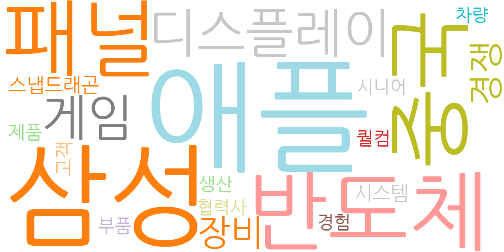
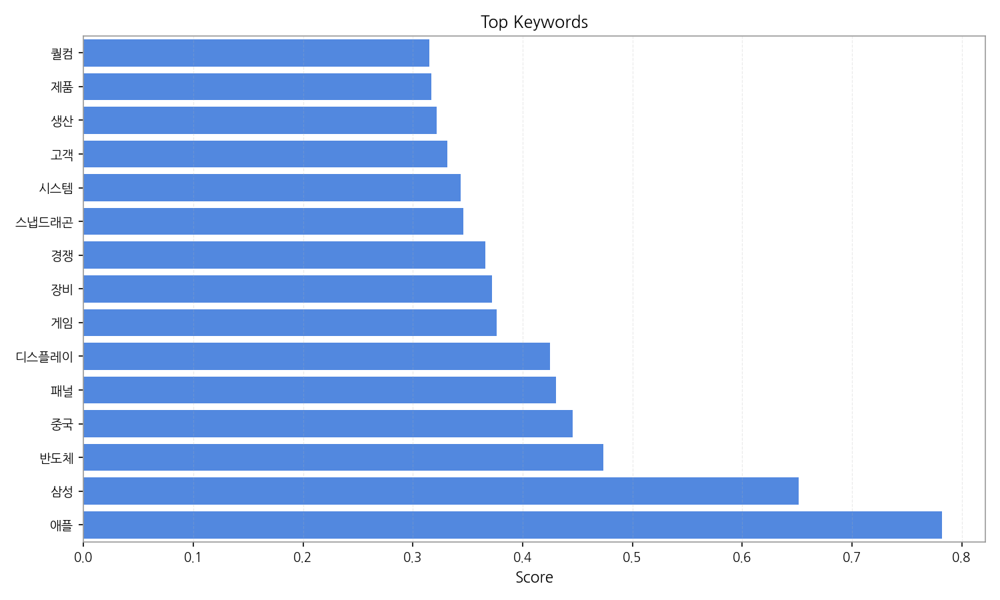
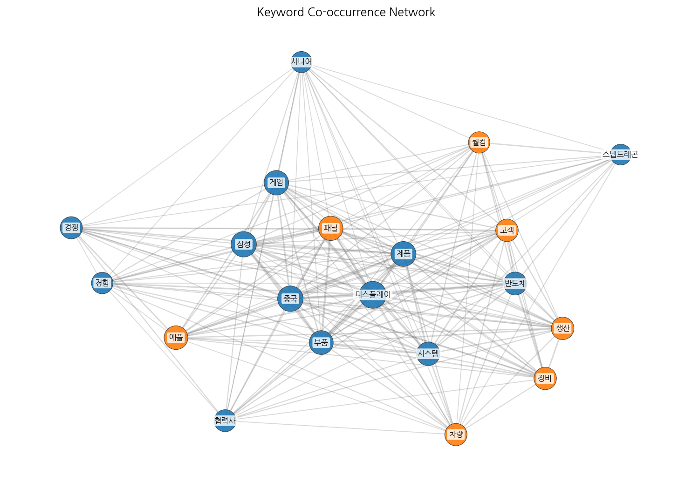
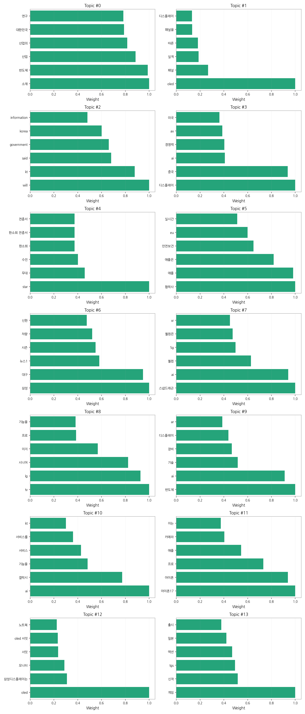
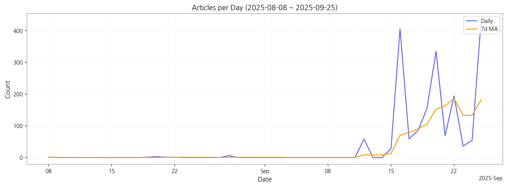

# Weekly/New Biz Report (2025-09-25)

## Executive Summary

- 이번 기간 핵심 토픽과 키워드, 주요 시사점을 요약합니다.

## 데일리 인텔리전스 브리핑 (디스플레이 산업)

**1. 핵심 맥락:**

*   **OLED 기술 경쟁 심화 및 시장 확대:** OLED는 여전히 디스플레이 시장의 핵심 동력이며, 삼성과 LG를 중심으로 모니터, 노트북 등 다양한 제품군으로 확장되고 있습니다 (Topic 1, 12). 동시에 중국의 디스플레이 산업 성장과 기술 경쟁력 강화는 국내 기업들에게 위협 요인으로 작용하고 있습니다 (Topic 3). 특히, 애플의 아이폰17에 대한 OLED 패널 공급 경쟁 (Topic 11)은 프리미엄 시장에서의 주도권 확보를 위한 중요한 변수가 될 것입니다.
*   **AI 기술 융합을 통한 디스플레이 혁신:** AI는 디스플레이 산업 전반에 걸쳐 새로운 기회를 창출하고 있습니다 (Topic 3, 7, 9, 10). 스냅드래곤과 같은 AP(Application Processor)는 AI 기능을 강화하여 XR(확장 현실) 경험을 향상시키고 (Topic 7), 갤럭시 등 스마트 기기에서는 AI 기반의 사용자 맞춤형 서비스 제공이 중요해지고 있습니다 (Topic 10). 또한, AI는 반도체 및 디스플레이 장비의 성능 향상에도 기여하며, 차세대 디스플레이 기술 개발의 핵심 요소로 자리매김하고 있습니다 (Topic 9).

**2. 최근 변화/스파이크:**

*   **2025년 9월 16일, 20일, 25일 기사 수 급증:** 9월 16일, 20일, 25일에 기사 수가 급증한 것은 디스플레이, 반도체, AI, 애플, 삼성 등 주요 키워드와 관련된 이슈가 집중적으로 발생했음을 시사합니다. 특히, OLED 서밋 2025 관련 보도 (Topic 12)와 아이폰17 관련 애플의 디스플레이 공급망 전략 (Topic 11)에 대한 관심이 높아진 것으로 추론됩니다. 또한, AI 기술의 디스플레이 산업 적용 사례 (Topic 3, 7, 9, 10) 및 중국과의 경쟁 심화 (Topic 3) 관련 뉴스도 영향을 미친 것으로 판단됩니다.

**3. 실무 인사이트:**

*   **차세대 OLED 기술 개발 및 상용화 가속화:** 폴더블, XR 기기 등 새로운 폼팩터에 최적화된 OLED 기술 개발에 집중하고, AI 기반 화질 개선, 전력 효율 향상 등 사용자 경험을 극대화하는 기술 개발에 투자해야 합니다.
*   **AI 융합 디스플레이 솔루션 개발 및 시장 선점:** AI 기반의 맞춤형 디스플레이 솔루션 개발을 통해 스마트 기기, 자동차, 의료 등 다양한 산업 분야에 진출하고, AI 반도체 기술과의 융합을 통해 경쟁 우위를 확보해야 합니다.
*   **글로벌 협력 강화 및 공급망 다변화:** 애플, 퀄컴 등 글로벌 기업과의 전략적 협력을 통해 기술 경쟁력을 강화하고, 중국 의존도를 낮추기 위해 공급망 다변화를 추진해야 합니다. 특히, EU의 규제 변화에 대한 지속적인 모니터링과 대응 전략 수립이 필요합니다 (Topic 5).

## Key Metrics

- 기간: 2025-08-08 ~ 2025-09-25
- 총 기사 수: 1,925
- 문서 수: N/A
- 키워드 수(상위): 15
- 토픽 수: 14
- 시계열 데이터 일자 수: 18

## Top Keywords

| Rank | Keyword | Score |
|---:|---|---:|
| 1 | 애플 | 0.782 |
| 2 | 삼성 | 0.652 |
| 3 | 반도체 | 0.473 |
| 4 | 중국 | 0.446 |
| 5 | 패널 | 0.431 |
| 6 | 디스플레이 | 0.425 |
| 7 | 게임 | 0.376 |
| 8 | 장비 | 0.372 |
| 9 | 경쟁 | 0.366 |
| 10 | 스냅드래곤 | 0.346 |
| 11 | 시스템 | 0.343 |
| 12 | 고객 | 0.332 |
| 13 | 생산 | 0.322 |
| 14 | 제품 | 0.317 |
| 15 | 퀄컴 | 0.315 |

## Topics

- 소재, 반도체, 산업 (#0)
  - 대표 단어: 소재, 반도체, 산업, 산업의, 대한민국, 연구
- oled, 패널, 실적 (#1)
  - 대표 단어: oled, 패널, 실적, 따른, 패널을, 디스플레이
- will, kt, said (#2)
  - 대표 단어: will, kt, said, government, korea, information
- 디스플레이, 중국, ai (#3)
  - 대표 단어: 디스플레이, 중국, ai, 경쟁력, ax, 미국
- star, 무대, 수진 (#4)
  - 대표 단어: star, 무대, 수진, 한소희, 한소희 전종서, 전종서
- 협력사, 애플, 애플은 (#5)
  - 대표 단어: 협력사, 애플, 애플은, 안전보건, eu, 실시간
- 삼성, 대구, 뉴스1 (#6)
  - 대표 단어: 삼성, 대구, 뉴스1, 시즌, 차량, 신한
- 스냅드래곤, ai, 퀄컴 (#7)
  - 대표 단어: 스냅드래곤, ai, 퀄컴, 5g, 퀄컴은, xr
- tv, lg, 시니어 (#8)
  - 대표 단어: tv, lg, 시니어, 이지, 프로, 기능을
- 반도체, ai, 기술 (#9)
  - 대표 단어: 반도체, ai, 기술, 장비, 디스플레이, ar
- ai, 갤럭시, 기능을 (#10)
  - 대표 단어: ai, 갤럭시, 기능을, 서비스, 서비스를, kt
- 아이폰17, 아이폰, 프로 (#11)
  - 대표 단어: 아이폰17, 아이폰, 프로, 애플, 카메라, 이는
- oled, 삼성디스플레이는, 모니터 (#12)
  - 대표 단어: oled, 삼성디스플레이는, 모니터, 서밋, oled 서밋, 노트북
- 게임, 신작, tgs (#13)
  - 대표 단어: 게임, 신작, tgs, 액션, 일본, 출시

## Trend

- 최근 14~30일 기사 수 추세와 7일 이동평균선을 제공합니다.

## Insights

## 데일리 인텔리전스 브리핑 (디스플레이 산업)

**1. 핵심 맥락:**

*   **OLED 기술 경쟁 심화 및 시장 확대:** OLED는 여전히 디스플레이 시장의 핵심 동력이며, 삼성과 LG를 중심으로 모니터, 노트북 등 다양한 제품군으로 확장되고 있습니다 (Topic 1, 12). 동시에 중국의 디스플레이 산업 성장과 기술 경쟁력 강화는 국내 기업들에게 위협 요인으로 작용하고 있습니다 (Topic 3). 특히, 애플의 아이폰17에 대한 OLED 패널 공급 경쟁 (Topic 11)은 프리미엄 시장에서의 주도권 확보를 위한 중요한 변수가 될 것입니다.
*   **AI 기술 융합을 통한 디스플레이 혁신:** AI는 디스플레이 산업 전반에 걸쳐 새로운 기회를 창출하고 있습니다 (Topic 3, 7, 9, 10). 스냅드래곤과 같은 AP(Application Processor)는 AI 기능을 강화하여 XR(확장 현실) 경험을 향상시키고 (Topic 7), 갤럭시 등 스마트 기기에서는 AI 기반의 사용자 맞춤형 서비스 제공이 중요해지고 있습니다 (Topic 10). 또한, AI는 반도체 및 디스플레이 장비의 성능 향상에도 기여하며, 차세대 디스플레이 기술 개발의 핵심 요소로 자리매김하고 있습니다 (Topic 9).

**2. 최근 변화/스파이크:**

*   **2025년 9월 16일, 20일, 25일 기사 수 급증:** 9월 16일, 20일, 25일에 기사 수가 급증한 것은 디스플레이, 반도체, AI, 애플, 삼성 등 주요 키워드와 관련된 이슈가 집중적으로 발생했음을 시사합니다. 특히, OLED 서밋 2025 관련 보도 (Topic 12)와 아이폰17 관련 애플의 디스플레이 공급망 전략 (Topic 11)에 대한 관심이 높아진 것으로 추론됩니다. 또한, AI 기술의 디스플레이 산업 적용 사례 (Topic 3, 7, 9, 10) 및 중국과의 경쟁 심화 (Topic 3) 관련 뉴스도 영향을 미친 것으로 판단됩니다.

**3. 실무 인사이트:**

*   **차세대 OLED 기술 개발 및 상용화 가속화:** 폴더블, XR 기기 등 새로운 폼팩터에 최적화된 OLED 기술 개발에 집중하고, AI 기반 화질 개선, 전력 효율 향상 등 사용자 경험을 극대화하는 기술 개발에 투자해야 합니다.
*   **AI 융합 디스플레이 솔루션 개발 및 시장 선점:** AI 기반의 맞춤형 디스플레이 솔루션 개발을 통해 스마트 기기, 자동차, 의료 등 다양한 산업 분야에 진출하고, AI 반도체 기술과의 융합을 통해 경쟁 우위를 확보해야 합니다.
*   **글로벌 협력 강화 및 공급망 다변화:** 애플, 퀄컴 등 글로벌 기업과의 전략적 협력을 통해 기술 경쟁력을 강화하고, 중국 의존도를 낮추기 위해 공급망 다변화를 추진해야 합니다. 특히, EU의 규제 변화에 대한 지속적인 모니터링과 대응 전략 수립이 필요합니다 (Topic 5).

## Opportunities (Top 5)

| Idea | Target | Value Prop | Score |
|---|---|---|---:|
| 개인 맞춤형 XR 몰입 경험을 위한 초고해상도 마이크로 OLED 솔루션 | 북미 빅테크 기업 (메타, 애플, 구글 등) | 세계 최고 수준의 초고해상도 마이크로 OLED 기술을 통해 현실과 구분이 어려운 몰입형 XR 경험 제공 (경쟁사 대비 압도적인 화질과 낮은 전력 소비) | 4.50 |
| AI 기반 디스플레이 제조 공정 자동화 및 수율 개선 솔루션 | 디스플레이 제조사 (삼성디스플레이, LG디스플레이, BOE 등) | AI 기반 실시간 공정 데이터 분석 및 예측 모델을 통해 불량 발생을 사전에 예측하고, 최적의 공정 조건을 자동으로 설정하여 수율 극대화 (경쟁사 대비 높은 정확도와 빠른 분석 속도) | 4.30 |
| AI 기반 차량용 HUD 증강 현실 솔루션 | 글로벌 완성차 OEM (프리미엄 브랜드 중심) | AI 기반 실시간 객체 인식 및 예측 기술을 통해 운전자에게 최적화된 증강 현실 정보를 제공하여 안전 운전 및 편의성 극대화 (경쟁사 대비 높은 몰입도와 직관적인 정보 제공) | 4.20 |
| 차세대 QD-MicroLED 디스플레이용 고효율 양자점 소재 개발 및 공급 | MicroLED 디스플레이 제조사 | 기존 양자점 소재 대비 높은 광효율, 색순도, 안정성을 제공하여 차세대 QD-MicroLED 디스플레이의 성능 향상에 기여 (경쟁사 대비 뛰어난 성능과 낮은 생산 비용) | 4.00 |
| IT 기기용 무안경 3D OLED 패널 솔루션 | 글로벌 IT 기기 제조사 (삼성, LG, Dell, HP 등) | 안경 없이도 몰입감 넘치는 3D 경험을 제공하여 IT 기기의 활용도를 높이고 사용자 만족도 향상 (경쟁사 대비 넓은 시야각과 선명한 3D 효과) | 3.80 |

## Appendix

- 데이터: keywords.json, topics.json, trend_timeseries.json, trend_insights.json, biz_opportunities.json