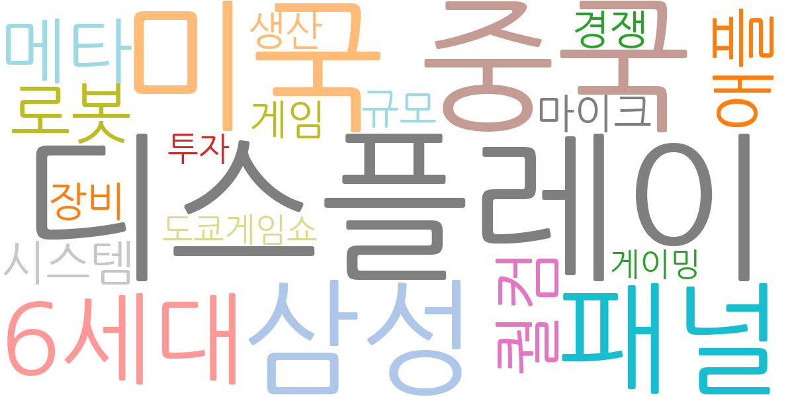
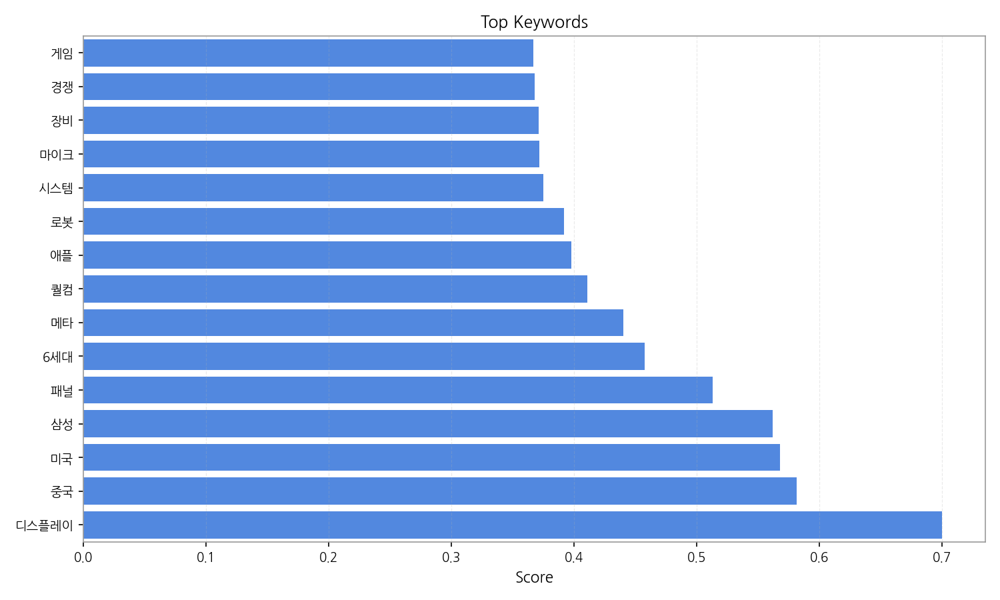
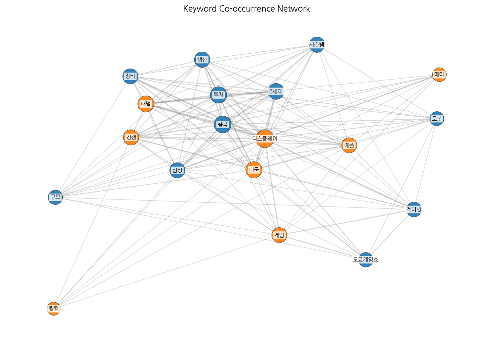
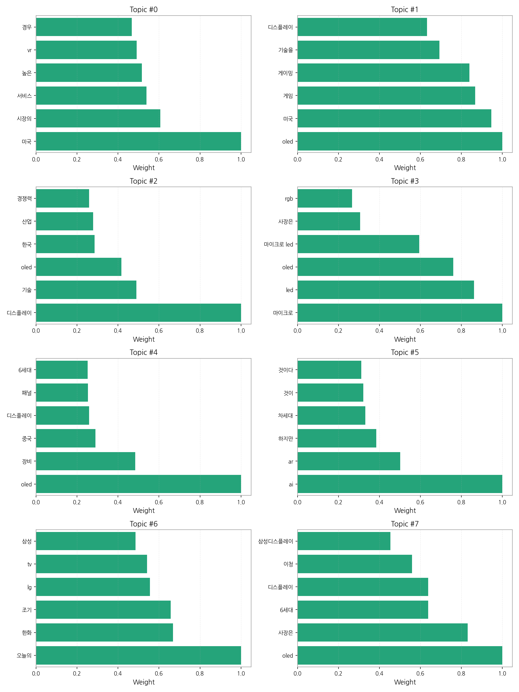

# Weekly/New Biz Report (2025-09-27)

## Executive Summary

- 이번 기간 핵심 토픽과 키워드, 주요 시사점을 요약합니다.

## 데일리 인텔리전스 브리핑

**1. 핵심 맥락:**

*   **OLED 기술 경쟁 심화 및 응용 분야 확대:** OLED는 여전히 디스플레이 산업의 핵심 키워드이며, 특히 미국 시장을 중심으로 게임, 게이밍, 자동차 등 다양한 응용 분야로 확장되고 있습니다. 동시에 중국의 OLED 생산 능력 확대와 장비 투자 관련 뉴스가 지속적으로 발생하며, 한국 디스플레이 산업의 경쟁력 유지에 대한 우려가 제기되고 있습니다.
*   **차세대 디스플레이 기술 경쟁 본격화:** 마이크로 LED가 OLED의 뒤를 잇는 차세대 디스플레이 기술로 주목받고 있으며, LG디스플레이 등 주요 기업들의 관련 투자 및 기술 개발 동향이 활발하게 보도되고 있습니다. 또한, AI/AR 기술과 연계된 차세대 디스플레이 기술에 대한 관심도 높아지고 있습니다.

**2. 최근 변화/스파이크:**

*   **2025년 9월 20일 및 26일 기사 수 급증:** 9월 20일과 26일에 기사 수가 급증한 것은 디스플레이, 중국, 미국, 삼성, 패널, 6세대 등의 키워드와 연관되어 있습니다. 이는 중국의 6세대 OLED 패널 생산라인 투자 확대 및 미국 시장 내 OLED 디스플레이 수요 증가에 대한 시장의 높은 관심도를 반영하는 것으로 추론됩니다. 특히, 삼성의 디스플레이 관련 사업 전략 변화 또는 신규 투자 발표가 있었을 가능성이 있습니다.

**3. 실무 인사이트:**

*   **사업 개발:**
    *   미국 시장 내 OLED 수요 증가에 발맞춰, 게임, 게이밍, 자동차 등 특정 응용 분야에 특화된 고부가가치 OLED 제품 개발 및 마케팅 전략을 강화해야 합니다.
    *   VR/AR 기기용 디스플레이 시장 진출을 적극적으로 모색하고, 관련 기술 경쟁력 확보를 위한 투자 및 협력을 강화해야 합니다.
*   **기술 기획:**
    *   마이크로 LED 기술 상용화를 위한 기술 개발 로드맵을 구체화하고, RGB 마이크로 LED 등 차별화된 기술 경쟁력 확보에 집중해야 합니다.
    *   AI/AR 기술과 연계된 차세대 디스플레이 기술 개발에 대한 투자를 확대하고, 관련 특허 확보 및 기술 표준화 활동에 적극적으로 참여해야 합니다.
*   **전략:**
    *   중국의 디스플레이 산업 성장 및 기술 추격에 대응하기 위해, 고부가치 기술 및 제품 개발에 집중하고, 차세대 디스플레이 기술 경쟁에서 우위를 확보해야 합니다.
    *   정부의 세제 지원 및 투자 유치 정책을 적극 활용하여, 국내 디스플레이 산업 생태계를 강화하고, 경쟁력 있는 생산 기반을 유지해야 합니다.

## Key Metrics

- 기간: 2025-08-17 ~ 2025-09-27
- 총 기사 수: 1,073
- 문서 수: N/A
- 키워드 수(상위): 15
- 토픽 수: 8
- 시계열 데이터 일자 수: 22

## Top Keywords

| Rank | Keyword | Score |
|---:|---|---:|
| 1 | 디스플레이 | 0.700 |
| 2 | 중국 | 0.582 |
| 3 | 미국 | 0.568 |
| 4 | 삼성 | 0.562 |
| 5 | 패널 | 0.513 |
| 6 | 6세대 | 0.458 |
| 7 | 메타 | 0.440 |
| 8 | 퀄컴 | 0.411 |
| 9 | 애플 | 0.398 |
| 10 | 로봇 | 0.392 |
| 11 | 시스템 | 0.375 |
| 12 | 마이크 | 0.372 |
| 13 | 장비 | 0.371 |
| 14 | 경쟁 | 0.368 |
| 15 | 게임 | 0.367 |

## Topics

- 미국, 시장의, 서비스 (#0)
  - 대표 단어: 미국, 시장의, 서비스, 높은, vr, 경우
- oled, 미국, 게임 (#1)
  - 대표 단어: oled, 미국, 게임, 게이밍, 기술을, 디스플레이
- 디스플레이, 기술, oled (#2)
  - 대표 단어: 디스플레이, 기술, oled, 한국, 산업, 경쟁력
- 마이크로, led, oled (#3)
  - 대표 단어: 마이크로, led, oled, 마이크로 led, 사장은, rgb
- oled, 장비, 중국 (#4)
  - 대표 단어: oled, 장비, 중국, 디스플레이, 패널, 6세대
- ai, ar, 하지만 (#5)
  - 대표 단어: ai, ar, 하지만, 차세대, 것이, 것이다
- 오늘의, 한화, 조기 (#6)
  - 대표 단어: 오늘의, 한화, 조기, lg, tv, 삼성
- oled, 사장은, 6세대 (#7)
  - 대표 단어: oled, 사장은, 6세대, 디스플레이, 이청, 삼성디스플레이

## Trend

- 최근 14~30일 기사 수 추세와 7일 이동평균선을 제공합니다.

## Insights

## 데일리 인텔리전스 브리핑

**1. 핵심 맥락:**

*   **OLED 기술 경쟁 심화 및 응용 분야 확대:** OLED는 여전히 디스플레이 산업의 핵심 키워드이며, 특히 미국 시장을 중심으로 게임, 게이밍, 자동차 등 다양한 응용 분야로 확장되고 있습니다. 동시에 중국의 OLED 생산 능력 확대와 장비 투자 관련 뉴스가 지속적으로 발생하며, 한국 디스플레이 산업의 경쟁력 유지에 대한 우려가 제기되고 있습니다.
*   **차세대 디스플레이 기술 경쟁 본격화:** 마이크로 LED가 OLED의 뒤를 잇는 차세대 디스플레이 기술로 주목받고 있으며, LG디스플레이 등 주요 기업들의 관련 투자 및 기술 개발 동향이 활발하게 보도되고 있습니다. 또한, AI/AR 기술과 연계된 차세대 디스플레이 기술에 대한 관심도 높아지고 있습니다.

**2. 최근 변화/스파이크:**

*   **2025년 9월 20일 및 26일 기사 수 급증:** 9월 20일과 26일에 기사 수가 급증한 것은 디스플레이, 중국, 미국, 삼성, 패널, 6세대 등의 키워드와 연관되어 있습니다. 이는 중국의 6세대 OLED 패널 생산라인 투자 확대 및 미국 시장 내 OLED 디스플레이 수요 증가에 대한 시장의 높은 관심도를 반영하는 것으로 추론됩니다. 특히, 삼성의 디스플레이 관련 사업 전략 변화 또는 신규 투자 발표가 있었을 가능성이 있습니다.

**3. 실무 인사이트:**

*   **사업 개발:**
    *   미국 시장 내 OLED 수요 증가에 발맞춰, 게임, 게이밍, 자동차 등 특정 응용 분야에 특화된 고부가가치 OLED 제품 개발 및 마케팅 전략을 강화해야 합니다.
    *   VR/AR 기기용 디스플레이 시장 진출을 적극적으로 모색하고, 관련 기술 경쟁력 확보를 위한 투자 및 협력을 강화해야 합니다.
*   **기술 기획:**
    *   마이크로 LED 기술 상용화를 위한 기술 개발 로드맵을 구체화하고, RGB 마이크로 LED 등 차별화된 기술 경쟁력 확보에 집중해야 합니다.
    *   AI/AR 기술과 연계된 차세대 디스플레이 기술 개발에 대한 투자를 확대하고, 관련 특허 확보 및 기술 표준화 활동에 적극적으로 참여해야 합니다.
*   **전략:**
    *   중국의 디스플레이 산업 성장 및 기술 추격에 대응하기 위해, 고부가치 기술 및 제품 개발에 집중하고, 차세대 디스플레이 기술 경쟁에서 우위를 확보해야 합니다.
    *   정부의 세제 지원 및 투자 유치 정책을 적극 활용하여, 국내 디스플레이 산업 생태계를 강화하고, 경쟁력 있는 생산 기반을 유지해야 합니다.

## Opportunities (Top 5)

| Idea | Target | Value Prop | Score |
|---|---|---|---:|
| AI 기반 디스플레이 공정 자동화 솔루션 | 디스플레이 제조사 (자사 포함) | AI 기반 실시간 공정 데이터 분석 및 예측을 통해 불량 발생을 사전에 감지하고, 공정 조건을 최적화하여 수율을 향상시키는 솔루션 제공. 생산 비용 절감 및 품질 향상에 기여. 경쟁사 대비 뛰어난 AI 기술 및 디스플레이 공정 노하우. | 4.50 |
| 차량용 AR HUD (Head-Up Display) 솔루션 | 글로벌 완성차 OEM (Tier 1 부품사 포함) | 넓은 시야각, 고해상도, 실시간 도로 정보 연동을 통한 몰입형 AR HUD 제공. 운전자 맞춤형 정보 표시 및 제스처 제어 지원으로 안전하고 편리한 운전 경험 제공. 경쟁사 대비 뛰어난 AR 구현 기술 및 디스플레이 품질. | 4.20 |
| 메타버스 협업용 Micro-OLED 글래스 | 북미 빅테크 기업 (메타, 애플, 마이크로소프트 등) | 초경량, 고해상도 Micro-OLED 디스플레이 기반 몰입형 VR/AR 글래스 제공. 넓은 시야각, 높은 명암비, 빠른 응답 속도로 현실감 있는 메타버스 경험 제공. 경쟁사 대비 뛰어난 디스플레이 기술 및 디자인. | 4.00 |
| IT 기기용 가변형 OLED 패널 | 글로벌 IT 기기 제조사 (삼성전자, LG전자, 애플 등) | 사용자 필요에 따라 화면 크기 및 형태를 자유롭게 조절할 수 있는 가변형 OLED 패널 제공. 뛰어난 화질, 얇은 두께, 가벼운 무게로 휴대성과 사용성을 극대화. 경쟁사 대비 뛰어난 벤딩 기술 및 내구성. | 3.80 |
| 퀀텀닷 컬러 필터 기반 MicroLED | 프리미엄 TV 제조사, AR/VR 기기 제조사 | 퀀텀닷 컬러 필터를 적용하여 색 재현율 및 휘도를 향상시킨 MicroLED 디스플레이 제공. 뛰어난 화질, 넓은 색 영역, 높은 에너지 효율로 프리미엄 디스플레이 시장 공략. 경쟁사 대비 뛰어난 퀀텀닷 기술 및 MicroLED 집적 기술. | 3.50 |

## Appendix

- 데이터: keywords.json, topics.json, trend_timeseries.json, trend_insights.json, biz_opportunities.json