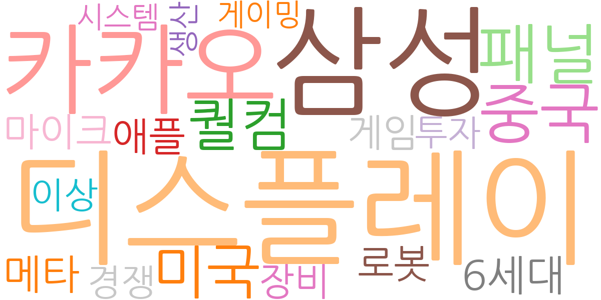
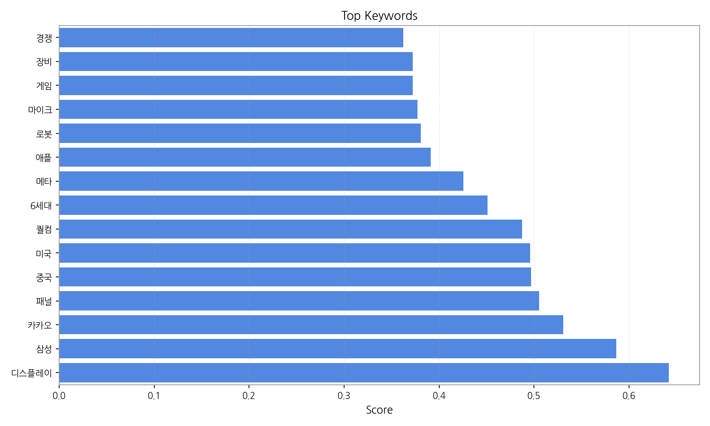
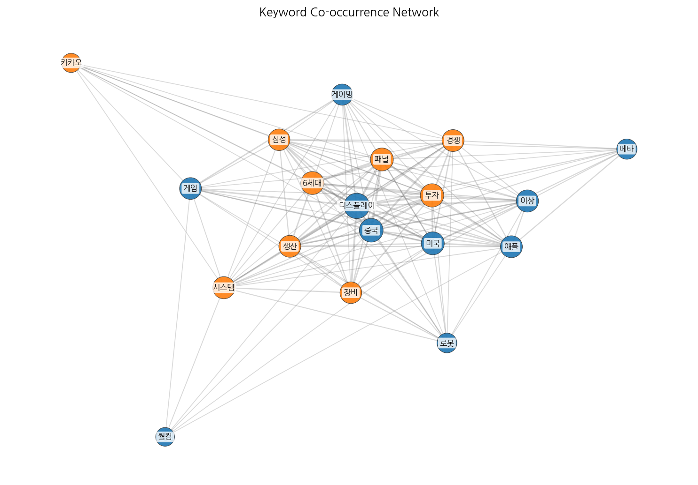
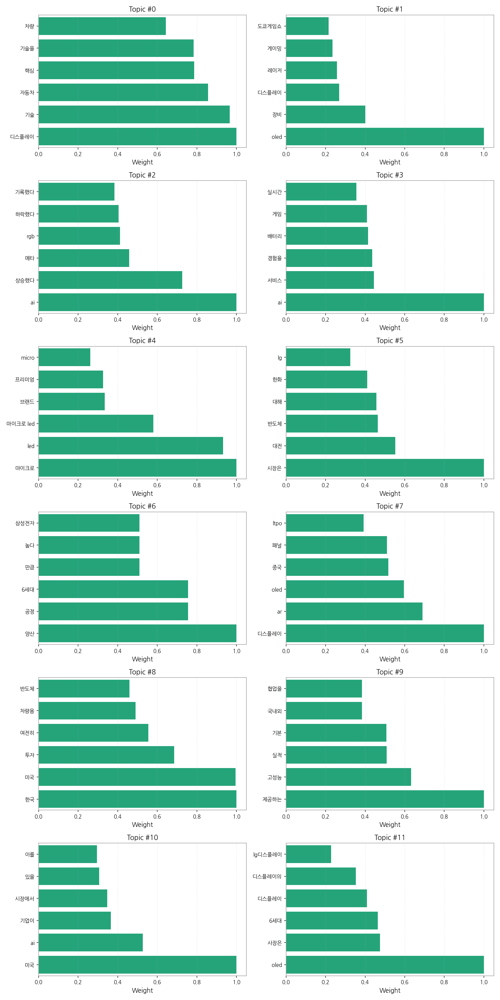
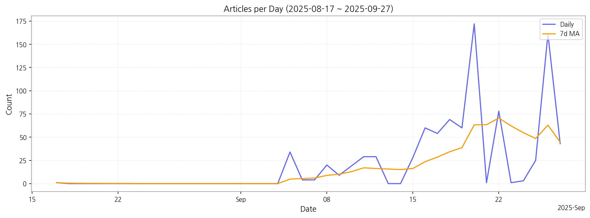

# Weekly/New Biz Report (2025-09-27)

## Executive Summary

- 이번 기간 핵심 토픽과 키워드, 주요 시사점을 요약합니다.

## 데일리 인텔리전스 브리핑

**1. 핵심 맥락:**

*   **차세대 디스플레이 기술 경쟁 심화:** 마이크로 LED와 OLED를 중심으로 차세대 디스플레이 기술 경쟁이 심화되고 있습니다. 특히 마이크로 LED는 프리미엄 제품군에서 높은 효과를 기대하며, OLED는 게이밍 시장을 중심으로 레이저 기술과 결합한 새로운 시도가 이루어지고 있습니다. 또한, 중국 디스플레이 업체들의 OLED 기술 추격과 LTPO 기술 경쟁도 눈여겨봐야 할 부분입니다.
*   **AI 기술 융합 및 시장 변동성 확대:** AI 기술이 디스플레이 산업 전반에 걸쳐 융합되면서 새로운 서비스와 사용자 경험을 창출하고 있습니다. 동시에 AI 관련 시장은 투자, 상승, 하락 등 변동성이 큰 상황이며, 메타와 같은 주요 기업들의 동향이 시장에 큰 영향을 미치고 있습니다.

**2. 최근 변화/스파이크:**

*   **2025년 9월 20일, 26일 기사 수 급증:** 9월 20일과 26일에 기사 수가 급증한 것은 디스플레이, 패널, 중국 등의 키워드와 연관되어, 중국 디스플레이 업체들의 기술 발전 및 시장 점유율 확대에 대한 관심이 높아졌거나, 특정 이벤트(예: 신기술 발표회, 투자 유치)가 있었을 가능성이 있습니다. 또한, 6세대 OLED 양산 공정 관련 이슈도 영향을 미쳤을 수 있습니다.

**3. 실무 인사이트:**

*   **차량용 디스플레이 시장 공략 강화:** 자동차, 차량, 전장 등의 키워드를 고려할 때, 차량용 디스플레이 시장은 여전히 성장 가능성이 높습니다. 특히 한국과 미국 시장에서 차량용 디스플레이 기술 개발 및 투자 기회를 적극적으로 모색해야 합니다.
*   **AI 기반 디스플레이 기술 및 서비스 개발:** AI 기술을 활용하여 디스플레이 성능을 향상시키고, 사용자 맞춤형 서비스를 제공하는 방안을 모색해야 합니다. 예를 들어, AI 기반 화질 개선 기술, 사용자 시선 추적 기술, 개인 맞춤형 콘텐츠 추천 서비스 등을 개발할 수 있습니다.
*   **중국 시장 동향 면밀히 분석 및 대응 전략 수립:** 중국 디스플레이 업체들의 기술 발전 속도를 주시하고, 가격 경쟁력 및 기술 경쟁력 강화를 위한 전략을 수립해야 합니다. 특히 OLED 및 차세대 디스플레이 기술 분야에서 중국 업체들과의 협력 또는 경쟁 방안을 고려해야 합니다.

## Key Metrics

- 기간: 2025-08-17 ~ 2025-09-27
- 총 기사 수: 904
- 문서 수: N/A
- 키워드 수(상위): 15
- 토픽 수: 12
- 시계열 데이터 일자 수: 22

## Top Keywords

| Rank | Keyword | Score |
|---:|---|---:|
| 1 | 디스플레이 | 0.642 |
| 2 | 삼성 | 0.587 |
| 3 | 카카오 | 0.531 |
| 4 | 패널 | 0.505 |
| 5 | 중국 | 0.497 |
| 6 | 미국 | 0.496 |
| 7 | 퀄컴 | 0.487 |
| 8 | 6세대 | 0.451 |
| 9 | 메타 | 0.425 |
| 10 | 애플 | 0.391 |
| 11 | 로봇 | 0.381 |
| 12 | 마이크 | 0.377 |
| 13 | 게임 | 0.372 |
| 14 | 장비 | 0.372 |
| 15 | 경쟁 | 0.362 |

## Topics

- 디스플레이, 기술, 자동차 (#0)
  - 대표 단어: 디스플레이, 기술, 자동차, 핵심, 기술을, 차량
- oled, 장비, 디스플레이 (#1)
  - 대표 단어: oled, 장비, 디스플레이, 레이저, 게이밍, 도쿄게임쇼
- ai, 상승했다, 메타 (#2)
  - 대표 단어: ai, 상승했다, 메타, rgb, 하락했다, 기록했다
- ai, 서비스, 경험을 (#3)
  - 대표 단어: ai, 서비스, 경험을, 배터리, 게임, 실시간
- 마이크로, led, 마이크로 led (#4)
  - 대표 단어: 마이크로, led, 마이크로 led, 브랜드, 프리미엄, micro
- 시장은, 대전, 반도체 (#5)
  - 대표 단어: 시장은, 대전, 반도체, 대해, 한화, lg
- 양산, 공정, 6세대 (#6)
  - 대표 단어: 양산, 공정, 6세대, 만큼, 높다, 삼성전자
- 디스플레이, ar, oled (#7)
  - 대표 단어: 디스플레이, ar, oled, 중국, 패널, ltpo
- 한국, 미국, 투자 (#8)
  - 대표 단어: 한국, 미국, 투자, 여전히, 차량용, 반도체
- 제공하는, 고성능, 실적 (#9)
  - 대표 단어: 제공하는, 고성능, 실적, 기본, 국내외, 협업을
- 미국, ai, 기업이 (#10)
  - 대표 단어: 미국, ai, 기업이, 시장에서, 있을, 이를
- oled, 사장은, 6세대 (#11)
  - 대표 단어: oled, 사장은, 6세대, 디스플레이, 디스플레이의, lg디스플레이

## Trend

- 최근 14~30일 기사 수 추세와 7일 이동평균선을 제공합니다.

## Insights

## 데일리 인텔리전스 브리핑

**1. 핵심 맥락:**

*   **차세대 디스플레이 기술 경쟁 심화:** 마이크로 LED와 OLED를 중심으로 차세대 디스플레이 기술 경쟁이 심화되고 있습니다. 특히 마이크로 LED는 프리미엄 제품군에서 높은 효과를 기대하며, OLED는 게이밍 시장을 중심으로 레이저 기술과 결합한 새로운 시도가 이루어지고 있습니다. 또한, 중국 디스플레이 업체들의 OLED 기술 추격과 LTPO 기술 경쟁도 눈여겨봐야 할 부분입니다.
*   **AI 기술 융합 및 시장 변동성 확대:** AI 기술이 디스플레이 산업 전반에 걸쳐 융합되면서 새로운 서비스와 사용자 경험을 창출하고 있습니다. 동시에 AI 관련 시장은 투자, 상승, 하락 등 변동성이 큰 상황이며, 메타와 같은 주요 기업들의 동향이 시장에 큰 영향을 미치고 있습니다.

**2. 최근 변화/스파이크:**

*   **2025년 9월 20일, 26일 기사 수 급증:** 9월 20일과 26일에 기사 수가 급증한 것은 디스플레이, 패널, 중국 등의 키워드와 연관되어, 중국 디스플레이 업체들의 기술 발전 및 시장 점유율 확대에 대한 관심이 높아졌거나, 특정 이벤트(예: 신기술 발표회, 투자 유치)가 있었을 가능성이 있습니다. 또한, 6세대 OLED 양산 공정 관련 이슈도 영향을 미쳤을 수 있습니다.

**3. 실무 인사이트:**

*   **차량용 디스플레이 시장 공략 강화:** 자동차, 차량, 전장 등의 키워드를 고려할 때, 차량용 디스플레이 시장은 여전히 성장 가능성이 높습니다. 특히 한국과 미국 시장에서 차량용 디스플레이 기술 개발 및 투자 기회를 적극적으로 모색해야 합니다.
*   **AI 기반 디스플레이 기술 및 서비스 개발:** AI 기술을 활용하여 디스플레이 성능을 향상시키고, 사용자 맞춤형 서비스를 제공하는 방안을 모색해야 합니다. 예를 들어, AI 기반 화질 개선 기술, 사용자 시선 추적 기술, 개인 맞춤형 콘텐츠 추천 서비스 등을 개발할 수 있습니다.
*   **중국 시장 동향 면밀히 분석 및 대응 전략 수립:** 중국 디스플레이 업체들의 기술 발전 속도를 주시하고, 가격 경쟁력 및 기술 경쟁력 강화를 위한 전략을 수립해야 합니다. 특히 OLED 및 차세대 디스플레이 기술 분야에서 중국 업체들과의 협력 또는 경쟁 방안을 고려해야 합니다.

## Opportunities (Top 5)

| Idea | Target | Value Prop | Score |
|---|---|---|---:|
| 차량용 MicroLED 디스플레이 결함 검사 자동화 로봇 솔루션 | 차량용 디스플레이 제조사, MicroLED 패널 제조사 | AI 기반의 자동화 로봇 솔루션을 통해 MicroLED 디스플레이의 결함을 빠르고 정확하게 검사하여 생산 효율성을 높이고 불량률을 감소시킵니다. 차별점은 딥러닝 기반의 이미지 분석 기술과 로봇 제어 기술의 통합입니다. | 4.50 |
| AI 기반 차량용 HUD 증강 현실 솔루션 | 글로벌 완성차 OEM 및 프리미엄 차량용 전장 부품 제조사 | AI 기반 실시간 증강 현실 정보를 HUD에 통합하여 운전자의 인지 부하를 줄이고 안전 운전을 지원합니다. 차별점은 운전자 맞춤형 정보 제공 및 제스처 인식 기반 인터페이스입니다. | 4.20 |
| OLED 증착 공정용 AI 기반 실시간 품질 관리 시스템 | 국내외 OLED 패널 제조사 | AI 기반 실시간 품질 관리 시스템을 통해 OLED 증착 공정의 수율을 극대화하고 생산 비용을 절감합니다. 차별점은 딥러닝 기반의 예측 모델 및 실시간 공정 제어 알고리즘입니다. | 4.00 |
| 마이크로 LED 기반 AR 글래스용 초고휘도 광원 모듈 | 북미 빅테크 기업 (AR/VR 디바이스 개발 부서) | 초소형, 초고휘도 마이크로 LED 광원 모듈을 제공하여 AR 글래스의 몰입감과 휴대성을 극대화합니다. 차별점은 자체 개발한 전사 공정 및 광학 설계 기술을 통한 균일한 휘도 확보입니다. | 3.80 |
| IT 기기용 스트레처블 OLED 패널 솔루션 | 글로벌 IT 기기 제조사 (스마트폰, 태블릿, 웨어러블) | 자유로운 형태 변형이 가능한 스트레처블 OLED 패널을 제공하여 IT 기기의 디자인 혁신을 가능하게 합니다. 차별점은 자체 개발한 신소재 및 공정 기술을 통한 높은 신뢰성 및 내구성 확보입니다. | 3.50 |

## Appendix

- 데이터: keywords.json, topics.json, trend_timeseries.json, trend_insights.json, biz_opportunities.json