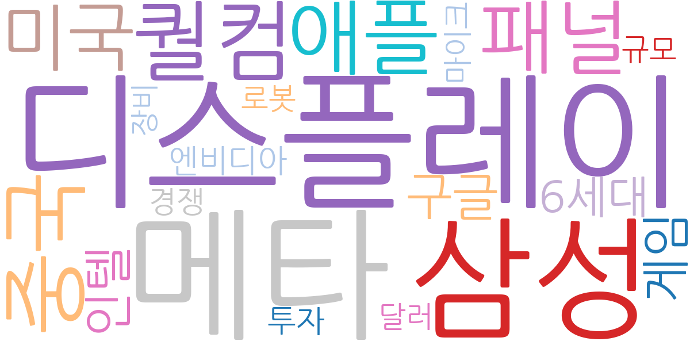
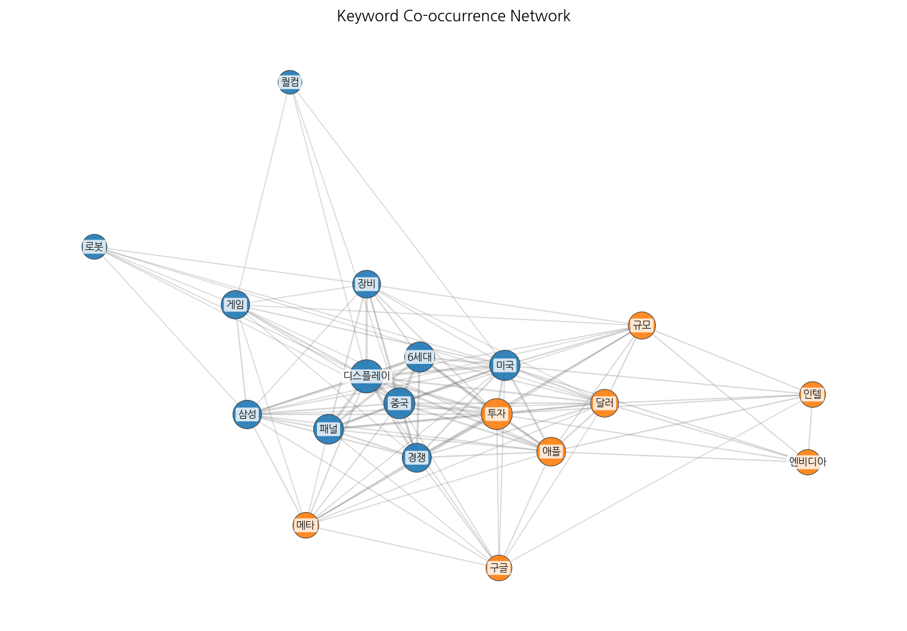
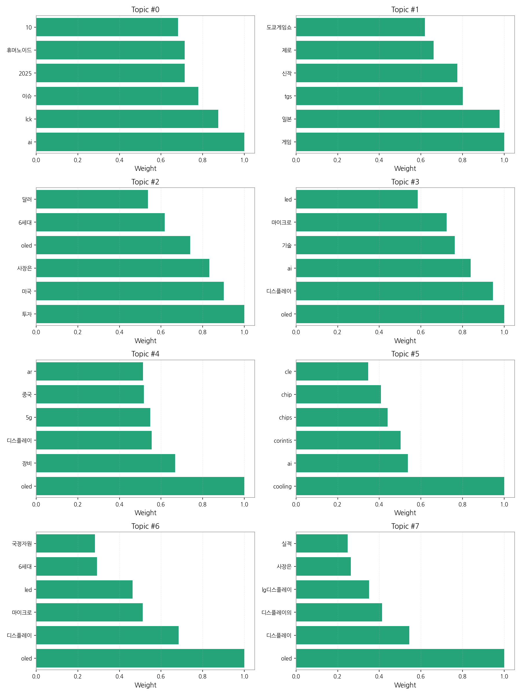
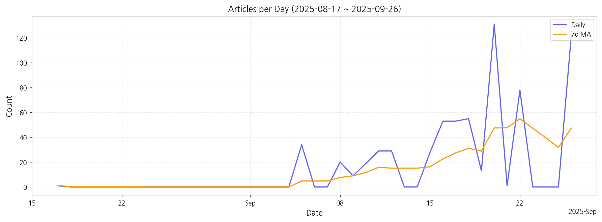

# Weekly/New Biz Report (2025-09-27)

## Executive Summary

- 이번 기간 핵심 토픽과 키워드, 주요 시사점을 요약합니다.

최근 14일 트렌드와 상위 8개 토픽, 10개 키워드를 바탕으로 요약했습니다.

## Key Metrics

- 기간: 2025-08-17 ~ 2025-09-26
- 총 기사 수: 675
- 문서 수: N/A
- 키워드 수(상위): 15
- 토픽 수: 8
- 시계열 데이터 일자 수: 16

## Top Keywords

| Rank | Keyword | Score |
|---:|---|---:|
| 1 | 디스플레이 | 0.575 |
| 2 | 메타 | 0.558 |
| 3 | 삼성 | 0.471 |
| 4 | 퀄컴 | 0.434 |
| 5 | 중국 | 0.432 |
| 6 | 애플 | 0.424 |
| 7 | 패널 | 0.417 |
| 8 | 미국 | 0.413 |
| 9 | 구글 | 0.393 |
| 10 | 인텔 | 0.379 |
| 11 | 게임 | 0.379 |
| 12 | 6세대 | 0.379 |
| 13 | 엔비디아 | 0.366 |
| 14 | 투자 | 0.338 |
| 15 | 경쟁 | 0.328 |

## Topics

- ai, lck, 이슈 (#0)
  - 대표 단어: ai, lck, 이슈, 2025, 휴머노이드, 10
- 게임, 일본, tgs (#1)
  - 대표 단어: 게임, 일본, tgs, 신작, 제로, 도쿄게임쇼
- 투자, 미국, 사장은 (#2)
  - 대표 단어: 투자, 미국, 사장은, oled, 6세대, 달러
- oled, 디스플레이, ai (#3)
  - 대표 단어: oled, 디스플레이, ai, 기술, 마이크로, led
- oled, 장비, 디스플레이 (#4)
  - 대표 단어: oled, 장비, 디스플레이, 5g, 중국, ar
- cooling, ai, corintis (#5)
  - 대표 단어: cooling, ai, corintis, chips, chip, cle
- oled, 디스플레이, 마이크로 (#6)
  - 대표 단어: oled, 디스플레이, 마이크로, led, 6세대, 국정자원
- oled, 디스플레이, 디스플레이의 (#7)
  - 대표 단어: oled, 디스플레이, 디스플레이의, lg디스플레이, 사장은, 실적

## Trend

- 최근 14~30일 기사 수 추세와 7일 이동평균선을 제공합니다.

## Insights

최근 14일 트렌드와 상위 8개 토픽, 10개 키워드를 바탕으로 요약했습니다.

## Opportunities (Top 5)

| Idea | Target | Value Prop | Score |
|---|---|---|---:|
| 메타버스 협업용 초고해상도 마이크로디스플레이 모듈 | 북미 빅테크 기업 (메타, 애플, 구글 등), XR 기기 제조사 | 기존 대비 4배 이상 높은 해상도와 120Hz 주사율을 지원하는 초고해상도 마이크로디스플레이 모듈 제공, 몰입감 극대화 및 장시간 사용 편의성 향상 | 4.50 |
| 차량용 AR HUD & e-Mirror 통합 솔루션 | 글로벌 완성차 OEM (프리미엄 브랜드, 자율주행 기술 선도 기업) | AR HUD와 e-Mirror의 유기적 연동을 통해 운전자 시야 내 안전 정보 극대화, 악천후/야간 시인성 향상, 차세대 자율주행 UX 선점 | 4.20 |
| AI 기반 디스플레이 공정 자동화 및 수율 예측 솔루션 | 디스플레이 제조사 (국내외 패널 제조사) | AI 기반의 실시간 공정 데이터 분석 및 예측 모델을 통해 수율 향상, 불량 예측, 공정 최적화, 자동화 수준 향상 | 4.00 |
| IT용 폴더블 OLED 패널 솔루션 | 글로벌 IT 기기 제조사 (삼성전자, LG전자, 레노버 등) | UTG(Ultra Thin Glass)를 적용하여 내구성을 획기적으로 개선하고, 주름을 최소화한 폴더블 OLED 패널 솔루션 제공, 차세대 IT 기기 디자인 혁신 지원 | 3.80 |
| 퀀텀닷 컬러 필터 기반 MicroLED 디스플레이 | 프리미엄 TV 제조사, 디지털 사이니지 기업 | 퀀텀닷 컬러 필터를 적용하여 MicroLED 디스플레이의 색 재현율 및 시야각을 개선하고, 생산 공정을 단순화하여 비용 절감 효과 제공 | 3.50 |

## Appendix

- 데이터: keywords.json, topics.json, trend_timeseries.json, trend_insights.json, biz_opportunities.json