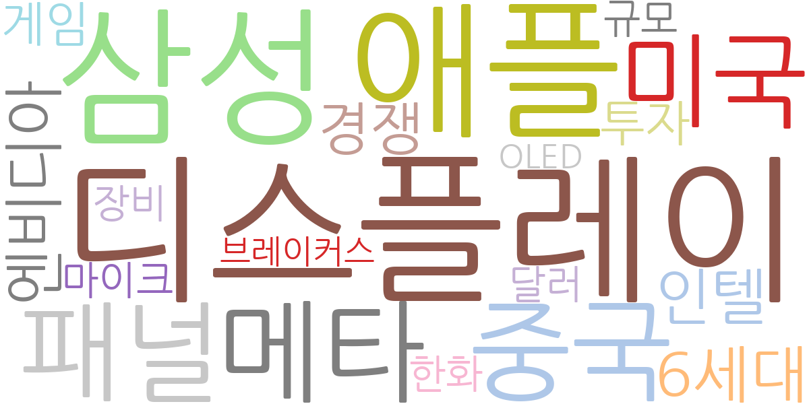
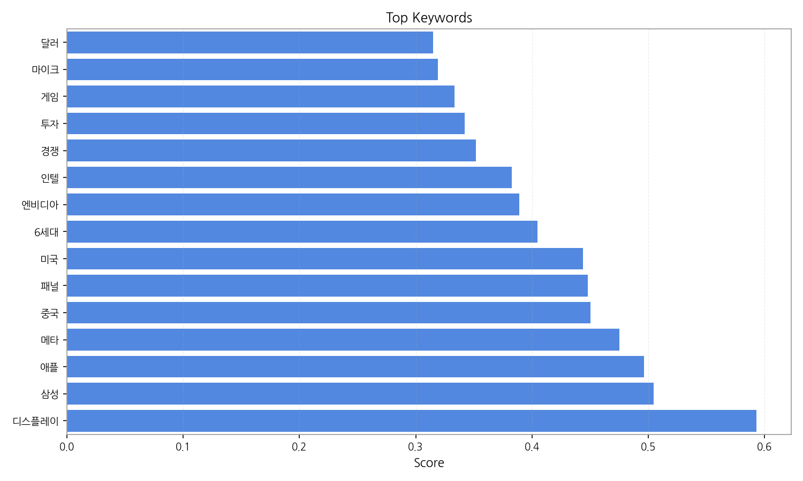
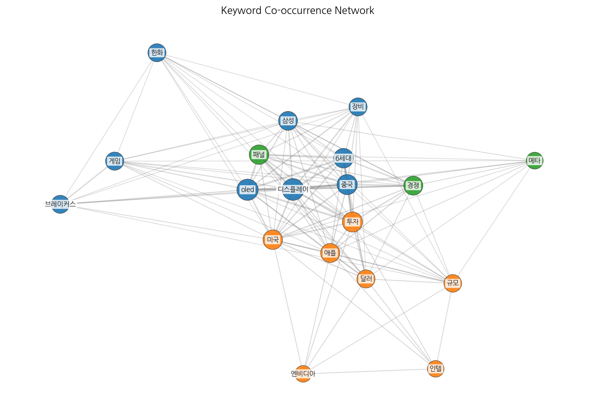
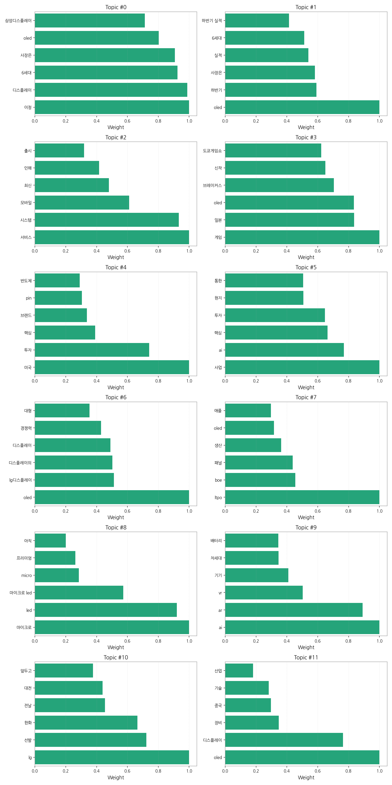

# Weekly/New Biz Report (2025-09-27)

## Executive Summary

- 이번 기간 핵심 토픽과 키워드, 주요 시사점을 요약합니다.

## 데일리 인텔리전스 브리핑

**1. 핵심 맥락:**

*   **OLED 기술 경쟁 심화 및 시장 확대:** OLED는 여전히 디스플레이 산업의 핵심 키워드이며, 특히 6세대 OLED 투자를 중심으로 삼성디스플레이와 LG디스플레이 간의 경쟁이 심화되고 있습니다. 동시에, OLED는 게임, 차량용 디스플레이 등 다양한 분야로 적용 범위를 넓히며 시장 확대를 주도하고 있습니다.
*   **AI/AR/VR 기반 차세대 디스플레이 기술 개발 경쟁:** AI, AR, VR 기술과 연계된 차세대 디스플레이 기술 개발 경쟁이 본격화되고 있습니다. 특히, AI 기반 서비스 및 시스템, AR/VR 기기용 디스플레이 기술 개발에 대한 관심이 높습니다.
*   **미국 중심의 투자 및 기술 패권 경쟁:** 미국은 디스플레이 산업을 포함한 핵심 기술 분야에 대한 투자를 확대하고 있으며, 이는 중국과의 기술 패권 경쟁 심화와 관련이 있습니다. 특히, AI, 반도체 등 첨단 기술 분야에서 미국 투자가 활발하게 이루어지고 있습니다.

**2. 최근 변화/스파이크:**

*   **2025년 9월 20일 기사 수 급증:** 9월 20일에 기사 수가 급증한 것은 OLED, 디스플레이, 6세대, 삼성디스플레이, LG디스플레이 등 디스플레이 산업 전반에 대한 관심이 집중된 결과로 보입니다. 특히, 이 시기에 도쿄게임쇼(TGS) 관련 기사가 다수 발생한 것으로 보아, 게임용 OLED 디스플레이에 대한 관심이 높아진 것이 기사 수 급증에 영향을 미쳤을 가능성이 있습니다.

**3. 실무 인사이트:**

*   **사업 개발:**
    *   **게임용 OLED 디스플레이 시장 공략:** 급성장하는 게임 시장을 겨냥하여 고성능, 저지연 OLED 디스플레이 개발 및 마케팅 전략을 강화하고, 게임 콘솔 및 PC 제조사와의 협력을 확대해야 합니다.
    *   **AI/AR/VR 디스플레이 기술 협력:** AI/AR/VR 기기 제조사와의 협력을 통해 차세대 디스플레이 기술 개발 및 상용화를 추진하고, 관련 특허 확보 및 표준화 활동에 적극 참여해야 합니다.
*   **기술 기획:**
    *   **LTPO TFT 기술 확보:** 저전력 소비가 중요한 모바일 및 웨어러블 기기 시장을 겨냥하여 LTPO TFT 기술 개발에 집중하고, 관련 특허 확보 및 생산 능력 확보를 위한 투자를 확대해야 합니다.

## Key Metrics

- 기간: 2025-08-17 ~ 2025-09-26
- 총 기사 수: 797
- 문서 수: N/A
- 키워드 수(상위): 15
- 토픽 수: 12
- 시계열 데이터 일자 수: 20

## Top Keywords

| Rank | Keyword | Score |
|---:|---|---:|
| 1 | 디스플레이 | 0.593 |
| 2 | 삼성 | 0.505 |
| 3 | 애플 | 0.496 |
| 4 | 메타 | 0.475 |
| 5 | 중국 | 0.451 |
| 6 | 패널 | 0.448 |
| 7 | 미국 | 0.444 |
| 8 | 6세대 | 0.405 |
| 9 | 엔비디아 | 0.389 |
| 10 | 인텔 | 0.383 |
| 11 | 경쟁 | 0.352 |
| 12 | 투자 | 0.342 |
| 13 | 게임 | 0.333 |
| 14 | 마이크 | 0.319 |
| 15 | 달러 | 0.315 |

## Topics

- 이청, 디스플레이, 6세대 (#0)
  - 대표 단어: 이청, 디스플레이, 6세대, 사장은, oled, 삼성디스플레이
- oled, 하반기, 사장은 (#1)
  - 대표 단어: oled, 하반기, 사장은, 실적, 6세대, 하반기 실적
- 서비스, 시스템, 모바일 (#2)
  - 대표 단어: 서비스, 시스템, 모바일, 최신, 인해, 출시
- 게임, 일본, oled (#3)
  - 대표 단어: 게임, 일본, oled, 브레이커스, 신작, 도쿄게임쇼
- 미국, 투자, 핵심 (#4)
  - 대표 단어: 미국, 투자, 핵심, 브랜드, pin, 반도체
- 사업, ai, 핵심 (#5)
  - 대표 단어: 사업, ai, 핵심, 투자, 현지, 통한
- oled, lg디스플레이, 디스플레이의 (#6)
  - 대표 단어: oled, lg디스플레이, 디스플레이의, 디스플레이, 경쟁력, 대형
- ltpo, boe, 패널 (#7)
  - 대표 단어: ltpo, boe, 패널, 생산, oled, 애플
- 마이크로, led, 마이크로 led (#8)
  - 대표 단어: 마이크로, led, 마이크로 led, micro, 프리미엄, 아직
- ai, ar, vr (#9)
  - 대표 단어: ai, ar, vr, 기기, 차세대, 배터리
- lg, 선발, 한화 (#10)
  - 대표 단어: lg, 선발, 한화, 전날, 대전, 앞두고
- oled, 디스플레이, 장비 (#11)
  - 대표 단어: oled, 디스플레이, 장비, 중국, 기술, 산업

## Trend

- 최근 14~30일 기사 수 추세와 7일 이동평균선을 제공합니다.

## Insights

## 데일리 인텔리전스 브리핑

**1. 핵심 맥락:**

*   **OLED 기술 경쟁 심화 및 시장 확대:** OLED는 여전히 디스플레이 산업의 핵심 키워드이며, 특히 6세대 OLED 투자를 중심으로 삼성디스플레이와 LG디스플레이 간의 경쟁이 심화되고 있습니다. 동시에, OLED는 게임, 차량용 디스플레이 등 다양한 분야로 적용 범위를 넓히며 시장 확대를 주도하고 있습니다.
*   **AI/AR/VR 기반 차세대 디스플레이 기술 개발 경쟁:** AI, AR, VR 기술과 연계된 차세대 디스플레이 기술 개발 경쟁이 본격화되고 있습니다. 특히, AI 기반 서비스 및 시스템, AR/VR 기기용 디스플레이 기술 개발에 대한 관심이 높습니다.
*   **미국 중심의 투자 및 기술 패권 경쟁:** 미국은 디스플레이 산업을 포함한 핵심 기술 분야에 대한 투자를 확대하고 있으며, 이는 중국과의 기술 패권 경쟁 심화와 관련이 있습니다. 특히, AI, 반도체 등 첨단 기술 분야에서 미국 투자가 활발하게 이루어지고 있습니다.

**2. 최근 변화/스파이크:**

*   **2025년 9월 20일 기사 수 급증:** 9월 20일에 기사 수가 급증한 것은 OLED, 디스플레이, 6세대, 삼성디스플레이, LG디스플레이 등 디스플레이 산업 전반에 대한 관심이 집중된 결과로 보입니다. 특히, 이 시기에 도쿄게임쇼(TGS) 관련 기사가 다수 발생한 것으로 보아, 게임용 OLED 디스플레이에 대한 관심이 높아진 것이 기사 수 급증에 영향을 미쳤을 가능성이 있습니다.

**3. 실무 인사이트:**

*   **사업 개발:**
    *   **게임용 OLED 디스플레이 시장 공략:** 급성장하는 게임 시장을 겨냥하여 고성능, 저지연 OLED 디스플레이 개발 및 마케팅 전략을 강화하고, 게임 콘솔 및 PC 제조사와의 협력을 확대해야 합니다.
    *   **AI/AR/VR 디스플레이 기술 협력:** AI/AR/VR 기기 제조사와의 협력을 통해 차세대 디스플레이 기술 개발 및 상용화를 추진하고, 관련 특허 확보 및 표준화 활동에 적극 참여해야 합니다.
*   **기술 기획:**
    *   **LTPO TFT 기술 확보:** 저전력 소비가 중요한 모바일 및 웨어러블 기기 시장을 겨냥하여 LTPO TFT 기술 개발에 집중하고, 관련 특허 확보 및 생산 능력 확보를 위한 투자를 확대해야 합니다.

## Opportunities (Top 5)

| Idea | Target | Value Prop | Score |
|---|---|---|---:|
| 메타버스 협업용 초고해상도 XR 글래스 | 북미 빅테크 기업 (메타, 애플, 마이크로소프트 등) | 업계 최고 수준의 초고해상도 마이크로OLED 디스플레이 기반 XR 글래스 솔루션 제공. 현실과 구분이 어려운 몰입감과 선명한 화질 제공. 장시간 사용에도 눈의 피로를 최소화. | 4.50 |
| 차량용 AR HUD (Head-Up Display) 솔루션 | 글로벌 완성차 OEM (Tier 1 공급사 포함) | 광시야각, 고해상도 마이크로디스플레이 기반 AR HUD 솔루션 제공. 운전 환경에 최적화된 정보 제공 및 직관적인 인터페이스 구현. 경쟁사 대비 뛰어난 몰입감과 안전성 제공. | 4.20 |
| AI 기반 디스플레이 공정 자동화 솔루션 | 글로벌 디스플레이 패널 제조사 (삼성디스플레이, LG디스플레이, BOE, CSOT 등) | AI 기반 실시간 공정 모니터링 및 제어 솔루션 제공. 불량 예측 및 원인 분석을 통한 수율 향상. 생산 라인 자동화 및 인건비 절감 효과 제공. | 4.00 |
| IT 기기용 폴더블 OLED 패널 | 글로벌 IT 기기 제조사 (삼성전자, LG전자, 화웨이 등) | 향상된 내구성, 최소 주름, 뛰어난 화질을 제공하는 폴더블 OLED 패널 솔루션 제공. 다양한 폼팩터 지원 및 맞춤형 디자인 제공. 경쟁사 대비 우수한 사용자 경험 제공. | 3.80 |
| 퀀텀닷 컬러 필터 기반 LCD용 신소재 | 글로벌 LCD 패널 제조사 (BOE, CSOT 등) | 기존 컬러 필터 대비 높은 색재현율 및 광효율을 제공하는 퀀텀닷 컬러 필터 솔루션 제공. LCD 패널의 색역 및 시야각 향상. 생산 공정 단순화 및 비용 절감 효과 제공. | 3.50 |

## Appendix

- 데이터: keywords.json, topics.json, trend_timeseries.json, trend_insights.json, biz_opportunities.json